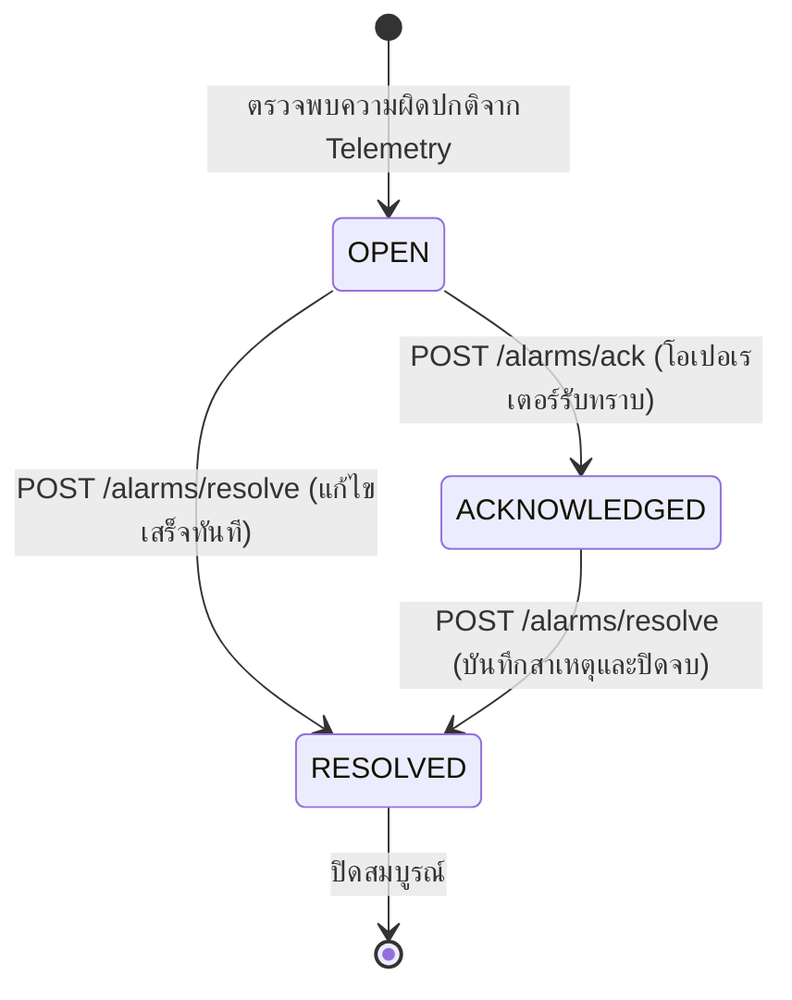

<!-- GLOBAL_NAV -->
<div align="right">
  <a href="../../README.md"> <b>หน้าหลัก</b></a> &nbsp;|&nbsp;
  <a href="../README.md"> <b>ดัชนีเอกสาร</b></a>
</div>
<br/>

<div align="center">
  <h1>คู่มืออ้างอิง IMS API (API Reference Manual)</h1>
  <p><b>ข้อกำหนดทางเทคนิคระดับโปรดักชันสำหรับ HTTP Endpoints, การรับส่งข้อมูล Telemetry ความถี่สูง, วงจรชีวิตการแจ้งเตือน และ Alerting Webhooks</b></p>
  <p>
    <a href="../../../docs/api/API_REFERENCE.md">English</a> |
    <a href="API_REFERENCE.md">ไทย</a> |
    <a href="../../../zh-CN/docs/api/API_REFERENCE.md">简体中文</a>
  </p>
</div>

---

## 1. ภาพรวมสถาปัตยกรรมและโทโพโลยีเครือข่าย (Architecture & Network Topology)

ระบบตรวจสอบทางอุตสาหกรรม (Industrial Monitoring System: IMS) เปิดอินเทอร์เฟซการเชื่อมต่อผ่าน HTTP, WebSocket และ SNMP สำหรับเชื่อมต่อเครื่องจักรในสายการผลิต, ระบบควบคุมการผลิต (MES), อุปกรณ์ PLC และสคริปต์อัตโนมัติของทีมวิศวกรรม

ทราฟฟิกทั้งหมดที่เข้าสู่พอร์ตหลักภายนอก (พอร์ตมาตรฐาน: `http://localhost:3000`) จะถูกจัดการโดย Nginx Reverse Proxy ประสิทธิภาพสูง ทำหน้าที่รับการเชื่อมต่อจากภายนอก, ควบคุมอัตราการส่งข้อมูลต่อไอพีต้นทาง (`limit_req zone=grafana_limit rate=100r/s burst=2500 nodelay`), จัดการบัฟเฟอร์ขนาดใหญ่ (`4 16k`) และส่งต่อคำขออย่างปลอดภัยไปยังเครือข่ายคอนเทนเนอร์ภายใน

```mermaid
flowchart TD
    subgraph External["ไคลเอนต์และอุปกรณ์ในโรงงาน"]
        LDI["เครื่องจักรผลิต LDI"]
        PLC["PLC และเซนเซอร์ในโรงงาน"]
        OPS["วิศวกรและโอเปอเรเตอร์ NOC"]
        PROM["ระบบตรวจสอบ Prometheus"]
    end

    subgraph FrontDoor["เกตเวย์ขาเข้า (พอร์ต 3000 / 80)"]
        PROXY["Nginx Reverse Proxy\n(ims-proxy)"]
    end

    subgraph InternalServices["เซอร์วิสแอปพลิเคชันภายใน"]
        NR["ไปป์ไลน์รับข้อมูล Node-RED\n(:1880)"]
        ALARM["API จัดการแจ้งเตือน Alarm\n(ims-alarm-api :4000)"]
        GRAFANA["แดชบอร์ดแสดงผล Grafana\n(ims-grafana :3000)"]
        AM["ระบบแจ้งเตือน Alertmanager\n(ims-alertmanager :9093)"]
        TWIN["3D Factory Twin POC\n(ims-factory-twin-3d :4100)"]
    end

    subgraph StorageLayer["ระบบฐานข้อมูลและการจัดเก็บ"]
        PGB["PgBouncer ตัวรวมการเชื่อมต่อ\n(:6432)"]
        TSDB["TimescaleDB เก็บข้อมูลอนุกรมเวลา\n(:5432)"]
    end

    LDI -->|POST /ldi-telemetry| PROXY
    PLC -->|POST /inject| PROXY
    OPS -->|POST /alarm-api/alarms/*| PROXY
    PROM -->|POST /alert-webhook| PROXY

    PROXY -->|ส่งต่อ /ldi-telemetry| NR
    PROXY -->|ส่งต่อ /inject| NR
    PROXY -->|ส่งต่อ /alarm-api/* (ตรวจสอบสิทธิ์)| ALARM
    PROXY -->|ส่งต่อ /api/* และ UI| GRAFANA
    PROXY -->|ส่งต่อ /factory-twin-3d/*| TWIN

    PROXY -.->|ตรวจสอบสิทธิ์ภายใน /auth-check| GRAFANA

    NR -->|บันทึกแบบกลุ่ม (Batched INSERT)| PGB
    ALARM -->|อัปเดต ldi_alarm_lifecycle| PGB
    GRAFANA -->|คิวรีเชิงวิเคราะห์ / CAGGs| PGB
    PGB --> TSDB
```

### รูปแบบการพิสูจน์ตัวตนและการควบคุมสิทธิ์ (Authentication & Authorization)

IMS กำหนดสิทธิ์การเข้าถึงอย่างรัดกุมตามขอบเขตความรับผิดชอบของแต่ละเซอร์วิส:

1. **Ingestion API Key (`X-API-Key`)**: ใช้งานโดยเครื่องจักรที่ส่งข้อมูล Telemetry เข้าสู่ Node-RED (`/ldi-telemetry`) โดยจะตรวจสอบเทียบกับคีย์ลับในสภาพแวดล้อมระบบ (`INGEST_API_KEY`)
2. **Session Cookie Auth Gate (`auth_request /auth-check`)**: ควบคุมการเปลี่ยนแปลงสถานะการทำงาน (`/alarm-api/`) และ Digital Twin (`/factory-twin-3d/`) โดย Nginx จะส่งคำขอย่อยไปตรวจสอบสิทธิ์กับเซสชันของ Grafana ที่ `/api/user` หากไม่มีสิทธิ์จะปฏิเสธคำขอทันทีด้วยรหัส `401 Unauthorized`
3. **Database Role Isolation**: `alarm-api` เชื่อมต่อไปยัง PostgreSQL ผ่าน PgBouncer ด้วยบทบาท `alarm_api_writer` ซึ่งมีสิทธิ์เฉพาะการอัปเดตคอลัมน์วงจรชีวิตในตาราง `public.ldi_alarm_lifecycle` เท่านั้น

---

## 2. API รับข้อมูล Telemetry ของเครื่องจักร (Telemetry Ingestion API)

รับข้อมูลอนุกรมเวลาความถี่สูงจากการทำงานของเครื่องจักรเปิดรับแสง LDI

### `POST /ldi-telemetry`

ส่งข้อมูลพารามิเตอร์การผลิต, ค่าการจัดตำแหน่ง, ปริมาณพลังงานแสง และแรงดันสุญญากาศเข้าสู่คิวหน่วยความจำของ Node-RED โดยตรง เพื่อทำการประมวลผลและบันทึกลง TimescaleDB แบบกลุ่ม (Batch)

- **Gateway URL**: `http://localhost:3000/ldi-telemetry`
- **Internal Direct URL**: `http://node-red:1880/ldi-telemetry`
- **Method**: `POST`
- **Headers**:
  - `Content-Type: application/json`
  - `X-API-Key: ${INGEST_API_KEY}` (จำเป็น)

#### โครงสร้าง JSON ของ Request (Schema)

```json
{
  "time": "2026-09-28T04:00:00Z",
  "factory": "F1",
  "process": "LDI",
  "eqp_id": "LDI-01",
  "mo": "MO-001234",
  "fpn": "PN-5678",
  "layer_name": "L1",
  "resist_dosage": 45.5,
  "scale_x": 1.002,
  "scale_y": 0.998,
  "temperature": 24.5,
  "humidity": 45.0,
  "scan_speed": 120.0,
  "air_vacuum": -15.2,
  "thickness": 1.2,
  "board_no": 1,
  "total_board": 100,
  "total_time": 450.5,
  "state": true,
  "pe_1": 1.1,
  "je_1": 2.2,
  "log_id": "LOG-10001"
}
```

#### พจนานุกรมฟิลด์ข้อมูล (Field Dictionary)

| ฟิลด์ (Field) | ชนิดข้อมูล | จำเป็น | หน่วย / รูปแบบ | คำอธิบาย |
|:--------------|:-----------|:-------|:---------------|:---------|
| `time` | ISO 8601 String | ใช่ | เวลาสากล UTC | เวลาที่เครื่องจักรบันทึกข้อมูล |
| `factory` | String | ใช่ | รหัสโรงงาน | รหัสโรงงานหรือพื้นที่ติดตั้ง (เช่น `F1`) |
| `process` | String | ใช่ | ขั้นตอนการผลิต | แผนกหรือขั้นตอนการผลิต (เช่น `LDI`, `DRILLING`, `VCP`) |
| `eqp_id` | String | ใช่ | รหัสเครื่องจักร | รหัสระบุเครื่องจักรเฉพาะตัว (เช่น `LDI-01`) |
| `mo` | String | ใช่ | ข้อความตัวเลข | หมายเลขใบสั่งผลิต (Manufacturing Order ID) |
| `fpn` | String | ใช่ | ข้อความตัวเลข | หมายเลขชิ้นงานผลิตภัณฑ์ (Part Number ID) |
| `layer_name` | String | ใช่ | ข้อความตัวเลข | ชั้นเลเยอร์ของแผ่น PCB (เช่น `L1`, `L2`, `TOP`, `BOT`) |
| `resist_dosage` | Float | ใช่ | $\text{mJ/cm}^2$ | ปริมาณพลังงานแสงเปิดรับของน้ำยาโฟโตรีซิสต์ |
| `scale_x` | Float | ใช่ | อัตราส่วน | ค่าชดเชยการขยายตัวตามแนวแกน X |
| `scale_y` | Float | ใช่ | อัตราส่วน | ค่าชดเชยการขยายตัวตามแนวแกน Y |
| `temperature` | Float | ใช่ | $^\circ\text{C}$ | อุณหภูมิภายในห้องเปิดรับแสงของเครื่องจักร |
| `humidity` | Float | ใช่ | $\% \text{RH}$ | ความชื้นสัมพัทธ์ในห้องเครื่องจักร |
| `scan_speed` | Float | ใช่ | $\text{mm/s}$ | ความเร็วในการสแกนของหัวเปิดรับแสง |
| `air_vacuum` | Float | ใช่ | $\text{kPa}$ | แรงดันลมดูดสุญญากาศสำหรับยึดแผ่นชิ้นงาน |
| `thickness` | Float | ใช่ | $\text{mm}$ | ความหนาของแผ่นชิ้นงาน PCB |
| `board_no` | Integer | ใช่ | ลำดับ | ลำดับแผ่นที่กำลังผลิตในชุดปัจจุบัน |
| `total_board` | Integer | ใช่ | จำนวน | จำนวนแผ่นทั้งหมดที่ต้องผลิตในล็อตนี้ |
| `total_time` | Float | ใช่ | วินาที | เวลารวมที่เครื่องจักรใช้ในการเปิดรับแสง |
| `state` | Boolean | ใช่ | จริง/เท็จ | สถานะการทำงาน (`true` = กำลังทำงาน, `false` = หยุด/ขัดข้อง) |
| `pe_1` | Float | ไม่บังคับ | $\mu\text{m}$ | ค่าความคลาดเคลื่อนตำแหน่งจุดอ้างอิงแชนเนล 1 |
| `je_1` | Float | ไม่บังคับ | $\mu\text{m}$ | ค่าความคลาดเคลื่อนของการกระตุกหัวสแกน 1 |
| `log_id` | String | ใช่ | ข้อความตัวเลข | รหัสระบุเฉพาะสำหรับการเชื่อมโยงประวัติบันทึก |

#### รหัสตอบกลับ HTTP (Responses)

- **`202 Accepted`**: ข้อมูลผ่านการตรวจสอบความถูกต้องและนำเข้าคิวเพื่อรอบันทึกลงฐานข้อมูลแล้ว
  ```json
  {
    "status": "accepted",
    "timestamp": "2026-09-28T04:00:00.104Z",
    "records_queued": 1
  }
  ```
- **`400 Bad Request`**: โครงสร้าง JSON ไม่ถูกต้องหรือขาดฟิลด์บังคับ
  ```json
  {
    "error": "Bad Request",
    "message": "Missing mandatory field 'eqp_id'"
  }
  ```
- **`401 Unauthorized`**: ขาด API Key หรือค่า `X-API-Key` ไม่ถูกต้อง
  ```json
  {
    "error": "Unauthorized",
    "message": "Invalid or missing X-API-Key token"
  }
  ```

#### ตัวอย่างคำสั่ง cURL สำหรับนำเข้าข้อมูลจริง

```bash
curl -X POST http://localhost:3000/ldi-telemetry \
  -H "Content-Type: application/json" \
  -H "X-API-Key: ${INGEST_API_KEY}" \
  -d '{
    "time": "2026-09-28T04:00:00Z",
    "factory": "F1",
    "process": "LDI",
    "eqp_id": "LDI-01",
    "mo": "MO-001234",
    "fpn": "PN-5678",
    "layer_name": "L1",
    "resist_dosage": 45.5,
    "scale_x": 1.002,
    "scale_y": 0.998,
    "temperature": 24.5,
    "humidity": 45.0,
    "scan_speed": 120.0,
    "air_vacuum": -15.2,
    "thickness": 1.2,
    "board_no": 1,
    "total_board": 100,
    "total_time": 450.5,
    "state": true,
    "pe_1": 1.1,
    "je_1": 2.2,
    "log_id": "LOG-10001"
  }'
```

---

## 3. API นำเข้าข้อมูล Metric ทั่วไป (General Ingestion API)

สำหรับการส่งข้อมูล Telemetry ทั่วไปจากอุปกรณ์ที่ไม่ใช่ LDI เช่น โหนดเซนเซอร์วัดสภาพแวดล้อม และสคริปต์ทดสอบการทำงาน

### `POST /inject`

- **Gateway URL**: `http://localhost:3000/inject`
- **Internal Direct URL**: `http://node-red:1880/inject`
- **Method**: `POST`
- **Headers**: `Content-Type: application/json`

#### โครงสร้าง JSON ของ Request

```json
{
  "device_id": "SENSOR-ENV-01",
  "metric": "ambient_temperature",
  "value": 23.4,
  "unit": "celsius",
  "timestamp": 1790568000
}
```

#### การตอบกลับ

- **`200 OK`**: ได้รับข้อมูลและส่งต่อไปป์ไลน์ประมวลผลเรียบร้อย
  ```json
  {
    "status": "ok",
    "received": 1
  }
  ```

#### ตัวอย่างคำสั่ง cURL

```bash
curl -X POST http://localhost:3000/inject \
  -H "Content-Type: application/json" \
  -d '{"device_id": "CHILLER-01", "metric": "flow_rate_lpm", "value": 48.2, "timestamp": 1790568000}'
```

---

## 4. API จัดการวงจรชีวิตการแจ้งเตือน (Alarm Lifecycle Management API)

ไมโครเซอร์วิส `alarm-api` (`services/alarm-api`) รับผิดชอบการเปลี่ยนสถานะของเหตุการณ์แจ้งเตือนที่จัดเก็บในตาราง `public.ldi_alarm_lifecycle`

สถานะของการแจ้งเตือนจะเปลี่ยนไปตามลำดับขั้นตอนที่แน่นอน:



### `POST /alarm-api/alarms/ack`

รับทราบการแจ้งเตือนในโรงงาน โดยเปลี่ยนสถานะจาก `OPEN` ไปเป็น `ACKNOWLEDGED`

- **Gateway URL**: `http://localhost:3000/alarm-api/alarms/ack` (ผ่าน Proxy และต้องมีเซสชันยืนยันตัวตน)
- **Direct Container URL**: `http://localhost:4000/alarms/ack` (เครือข่ายภายใน)
- **Method**: `POST`
- **Headers**:
  - `Content-Type: application/json`
  - `Cookie: <grafana_session>` (จำเป็นเมื่อเรียกผ่านเกตเวย์พอร์ต 3000)

#### พารามิเตอร์ของ Request

| ฟิลด์ (Field) | ชนิดข้อมูล | จำเป็น | คำอธิบาย |
|:--------------|:-----------|:-------|:---------|
| `logdate_ms` | Number | ใช่ | เวลาที่เกิดการแจ้งเตือนในหน่วย Unix epoch milliseconds |
| `logid` | String | ใช่ | รหัสระบุเฉพาะของบันทึกการแจ้งเตือน |
| `acknowledged_by` | String | ใช่ | รหัสพนักงานหรือชื่อผู้ใช้ของโอเปอเรเตอร์ที่รับทราบเหตุการณ์ |

```json
{
  "logdate_ms": 1790568000000,
  "logid": "LOG-10001",
  "acknowledged_by": "operator-01"
}
```

#### รหัสตอบกลับ

- **`200 OK`**: เปลี่ยนสถานะเป็น `ACKNOWLEDGED` สำเร็จ
  ```json
  {
    "logid": "LOG-10001",
    "logdate": "2026-09-28T04:00:00.000Z",
    "status": "ACKNOWLEDGED",
    "acknowledged_at": "2026-09-28T04:02:15.241Z",
    "acknowledged_by": "operator-01",
    "resolved_at": null,
    "resolved_by": null,
    "resolution_note": null
  }
  ```
- **`400 Bad Request`**: ข้อมูลไม่ถูกต้อง (ขาดฟิลด์บังคับ หรือ `logdate_ms` ไม่ใช่ตัวเลข)
- **`404 Not Found`**: ไม่พบแถวข้อมูลการแจ้งเตือนที่ตรงกับ `logdate` และ `logid` ในฐานข้อมูล
- **`409 Conflict`**: สถานะปัจจุบันไม่สามารถเปลี่ยนได้ (เช่น การแจ้งเตือนอยู่ในสถานะ `RESOLVED` แล้ว)
- **`500 Internal Error`**: ข้อผิดพลาดภายในฐานข้อมูลหรือเครือข่าย

#### ตัวอย่างคำสั่ง cURL

```bash
curl -X POST http://localhost:3000/alarm-api/alarms/ack \
  -H "Content-Type: application/json" \
  -d '{
    "logdate_ms": 1790568000000,
    "logid": "LOG-10001",
    "acknowledged_by": "operator-01"
  }'
```

---

### `POST /alarm-api/alarms/resolve`

ปิดจบและแก้ไขปัญหาการแจ้งเตือน โดยเปลี่ยนสถานะจาก `OPEN` หรือ `ACKNOWLEDGED` ไปเป็น `RESOLVED` พร้อมบันทึกรายละเอียดแนวทางแก้ไข

- **Gateway URL**: `http://localhost:3000/alarm-api/alarms/resolve`
- **Direct Container URL**: `http://localhost:4000/alarms/resolve`
- **Method**: `POST`
- **Headers**:
  - `Content-Type: application/json`
  - `Cookie: <grafana_session>`

#### พารามิเตอร์ของ Request

| ฟิลด์ (Field) | ชนิดข้อมูล | จำเป็น | คำอธิบาย |
|:--------------|:-----------|:-------|:---------|
| `logdate_ms` | Number | ใช่ | เวลาที่เกิดการแจ้งเตือนในหน่วย Unix epoch milliseconds |
| `logid` | String | ใช่ | รหัสระบุเฉพาะของการแจ้งเตือน |
| `resolved_by` | String | ใช่ | รหัสวิศวกรหรือช่างเทคนิคที่ดำเนินการแก้ไขเสร็จสิ้น |
| `resolution_note` | String | ไม่บังคับ | รายละเอียดการวิเคราะห์สาเหตุของปัญหาและขั้นตอนการซ่อมบำรุง |

```json
{
  "logdate_ms": 1790568000000,
  "logid": "LOG-10001",
  "resolved_by": "engineer-02",
  "resolution_note": "เปลี่ยนไส้กรองนิวแมติกและตรวจสอบแรงดันลมดูดให้อยู่ในเกณฑ์มาตรฐาน -15.2 kPa เรียบร้อย"
}
```

#### รหัสตอบกลับ

- **`200 OK`**: เปลี่ยนสถานะเป็น `RESOLVED` สำเร็จ
  ```json
  {
    "logid": "LOG-10001",
    "logdate": "2026-09-28T04:00:00.000Z",
    "status": "RESOLVED",
    "acknowledged_at": "2026-09-28T04:02:15.241Z",
    "acknowledged_by": "operator-01",
    "resolved_at": "2026-09-28T04:15:30.812Z",
    "resolved_by": "engineer-02",
    "resolution_note": "เปลี่ยนไส้กรองนิวแมติกและตรวจสอบแรงดันลมดูดให้อยู่ในเกณฑ์มาตรฐาน -15.2 kPa เรียบร้อย"
  }
  ```
- **`400 Bad Request`**: ข้อมูลไม่ครบถ้วน
- **`404 Not Found`**: ไม่พบข้อมูลในระบบ
- **`409 Conflict`**: การแจ้งเตือนอยู่ในสถานะ `RESOLVED` อยู่ก่อนแล้ว

#### ตัวอย่างคำสั่ง cURL

```bash
curl -X POST http://localhost:3000/alarm-api/alarms/resolve \
  -H "Content-Type: application/json" \
  -d '{
    "logdate_ms": 1790568000000,
    "logid": "LOG-10001",
    "resolved_by": "engineer-02",
    "resolution_note": "เปลี่ยนไส้กรองนิวแมติกและตรวจสอบแรงดันลมดูดให้อยู่ในเกณฑ์มาตรฐาน -15.2 kPa เรียบร้อย"
  }'
```

---

### `GET /alarm-api/healthz`

ตรวจสอบความพร้อมในการทำงานของคอนเทนเนอร์และการเชื่อมต่อฐานข้อมูล โดยรันคำสั่ง `SELECT 1` ผ่าน Connection Pool

- **Gateway URL**: `http://localhost:3000/alarm-api/healthz`
- **Direct Container URL**: `http://localhost:4000/healthz`
- **Method**: `GET`

#### รหัสตอบกลับ

- **`200 OK`**: การเชื่อมต่อฐานข้อมูลปกติ (`{"status":"ok"}`)
- **`503 Service Unavailable`**: ไม่สามารถเชื่อมต่อฐานข้อมูลได้ (`{"status":"db unreachable"}`)

#### ตัวอย่างคำสั่ง cURL

```bash
curl -s http://localhost:4000/healthz
```

---

## 5. API ระบบแจ้งเตือนภายนอก (Alerting & Webhook API)

เปิดให้ Prometheus, ระบบตรวจสอบภายนอก และเกตเวย์ PLC ส่งต่อเหตุการณ์แจ้งเตือนเข้าสู่ Prometheus Alertmanager

### `POST /api/v2/alerts`

- **Gateway URL**: `http://localhost:3000/alert-webhook` (หรือตรงที่ `http://localhost:9093/api/v2/alerts`)
- **Method**: `POST`
- **Headers**: `Content-Type: application/json`

#### โครงสร้าง JSON มาตรฐาน Prometheus Alertmanager v2

```json
[
  {
    "labels": {
      "alertname": "LdiHighLaserDosage",
      "severity": "critical",
      "instance": "LDI-01",
      "process": "LDI",
      "factory": "F1"
    },
    "annotations": {
      "summary": "พลังงานเลเซอร์เกินเกณฑ์ความปลอดภัยสูงสุด",
      "description": "เครื่องจักร LDI-01 วัดค่าพลังงานได้ 48.5 mJ/cm2 (เกณฑ์สูงสุด: 46.0 mJ/cm2) จำเป็นต้องหยุดตรวจสอบทันที"
    },
    "startsAt": "2026-09-28T04:10:00Z",
    "endsAt": "2026-09-28T04:20:00Z",
    "generatorURL": "http://prometheus:9090/graph"
  }
]
```

#### ตัวอย่างคำสั่ง cURL

```bash
curl -X POST http://localhost:9093/api/v2/alerts \
  -H "Content-Type: application/json" \
  -d '[
    {
      "labels": {
        "alertname": "LdiVacuumDrop",
        "severity": "warning",
        "instance": "LDI-02",
        "process": "LDI"
      },
      "annotations": {
        "summary": "แรงดันสุญญากาศในห้องเครื่องจักรตก",
        "description": "แรงดันตกต่ำกว่า -12.0 kPa ต่อเนื่องเกิน 3 นาที"
      },
      "startsAt": "2026-09-28T04:12:00Z"
    }
  ]'
```

---

## 6. Endpoints ตรวจสอบสถานะของระบบและเกตเวย์ (Gateway System APIs)

| Endpoint | โปรโตคอล | เซอร์วิสปลายทาง | วัตถุประสงค์ |
|:---------|:---------|:----------------|:-------------|
| `/api/health` | HTTP GET | Grafana `:3000` | ตรวจสอบสถานะความพร้อมและฐานข้อมูลของ Grafana |
| `/api/login/ping` | HTTP GET | Grafana `:3000` | ตรวจสอบสถานะเซสชันของไคลเอนต์และหน้าจอ Kiosk |
| `/api/live/ws` | WebSocket | Grafana `:3000` | การสตรีมข้อมูลสดแบบสองทางสำหรับหน้าจอแดชบอร์ด |
| `/auth-check` | HTTP GET | Grafana `:3000` | ตรวจสอบเซสชันภายในสำหรับ Nginx auth_request |

---

## 7. รหัสข้อผิดพลาดและการแก้ไขปัญหา (Troubleshooting & Error Codes)

| รหัสสถานะ | สาเหตุ | การวินิจฉัยและขั้นตอนแก้ไข |
|:----------|:-------|:---------------------------|
| `400 Bad Request` | โครงสร้างข้อมูลไม่ถูกต้อง | ตรวจสอบข้อมูลเทียบกับ Field Dictionary ให้แน่ใจว่า `logdate_ms` เป็นตัวเลข |
| `401 Unauthorized` | การยืนยันตัวตนล้มเหลว | ระบุ `X-API-Key` ที่ถูกต้อง หรือตรวจสอบว่าล็อกอินเข้าเซสชันของ Grafana แล้ว |
| `404 Not Found` | ไม่พบข้อมูล | ตรวจสอบว่ามี `logid` และ `logdate_ms` ในตาราง `public.ldi_alarm_lifecycle` หรือไม่ |
| `409 Conflict` | การเปลี่ยนสถานะไม่ถูกต้อง | สถานะที่แก้ไขแล้ว (RESOLVED) ไม่สามารถย้อนกลับไปรับทราบ (ACKNOWLEDGED) ได้ |
| `429 Too Many Requests` | เกินขีดจำกัดอัตราส่งข้อมูล | ส่งข้อมูลเกิน 100 คำขอ/วินาที ให้ลดความถี่หรือเพิ่มระยะเวลาระหว่างคำขอ |
| `502 Bad Gateway` | คอนเทนเนอร์ปลายทางไม่พร้อม | คอนเทนเนอร์อาจกำลังรีสตาร์ต ให้สั่ง `docker exec ims-proxy nginx -s reload` |
| `503 Service Unavailable` | การเชื่อมต่อฐานข้อมูลขัดข้อง | ตรวจสอบสถานะการเชื่อมต่อของ PgBouncer และ TimescaleDB ด้วย `make verify` |
