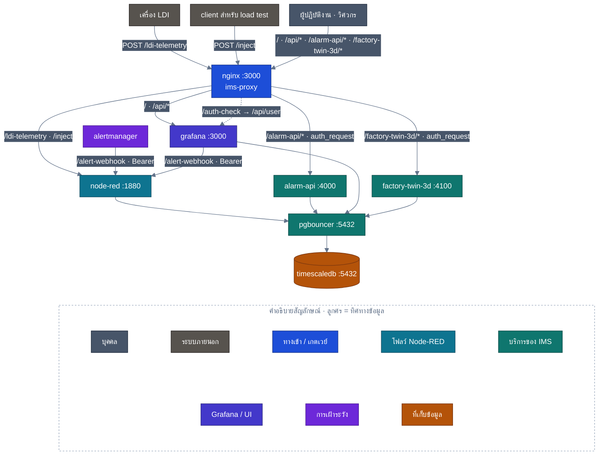
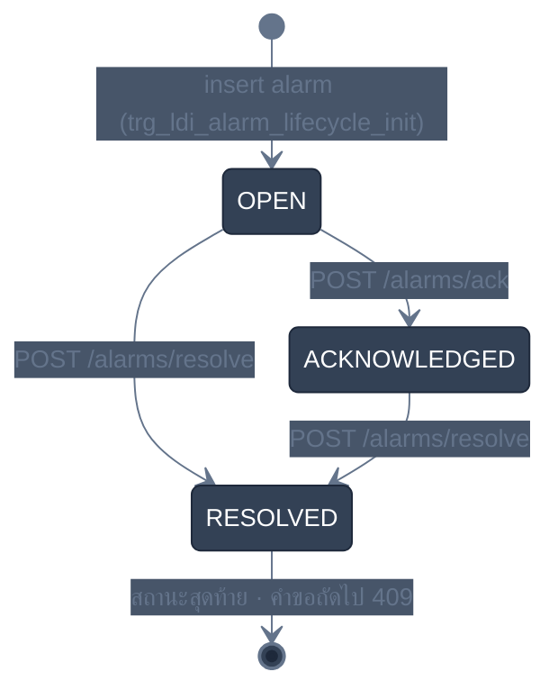

<!-- GLOBAL_NAV -->
<div align="right">
  <a href="../../README.md"> <b>หน้าหลัก</b></a> &nbsp;|&nbsp;
  <a href="../README.md"> <b>ดัชนีเอกสาร</b></a>
</div>
<br/>

<div align="center">
  <h1>คู่มืออ้างอิง IMS API (API Reference Manual)</h1>
  <p><b>ข้อกำหนดทางเทคนิคระดับโปรดักชันสำหรับ HTTP Endpoints, การรับส่งข้อมูล Telemetry ความถี่สูง, วงจรชีวิตการแจ้งเตือน และ Alerting Webhooks</b></p>
  <p>
    <a href="../../../docs/api/API_REFERENCE.md">English</a> |
    <a href="API_REFERENCE.md">ไทย</a> |
    <a href="../../../zh-CN/docs/api/API_REFERENCE.md">简体中文</a>
  </p>
</div>

---

## 1. ภาพรวมสถาปัตยกรรมและโทโพโลยีเครือข่าย (Architecture & Network Topology)

ระบบตรวจสอบทางอุตสาหกรรม (Industrial Monitoring System: IMS) เปิดอินเทอร์เฟซการเชื่อมต่อผ่าน HTTP, WebSocket และ SNMP สำหรับเชื่อมต่อเครื่องจักรในสายการผลิต, ระบบควบคุมการผลิต (MES), อุปกรณ์ PLC และสคริปต์อัตโนมัติของทีมวิศวกรรม

ทราฟฟิกทั้งหมดที่เข้าสู่พอร์ตหลักภายนอก (พอร์ตมาตรฐาน: `http://localhost:3000`) จะถูกจัดการโดย Nginx Reverse Proxy ประสิทธิภาพสูง ทำหน้าที่รับการเชื่อมต่อจากภายนอก, ควบคุมอัตราการส่งข้อมูลต่อไอพีต้นทาง (`limit_req zone=grafana_limit rate=100r/s burst=2500 nodelay`), จัดการบัฟเฟอร์ขนาดใหญ่ (`4 16k`) และส่งต่อคำขออย่างปลอดภัยไปยังเครือข่ายคอนเทนเนอร์ภายใน



### รูปแบบการพิสูจน์ตัวตนและการควบคุมสิทธิ์ (Authentication & Authorization)

IMS กำหนดสิทธิ์การเข้าถึงอย่างรัดกุมตามขอบเขตความรับผิดชอบของแต่ละเซอร์วิส:

1. **Ingestion API Key (`X-API-Key`)**: ใช้งานโดยเครื่องจักรที่ส่งข้อมูล Telemetry เข้าสู่ Node-RED (`/ldi-telemetry`) โดยจะตรวจสอบเทียบกับคีย์ลับในสภาพแวดล้อมระบบ (`INGEST_API_KEY`)
2. **Session Cookie Auth Gate (`auth_request /auth-check`)**: ควบคุมการเปลี่ยนแปลงสถานะการทำงาน (`/alarm-api/`) และ Digital Twin (`/factory-twin-3d/`) โดย Nginx จะส่งคำขอย่อยไปตรวจสอบสิทธิ์กับเซสชันของ Grafana ที่ `/api/user` หากไม่มีสิทธิ์จะปฏิเสธคำขอทันทีด้วยรหัส `401 Unauthorized`
3. **Database Role Isolation**: `alarm-api` เชื่อมต่อไปยัง PostgreSQL ผ่าน PgBouncer ด้วยบทบาท `alarm_api_writer` ซึ่งมีสิทธิ์เฉพาะการอัปเดตคอลัมน์วงจรชีวิตในตาราง `public.ldi_alarm_lifecycle` เท่านั้น

---

## 2. API รับข้อมูล Telemetry ของเครื่องจักร (Telemetry Ingestion API)

รับข้อมูลอนุกรมเวลาความถี่สูงจากการทำงานของเครื่องจักรเปิดรับแสง LDI

### `POST /ldi-telemetry`

ส่งข้อมูลพารามิเตอร์การผลิต, ค่าการจัดตำแหน่ง, ปริมาณพลังงานแสง และแรงดันสุญญากาศเข้าสู่คิวหน่วยความจำของ Node-RED โดยตรง เพื่อทำการประมวลผลและบันทึกลง TimescaleDB แบบกลุ่ม (Batch)

- **Gateway URL**: `http://localhost:3000/ldi-telemetry`
- **Internal Direct URL**: `http://node-red:1880/ldi-telemetry`
- **Method**: `POST`
- **Headers**:
  - `Content-Type: application/json`
  - `X-API-Key: ${INGEST_API_KEY}` (จำเป็น)

#### โครงสร้าง JSON ของ Request (JSON Array)

```json
[
  {
    "time": "2026-09-28T04:00:00Z",
  "factory": "F1",
  "process": "LDI",
  "eqp_id": "LDI-01",
  "mo": "MO-001234",
  "fpn": "PN-5678",
  "layer_name": "L1",
  "resist_dosage": 45.5,
  "scale_x": 1.002,
  "scale_y": 0.998,
  "temperature": 24.5,
  "humidity": 45.0,
  "scan_speed": 120.0,
  "air_vacuum": -15.2,
  "thickness": 1.2,
  "board_no": 1,
  "total_board": 100,
  "total_time": 450.5,
  "state": true,
  "pe_1": 1.1,
  "je_1": 2.2,
    "log_id": "LOG-10001"
  }
]
```

#### พจนานุกรมฟิลด์ข้อมูล (Field Dictionary)

| ฟิลด์ (Field) | ชนิดข้อมูล | จำเป็น | หน่วย / รูปแบบ | คำอธิบาย |
|:--------------|:-----------|:-------|:---------------|:---------|
| `time` | ISO 8601 String | ใช่ | เวลาสากล UTC | เวลาที่เครื่องจักรบันทึกข้อมูล |
| `factory` | String | ใช่ | รหัสโรงงาน | รหัสโรงงานหรือพื้นที่ติดตั้ง (เช่น `F1`) |
| `process` | String | ใช่ | ขั้นตอนการผลิต | แผนกหรือขั้นตอนการผลิต (เช่น `LDI`, `DRILLING`, `VCP`) |
| `eqp_id` | String | ใช่ | รหัสเครื่องจักร | รหัสระบุเครื่องจักรเฉพาะตัว (เช่น `LDI-01`) |
| `mo` | String | ใช่ | ข้อความตัวเลข | หมายเลขใบสั่งผลิต (Manufacturing Order ID) |
| `fpn` | String | ใช่ | ข้อความตัวเลข | หมายเลขชิ้นงานผลิตภัณฑ์ (Part Number ID) |
| `layer_name` | String | ใช่ | ข้อความตัวเลข | ชั้นเลเยอร์ของแผ่น PCB (เช่น `L1`, `L2`, `TOP`, `BOT`) |
| `resist_dosage` | Float | ใช่ | $\text{mJ/cm}^2$ | ปริมาณพลังงานแสงเปิดรับของน้ำยาโฟโตรีซิสต์ |
| `scale_x` | Float | ใช่ | อัตราส่วน | ค่าชดเชยการขยายตัวตามแนวแกน X |
| `scale_y` | Float | ใช่ | อัตราส่วน | ค่าชดเชยการขยายตัวตามแนวแกน Y |
| `temperature` | Float | ใช่ | $^\circ\text{C}$ | อุณหภูมิภายในห้องเปิดรับแสงของเครื่องจักร |
| `humidity` | Float | ใช่ | $\% \text{RH}$ | ความชื้นสัมพัทธ์ในห้องเครื่องจักร |
| `scan_speed` | Float | ใช่ | $\text{mm/s}$ | ความเร็วในการสแกนของหัวเปิดรับแสง |
| `air_vacuum` | Float | ใช่ | $\text{kPa}$ | แรงดันลมดูดสุญญากาศสำหรับยึดแผ่นชิ้นงาน |
| `thickness` | Float | ใช่ | $\text{mm}$ | ความหนาของแผ่นชิ้นงาน PCB |
| `board_no` | Integer | ใช่ | ลำดับ | ลำดับแผ่นที่กำลังผลิตในชุดปัจจุบัน |
| `total_board` | Integer | ใช่ | จำนวน | จำนวนแผ่นทั้งหมดที่ต้องผลิตในล็อตนี้ |
| `total_time` | Float | ใช่ | วินาที | เวลารวมที่เครื่องจักรใช้ในการเปิดรับแสง |
| `state` | Boolean | ใช่ | จริง/เท็จ | สถานะการทำงาน (`true` = กำลังทำงาน, `false` = หยุด/ขัดข้อง) |
| `pe_1` | Float | ไม่บังคับ | $\mu\text{m}$ | ค่าความคลาดเคลื่อนตำแหน่งจุดอ้างอิงแชนเนล 1 |
| `je_1` | Float | ไม่บังคับ | $\mu\text{m}$ | ค่าความคลาดเคลื่อนของการกระตุกหัวสแกน 1 |
| `log_id` | String | ใช่ | ข้อความตัวเลข | รหัสระบุเฉพาะสำหรับการเชื่อมโยงประวัติบันทึก |

#### รหัสตอบกลับ HTTP (Responses)

- **`200 OK`**: ข้อมูลผ่านการตรวจสอบความถูกต้อง บันทึกลง staging ล่วงหน้า (`public.ingest_staging`) เสร็จสิ้น, บันทึกลงไฮเปอร์เทเบิล (`public.ldi_data`) สำเร็จ และลบข้อมูลออกจาก staging เรียบร้อย
  ```json
  {
    "message": "LDI Batch received",
    "rows": 10
  }
  ```
- **`400 Bad Request`**: โครงสร้าง JSON ไม่ถูกต้อง, เพย์โหลดไม่ใช่ JSON Array หรือขาดฟิลด์บังคับ (`eqp_id`, `log_id`)
  ```json
  {
    "error": "Payload must be a JSON array"
  }
  ```
- **`401 Unauthorized`**: ขาด API Key หรือค่า `X-API-Key` ไม่ถูกต้อง
  ```json
  {
    "error": "Unauthorized"
  }
  ```
- **`413 Payload Too Large`**: จำนวนแถวในชุดข้อมูลเกินขีดจำกัดสูงสุด (500 แถว)
  ```json
  {
    "error": "Batch too large: 520 rows, max 500 -- split it"
  }
  ```
- **`502 Bad Gateway`**: บันทึกลง staging สำเร็จแต่เกิดข้อผิดพลาดในการบันทึกลงไฮเปอร์เทเบิล; ข้อมูลถูกคงไว้ใน `public.ingest_staging` เพื่อรอลองใหม่
  ```json
  {
    "error": "Insert failed, batch staged for retry"
  }
  ```
- **`503 Service Unavailable`**: การเชื่อมต่อฐานข้อมูลไม่พร้อมใช้งาน หรือการบันทึกลง staging ล้มเหลว; ปฏิเสธการรับข้อมูลชุดนี้
  ```json
  {
    "error": "Staging failed, batch not accepted"
  }
  ```

#### ตัวอย่างคำสั่ง cURL สำหรับนำเข้าข้อมูลจริง

```bash
curl -X POST http://localhost:3000/ldi-telemetry \
  -H "Content-Type: application/json" \
  -H "X-API-Key: ${INGEST_API_KEY}" \
  -d '[{
    "time": "2026-09-28T04:00:00Z",
    "factory": "F1",
    "process": "LDI",
    "eqp_id": "LDI-01",
    "mo": "MO-001234",
    "fpn": "PN-5678",
    "layer_name": "L1",
    "resist_dosage": 45.5,
    "scale_x": 1.002,
    "scale_y": 0.998,
    "temperature": 24.5,
    "humidity": 45.0,
    "scan_speed": 120.0,
    "air_vacuum": -15.2,
    "thickness": 1.2,
    "board_no": 1,
    "total_board": 100,
    "total_time": 450.5,
    "state": true,
    "pe_1": 1.1,
    "je_1": 2.2,
    "log_id": "LOG-10001"
  }]'
```

---

## 3. API นำเข้าข้อมูล Metric ทั่วไป (General Ingestion API)

สำหรับการส่งข้อมูล Telemetry ทั่วไปจากอุปกรณ์ที่ไม่ใช่ LDI เช่น โหนดเซนเซอร์วัดสภาพแวดล้อม และสคริปต์ทดสอบการทำงาน

### `POST /inject`

- **Gateway URL**: `http://localhost:3000/inject`
- **Internal Direct URL**: `http://node-red:1880/inject`
- **Method**: `POST`
- **Headers**: `Content-Type: application/json`

#### โครงสร้าง JSON ของ Request

```json
{
  "device_id": "SENSOR-ENV-01",
  "metric": "ambient_temperature",
  "value": 23.4,
  "unit": "celsius",
  "timestamp": 1790568000
}
```

#### การตอบกลับ

- **`200 OK`**: ได้รับข้อมูลและส่งต่อไปป์ไลน์ประมวลผลเรียบร้อย
  ```json
  {
    "status": "ok",
    "received": 1
  }
  ```

#### ตัวอย่างคำสั่ง cURL

```bash
curl -X POST http://localhost:3000/inject \
  -H "Content-Type: application/json" \
  -d '{"device_id": "CHILLER-01", "metric": "flow_rate_lpm", "value": 48.2, "timestamp": 1790568000}'
```

---

## 4. API จัดการวงจรชีวิตการแจ้งเตือน (Alarm Lifecycle Management API)

ไมโครเซอร์วิส `alarm-api` (`services/alarm-api`) รับผิดชอบการเปลี่ยนสถานะของเหตุการณ์แจ้งเตือนที่จัดเก็บในตาราง `public.ldi_alarm_lifecycle`

สถานะของการแจ้งเตือนจะเปลี่ยนไปตามลำดับขั้นตอนที่แน่นอน:



### ใครเรียกใช้ได้

`alarm-api` ไม่ได้เปิด port บนเครื่อง เรียกได้ผ่าน nginx ที่ `/alarm-api/` หรือจาก container อื่นบนเครือข่ายภายในที่ `http://alarm-api:4000` เท่านั้น

ทุกคำขอ ack/resolve ต้องมี cookie session ของ Grafana และต้องผ่านการตรวจสองชั้น:

1. **nginx** ส่ง cookie ไปให้ Grafana ตรวจ (`auth_request` → `/api/user`) ถ้าไม่มี session หรือ session ไม่ถูกต้อง จะได้ **401** ก่อนคำขอถึง service
2. **alarm-api** ถาม Grafana อีกครั้งทั้ง `/api/user` และ `/api/user/orgs` เพื่อเอาชื่อ login และ role ของผู้เรียกในองค์กรปัจจุบัน
   - **Editor** หรือ **Admin** เขียนได้ รวมถึง Grafana server admin
   - **Viewer** จะได้ **403**

ผู้ดำเนินการที่บันทึกใน `acknowledged_by` / `resolved_by` คือชื่อ login Grafana ของ session เสมอ field `acknowledged_by` หรือ `resolved_by` ใน body ของคำขอจะถูกละเลย

### `POST /alarm-api/alarms/ack`

รับทราบการแจ้งเตือน: `OPEN` → `ACKNOWLEDGED`

- **URL**: `http://<host>:3000/alarm-api/alarms/ack`
- **Headers**: `Content-Type: application/json`, `Cookie: grafana_session=…`

#### ข้อมูลในคำขอ

| Field | ชนิด | จำเป็น | คำอธิบาย |
|:------|:-----|:---------|:------------|
| `logdate_ms` | Number | ใช่ | เวลาของการแจ้งเตือนเป็น Unix epoch มิลลิวินาที |
| `logid` | String | ใช่ | รหัสของรายการ log การแจ้งเตือน |

```json
{ "logdate_ms": 1790568000000, "logid": "LOG-10001" }
```

#### การตอบกลับ

- **`200 OK`**: เปลี่ยนเป็น `ACKNOWLEDGED` แล้ว body ส่งแถวข้อมูลกลับมา โดย `acknowledged_by` เป็นชื่อ login Grafana ของผู้เรียก
- **`400 Bad Request`**: `{"error": "logdate_ms (number) and logid are required"}`
- **`401 Unauthorized`**: ไม่มี session Grafana ที่ถูกต้อง (มาจาก nginx หรือจาก service เองเมื่อเรียกตรง)
- **`403 Forbidden`**: `{"error": "insufficient permission (Viewer role cannot acknowledge/resolve alarms)"}`
- **`404 Not Found`**: ไม่มีแถว lifecycle ที่ตรงกับ `logdate_ms` และ `logid`
- **`409 Conflict`**: การแจ้งเตือนไม่ได้อยู่ในสถานะ `OPEN` เช่น `{"error": "cannot transition to ACKNOWLEDGED from current status ACKNOWLEDGED"}`
- **`500 Internal Error`**: ติดต่อฐานข้อมูลไม่ได้ หรือเกิดข้อผิดพลาดที่ไม่คาดคิด

#### ตัวอย่าง cURL

```bash
curl -X POST http://localhost:3000/alarm-api/alarms/ack \
  -H "Content-Type: application/json" \
  -H "Cookie: grafana_session=<your session cookie>" \
  -d '{"logdate_ms": 1790568000000, "logid": "LOG-10001"}'
```

---

### `POST /alarm-api/alarms/resolve`

ปิดการแจ้งเตือน: `OPEN` หรือ `ACKNOWLEDGED` → `RESOLVED` พร้อมบันทึกเพิ่มเติม (ไม่บังคับ)

- **URL**: `http://<host>:3000/alarm-api/alarms/resolve`
- **Headers**: `Content-Type: application/json`, `Cookie: grafana_session=…`

#### ข้อมูลในคำขอ

| Field | ชนิด | จำเป็น | คำอธิบาย |
|:------|:-----|:---------|:------------|
| `logdate_ms` | Number | ใช่ | เวลาของการแจ้งเตือนเป็น Unix epoch มิลลิวินาที |
| `logid` | String | ใช่ | รหัสของรายการ log การแจ้งเตือน |
| `resolution_note` | String | ไม่ | สาเหตุรากและการแก้ไขที่ทำ |

```json
{ "logdate_ms": 1790568000000, "logid": "LOG-10001", "resolution_note": "Replaced the chuck filter; vacuum back in range." }
```

#### การตอบกลับ

รหัสเหมือน `ack` เมื่อได้ `200` จะคืนแถวที่มี `status: "RESOLVED"` และ `resolved_by` เป็นชื่อ login Grafana ของผู้เรียก ส่วน `409` หมายถึงการแจ้งเตือนเป็น `RESOLVED` อยู่แล้ว

#### ตัวอย่าง cURL

```bash
curl -X POST http://localhost:3000/alarm-api/alarms/resolve \
  -H "Content-Type: application/json" \
  -H "Cookie: grafana_session=<your session cookie>" \
  -d '{"logdate_ms": 1790568000000, "logid": "LOG-10001", "resolution_note": "Replaced the chuck filter."}'
```

---

### `GET /alarm-api/healthz`

ตรวจว่า service ทำงานและติดต่อฐานข้อมูลได้ (รัน `SELECT 1` ผ่าน pool) ตัว service เองไม่ขอ session แต่เส้นทาง `/alarm-api/` บน nginx ยังต้องมี session อยู่ healthcheck ของ Docker จึงเรียกจากภายใน container แทน

- **ผ่าน nginx**: `http://<host>:3000/alarm-api/healthz` พร้อม cookie session ของ Grafana
- **ภายใน container**: `http://127.0.0.1:4000/healthz` (สิ่งที่ healthcheck ของ Docker เรียก) ส่วน container อื่นใช้ `http://alarm-api:4000/healthz` ได้

#### การตอบกลับ

- **`200 OK`**: `{"status": "ok"}`
- **`503 Service Unavailable`**: `{"status": "db unreachable"}`

```bash
docker exec ims-alarm-api wget -qO- http://127.0.0.1:4000/healthz
```

---

## 5. API ระบบแจ้งเตือนภายนอก (Alerting & Webhook API)

เปิดให้ Prometheus, ระบบตรวจสอบภายนอก และเกตเวย์ PLC ส่งต่อเหตุการณ์แจ้งเตือนเข้าสู่ Prometheus Alertmanager

### `POST /api/v2/alerts`

- **Gateway URL**: `http://localhost:3000/alert-webhook` (หรือตรงที่ `http://localhost:9093/api/v2/alerts`)
- **Method**: `POST`
- **Headers**: `Content-Type: application/json`

#### โครงสร้าง JSON มาตรฐาน Prometheus Alertmanager v2

```json
[
  {
    "labels": {
      "alertname": "LdiHighLaserDosage",
      "severity": "critical",
      "instance": "LDI-01",
      "process": "LDI",
      "factory": "F1"
    },
    "annotations": {
      "summary": "พลังงานเลเซอร์เกินเกณฑ์ความปลอดภัยสูงสุด",
      "description": "เครื่องจักร LDI-01 วัดค่าพลังงานได้ 48.5 mJ/cm2 (เกณฑ์สูงสุด: 46.0 mJ/cm2) จำเป็นต้องหยุดตรวจสอบทันที"
    },
    "startsAt": "2026-09-28T04:10:00Z",
    "endsAt": "2026-09-28T04:20:00Z",
    "generatorURL": "http://prometheus:9090/graph"
  }
]
```

#### ตัวอย่างคำสั่ง cURL

```bash
curl -X POST http://localhost:9093/api/v2/alerts \
  -H "Content-Type: application/json" \
  -d '[
    {
      "labels": {
        "alertname": "LdiVacuumDrop",
        "severity": "warning",
        "instance": "LDI-02",
        "process": "LDI"
      },
      "annotations": {
        "summary": "แรงดันสุญญากาศในห้องเครื่องจักรตก",
        "description": "แรงดันตกต่ำกว่า -12.0 kPa ต่อเนื่องเกิน 3 นาที"
      },
      "startsAt": "2026-09-28T04:12:00Z"
    }
  ]'
```

---

## 6. Endpoints ตรวจสอบสถานะของระบบและเกตเวย์ (Gateway System APIs)

| Endpoint | โปรโตคอล | เซอร์วิสปลายทาง | วัตถุประสงค์ |
|:---------|:---------|:----------------|:-------------|
| `/api/health` | HTTP GET | Grafana `:3000` | ตรวจสอบสถานะความพร้อมและฐานข้อมูลของ Grafana |
| `/api/login/ping` | HTTP GET | Grafana `:3000` | ตรวจสอบสถานะเซสชันของไคลเอนต์และหน้าจอ Kiosk |
| `/api/live/ws` | WebSocket | Grafana `:3000` | การสตรีมข้อมูลสดแบบสองทางสำหรับหน้าจอแดชบอร์ด |
| `/auth-check` | HTTP GET | Grafana `:3000` | ตรวจสอบเซสชันภายในสำหรับ Nginx auth_request |

---

## 7. รหัสข้อผิดพลาดและการแก้ไขปัญหา (Troubleshooting & Error Codes)

| รหัสสถานะ | สาเหตุ | การวินิจฉัยและขั้นตอนแก้ไข |
|:----------|:-------|:---------------------------|
| `400 Bad Request` | โครงสร้างข้อมูลไม่ถูกต้อง | ตรวจสอบข้อมูลเทียบกับ Field Dictionary ให้แน่ใจว่า `logdate_ms` เป็นตัวเลข |
| `401 Unauthorized` | การยืนยันตัวตนล้มเหลว | ระบุ `X-API-Key` ที่ถูกต้อง หรือตรวจสอบว่าล็อกอินเข้าเซสชันของ Grafana แล้ว |
| `404 Not Found` | ไม่พบข้อมูล | ตรวจสอบว่ามี `logid` และ `logdate_ms` ในตาราง `public.ldi_alarm_lifecycle` หรือไม่ |
| `409 Conflict` | การเปลี่ยนสถานะไม่ถูกต้อง | สถานะที่แก้ไขแล้ว (RESOLVED) ไม่สามารถย้อนกลับไปรับทราบ (ACKNOWLEDGED) ได้ |
| `429 Too Many Requests` | เกินขีดจำกัดอัตราส่งข้อมูล | ส่งข้อมูลเกิน 100 คำขอ/วินาที ให้ลดความถี่หรือเพิ่มระยะเวลาระหว่างคำขอ |
| `502 Bad Gateway` | คอนเทนเนอร์ปลายทางไม่พร้อม | คอนเทนเนอร์อาจกำลังรีสตาร์ต ให้สั่ง `docker exec ims-proxy nginx -s reload` |
| `503 Service Unavailable` | การเชื่อมต่อฐานข้อมูลขัดข้อง | ตรวจสอบสถานะการเชื่อมต่อของ PgBouncer และ TimescaleDB ด้วย `make verify` |
