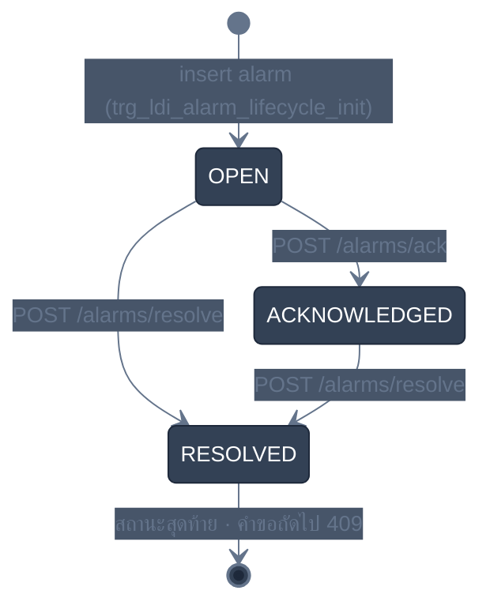

<!-- GLOBAL_NAV -->
<div align="right">
  <a href="../../README.md"> <b>หน้าหลัก</b></a> &nbsp;|&nbsp;
  <a href="../README.md"> <b>ดัชนีเอกสาร</b></a>
</div>
<br/>

<div align="center">
  <h1>คู่มือระดับความรุนแรงของการแจ้งเตือนและสถาปัตยกรรมสถานะวงจรชีวิต (Alarm Severity & Lifecycle)</h1>
  <p><b>การจำแนกระดับความรุนแรง 4 ระดับ, โทเคนสีมาตรฐาน (Canonical Color Tokens), เครื่องจักรสถานะจำกัด (OPEN → ACKNOWLEDGED → RESOLVED) และการสอดคล้องกับ ISA-18.2</b></p>
  <p>
    <a href="../../../docs/architecture/ALARM_SEVERITY_GUIDE.md">English</a> |
    <a href="ALARM_SEVERITY_GUIDE.md">ไทย</a> |
    <a href="../../../zh-CN/docs/architecture/ALARM_SEVERITY_GUIDE.md">简体中文</a>
  </p>
</div>

---

## 1. ภาพรวมและขอบเขตการปฏิบัติการ

ระบบ Industrial Monitoring System (IMS) ปฏิบัติตามสถาปัตยกรรมการจัดการสัญญาณแจ้งเตือนแบบกำหนดแน่นอน (Deterministic Alarm Management) เพื่อป้องกันภาวะสัญญาณแจ้งเตือนท่วมท้น (Alarm Floods), บังคับใช้การแสดงความเป็นเจ้าของเหตุการณ์ และระบุบริบทที่นำไปปฏิบัติได้จริงบนบอร์ด Andon หน้างานและระบบวิเคราะห์ทางวิศวกรรม

การประมวลผลการแจ้งเตือนทำงานแยกกันระหว่าง 2 โครงสร้างฐานข้อมูล:
1. **ตารางบันทึกเหตุการณ์แบบต่อท้ายเท่านั้น (`public.ldi_alarm_log`)**: ไฮเปอร์เทเบิลความเร็วสูงที่ไม่สามารถแก้ไขได้ ซึ่งจะบันทึกทุกครั้งที่มีสัญญาณเตือนดังขึ้น
2. **ตารางติดตามสถานะวงจรชีวิตที่แก้ไขได้ (`public.ldi_alarm_lifecycle`)**: ตารางเฉพาะสำหรับติดตามผู้รับผิดชอบ, การรับทราบเหตุการณ์ของผู้ปฏิบัติงาน และเวลาที่แก้ไขเสร็จสิ้น

---

## 2. ระดับความรุนแรง 4 ระดับและโทเคนสีมาตรฐาน (Canonical Color Tokens)

ทุกรหัสการแจ้งเตือนใน `public.ldi_alarm_ms_code` ถูกควบคุมโดยข้อกำหนด `CHECK` ของฐานข้อมูลที่จำกัดไว้ 4 ระดับ:

| ระดับความรุนแรง | โทเคนสีทางการ | รหัสสี (Hex) | ตัวบ่งชี้ทางสายตา | ลำดับความสำคัญและการตอบสนอง |
|:----------------|:--------------|:-------------|:-------------------|:----------------------------|
| **Critical (วิกฤต)** | `critical` | `#EF4444` | สีแดงสด | ลำดับความสำคัญสูงสุด — เสี่ยงต่อการหยุดเครื่องทันทีหรือชิ้นงานเสียหาย ต้องตอบสนอง $< 2\text{ นาที}$ |
| **Major (สำคัญมาก)** | `warning` | `#F59E0B` | สีเหลืองอำพัน | ข้อบกพร่องร้ายแรงหรือพารามิเตอร์เบี่ยงเบน ต้องเข้าแก้ไขอย่างรวดเร็ว $< 15\text{ นาที}$ |
| **Minor (เล็กน้อย)** | `severity-minor` | `#EAB308` | สีเหลืองทอง | การเตือนที่มีผลกระทบต่ำ หรือการแจ้งเตือนบำรุงรักษาเชิงป้องกัน ตรวจสอบในรอบกะการทำงาน |
| **Warning (แจ้งเตือน)** | `accent` | `#3B82F6` | สีน้ำเงินแม่นยำ | ข้อมูลทั่วไปหรือคำแนะนำ ใช้สีน้ำเงินเพื่อป้องกันการสับสนทางสายตากับสีเหลืองอำพันของ Major |

> [!TIP]
> **การปฏิบัติตามระบบการออกแบบ**: สังเกตว่าระดับต่ำสุด **Warning** จงใจใช้โทเคนสีน้ำเงิน `#3B82F6` (accent blue) ในขณะที่ **Major** ใช้โทเคนสีเหลืองอำพัน `#F59E0B` (amber) เพื่อให้ผู้ปฏิบัติงานหน้างานสามารถแยกแยะระหว่างคำแนะนำทั่วไปกับความผิดปกติร้ายแรงได้ทันทีเพียงชำเลืองมอง

---

## 3. วงจรชีวิตของสถานะการแจ้งเตือน (Migration 077)

การเปลี่ยนสถานะวงจรชีวิตของการแจ้งเตือนถูกควบคุมทางฝั่งเซิร์ฟเวอร์ฐานข้อมูล PostgreSQL โดยทริกเกอร์ `trg_ldi_alarm_lifecycle_guard`:



### คำจำกัดความของสถานะและการบังคับใช้ด้วยทริกเกอร์

- **`OPEN`**: สถานะเริ่มต้นที่สร้างขึ้นอัตโนมัติเมื่อมีแถวบันทึกลงใน `public.ldi_alarm_log` ยังไม่มีการเข้าจัดการจากเจ้าหน้าที่
- **`ACKNOWLEDGED`**: เจ้าหน้าที่ควบคุมเครื่องได้รับทราบและยอมรับหน้าที่ดูแล ต้องระบุชื่อผู้รับทราบ `acknowledged_by` และระบบจะประทับเวลา `acknowledged_at` อัตโนมัติ
- **`RESOLVED`**: สถานะสิ้นสุด ต้องระบุชื่อผู้แก้ไข `resolved_by` และบันทึกเพิ่มเติม `resolution_note` เมื่อเข้าสู่สถานะ `RESOLVED` ข้อมูลแถวนั้นจะกลายเป็นแบบอ่านอย่างเดียวถาวร หากมีการพยายาม UPDATE อีก ระบบจะยกเลิกคำสั่งด้วยข้อผิดพลาดทันที

---

## 4. ความสอดคล้องกับมาตรฐาน ISA-18.2 และขอบเขตทางเทคนิค

ระบบ IMS นำคำศัพท์และแนวคิดบางส่วนมาจาก **ANSI/ISA-18.2-2016** (Management of Alarm Systems for the Process Industries) เพื่อความแม่นยำทางวิศวกรรม ระบบนี้จัดอยู่ในกลุ่ม **"รูปแบบ ISA-18.2 (ISA-18.2-style)"**:

### สิ่งที่ถูกนำมาใช้งานจริง
- **โครงสร้างระดับความรุนแรง 4 ระดับ**: การจัดหมวดหมู่อย่างเป็นระบบพร้อมลำดับความสำคัญชัดเจน
- **เครื่องจักรสถานะวงจรชีวิตของผู้ปฏิบัติงาน**: มีการติดตามสถานะ (`OPEN` $\to$ `ACKNOWLEDGED` $\to$ `RESOLVED`)
- **การบันทึกการรับทราบที่ตรวจสอบย้อนหลังได้**: เชื่อมต่อผ่าน REST API (`ims-alarm-api`) พร้อมบันทึกตัวตนและเวลา
- **การแสดงผลบนกระดาน Andon (ISA-101)**: หน้าจอแสดงผลสถานการณ์ที่มีคอนทราสต์สูงสำหรับติดตั้งในโรงงาน

### สิ่งที่อยู่นอกขอบเขตการทำงาน (โดยเจตนา)
- **การระงับการแจ้งเตือนชั่วคราว (Shelving & Suppression)**: ปัจจุบันใช้การเข้าโหมดซ่อมบำรุงด้วยมือของผู้ควบคุมเครื่อง แทนการใช้ระบบจับเวลา Shelving อัตโนมัติ
- **แคตตาล็อกการพิจารณาเหตุผลแบบไดนามิก**: ข้อมูลการพิจารณาเหตุผลบันทึกอยู่ในตารางเอกสารเชิงสัมพันธ์ แทนการปรับเปลี่ยนในรันไทม์

---

## 5. คำสั่ง SQL ตรวจสอบข้อมูลสดและ API สำหรับเชื่อมต่อ

### คำสั่ง SQL ค้นหารายการแจ้งเตือนที่ยังไม่ได้รับการแก้ไข (Andon Queue)

```sql
SELECT
  l.logid,
  l.logdate,
  l.equipmentid,
  m.alarm_code,
  m.alarm_msg,
  m.severity,
  COALESCE(lc.status, 'OPEN') AS status,
  lc.acknowledged_by,
  ROUND(EXTRACT(EPOCH FROM (NOW() - l.logdate)) / 60.0, 1) AS elapsed_minutes
FROM public.ldi_alarm_log l
JOIN public.ldi_alarm_ms_code m ON l.errorcode = m.alarm_code
LEFT JOIN public.ldi_alarm_lifecycle lc ON (l.logdate = lc.logdate AND l.logid = lc.logid)
WHERE lc.status IS DISTINCT FROM 'RESOLVED'
  AND l.logdate > NOW() - INTERVAL '24 hours'
ORDER BY
  CASE m.severity
    WHEN 'Critical' THEN 1
    WHEN 'Major'    THEN 2
    WHEN 'Minor'    THEN 3
    ELSE 4
  END ASC,
  l.logdate DESC;
```

### คำสั่ง cURL สำหรับรับทราบและปิดงานแจ้งเตือนผ่าน API

```bash
# ผู้ดำเนินการที่บันทึกคือชื่อ login Grafana ของ session (Editor หรือ Admin) field acknowledged_by / resolved_by ใน body จะถูกละเลย
# 1. ผู้ควบคุมเครื่องกดยอมรับการแจ้งเตือน (ผ่าน Nginx proxy front-door พร้อมเซสชัน Grafana)
curl -X POST "http://localhost:3000/alarm-api/alarms/ack" \
  -H "Content-Type: application/json" \
  -H "Cookie: grafana_session=YOUR_SESSION_COOKIE" \
  -d '{
    "logdate_ms": 1790568000000,
    "logid": "LOG-10001"
  }'

# 2. ช่างเทคนิคบันทึกปิดงานพร้อมระบุสาเหตุการแก้ไข (Resolve)
curl -X POST "http://localhost:3000/alarm-api/alarms/resolve" \
  -H "Content-Type: application/json" \
  -H "Cookie: grafana_session=YOUR_SESSION_COOKIE" \
  -d '{
    "logdate_ms": 1790568000000,
    "logid": "LOG-10001",
    "resolution_note": "เปลี่ยนปะเก็นซีลสุญญากาศห้องฉายแสงเรียบร้อย ระดับความดันกลับสู่ค่าปกติ"
  }'
```
