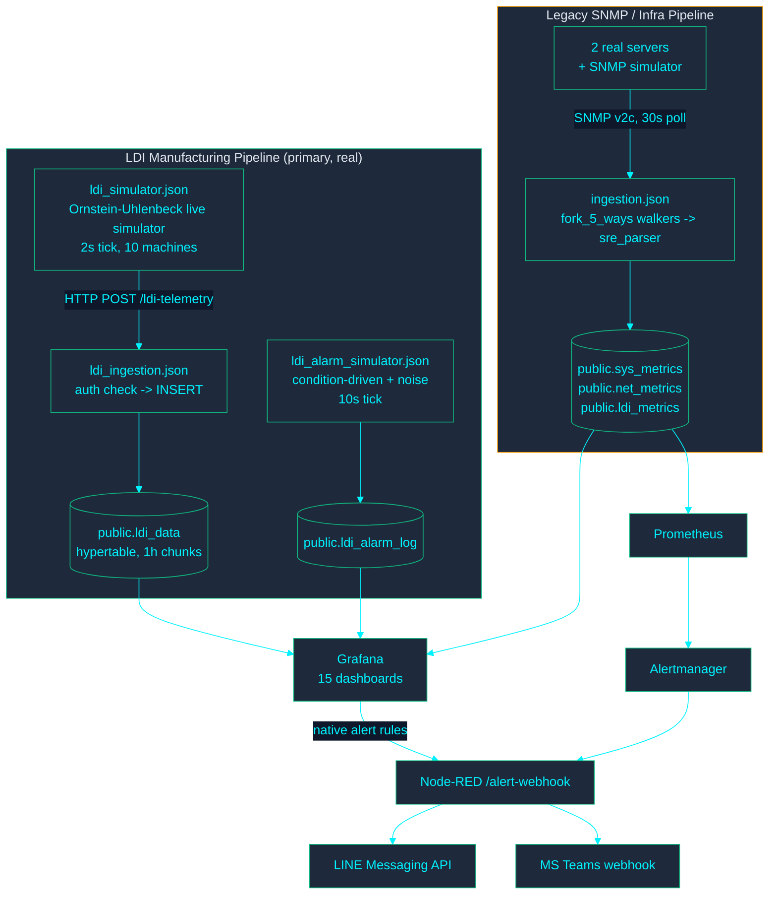

<!-- GLOBAL_NAV -->

  <a href="../../README.md"> <b>หน้าหลัก</b></a> &nbsp;|&nbsp;
  <a href="../README.md"> <b>ดัชนีเอกสาร</b></a>

 

 

 <a href="../../../docs/architecture/ARCHITECTURE.md"> <b>English</b></a> |
  <b>ไทย</b> |
 <a href="../../../zh-CN/docs/architecture/ARCHITECTURE.md"> <b>简体中文</b></a>
 

# สถาปัตยกรรมระบบ IMS

> **ผู้อ่าน:** สถาปนิกระบบ, SRE และนักพัฒนา backend
> **วัตถุประสงค์:** แหล่งอ้างอิงหลักเพียงแห่งเดียวของโทโพโลยีระบบ การไหลของข้อมูล และสถาปัตยกรรมเชิงปฏิบัติการ
> **ที่มาของข้อมูล:** ตรวจเทียบกับระบบที่รันอยู่จริงเมื่อ 2026-08-05 และตรวจรายการคอนเทนเนอร์ การแจ้งเตือน แดชบอร์ด และ CI gate ซ้ำเทียบกับ `main` เมื่อ 2026-09-26 log การรันจริงและภาพหน้าจอที่ยืนยันข้อความด้านล่างอยู่ที่ **[ดัชนีหลักฐาน](../evidence/INDEX.md)**

---

## บริบทของระบบ

IMS เป็น Docker Compose stack ที่มี **ไปป์ไลน์ telemetry 2 ชุดที่ทำงานแยกจากกัน** ส่งข้อมูลเข้า TimescaleDB ชุดเดียวที่ใช้ร่วมกัน แสดงผลผ่าน **แดชบอร์ด Grafana 15 ชุด** และแจ้งเตือนผ่านทั้งระบบแจ้งเตือนในตัวของ Grafana และ Prometheus/Alertmanager

**เหตุผลที่มีไปป์ไลน์สองชุด:**

- **ไปป์ไลน์ SNMP แบบเดิม (`ingestion.json`):** การออกแบบดั้งเดิมของระบบ poll อุปกรณ์ SNMP แยกวิเคราะห์ด้วย `sre_parser` แบบมีสถานะ แล้ว insert ลง `sys_metrics` / `net_metrics` / `ldi_metrics`
- **ไปป์ไลน์การผลิต LDI (`ldi_data`):** เพิ่มเข้ามาภายหลังเพื่อรับ telemetry ความละเอียดสูงผ่าน HTTP POST จำเป็นเพราะแดชบอร์ดการผลิตต้องการความแม่นยำของ PE/JE/Cpk ระดับรายตัวอย่าง ซึ่งตาราง `ldi_metrics` ที่เป็นข้อมูลสังเคราะห์รองรับไม่ได้

> [!NOTE]
> **เนื้อหากระบวนการ LDI ในทุกแดชบอร์ดของ Grafana อ่านจาก `ldi_data` ไม่ใช่ `ldi_metrics`** แม้ `ldi_metrics` ยังรับข้อมูลอยู่ แต่คอลัมน์เฉพาะของ LDI (`throughput`, `power_watt`, `vibration`) มีค่าเป็น `0` เสมอสำหรับอุปกรณ์กลุ่ม LDI ดูหัวข้อ "ข้อจำกัดของระบบและขอบเขตทางเทคนิค" ด้านล่าง

---

## รายการคอนเทนเนอร์

| Service | คอนเทนเนอร์ | หน้าที่ |
| --- | --- | --- |
| `timescaledb` | `ims-timescaledb` | PostgreSQL + TimescaleDB — ที่เก็บข้อมูลถาวรทั้งหมด |
| `pgbouncer` | `ims-pgbouncer` | connection pooler แบบ transaction mode หน้า TimescaleDB |
| `node-red` | `ims-node-red` | ไปป์ไลน์ telemetry ทั้งสองชุด (ตัวจำลอง + การรับข้อมูล) และ flow ส่งการแจ้งเตือน |
| `grafana` | `ims-grafana` | แดชบอร์ด กฎแจ้งเตือนที่ provision ไว้ และระบบแจ้งเตือนในตัว ไม่มีพอร์ตบน host เป็นของตัวเอง — เข้าถึงผ่าน `proxy` เท่านั้น (ดูด้านล่าง) |
| `proxy` | `ims-proxy` | nginx reverse proxy; ทางเข้าบน host เพียงทางเดียวสู่ Grafana และ `alarm-api` โดย `/alarm-api/` ต้องผ่านการตรวจ `auth_request` กับ session ของ Grafana (`proxy/nginx.conf`) — ดู `SECURITY_MODEL.md` |
| `alarm-api` | `ims-alarm-api` | เส้นทางเขียนข้อมูลลง `public.ldi_alarm_lifecycle` (Acknowledge/Resolve เรียกจาก `IMS LDI - Alarm Console`) ไม่มีพอร์ตบน host เข้าถึงผ่าน `proxy` เท่านั้น เชื่อมต่อ Postgres ด้วย role `alarm_api_writer` ที่มีสิทธิ์น้อยที่สุด (migration 078) |
| `renderer` | `ims-grafana-renderer` | service `grafana-image-renderer` ภายนอก (export ภาพ PNG สำหรับการแจ้งเตือน/รายงาน) |
| `prometheus` | `ims-prometheus` | scrape exporter ที่เกี่ยวกับ `sys_metrics` และสุขภาพของ Node-RED; ประเมินกฎแจ้งเตือนของตัวเอง |
| `alertmanager` | `ims-alertmanager` | ส่งต่อการแจ้งเตือนของ Prometheus ไปที่ `/alert-webhook` ของ Node-RED |
| `blackbox-exporter` | (blackbox) | probe แบบ HTTP/TCP/ICMP สำหรับเฝ้าระวัง SLA |
| `snmpsim` | (snmpsim) | SNMP agent จำลองสำหรับเป้าหมายพัฒนา/ทดสอบของไปป์ไลน์แบบเดิม |
| `db-migrate` | `ims-db-migrate` | ตัวรัน migration แบบครั้งเดียว (`scripts/migrate-entrypoint.sh`) กั้นการเริ่มของ `node-red` และ `alarm-api` |
| `factory-twin-3d` | `ims-factory-twin-3d` | ดิจิทัลทวินชั้น 1 (Express พอร์ต 4100 ภายใน) ไม่มีพอร์ตบน host เข้าถึงผ่าน `proxy` ที่ `/factory-twin-3d/` หลังด่าน `auth_request` เดียวกัน อ่านอย่างเดียว: ไม่เขียนอะไรลงฐานข้อมูล |
| `observability-archiver` | `ims-observability-archiver` | เก็บ snapshot ด้าน observability ของคอนเทนเนอร์/ฐานข้อมูลลง `./ops-logs` เป็นระยะ และ mount Docker socket แบบอ่านอย่างเดียว |
| `pgadmin` | `ims-pgadmin4` | หน้าจอจัดการฐานข้อมูล (`dpage/pgadmin4`) ไม่อยู่บนเส้นทางข้อมูลขณะรัน |

service ที่ใช้ภายในเท่านั้น (PgBouncer, ตัวจำลอง SNMP, Grafana, alarm-api, factory-twin-3d, renderer) ไม่เปิดสู่ host โดยตรง พอร์ตบน host มีดังนี้: `proxy` ที่ `${GRAFANA_PORT:-3000}` (ทุก interface — ทางเข้า UI เพียงทางเดียว เป็นด่านหน้าของ Grafana, alarm-api, ทวิน และ `/ldi-telemetry` + `/inject` ของ Node-RED), `pgadmin` ที่ `5050` (ทุก interface) ส่วน Node-RED (1880), Prometheus (9090), Alertmanager (9093) และ Blackbox (9115) bind ไว้ที่ `127.0.0.1` เท่านั้น

---

## ไปป์ไลน์การผลิต LDI (ไปป์ไลน์ที่ทุกแดชบอร์ดใช้จริง)

1. **`ldi_simulator.json`** (แท็บ "LDI Live Simulator") รันกระบวนการ Ornstein-Uhlenbeck แบบย้อนกลับสู่ค่าเฉลี่ยรายเครื่อง (เครื่อง LDI จำลอง 10 เครื่องใน 3 กระบวนการ: DF INNER, DF OUTER, SM) ทุก 2 วินาที และ POST เป็น batch ไปที่ `/ldi-telemetry`
2. **`ldi_ingestion.json`** (แท็บ "IMS LDI Ingestion") รับ POST ตรวจ header `x-api-key` เทียบกับ `INGEST_API_KEY` แล้ว insert ลง `public.ldi_data`
3. **`ldi_alarm_simulator.json`** (แท็บ "LDI Alarm Simulator") ทำงานทุก 10 วินาที รหัส alarm ที่มีความเชื่อมโยงกับพารามิเตอร์จริง (อุณหภูมิ/ความชื้น, ความคลาดเคลื่อนการจัดตำแหน่ง PE/JE, scan speed) ขับเคลื่อนด้วยเงื่อนไข — จะเกิดเฉพาะเมื่อ telemetry ที่อ่านล่าสุดอยู่นอกสเปกจริง โดยใช้เกณฑ์เดียวกับที่ `v_ldi_alarm_context` (migration 045) ใช้ประเมิน RCA ส่วนรหัสที่ไม่มีความเชื่อมโยงกับพารามิเตอร์ (ความผิดพลาดของการสอบเทียบ ความผิดพลาดของอุปกรณ์สร้างภาพ ฯลฯ) สุ่มจากกลุ่ม noise แบบถ่วงน้ำหนักตามความถี่ในอดีตจริง `VACUUM` (รหัส alarm `91009`) ตั้งใจให้เป็น noise อย่างเดียว เพราะค่า `air_vacuum` ที่คงที่ตามสูตรการผลิตของทุกเครื่องอยู่ในช่วง "นอกสเปก" ของ `flag_vac_out_of_spec` อยู่แล้วไม่ว่าจังหวะเวลาใด จึงไม่มีกลยุทธ์ด้านจังหวะของ alarm ใดสร้างสัญญาณความสัมพันธ์จริงได้ — เป็นความไม่สอดคล้องระหว่างเกณฑ์ flag กับสูตรการผลิต ไม่ใช่สิ่งที่ควรแก้แบบหลอก ๆ ในตัวจำลอง
4. ทั้งสองส่วนเขียนลง `public.ldi_data` / `public.ldi_alarm_log` ซึ่งทุกแดชบอร์ด LDI ใน Grafana และ panel RCA Truth Test อ่านข้อมูลจากที่นี่

**Yield** มีแหล่งอ้างอิงเดียวคือ `public.f_ldi_yield_pct()` (migration 046) — ใช้ค่าที่แย่กว่าระหว่างอัตราผ่านของ PE และ JE เทียบกับ `pe_setting`/`je_setting` ของแต่ละแถวเอง (ไม่ใช่ threshold ที่ฝังค่าไว้) ทั้ง NOC Overview และ Manufacturing เรียกฟังก์ชันเดียวกันนี้ ตัวเลขจึงขัดแย้งกันไม่ได้โดยโครงสร้าง

**Cpk** สูตรความสามารถของกระบวนการ (`LEAST((limit-mean)/(3*sigma), (mean+limit)/(3*sigma))`, ใช้ sample stddev) ถูกเขียนแยกกัน 5 แห่ง (panel ในแดชบอร์ด 3 แห่ง + `v_machine_spc_fleet` + `v_machine_spc_ranking`) แทนการใช้ร่วมกัน — `tests/e2e/golden-dataset-spc.js` ป้อนชุดข้อมูลสังเคราะห์ที่คำนวณด้วยมือผ่านทั้ง 5 แห่งและยืนยันว่าผลตรงกัน เป็น CI gate ถาวรกันไม่ให้แยกทางกันอีก

---

## ไปป์ไลน์ SNMP / โครงสร้างพื้นฐานแบบเดิม

`ingestion.json` (แท็บ "IMS Ingestion Pipeline") poll อุปกรณ์ที่ลงทะเบียนผ่าน SNMP v2c ทุก 30 วินาที:

- โหลดทะเบียนอุปกรณ์จาก `public.devices` เข้า `global.deviceRegistry` (refresh ทุก 5 นาที)
- `fork_5_ways` แจก walker แบบขนาน (CPU, Storage, Network, Temperature, LDI) ต่ออุปกรณ์
- `sre_parser` ("SRE AIOps Parser v9 Batch") เก็บสถานะรายอุปกรณ์ใน flow context พักแถวข้อมูล และ insert เป็น batch ลง `sys_metrics` / `net_metrics` / `ldi_metrics` แยกอิสระต่อตาราง (walker ที่ล้มเหลวบางตัวไม่ขวางข้อมูลส่วนอื่น)
- ตัวจำลองโหลดสังเคราะห์แบบ k6 (`inject_fleet` -> `generate_fleet_targets` -> `pace_limiter` -> เส้นทาง fork/parser เดียวกัน) ก็ป้อนข้อมูลเข้าไปป์ไลน์เดียวกันนี้เพื่อทดสอบโหลด

ไปป์ไลน์นี้คือสิ่งที่ขับเคลื่อน panel โครงสร้างพื้นฐานของ NOC Overview จริง (CPU/RAM/Disk/Temperature ของเซิร์ฟเวอร์จริง 2 เครื่อง `<linux-server>` / `<windows-server>`) และแดชบอร์ด AIOps & Capacity Forecast แต่ **ไม่ใช่** สิ่งที่ขับเคลื่อน panel กระบวนการ/คุณภาพของ LDI ใด ๆ — ดูการแยกไปป์ไลน์ด้านบน

---

## โครงสร้างฐานข้อมูล (ณ migration 047)

> จำนวนคอลัมน์ รายการ view/materialized view/CAGG ทั้งหมด และจำนวน migration ที่ apply แล้ว สร้างอัตโนมัติใน **[DATABASE_SCHEMA.md](DATABASE_SCHEMA.md)** (`node scripts/generate-schema-inventory.js` ตรวจใน CI เทียบกับฐานข้อมูลจริง) ตารางนี้เพิ่ม "เหตุผล" — อะไรป้อนข้อมูลให้แต่ละตารางและใช้ทำอะไร — ซึ่งตัวสร้างอนุมานจาก `information_schema` ไม่ได้

| ตาราง | ประเภท | ข้อมูลมาจาก | หน้าที่ |
| --- | --- | --- | --- |
| `devices` | ตาราง | manual/seed | ทะเบียนของทุกสิ่งที่เฝ้าระวัง (`device_type`: `ldi` หรือ `server`) |
| `ldi_data` | Hypertable, chunk 1 ชม. | `ldi_ingestion.json` | telemetry กระบวนการ LDI จริง — PE/JE, อุณหภูมิ, ความชื้น, vacuum, scan speed รายตัวอย่าง เป็นแหล่งข้อมูลของทุก panel LDI |
| `ldi_alarm_log` | Hypertable, chunk 7 วัน | `ldi_alarm_simulator.json` | แถวเหตุการณ์ alarm รายครั้ง สัมพันธ์กับเงื่อนไขตั้งแต่การแก้ตัวจำลองในรอบนั้น |
| `ldi_alarm_ms_code` | ตาราง | migration 036 (mock seed) | ข้อมูลอ้างอิงรหัส alarm หลัก (รหัสจริง 20 รหัส เฉพาะคำอธิบายเชิงหน้าที่ — ไม่ใช่แคตตาล็อกของผู้ผลิต) |
| `sys_metrics` / `net_metrics` / `ldi_metrics` | Hypertables, chunk 1 วัน | `ingestion.json` (ไปป์ไลน์แบบเดิม) | telemetry โครงสร้างพื้นฐาน + ตาราง LDI สังเคราะห์จาก k6 ที่มีช่องว่างที่ทราบอยู่ (ดูด้านล่าง) |
| `schema_migrations` | ตาราง | `scripts/migrate-entrypoint.sh` | ติดตาม migration — `(version, filename, applied_at)` รูปแบบมาตรฐานไม่มีคอลัมน์ `checksum` |

**View ที่ควรรู้จัก:** `v_ldi_alarm_context` (migration 045 เชื่อม alarm กับค่า telemetry ภายใน 5 นาทีก่อนหน้า — เป็นสิ่งที่ RCA Truth Test ใช้หาความสัมพันธ์), `v_machine_spc_fleet` / `v_machine_spc_ranking` (Cpk ทั้งกลุ่มเครื่องเทียบกับตามที่เลือก), `v_fleet_health` / `v_fleet_score` (migration 047 จำกัดเฉพาะ `device_type='server'` — ก่อนหน้านี้รวมแถวค่าศูนย์ถาวรของเครื่อง LDI ทำให้คะแนนสุขภาพโครงสร้างพื้นฐานถูกเจือจาง)

---

## ธรรมาภิบาลของ Migration

**ตัวรัน migration มาตรฐานเพียงตัวเดียว**: `scripts/migrate-entrypoint.sh` service `db-migrate` แบบครั้งเดียวของ Docker Compose รันให้อัตโนมัติ (`node-red` พึ่งพา `db-migrate: condition: service_completed_successfully`) ส่วน `scripts/migrate.sh` เป็นเพียงตัวห่อบาง ๆ (`docker compose run --rm db-migrate`) สำหรับรันซ้ำด้วยตนเองโดยไม่ต้องเปิด stack ส่วนอื่น

ก่อนหน้านี้ repository มีตัวรัน migration อิสระ 3 ตัวที่ติดตามผลต่างกัน (`migrate.sh` มี loop ของตัวเองพร้อมคอลัมน์ `checksum` ที่ไม่ได้ใช้, `migrate-entrypoint.sh` ไม่มี, `init-migrations.sh` ไม่มีตารางติดตามเลยและเดาจากข้อความ error) — ตัวใดรันก่อนบนฐานข้อมูลใดจะกำหนดรูปแบบ `schema_migrations` ของฐานข้อมูลนั้นแบบเงียบ ๆ นี่คือสาเหตุรากของเหตุการณ์การติดตามคลาดเคลื่อนอย่างน้อยหนึ่งครั้งที่ยืนยันแล้ว (migration 038 ถูก apply จริงแต่แถวติดตามยังไม่ถูกบันทึก) ปัจจุบันลบ `init-migrations.sh` แล้ว เหลือตัวรันเดียวและรูปแบบการติดตามเดียว

migration ทุกไฟล์ควรรันซ้ำได้อย่างปลอดภัย (`CREATE ... IF NOT EXISTS`, ใช้ guard `DO $$ ... IF EXISTS ...` สำหรับการเปลี่ยนชื่อ ฯลฯ) การรันซ้ำกับฐานข้อมูลที่ migrate แล้วจึงไม่เปลี่ยนแปลงอะไรเสมอ **Migration 020 เป็นตัวอย่างที่ต้องระวัง**: เดิมขึ้นต้นด้วย `DROP TABLE ldi_data CASCADE` แบบไม่มีเงื่อนไข ซึ่งปลอดภัยเฉพาะช่วงพัฒนาแรก ๆ ก่อนมีข้อมูลจริง — แต่ถูกพบว่ายังถูกบันทึกว่า apply แล้วทั้งที่ไม่เคยรัน บนฐานข้อมูลที่มีข้อมูลจริงกว่า 284,000 แถว จึงถูกเขียนใหม่ให้สร้างเมื่อยังไม่มีและปรับแต่งในที่เดิมแทนการลบ

Migration 048 ทำสิ่งที่ 020 เริ่มไว้ให้สมบูรณ์: การแปลงคอลัมน์ของ `ldi_data` จาก `DOUBLE PRECISION` → `REAL` ซึ่งไม่มีผลแบบเงียบ ๆ กับ chunk ที่ถูกบีบอัด โดยคลายการบีบอัด ลบ/สร้างห่วงโซ่ continuous aggregate ที่พึ่งพาใหม่ (`ldi_data_1m` → `15m` → `1h` และ `ldi_data_hourly`) รวมถึง view ธรรมดาที่พึ่งพาอีก 7 ตัว แปลงคอลัมน์ แล้ว refresh ทุก CAGG จากข้อมูลดิบ — มี guard ให้ไม่ทำอะไรหากคอลัมน์เป็น `REAL` อยู่แล้ว (ซึ่งเป็นจริงในการติดตั้งใหม่ทุกครั้งผ่าน `postgres/init/001`) Migration 049 ลบตาราง `alert_rules`/`alert_history` ที่เลิกใช้แล้ว (ดูข้อจำกัดของระบบและขอบเขตทางเทคนิค) Migration 050 ยกระดับตรรกะ Lift/Confidence ของ RCA เป็น view ที่ใช้ร่วมกันจริงชื่อ `v_ldi_rca_recent_window`

Migration 064 แปลง `v_machine_spc_fleet` และ `v_ldi_rca_recent_window` จาก view ธรรมดาเป็น materialized view (ชื่อและคอลัมน์ผลลัพธ์เหมือนเดิม จึงไม่ต้องแก้แดชบอร์ดของ 4 panel ที่อ่านอยู่) refresh ทุก 60 วินาทีผ่าน job scheduler ทั่วไปในตัวของ TimescaleDB (`add_job` — stack นี้ไม่มี extension `pg_cron` จึงใช้ทางนั้นไม่ได้) และยังแยก CTE ที่ฝังอยู่ใน panel "RCA Truth Test" ของ Engineering Analytics ออกเป็น materialized view ใหม่ `v_ldi_rca_truth_test` ซึ่ง _ต้อง_ แก้ SQL ของ panel หนึ่งบรรทัด (เป็น `SELECT ... FROM v_ldi_rca_truth_test` แทนการคำนวณห่วงโซ่ CTE ใหม่ทุกครั้งที่อ่าน) การเปลี่ยนแปลงทั้งสองอิงตัวเลข `EXPLAIN ANALYZE` ที่วัดจริง ไม่ใช่การเดา: latency P95 ของ query ชุด LDI ลดจาก 60.12 ms เหลือ 5.30 ms

---

## การแจ้งเตือน

ระบบประเมินการแจ้งเตือนอิสระสองชุดส่งเข้า flow ส่งการแจ้งเตือนของ Node-RED ชุดเดียวกัน:

1. **ระบบแจ้งเตือนในตัวของ Grafana** (`monitoring/grafana/provisioning/alerting/rules.yml`, `ldi-rules.yml`) — กฎระดับเครื่องที่ scheduler ของ Grafana ประเมินกับ TimescaleDB โดยตรง: เกณฑ์โครงสร้างพื้นฐาน (High CPU/RAM/Disk Usage, High Temperature, Interface Down, ข้อผิดพลาด/การทิ้งแพ็กเก็ตของเครือข่าย, พยากรณ์ bandwidth), ความผิดปกติแบบ Z-score และกฎของ LDI (alarm ในฐานข้อมูล, PE/JE drift, Cpk ต่ำกว่า 1.33, อุณหภูมิเกินสเปก, เครื่องออฟไลน์, vibration critical) contact point เดียวคือ `ims-node-red-webhook` ซึ่ง POST ไปที่ `http://node-red:1880/alert-webhook`
2. **Prometheus + Alertmanager** — กฎระดับแพลตฟอร์มใน `monitoring/prometheus/rules/ims-alerts.yml` (Prometheus/Alertmanager/targets ทำงานอยู่, `ServiceDown`/latency/SLA/TLS หมดอายุจาก blackbox, `Watchdog` และตัวชี้วัดไปป์ไลน์ Node-RED `ims_pipeline_*` / `ims_circuit_breaker_state`) Alertmanager (`monitoring/alertmanager/alertmanager.yml`) จัดกลุ่มตามระดับความรุนแรง และมีกฎ inhibition 3 ข้อ (critical ระงับ warning บนอุปกรณ์เดียวกัน)

**ทั้งสองเส้นทางรวมกันที่ `nodered_data/flows/alerting.json`** (แท็บ "IMS Alerting Pipeline") ซึ่งรับ webhook ทั้งสองที่ `POST /alert-webhook` จัดรูปแบบการแจ้งเตือน แล้วส่งต่อไปยัง:

- **LINE Messaging API** (ไม่ใช่ LINE Notify — LINE ยุติ API นั้นในปี 2025 และไม่ได้ใช้ที่นี่) ผ่าน `LINE_CHANNEL_ACCESS_TOKEN` + `LINE_USER_ID`
- **MS Teams** ผ่าน `TEAMS_WEBHOOK_URL` ในรูป Adaptive Card

หาก credential ใดยังไม่ตั้งค่า ฟังก์ชันส่งที่เกี่ยวข้องจะเรียก `node.error()` (เห็นได้ใน debug node "Alert Delivery Failure" ของ flow และสถานะสีแดงค้างบน node) แทนการทิ้งการแจ้งเตือนเงียบ ๆ — แต่จะไม่มีการส่งจริงจนกว่าจะตั้ง credential จริงใน `.env` contact point ที่ส่งตรงไป Slack ด้วย URL ตัวอย่างเดิมถูกลบออก แทนที่จะปล่อยให้ล้มเหลวทุกครั้งที่มีการแจ้งเตือน critical

---

## รายการแดชบอร์ด

> จำนวน panel และคำอธิบายสร้างอัตโนมัติใน **[DASHBOARD_INVENTORY.md](DASHBOARD_INVENTORY.md)** (`node scripts/generate-dashboard-inventory.js` ตรวจใน CI) ตารางนี้เพิ่ม "เหตุผล" เชิงสถาปัตยกรรม — ขอบเขตและการอ้างอิงข้ามกัน — ที่ตัวสร้างอนุมานจาก JSON ไม่ได้ เมื่อเพิ่มหรือเปลี่ยนชื่อแดชบอร์ด ให้ปรับคอลัมน์ UID/Title ที่นี่ให้ตรงกับไฟล์ที่สร้างอัตโนมัติ

| UID | Title | ขอบเขต |
| --- | --- | --- |
| `ims-noc-overview` | IMS NOC Overview | เฉพาะโครงสร้างพื้นฐาน (เซิร์ฟเวอร์ + เครือข่าย) — เนื้อหากระบวนการ LDI อยู่ที่อื่น ดูด้านล่าง |
| `ims-ldi-manufacturing` | IMS LDI - Manufacturing Command Center | แดชบอร์ด RCA 4 ชั้นเต็มรูปแบบ: KPI ผู้บริหาร, telemetry เครื่อง, บริบทการผลิต, สตรีม alarm |
| `ims-ldi-operator-andon` | IMS LDI - Operator Andon Board | จอ kiosk หน้าไลน์ อ่านอย่างเดียว; ไม่ต้องเลื่อนที่ 1920x1080 และ 3840x2160 (ไม่รองรับ 1280x720 ตั้งแต่ PR #22) |
| `ims-ldi-alarm-console` | IMS LDI - Alarm Console | แดชบอร์ดเดียวที่โต้ตอบได้: Acknowledge/Resolve ผ่าน `alarm-api` ลง `public.ldi_alarm_lifecycle` |
| `ims-ldi-alarm-response` | IMS LDI - Alarm Response (MTTA/MTTR) | KPI เวลาตอบสนองที่คำนวณจากวงจรชีวิต alarm จริง |
| `ims-ldi-alarm-dictionary` | IMS LDI - Alarm Dictionary | ค้นรหัส alarm ของผู้ผลิตพร้อมเหตุการณ์ล่าสุด เข้าถึงผ่านลิงก์เจาะลึก |
| `ims-ldi-factory-digital-twin` | IMS LDI - Factory Digital Twin | แผนผัง Canvas ของเครื่อง LDI ที่ส่งข้อมูล จัดกลุ่มตามโซน (`public.devices.location`) |
| `ims-ldi-engineering-analytics` | IMS LDI - Engineering Analytics & SPC | จัดอันดับ Cpk/SPC, RCA Truth Test, การกระจายของ PE/JE |
| `ims-ldi-machine-snapshot` | IMS LDI - Machine Snapshot | เจาะลึกรายเหตุการณ์ (คลิก alarm/log เพื่อตรวจสอบ) |
| `ldi-data-readiness` | LDI Data Readiness & Integration Gaps | แดชบอร์ดตรวจคุณภาพข้อมูลด้วยตัวเอง (board key ซ้ำ, % ความครอบคลุม, อัตราจับคู่กับ alarm master) |
| `ims-easy-overview` | IMS Easy Overview | ดูภาพรวมทั้งกลุ่มเครื่องโดยไม่ต้องตั้งค่า สร้างจาก view/ฟังก์ชันที่ใช้ร่วมกันทั้งหมด (`v_ldi_machine_latest_full`, `v_ldi_alarm_context`, `f_ldi_yield_pct`, `v_machine_spc_fleet`) — ไม่มี template variable ให้ตั้ง |
| `ims-engineering` | IMS Engineering Drill-Down | เน้นโครงสร้างพื้นฐาน: CPU/RAM/storage/เครือข่ายรายเซิร์ฟเวอร์, throughput/คุณภาพของ LDI (ไปป์ไลน์แบบเดิม) |
| `ims-capacity` | IMS AIOps & Capacity Forecast | พยากรณ์จำนวนวันจนเต็ม/อิ่มตัวด้วย regression (โครงสร้างพื้นฐาน) |
| `ims-meta-monitoring` | IMS Pipeline Health & Meta-Monitoring | สุขภาพของไปป์ไลน์รับข้อมูลเอง (แถว/วินาที, อัตรา batch สำเร็จ, ความลึกของคิว retry) |
| `ims-ingestion-latency` | IMS Ingestion Latency | หลักฐานความหน่วง source_ts → ingest_ts แบบอ่านอย่างเดียว จากคอลัมน์ `ingest_ts` ของ migration 081 |

NOC Overview ถูกแยกออกจากเนื้อหา LDI/การผลิตในรอบนั้น (เดิมแสดง panel Yield ซ้ำกับ Manufacturing) — เรื่องโครงสร้างพื้นฐานและการผลิตจึงตั้งใจแยกไว้คนละแดชบอร์ด ไม่ผสมในหน้า "overview" เดียว

---

## ข้อจำกัดของระบบและขอบเขตทางเทคนิค

บันทึกไว้ที่นี่เพื่อความชัดเจนเชิงปฏิบัติการและการมองเห็นเชิงสถาปัตยกรรม:

- **`ldi_metrics.throughput` / `.power_watt` / `.vibration` เป็น `0` เสมอสำหรับอุปกรณ์ LDI ทุกเครื่อง** (ยืนยันจากกว่า 2,300 แถว ครบทั้ง 10 เครื่อง) พารามิเตอร์เหล่านี้สงวนไว้สำหรับการเชื่อมต่อในอนาคตและปัจจุบันส่งค่าเป็น 0 กฎแจ้งเตือน `ims-ldi-vibration-critical` จึงถูกพักไว้ ข้อนี้ **ไม่** กระทบแดชบอร์ดที่อ่านจาก `ldi_data` (ไปป์ไลน์หลัก) — กระทบเฉพาะตาราง `ldi_metrics` แบบเดิมและสิ่งที่ query ตารางนั้นโดยตรง
- **board key ซ้ำบน LDI-01/LDI-04** (คู่ `(mo, board_no)` ซ้ำ 157 / 121 คู่ตามลำดับ และ 0 บนอีก 8 เครื่อง) หาสาเหตุรากได้แล้ว: สตริงสุ่ม `MO-NNNNN` ชนกันข้ามรอบงาน (birthday paradox เพราะมีค่าเลข 5 หลักที่เป็นไปได้เพียงราว 90,000 ค่า และสุ่ม 175–257 ครั้งต่อเครื่องตลอดประวัติของชุดข้อมูล) — ไม่ใช่การนับบอร์ดซ้ำจริง พื้นที่ ID สุ่มถูกขยาย 10 เท่า (6 หลัก) ทั้งในตัวจำลองสดและตัวสร้างข้อมูลย้อนหลังแบบ batch เพื่อรองรับจำนวนที่มากขึ้นในอนาคต
- **การส่งการแจ้งเตือนจริง (LINE/Teams) ต้องจัดหา credential ภายนอก** — `LINE_CHANNEL_ACCESS_TOKEN`, `LINE_USER_ID`, `TEAMS_WEBHOOK_URL` ใน `.env` ว่างโดยค่าเริ่มต้น ไปป์ไลน์ตรวจสอบตั้งแต่ต้นจนจบและบันทึกสถานะการส่งไว้ รอการตั้งค่า credential ในการปฏิบัติงาน
- **การสอบเทียบความสัมพันธ์ RCA ของ VACUUM (91009) เสร็จเมื่อ 2026-08-07** threshold นอกสเปกถูกสอบเทียบใหม่รอบช่วงสูตรการผลิต DF INNER ของตัวจำลองเอง (`air_vacuum > -8 OR < -30`, migration 057 — ได้มาจากตัวจำลอง ไม่ใช่สเปกของผู้ผลิต) DF OUTER/SM ส่ง `NULL` อย่างถูกต้องแทนค่า `0.0` ที่ใช้แทน "ไม่เกี่ยวข้อง" (migration 054 และ backfill ข้อมูลย้อนหลังใน migration 060) และตัวสร้าง telemetry ฉีดเหตุการณ์ vacuum อ่อนที่เกิดยากเพื่อให้มีการหลุดสเปกจริงให้หาความสัมพันธ์ (`nodered_data/flows.json`, `ldisim_gen`) **ค่า Lift สะท้อนสถานะการทำงานปัจจุบัน** `docs/architecture/LDI_RCA_GUIDE.md` มีระเบียบวิธีปัจจุบันและตารางภาพ ณ วันที่ ให้รัน `SELECT * FROM public.v_ldi_rca_truth_test` เพื่อดูตัวเลขของวันนี้
- **MOTION (70004) มีความสัมพันธ์เชิงบวก แต่อาจต้องเก็บตัวอย่างนานขึ้นให้ถึงเกณฑ์ความเชื่อมั่น n≥30** ใน `v_ldi_rca_recent_window` (view ปฏิบัติการแบบหน้าต่างเลื่อน 24 ชม. — ส่วน `v_ldi_rca_truth_test` ซึ่งเป็น view ตรวจสอบกับข้อมูลทั้งชุดมักมีเหตุการณ์เพียงพอ) การหลุดสเปกของ scan speed ถูกจับความสัมพันธ์ได้ถูกต้อง เพียงแต่เกิดน้อยกว่าเหตุการณ์ด้านอุณหภูมิ/ความชื้น/การจัดตำแหน่งในการกระจายของสูตรการผลิตปัจจุบัน หมวดนี้จะได้ความเชื่อมั่นระดับ "OK" เมื่อสะสมเหตุการณ์ได้เพียงพอในหน้าต่างที่อ่าน ดูตัวเลขปัจจุบันใน `LDI_RCA_GUIDE.md`
- **การตั้งค่านโยบายระยะเก็บข้อมูลต่างกันระหว่างเส้นทางการเริ่มระบบ (ตรวจกับระบบจริงเมื่อ 2026-08-10)** — `postgres/init/001` ตั้งระยะเก็บของ `sys_metrics`/`net_metrics`/`ldi_metrics` เป็น 30 วัน ส่วน `database/migrations/016-aggressive-retention.sql` ตั้งตารางเดียวกันเป็น 14 วัน ฐานข้อมูลจริงตรงกับค่า 30 วันของ `postgres/init/` แปลว่าระบบนี้ถูก bootstrap ใหม่ ไม่ได้สร้างจากการ apply ทุก migration ตามลำดับ `postgres/init/032` ยังตั้งระยะเก็บของ `ldi_data` (180 วัน) และ `ldi_alarm_log` (365 วัน) ด้วย ดูตารางนโยบายจริงฉบับเต็มใน `docs/architecture/DATA_RETENTION.md`
- **ปรับการตรวจสอบของ golden-dataset SPC regression gate (2026-08-12)** `tests/e2e/golden-dataset-spc.js` insert ข้อมูลสังเคราะห์ใน transaction ที่ rollback เสมอ แต่ migration 064 เปลี่ยน `v_machine_spc_fleet` จาก view ธรรมดาเป็น materialized view ซึ่งโดยโครงสร้างมองไม่เห็นข้อมูลที่ insert ใน transaction ที่ยังไม่ commit (materialized view เป็น snapshot ทางกายภาพแยกต่างหาก ไม่ได้รัน query ที่นิยามไว้ใหม่ทุกครั้ง) แก้โดยฝังสูตรเดียวกับ view ลงในการทดสอบ (รูปแบบเดียวกับที่ใช้กับการตรวจระดับ panel อีก 3 รายการในชุดนั้นอยู่แล้ว) แทนการ query วัตถุ materialized จริง ปัจจุบันผ่านครบ 7/7 assertion ดู `docs/architecture/LDI_SPC_GUIDE.md`
- **พฤติกรรมการกู้คืนคอนเทนเนอร์แบบ `restart: unless-stopped` ที่สังเกตได้ระหว่างทดสอบ DR (2026-08-10)** — ยืนยันสองครั้งผ่านการสตรีม `docker events` สด: เกิดเฉพาะเหตุการณ์ `kill`/`die` ไม่มีการ `start` อัตโนมัติ แม้ `docker inspect` ยืนยันว่า restart policy ถูกตั้งไว้ถูกต้อง ผลต่อเนื่องจากการซ้อมเดียวกัน: หลังกู้คืนด้วยมือ watchdog เชื่อมต่อ pool ใหม่ของการรับข้อมูล LDI (`ldiDbConnFailureStreak` ซึ่งสร้างขึ้นในรอบนั้นเพื่อความล้มเหลวแบบนี้โดยเฉพาะ) ไม่ได้สั่งรีสตาร์ต Node-RED อัตโนมัติภายในราว 6 นาที — มีเพียงการรัน `docker restart ims-node-red` ด้วยมือที่แก้ได้ ดู DR Test Evidence (Drill 2) ใน `IMS_MANUFACTURING_PLATFORM_V2.md` สำหรับลำดับเหตุการณ์เต็ม การปรับ threshold ของตัวนับ watchdog เพิ่มเติมอยู่ในแผนของรอบการปฏิบัติงานถัดไป
- **ขอบเขตโดเมนและกระบวนการผลิตประเภทใหม่ในอนาคตบันทึกแยกไว้ ไม่อยู่ในไฟล์นี้** — ดู `docs/architecture/OWNERSHIP.md` สำหรับการแยกโครงสร้างพื้นฐาน/การผลิต (`monitoring/grafana/dashboards/{infrastructure,manufacturing}/` บังคับด้วย `CODEOWNERS`) และ `docs/architecture/MANUFACTURING_DOMAIN.md` สำหรับวิธีเพิ่มกระบวนการประเภทใหม่ (AOI, plating, etching, drilling) โดยไม่แตะ schema หรือแดชบอร์ดของ LDI `docs/architecture/EAP_ARCHITECTURE.md` บันทึก adapter อุปกรณ์จริงสองตัว (SNMP, HTTP/JSON) และสัญญาของ adapter SECS/GEM ที่ยังไม่ได้พัฒนา ส่วน `docs/architecture/IMS_MANUFACTURING_PLATFORM_V2.md` คือแผนการนำไปใช้และบันทึกหลักฐานที่ทั้งสามเอกสารมาจาก
- **การจัดระดับความรุนแรงของ alarm ใช้หมวดหมู่แบบ ISA-18.2** การตั้งชื่อ 4 ระดับ Critical/Major/Minor/Warning และ token สีเฉพาะ (`GRAFANA_DESIGN_SYSTEM.md` §2.1) ยืมคำศัพท์ระดับความรุนแรงจาก ISA-18.2 `ldi_alarm_log` บันทึกสถานะความรุนแรงของทุก alarm หากเอกสารสำหรับผู้มีส่วนได้ส่วนเสียต้องอธิบายการจัดการ alarm ควรระบุว่า "ใช้หมวดหมู่ความรุนแรงแบบ ISA-18.2" ส่วน ISA-**101** (มาตรฐานอีกฉบับด้านการออกแบบ HMI) อ้างถึงอย่างถูกต้องและจำกัดเฉพาะเลย์เอาต์ kiosk ของ Operator Andon Board — ไม่เกี่ยวกับหมายเหตุนี้

---

## ธรรมาภิบาล / CI Gates

gate อัตโนมัติต่อไปนี้รันใน CI (`.github/workflows/ci.yml`): gate ประเภท lint อยู่ใน job `lint` และ gate ที่ต้องใช้ฐานข้อมูลจริงอยู่ใน job `integration-chaos` แต่ละ gate ดักความล้มเหลวคนละประเภทที่ผู้ตรวจต้องตรวจด้วยมือหากไม่มี:

| Gate | สคริปต์ | สิ่งที่พิสูจน์ |
| --- | --- | --- |
| โครงสร้างแดชบอร์ด | `tests/lint/dashboard-linter.js` | การจัดแนว grid, ความสูง panel มาตรฐาน, เพดานการไม่ต้องเลื่อนของ kiosk (รายแดชบอร์ด เช่น `ims-ldi-operator-andon`: 20 หน่วย grid) |
| ความครอบคลุมหมวด RCA | `tests/lint/rca-mapping-coverage.js` | รหัส alarm หลัก ≥70% จับคู่กับหมวด RCA และทุกการอ้างอิงในแดชบอร์ดถูกต้อง |
| งบประมาณ query (เชิงโครงสร้าง) | `tests/lint/query-budget-linter.js` | ไม่มี panel ใดสแกนช่วงของ `ldi_data` ดิบแทนการใช้ CAGG ระดับ `_1m`/`_15m`/`_1h` |
| งบประมาณ query (เวลาจริง) | `tests/e2e/query-timing-check.js` | เวลาจริงจาก `EXPLAIN ANALYZE` ฝั่งเซิร์ฟเวอร์ P95 < 80 ms กับฐานข้อมูลจริง |
| ความถูกต้องของข้อมูลใน panel | `tests/e2e/panel-data-check.js` | SQL ที่ _resolve แล้วจริง_ ของทุก panel รันกับฐานข้อมูลจริงและคืนแถวจริงพร้อมคอลัมน์ `time` ที่ถูกต้อง |
| schema drift | `scripts/migrate.sh` (ยืนยัน `Pending: 0`) | ไดเรกทอรี migration กับตาราง `schema_migrations` ที่ใช้งานจริงตรงกัน |
| วัตถุที่ไม่มีผู้ใช้ | `tests/lint/orphan-object-linter.js` | ทุกตาราง/view ในฐานข้อมูลจริงถูกอ้างอิงโดยแดชบอร์ด กฎแจ้งเตือน flow หรือ migration อย่างน้อยหนึ่งแห่ง — ไม่ถูกทิ้งไว้เงียบ ๆ |
| Golden-dataset SPC | `tests/e2e/golden-dataset-spc.js` | การคำนวณ Cpk/Cp ที่แยกกันทั้ง 5 แห่งให้ผลตรงกับสูตรตามตำราบนชุดข้อมูลสังเคราะห์ที่ทราบค่า |

token สี (`GRAFANA_DESIGN_SYSTEM.md`): ทุก threshold step และสีของ value mapping ที่สื่อสถานะเครื่อง/alarm ใช้หนึ่งใน 5 token — OK `#22C55E`, Warning `#F59E0B`, Critical `#EF4444`, No Data `#64748B`, Info `#2563EB` สีเพื่อการตกแต่ง (แยกเส้นกราฟ พื้นหลัง ขอบ สีเน้นของแบรนด์) ได้รับการยกเว้นโดยตั้งใจ — แดชบอร์ดสร้างจากสีสด 5 สีอย่างเดียวไม่ได้

gate ระดับ browser ก็รันใน CI เช่นกัน: job `factory-twin-regression` (`tests/playwright/factory-twin-regression.js` พร้อมชุด E2E ของโหมดล้มเหลวและตัวตรวจสอบ) และ job `visual-regression` (`tests/playwright/ldi-responsive-regression.js` ไม่ต้องเลื่อนที่ 1920 และ 3840 px) baseline UI ใน `tests/playwright/ui-visual-baseline/` ถูก commit ไว้แล้ว ส่วน `tests/playwright/dashboard-visual-regression.js` ยังจับภาพหน้าจอเพื่อทำเอกสารเท่านั้นและไม่ได้ยืนยันผลใด ๆ

---

## ข้อมูลอ้างอิง

| แหล่งข้อมูล | ลิงก์ |
| --- | --- |
| เอกสาร TimescaleDB | <https://docs.timescale.com/> |
| เอกสาร Node-RED | <https://nodered.org/docs/> |
| เอกสาร Grafana | <https://grafana.com/docs/> |
| เอกสาร Prometheus | <https://prometheus.io/docs/> |
| เอกสาร Alertmanager | <https://prometheus.io/docs/alerting/latest/configuration/> |
| LINE Messaging API | <https://developers.line.biz/en/docs/messaging-api/> |

เอกสารที่เกี่ยวข้องใน repository นี้: `GRAFANA_DESIGN_SYSTEM.md` (แนวทางสี/token), `../operations/TROUBLESHOOTING.md`, `../archive/IMS_FULL_SYSTEM_AUDIT.md` (ผลตรวจสอบพื้นฐานของระบบ), `DASHBOARD_INVENTORY.md` และ `DATABASE_SCHEMA.md` (รายการที่สร้างอัตโนมัติ)
