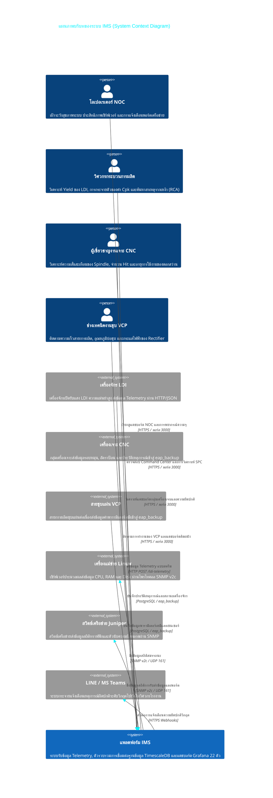
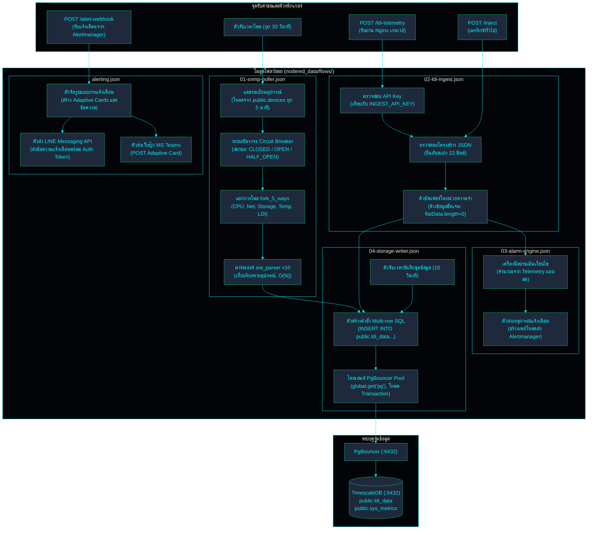
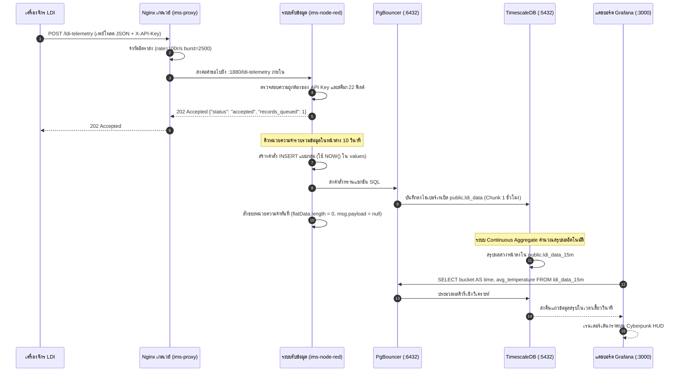
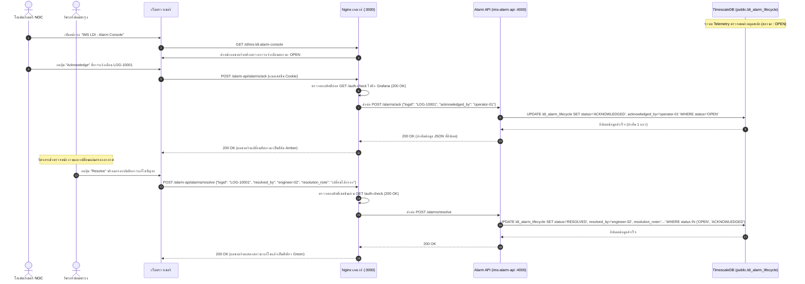
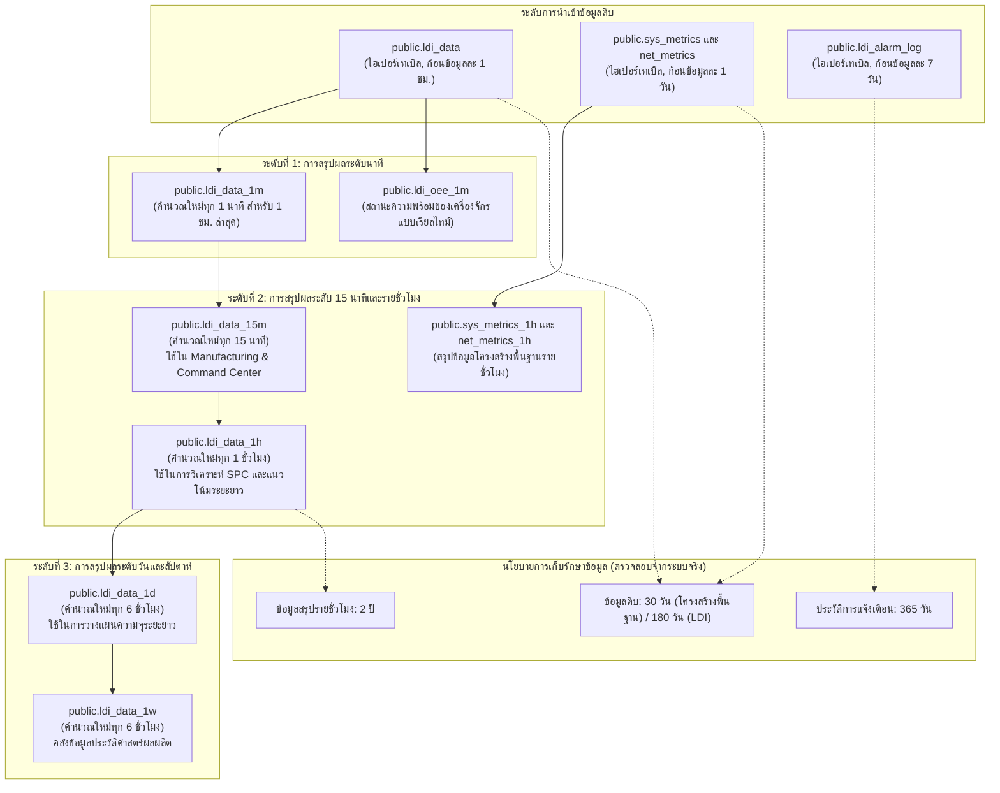
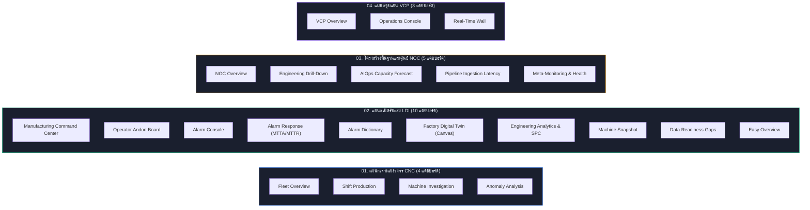

<!-- GLOBAL_NAV -->
<div align="right">
  <a href="../../README.md"> <b>หน้าหลัก</b></a> &nbsp;|&nbsp;
  <a href="../README.md"> <b>ดัชนีเอกสาร</b></a>
</div>
<br/>

<div align="center">
  <h1>แผนภาพสถาปัตยกรรมและโทโพโลยีระบบ IMS (Visual Architecture Reference)</h1>
  <p><b>โมเดล C4 เชิงลึก, ลำดับขั้นตอนการทำงาน (Sequence Flows), ความปลอดภัยของเกตเวย์ และโครงสร้างลำดับชั้นการจัดเก็บข้อมูลสำหรับระบบ IMS</b></p>
  <p>
    <a href="../../../docs/architecture/ARCHITECTURE_DIAGRAM.md">English</a> |
    <a href="ARCHITECTURE_DIAGRAM.md">ไทย</a> |
    <a href="../../../zh-CN/docs/architecture/ARCHITECTURE_DIAGRAM.md">简体中文</a>
  </p>
</div>

---

> [!TIP]
> **ไฟล์ข้อกำหนด Mermaid โดยตรง**: สำหรับการเรนเดอร์ใน IDE หรือไปป์ไลน์ CI สามารถเข้าถึงไฟล์ Mermaid ดิบได้ที่ [ims-system-architecture.mermaid](../../../docs/architecture/ims-system-architecture.mermaid)

## 1. แผนภาพบริบทของระบบ (C4 Model - Level 1: System Context)

แผนภาพบริบทแสดงภาพรวมการมีปฏิสัมพันธ์ระหว่างผู้ใช้งาน, เครื่องจักรในกระบวนการผลิต, เครื่องแม่ข่ายโครงสร้างพื้นฐานไอที, สวิตช์เครือข่าย และระบบส่งข้อความภายนอก กับระบบ Telemetry หลักของ IMS



---

## 2. แผนภาพโครงสร้างคอนเทนเนอร์ (C4 Model - Level 2: Container Diagram)

แผนภาพนี้แสดงรายละเอียดการทำงานของเซอร์วิสทั้ง 15 ตัวในเครือข่าย Docker Compose พร้อมการแมปพอร์ตและเส้นทางการรับส่งข้อมูล:

```mermaid
%%{init: {'theme': 'base', 'themeVariables': { 'primaryColor': '#1e293b', 'primaryTextColor': '#00F2FE', 'primaryBorderColor': '#10B981', 'lineColor': '#00F2FE', 'secondaryColor': '#0f172a', 'tertiaryColor': '#0f172a', 'clusterBkg': '#030407', 'clusterBorder': '#00F2FE'}}}%%
C4Container
 title แผนภาพคอนเทนเนอร์ของระบบ IMS (15 เซอร์วิส)

 Person(user, "วิศวกรและผู้ปฏิบัติการ", "เข้าใช้งานแดชบอร์ด, Digital Twin และ API จัดการแจ้งเตือนผ่านเบราว์เซอร์")
 System_Ext(ext_dev, "อุปกรณ์และเครื่องจักรในโรงงาน", "LDI, CNC เจาะ, VCP ชุบ, เซิร์ฟเวอร์, สวิตช์")

 System_Boundary(c1, "เครือข่าย Docker ภายในของ IMS (ims_net)") {
   Container(proxy, "Reverse Proxy (ims-proxy)", "Nginx Alpine", "เกตเวย์ขาเข้ารวมศูนย์, ควบคุมอัตราการส่งข้อมูล และตรวจสอบสิทธิ์เซสชัน")
   Container(grafana, "Grafana 13 (ims-grafana)", "Go", "แสดงผลแดชบอร์ดธีม Cyberpunk HUD ทั้งหมด 22 ตัวใน 4 แผนกงาน")
   Container(alarm_api, "Alarm API (ims-alarm-api)", "Node.js Express", "จัดการการเปลี่ยนสถานะแจ้งเตือน (ack/resolve) ใน public.ldi_alarm_lifecycle")
   Container(twin_3d, "Factory Twin 3D (ims-factory-twin-3d)", "Node.js Express", "เรนเดอร์โมเดล 3D แบบจำลองโรงงานชั้น 1 (อ่านอย่างเดียว)")
   Container(renderer, "Image Renderer (ims-grafana-renderer)", "Chromium", "สร้างภาพ PNG ของพาเนลสำหรับแนบไปกับการแจ้งเตือนและรายงาน")

   Container(nodered, "ไปป์ไลน์รับข้อมูล (ims-node-red)", "Node.js / Node-RED", "รัน Walker แบบขนาน, พาร์สเซอร์ข้อมูล, คิวบัฟเฟอร์ และส่งต่อแจ้งเตือน")
   Container(pgbouncer, "ตัวรวมการเชื่อมต่อ (ims-pgbouncer)", "C / PgBouncer", "ทำ Transaction Pooling ป้องกันปัญหาการเชื่อมต่อฐานข้อมูลเต็ม")
   ContainerDb(timescaledb, "TimescaleDB (ims-timescaledb)", "PostgreSQL 16 + TimescaleDB", "จัดเก็บข้อมูลไฮเปอร์เทเบิล, Continuous Aggregates และประวัติการแจ้งเตือน")

   Container(prometheus, "Prometheus (ims-prometheus)", "Go", "เก็บรวบรวมเมทริกซ์และประเมินกฎการแจ้งเตือน")
   Container(alertmanager, "Alertmanager (ims-alertmanager)", "Go", "ตัดข้อมูลแจ้งเตือนซ้ำ จัดกลุ่ม และส่งต่อไปยัง Node-RED")
   Container(blackbox, "Blackbox Probes (ims-blackbox)", "Go", "ตรวจสอบ SLA ของ HTTP และการเชื่อมต่อเครือข่าย")
   Container(snmpsim, "SNMP Simulator (ims-snmpsim)", "Python", "จำลองอุปกรณ์ SNMP เซิร์ฟเวอร์และสวิตช์สำหรับการพัฒนาในเครื่อง")
   Container(archiver, "Observability Archiver (ims-observability-archiver)", "Bash", "บันทึกประวัติสุขภาพและเมทริกซ์เก็บไว้ใน ops-logs เป็นระยะ")
   Container(db_migrate, "Migration Runner (ims-db-migrate)", "Bash / psql", "คอนเทนเนอร์แบบรันครั้งเดียวสำหรับรันสคริปต์ไมเกรชัน 001 ถึง 086")
   Container(pgadmin, "PgAdmin 4 (ims-pgadmin4)", "Python", "หน้าต่างเว็บจัดการฐานข้อมูล (พอร์ต 5050)")
 }

 Rel(user, proxy, "เข้าถึงหน้าจอและ API", "HTTPS / พอร์ต 3000")
 Rel(ext_dev, proxy, "ส่งข้อมูล Telemetry ผ่าน HTTP", "POST /ldi-telemetry")
 Rel(nodered, ext_dev, "โพลข้อมูลผ่าน SNMP", "UDP 161")

 Rel(proxy, grafana, "ส่งต่อหน้าเว็บและ API ของ Grafana", "HTTP :3000")
 Rel(proxy, alarm_api, "ส่งต่อ /alarm-api/* (ตรวจสอบสิทธิ์แล้ว)", "HTTP :4000")
 Rel(proxy, twin_3d, "ส่งต่อ /factory-twin-3d/* (ตรวจสอบสิทธิ์แล้ว)", "HTTP :4100")
 Rel(proxy, nodered, "ส่งต่อ /ldi-telemetry และ /inject", "HTTP :1880")
 Rel(proxy, grafana, "ตรวจสอบเซสชันภายใน (/auth-check)", "HTTP :3000")

 Rel(grafana, renderer, "ขอเรนเดอร์ภาพพาเนล", "HTTP :8081")
 Rel(grafana, pgbouncer, "คิวรีข้อมูล CAGGs และวิว", "TCP :6432")
 Rel(alarm_api, pgbouncer, "อัปเดตสถานะแจ้งเตือน (สิทธิ์ alarm_api_writer)", "TCP :6432")
 Rel(nodered, pgbouncer, "บันทึกข้อมูลแบบชุด (Batch INSERT)", "TCP :6432")
 Rel(pgbouncer, timescaledb, "ส่งต่อทรานแซกชัน", "TCP :5432")

 Rel(prometheus, timescaledb, "ดึงสถิติเมทริกซ์", "TCP :5432")
 Rel(prometheus, alertmanager, "ส่งเหตุการณ์แจ้งเตือน", "HTTP :9093")
 Rel(alertmanager, nodered, "ส่งเว็บบุ๊กไปยัง /alert-webhook", "HTTP :1880")
```



---

## 3. แผนภาพองค์ประกอบภายในไปป์ไลน์ Node-RED (C4 Model - Level 3: Components)

รายละเอียดโมดูลย่อยและการไหลของข้อมูลภายในคอนเทนเนอร์ `ims-node-red`:



---

## 4. ลำดับการไหลของข้อมูล Telemetry ความถี่สูง (High-Throughput Sequence Flow)

เส้นทางของข้อมูลการผลิตจากหัวเปิดรับแสงของเครื่องจักร LDI ไปจนถึงการแสดงผลบนหน้าจอแดชบอร์ดแบบ Sub-second:



---

## 5. ลำดับขั้นตอนการจัดการวงจรชีวิตการแจ้งเตือน (Alarm Lifecycle Sequence)

ขั้นตอนการทำงานตั้งแต่ระบบตรวจพบความผิดปกติ การรับทราบโดยโอเปอเรเตอร์ จนถึงการแก้ไขปัญหาเสร็จสิ้น:



---

## 6. กลไกตัดวงจรป้องกันความผิดพลาดของโพรโทคอล SNMP (Circuit Breaker)

ปกป้องสวิตช์เครือข่ายจากการส่งข้อมูลท่วมท้นเมื่ออุปกรณ์ปลายทางไม่ตอบสนอง:

```mermaid
sequenceDiagram
  autonumber
  participant Timer as ตัวจับเวลา Node-RED (ทุก 30 วินาที)
  participant Walker as ตัวโพลข้อมูล SNMP Bulk
  participant Breaker as ตัวจัดการสถานะ Circuit Breaker
  participant Target as อุปกรณ์ปลายทาง (หยุดทำงาน)
  participant DB as TimescaleDB (sys_metrics)

  Timer->>Walker: สั่งเริ่มรอบการดึงข้อมูล
  Walker->>Breaker: ตรวจสอบสถานะของอุปกรณ์ "SW-CORE-01"

  alt สถานะเป็น CLOSED (ปกติสมบูรณ์)
    Walker->>Target: ส่งคำขอ SNMP GETBULK (UDP 161)
    Target--xWalker: ไม่มีการตอบสนอง (Timeout หลังจาก 5 วินาที)
    Walker->>Breaker: บันทึกความล้มเหลว (failureCount++)

    alt failureCount < 2
      Breaker-->>Walker: สถานะยังคงเป็น CLOSED (รอลองใหม่รอบถัดไป)
    else failureCount >= 2
      Breaker->>Breaker: ปรับสถานะเป็น OPEN (ตัดวงจรทันที)
      Breaker->>DB: บันทึกสถานะอุปกรณ์ = OFFLINE (ปรับค่าเมทริกซ์เป็น 0 เพื่อความปลอดภัย)
      Note over Breaker: เริ่มนับถอยหลังเวลาทดสอบ 120 วินาที
    end

  else สถานะเป็น OPEN (ตัดวงจรอยู่)
    Breaker-->>Walker: ระงับการส่งคำขอโพล (ป้องกันเครือข่ายล่ม)
    Note over Walker: ข้ามการส่งข้อมูล SNMP ในรอบนี้

  else หมดเวลาหน่วง: ปรับสถานะเป็น HALF_OPEN (โหมดทดสอบ)
    Breaker->>Walker: อนุญาตให้ส่งคำขอทดสอบเพียง 1 รายการ
    Walker->>Target: ส่งคำขอทดสอบ SNMP GET
    alt การทดสอบสำเร็จ
      Target-->>Walker: อุปกรณ์ตอบกลับปกติ
      Walker->>Breaker: รีเซ็ต failureCount = 0; ปรับสถานะกลับเป็น CLOSED
      Breaker->>DB: บันทึกสถานะอุปกรณ์ = ONLINE
    else การทดสอบล้มเหลว
      Target--xWalker: ขาดการติดต่อ (Timeout)
      Walker->>Breaker: ปรับสถานะกลับเป็น OPEN; เริ่มจับเวลาหน่วง 120 วินาทีใหม่
    end
  end
```

---

## 7. ลำดับชั้นการจัดเก็บข้อมูลและการรวมผลต่อเนื่อง (TimescaleDB Topology)



---

## 8. แผนผังระบบนิเวศแดชบอร์ดตาม 4 แผนกงาน (Dashboard Ecosystem)

แดชบอร์ด Grafana ทั้ง 22 ตัวถูกจัดหมวดหมู่อย่างเป็นระเบียบตาม 4 แผนกงาน:



---

## 9. คำสั่งตรวจสอบสถาปัตยกรรมระบบจริง (Verification Commands)

```bash
# 1. ตรวจสอบสถานะของคอนเทนเนอร์ทั้ง 14 ตัวและพอร์ตที่เปิดใช้งาน
docker ps --format "table {{.Names}}\t{{.Status}}\t{{.Ports}}"

# 2. ตรวจสอบจำนวนการเชื่อมต่อใน Pool ของ PgBouncer
docker exec -i ims-timescaledb psql -U ims_admin -p 6432 -h ims-pgbouncer -d ims_telemetry -c "SHOW POOLS;"

# 3. ตรวจสอบการกระจายตัวของ Chunks และขนาดการบีบอัดข้อมูลใน TimescaleDB
docker exec -i ims-timescaledb psql -U ims_admin -d ims_telemetry -c "
SELECT hypertable_name, num_chunks, total_size, compressed_total_size
FROM timescaledb_information.hypertables
ORDER BY total_size DESC;"

# 4. ตรวจสอบนโยบายการคำนวณ Continuous Aggregate ที่ทำงานอยู่
docker exec -i ims-timescaledb psql -U ims_admin -d ims_telemetry -c "
SELECT view_name, schedule_interval, max_interval_per_job
FROM timescaledb_information.continuous_aggregate_stats;"
```
