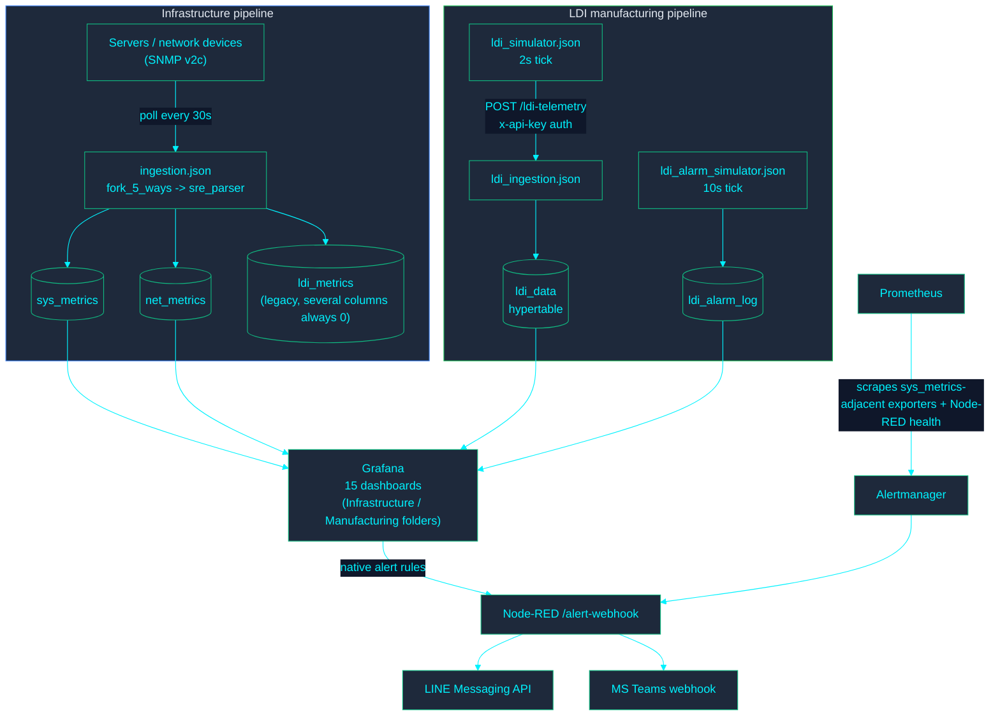
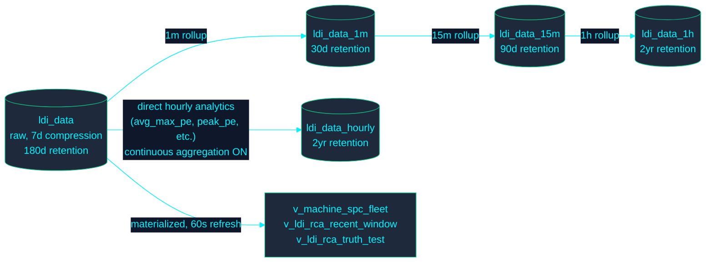
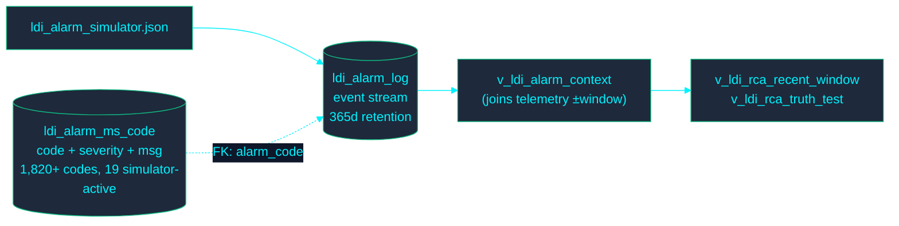

<!-- GLOBAL_NAV -->

  <a href="../../README.md"> <b>Home</b></a> &nbsp;|&nbsp;
  <a href="../README.md"> <b>Docs Index</b></a>

 

# Data Flow

> **กลุ่มเป้าหมาย (Audience):** วิศวกร SRE/ทีมปฏิบัติการ (Operations), นักพัฒนาที่เข้ามาร่วมทีมใหม่, ทีม QA/ทีมตรวจสอบระบบ (Audit)
>
> **แหล่งอ้างอิงข้อมูล (Provenance):** ชื่อ Table/View และความสัมพันธ์ของ CAGG ด้านล่างทั้งหมดได้รับการตรวจสอบโดยตรงกับฐานข้อมูลที่ใช้งานจริง (`timescaledb_information.continuous_aggregates`) และ Migration จริงเมื่อวันที่ 2026-08-10

---

## โครงสร้างแบบ End-to-end: ทั้งสอง Data Pipeline

**ข้อควรระวังในการส่งข้อความ (Delivery caveat):** การส่งข้อความผ่าน LINE/Teams จำเป็นต้องมีการกำหนดค่า `LINE_CHANNEL_ACCESS_TOKEN` / `TEAMS_WEBHOOK_URL` โดยผู้ดูแลระบบ ซึ่งตั้งใจให้ไม่มีอยู่ในไฟล์ `.env` ของ Repository นี้ อย่างไรก็ตาม โลจิกการจัดรูปแบบและการพยายามส่งข้อความจนถึงจุดนั้นทำงานได้จริงและมีความถูกต้อง

---

## ข้อมูล Telemetry ของ LDI: สายโซ่การทำ Rollup ของ CAGG

ข้อมูลดิบ `ldi_data` จะถูกส่งไปยังเส้นทางการทำ Aggregation สองเส้นทางที่เป็นอิสระต่อกัน ซึ่งแต่ละเส้นทางมีวัตถุประสงค์การใช้งานที่แตกต่างกัน — ห้ามทึกทักเอาเองว่าเป็นการทำงานที่ซ้ำซ้อนกัน (Redundant):

`ldi_data_1m → 15m → 1h` คือการทำ Rollup แบบต่อเนื่อง (Chained Rollup) (แต่ละระดับจะรวบรวมข้อมูลจากระดับที่ต่ำกว่า) เพื่อประสิทธิภาพในการคิวรีข้อมูลตามช่วงเวลาบน Dashboard ส่วน `ldi_data_hourly` เป็น View แบบรายชั่วโมงที่ _แยกต่างหาก_ และถูกสร้างขึ้นมาโดยเฉพาะ ซึ่งคำนวณโดยตรงจากข้อมูลดิบพร้อมคอลัมน์สำหรับการวิเคราะห์ของตัวเอง (เช่น `avg_max_pe`, `peak_pe` และอื่นๆ) และมีการเปิดใช้งาน `timescaledb.materialized_only = false` (การรวมข้อมูลแบบต่อเนื่อง Continuous Aggregation — Migration 065) เนื่องจากเมทริกซ์เฉพาะเหล่านั้นจำเป็นต้องสะท้อนข้อมูลของช่วงเวลาปัจจุบันในชั่วโมงนั้นๆ โดยไม่ต้องรอรอบการ Refresh ครั้งต่อไป

## ข้อมูล Master ของ Alarm และระดับความรุนแรง (Severity)

ดูเอกสาร `docs/architecture/ALARM_SEVERITY_GUIDE.md` และ `docs/architecture/LDI_RCA_GUIDE.md` สำหรับโครงสร้างการจัดหมวดหมู่ (Taxonomy) และระเบียบวิธีวิเคราะห์ความสัมพันธ์ (Correlation Methodology) ที่ถูกสร้างขึ้นบนโครงสร้างข้อมูลนี้

## เอกสารที่เกี่ยวข้อง

- `docs/architecture/ARCHITECTURE.md` — บริบทของระบบแบบเต็มรูปแบบ และรายการคอนเทนเนอร์ (Container Inventory) ทั้งหมด
- `docs/architecture/DATABASE_SCHEMA.md` — ข้อมูลอ้างอิงของ Table/Column/View ที่สร้างขึ้นโดยอัตโนมัติ
- `docs/architecture/DATA_RETENTION.md` — ตัวเลขระยะเวลาการเก็บรักษา/การบีบอัดข้อมูล (Retention/Compression) ที่แสดงด้านบน พร้อมข้อกำหนดด้านการกำกับดูแล
- `docs/architecture/EAP_ARCHITECTURE.md` — รายละเอียดเชิงลึกของ Ingestion Adapters ทั้งสองแบบ (SNMP, HTTP/JSON)
