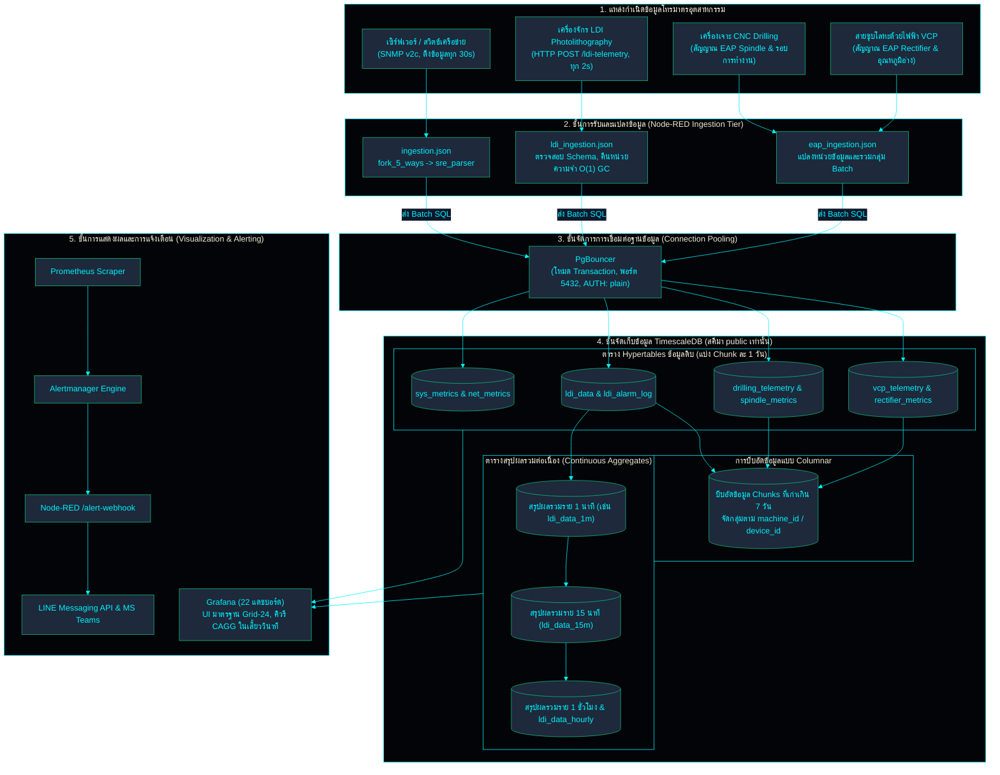
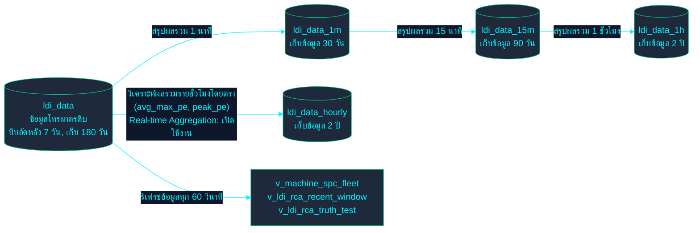
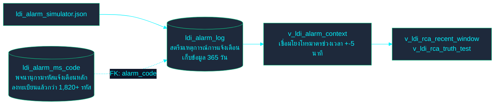

<!-- GLOBAL_NAV -->
<div align="right">
  <a href="../../README.md"> <b>หน้าหลัก</b></a> &nbsp;|&nbsp;
  <a href="../README.md"> <b>ดัชนีเอกสาร</b></a>
</div>
<br/>

<div align="center">
  <h1>สถาปัตยกรรมการไหลของข้อมูลโทรมาตรและไปป์ไลน์ IMS (Data Flow Architecture)</h1>
  <p><b>ไปป์ไลน์รับข้อมูลหลายโดเมน, การแปลงข้อมูลใน Node-RED Sandbox, การจัดการ Connection Pool ด้วย PgBouncer, ผลรวมต่อเนื่อง TimescaleDB CAGG และการแสดงผลบน Grafana</b></p>
  <p>
    <a href="../../../docs/architecture/DATA_FLOW.md">English</a> |
    <a href="DATA_FLOW.md">ไทย</a> |
    <a href="../../../zh-CN/docs/architecture/DATA_FLOW.md">简体中文</a>
  </p>
</div>

---

> **กลุ่มเป้าหมายผู้ใช้งาน:** วิศวกร SRE / ทีมปฏิบัติการ, วิศวกรข้อมูล, สถาปนิกซอฟต์แวร์, ทีมตรวจสอบคุณภาพและความปลอดภัย  
> **ขอบเขตข้อมูลโทรมาตร:** ครอบคลุม 4 โดเมนอุตสาหกรรม (โครงสร้างพื้นฐาน IT/OT, กระบวนการผลิต LDI Photolithography, ฝูงเครื่องเจาะ CNC Drilling, สายชุบโลหะ VCP Electroplating)  
> **ที่มา:** ทุกตาราง, วิว, โหนดฟังก์ชัน และ Continuous Aggregate ได้รับการตรวจสอบตรงกับฐานข้อมูลจริง (`timescaledb_information.continuous_aggregates`), ไมเกรชัน 013–090 และ Node-RED Flows ที่กำลังรันอยู่

---

## 1. ภาพรวมสถาปัตยกรรมไปป์ไลน์ข้อมูลแบบหลายโดเมน (Pipeline Topology)


```mermaid
%%{init: {'theme': 'base', 'themeVariables': { 'primaryColor': '#1e293b', 'primaryTextColor': '#00F2FE', 'primaryBorderColor': '#10B981', 'lineColor': '#00F2FE', 'secondaryColor': '#0f172a', 'tertiaryColor': '#0f172a', 'clusterBkg': '#030407', 'clusterBorder': '#00F2FE'}}}%%
flowchart TB
  subgraph SOURCES["1. แหล่งกำเนิดข้อมูลโทรมาตรอุตสาหกรรม"]
    SNMP_DEV["เซิร์ฟเวอร์ / สวิตช์เครือข่าย
(SNMP v2c, ดึงข้อมูลทุก 30s)"]
    LDI_DEV["เครื่องจักร LDI Photolithography
(HTTP POST /ldi-telemetry, ทุก 2s)"]
    DRL_DEV["เครื่องเจาะ CNC Drilling
(สัญญาณ EAP Spindle & รอบการทำงาน)"]
    VCP_DEV["สายชุบโลหะด้วยไฟฟ้า VCP
(สัญญาณ EAP Rectifier & อุณหภูมิอ่าง)"]
  end

  subgraph INGESTION["2. ชั้นการรับและแปลงข้อมูล (Node-RED Ingestion Tier)"]
    NR_INFRA["ingestion.json
fork_5_ways -> sre_parser"]
    NR_LDI["ldi_ingestion.json
ตรวจสอบ Schema, คืนหน่วยความจำ O(1) GC"]
    NR_EAP["eap_ingestion.json
แปลงหน่วยข้อมูลและรวมกลุ่ม Batch"]
  end

  subgraph POOL["3. ชั้นจัดการการเชื่อมต่อฐานข้อมูล (Connection Pooling)"]
    PGB["PgBouncer
(โหมด Transaction, พอร์ต 5432, AUTH: plain)"]
  end

  subgraph STORAGE["4. ชั้นจัดเก็บข้อมูล TimescaleDB (สคีมา public เท่านั้น)"]
    subgraph HYPER["ตาราง Hypertables ข้อมูลดิบ (แบ่ง Chunk ละ 1 วัน)"]
      HT_SYS[("sys_metrics & net_metrics")]
      HT_LDI[("ldi_data & ldi_alarm_log")]
      HT_DRL[("drilling_telemetry & spindle_metrics")]
      HT_VCP[("vcp_telemetry & rectifier_metrics")]
    end
    subgraph CAGGS["ตารางสรุปผลรวมต่อเนื่อง (Continuous Aggregates)"]
      CAGG_1M[("สรุปผลรวมราย 1 นาที (เช่น ldi_data_1m)")]
      CAGG_15M[("สรุปผลรวมราย 15 นาที (ldi_data_15m)")]
      CAGG_1H[("สรุปผลรวมราย 1 ชั่วโมง & ldi_data_hourly")]
    end
    subgraph COMPRESS["การบีบอัดข้อมูลแบบ Columnar"]
      COL[("บีบอัดข้อมูล Chunks ที่เก่าเกิน 7 วัน
จัดกลุ่มตาม machine_id / device_id")]
    end
  end

  subgraph DISPATCH["5. ชั้นการแสดงผลและการแจ้งเตือน (Visualization & Alerting)"]
    GRAF["Grafana (22 แดชบอร์ด)
UI มาตรฐาน Grid-24, คิวรี CAGG ในเสี้ยววินาที"]
    PROM["Prometheus Scraper"]
    AM["Alertmanager Engine"]
    WH["Node-RED /alert-webhook"]
    NOTIF["LINE Messaging API & MS Teams"]
  end

  SNMP_DEV --> NR_INFRA
  LDI_DEV --> NR_LDI
  DRL_DEV --> NR_EAP
  VCP_DEV --> NR_EAP

  NR_INFRA -->|ส่ง Batch SQL| PGB
  NR_LDI -->|ส่ง Batch SQL| PGB
  NR_EAP -->|ส่ง Batch SQL| PGB

  PGB --> HT_SYS
  PGB --> HT_LDI
  PGB --> HT_DRL
  PGB --> HT_VCP

  HT_LDI --> CAGG_1M --> CAGG_15M --> CAGG_1H
  HT_LDI --> COL
  HT_DRL --> COL
  HT_VCP --> COL

  CAGGS --> GRAF
  HYPER --> GRAF
  PROM --> AM --> WH --> NOTIF
```

---

## 2. รูปแบบโค้ดการแปลงข้อมูลและการจัดการหน่วยความจำใน Node-RED

ภายใน **ไปป์ไลน์รับข้อมูลของ Node-RED** โหนดฟังก์ชันทำงานภายใต้ V8 Sandbox ที่ไม่อนุญาตให้ใช้คำสั่ง `require()` โมดูลภายนอกทั้งหมดจะต้องถูกเรียกผ่าน `global.get()` เพื่อป้องกันปัญหาหน่วยความจำรั่วไหลระหว่างที่ข้อมูลหลั่งไหลเข้ามาอย่างหนาแน่น (>100,000 เหตุการณ์/วินาที) โค้ดทั้งหมดต้องทำงานแบบ **O(N) Single-Pass** พร้อมคำสั่ง **คืนหน่วยความจำขยะ (Explicit GC)** เสมอ:

```javascript
// ตัวอย่าง: โค้ดฟังก์ชันใน Node-RED สำหรับแปลงข้อมูลและคืนหน่วยความจำ
const pg = global.get('pg');
const pool = global.get('pgPool');

const rawPayload = msg.payload;
if (!Array.isArray(rawPayload) || rawPayload.length === 0) {
    return null;
}

const flatData = [];
const insertTime = new Date().toISOString();

// วนลูปประมวลผลข้อมูลรอบเดียว O(N)
for (let i = 0; i < rawPayload.length; i++) {
    const item = rawPayload[i];
    flatData.push([
        insertTime,
        item.eqp_id,
        Number(item.pe1_intensity) || 0.0,
        Number(item.pe2_intensity) || 0.0,
        Number(item.thickness) || 0.0,
        Number(item.temperature) || 0.0,
        item.lot_id || 'UNKNOWN'
    ]);
}

// สร้างคำสั่ง SQL Insert แบบ Parameterized Batch
const columns = '("time", machine_id, pe1_intensity, pe2_intensity, thickness, temperature, lot_id)';
const values = flatData.map((_, idx) => {
    const offset = idx * 7;
    return `($${offset + 1}, $${offset + 2}, $${offset + 3}, $${offset + 4}, $${offset + 5}, $${offset + 6}, $${offset + 7})`;
}).join(', ');

const query = `
    INSERT INTO public.ldi_data ${columns}
    VALUES ${values}
    ON CONFLICT (log_id, "time") DO NOTHING;
`;

const flattenedParams = flatData.flat();

// วินัยการคืนหน่วยความจำอย่างเคร่งครัด: ป้องกัน V8 Heap โตผิดปกติ
flatData.length = 0;
msg.payload = null;

// ส่งต่อไปยัง PgBouncer Connection Pool
msg.topic = query;
msg.params = flattenedParams;
return msg;
```

---

## 3. ห่วงโซ่การสรุปผลรวมต่อเนื่อง (TimescaleDB CAGG Rollup Chain)

ข้อมูลโทรมาตรดิบในตาราง `public.ldi_data` จะถูกส่งต่อไปยัง 2 เส้นทางการสรุปผลรวมที่เป็นอิสระต่อกัน:


```mermaid
%%{init: {'theme': 'base', 'themeVariables': { 'primaryColor': '#1e293b', 'primaryTextColor': '#00F2FE', 'primaryBorderColor': '#10B981', 'lineColor': '#00F2FE', 'secondaryColor': '#0f172a', 'tertiaryColor': '#0f172a', 'clusterBkg': '#030407', 'clusterBorder': '#00F2FE'}}}%%
flowchart LR
  RAW[("ldi_data
ข้อมูลโทรมาตรดิบ
บีบอัดหลัง 7 วัน, เก็บ 180 วัน")]

  RAW -->|"สรุปผลรวม 1 นาที"| M1[("ldi_data_1m
เก็บข้อมูล 30 วัน")]
  M1 -->|"สรุปผลรวม 15 นาที"| M15[("ldi_data_15m
เก็บข้อมูล 90 วัน")]
  M15 -->|"สรุปผลรวม 1 ชั่วโมง"| M1H[("ldi_data_1h
เก็บข้อมูล 2 ปี")]

  RAW -->|"วิเคราะห์ผลรวมรายชั่วโมงโดยตรง
(avg_max_pe, peak_pe)
Real-time Aggregation: เปิดใช้งาน"| MHOURLY[("ldi_data_hourly
เก็บข้อมูล 2 ปี")]

  RAW -->|"รีเฟรชข้อมูลทุก 60 วินาที"| SPC["v_machine_spc_fleet
v_ldi_rca_recent_window
v_ldi_rca_truth_test"]
```

* **การสรุปผลรวมต่อเนื่องแบบลดหลั่น (`1m -> 15m -> 1h`):** นำข้อมูลสรุปจากระดับที่เล็กกว่ามารวมต่อ เพื่อให้การเปิดดูกราฟระยะยาว (7 วัน, 30 วัน) บน Grafana ทำงานได้รวดเร็วในระดับเสี้ยววินาที
* **การสรุปผลรวมรายชั่วโมงแบบ Real-time (`ldi_data_hourly`):** กำหนดค่า `timescaledb.materialized_only = false` เพื่อคำนวณเมตริกซับซ้อน (`avg_max_pe`, `peak_pe`) จากข้อมูลดิบโดยตรง พร้อมรวมข้อมูลล่าสุดที่ยังไม่ได้ Materialize แบบ Real-time

---

## 4. ไปป์ไลน์การประมวลผลการแจ้งเตือนและการวิเคราะห์หาสาเหตุที่แท้จริง (RCA)


```mermaid
%%{init: {'theme': 'base', 'themeVariables': { 'primaryColor': '#1e293b', 'primaryTextColor': '#00F2FE', 'primaryBorderColor': '#10B981', 'lineColor': '#00F2FE', 'secondaryColor': '#0f172a', 'tertiaryColor': '#0f172a', 'clusterBkg': '#030407', 'clusterBorder': '#00F2FE'}}}%%
flowchart LR
  ALM_SIM["ldi_alarm_simulator.json"] --> ALOG[("ldi_alarm_log
สตรีมเหตุการณ์การแจ้งเตือน
เก็บข้อมูล 365 วัน")]
  MASTER[("ldi_alarm_ms_code
พจนานุกรมรหัสแจ้งเตือนหลัก
ลงทะเบียนแล้วกว่า 1,820+ รหัส")] -.->|"FK: alarm_code"| ALOG
  ALOG --> CTX["v_ldi_alarm_context
เชื่อมโยงโทรมาตรช่วงเวลา +-5 นาที"]
  CTX --> RCA["v_ldi_rca_recent_window
v_ldi_rca_truth_test"]
```

การแจ้งเตือนจะถูกบันทึกลงใน `public.ldi_alarm_log` และเชื่อมโยงกับรหัสใน `public.ldi_alarm_ms_code` ผ่าน Foreign Key โดยมีวิว `v_ldi_alarm_context` ทำหน้าที่เชื่อมข้อมูลโทรมาตรของเครื่องจักรในช่วง $\pm 5\text{ นาที}$ รอบเวลาที่เกิดเหตุการณ์ เพื่อส่งต่อให้ระบบวิเคราะห์รากเหง้าปัญหา (RCA) บนหน้าจอของผู้ควบคุม

---

## 5. กฎเหล็กและข้อจำกัดทางสถาปัตยกรรม (Architectural Rules)

1. **สคีมาฐานข้อมูล:** ข้อมูลทั้งหมดต้องอยู่ในสคีมา `public` เท่านั้น ห้ามสร้างสคีมา `ims.*`
2. **PgBouncer:** ใช้โหมด Transaction และตั้งค่า `AUTH_TYPE: scram-sha-256` ห้ามใช้ Prepared Statements
3. **ความปลอดภัยในการบันทึกข้อมูล:** คำสั่ง SQL ต้องมี `ON CONFLICT (log_id, "time") DO NOTHING` เสมอ
4. **ความลับและโทเค็น:** การแจ้งเตือนไปยัง LINE และ MS Teams ต้องใช้โทเค็นที่ผู้ควบคุมระบบกำหนดเองเท่านั้น ห้ามคอมมิตลงใน Git

---

[⬅️ กลับสู่ภาพรวมสถาปัตยกรรม](ARCHITECTURE.md) | [ หน้าหลักคลังข้อมูล](../../README.md)
