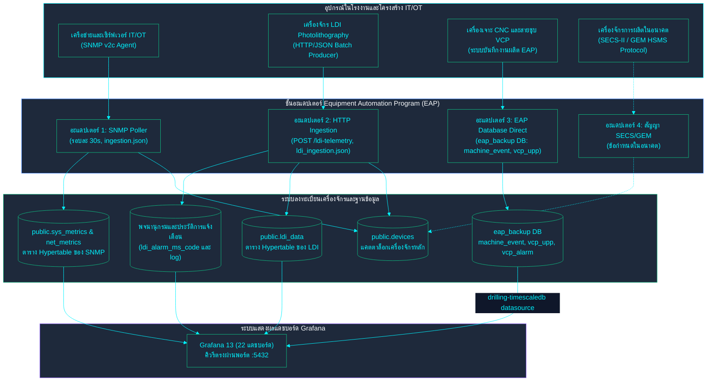

<!-- GLOBAL_NAV -->

  <a href="../../README.md"> <b>หน้าหลัก</b></a> &nbsp;|&nbsp;
  <a href="../README.md"> <b>ดัชนีเอกสาร</b></a>

 

  <h1>สถาปัตยกรรมชั้นเชื่อมต่อเครื่องจักรอุตสาหกรรม (EAP)</h1>
  
<b>รูปแบบอะแดปเตอร์ Equipment Automation Program (EAP), การรับข้อมูลหลายโปรโตคอล, สัญญารองรับ SECS/GEM และแคตตาล็อกเครื่องจักร</b>

  

    <a href="../../../docs/architecture/EAP_ARCHITECTURE.md">English</a> |
    <a href="EAP_ARCHITECTURE.md">ไทย</a> |
    <a href="../../../zh-CN/docs/architecture/EAP_ARCHITECTURE.md">简体中文</a>
  

---

> **EAP = Equipment Automation Program** — การเชื่อมต่อเครื่องจักรตามมาตรฐาน SECS/GEM ตามขอบเขตงานที่ได้รับยืนยัน (ไม่ใช่องค์กร "Enterprise Application Platform") ดูรายละเอียดใน `docs/architecture/IMS_MANUFACTURING_PLATFORM_V2.md` §3
>
> **ข้อเท็จจริงของระบบ:** IMS เป็นระบบสำหรับเฝ้าระวังและมอนิเตอร์เท่านั้น (Monitoring-only) ทำหน้าที่อ่านข้อมูลโทรมาตรและส่งสัญญาณเตือน โดยไม่มีการส่งคำสั่งควบคุม, ไม่ดาวน์โหลดสูตรการผลิต (Recipes) และไม่เก็บสถานะของเครื่องจักร ปัจจุบันเครื่องจักร LDI ในระบบเชื่อมต่อผ่านโพลลิ่ง SNMP และ HTTP API เอกสารฉบับนี้ไม่ได้อ้างว่าระบบรองรับ SECS/GEM แบบสมบูรณ์ แต่เป็นการจัดทำเอกสารสำหรับอะแดปเตอร์ที่ใช้งานจริง และกำหนดสัญญามาตรฐานสำหรับเครื่องจักรในอนาคต
>
> **ที่มา:** คำอธิบายอะแดปเตอร์ SNMP และ HTTP/JSON ได้รับการตรวจสอบตรงกับ `nodered_data/flows/ingestion.json`, `nodered_data/flows/ldi_ingestion.json` และ `scripts/mock/eap-mock-data.js`

---

## 1. ภาพรวมสถาปัตยกรรมอะแดปเตอร์ EAP (EAP Topology)

---

## 2. รายละเอียดสัญญาของอะแดปเตอร์ทั้ง 4 รูปแบบ

หน้าที่ของทุกอะแดปเตอร์เหมือนกันทั้งหมดไม่ว่าจะเชื่อมต่อด้วยโปรโตคอลใด: รับข้อมูลโทรมาตรและเหตุการณ์การแจ้งเตือนจากอุปกรณ์จริงหรืออุปกรณ์จำลอง แล้วนำเข้าสู่ `public.devices` และตาราง Hypertable ที่สอดคล้องกัน โดยใช้ `device_id` เป็นคีย์หลักในการเชื่อมโยงข้อมูลไปยังแดชบอร์ด, วิว SPC/RCA และบันทึกประวัติทั้งหมด

### อะแดปเตอร์ 1 — SNMP (อุปกรณ์โครงสร้างพื้นฐาน IT/OT)
* **ตำแหน่งโค้ด:** `nodered_data/flows/ingestion.json` (แท็บ "IMS Ingestion Pipeline")
* **โมเดลอุปกรณ์:** แถวใน `public.devices` ที่มี `device_type IN ('server','workstation','network')` โดยเก็บ `hostname`, `ip_address`, `snmp_community`, `snmp_port`, `poll_interval`
* **แผนการเก็บข้อมูล:** ทุก 30 วินาที โหนด `fork_5_ways` จะส่งตัวอ่าน SNMP v2c แบบขนาน (CPU, พื้นที่จัดเก็บ, เครือข่าย, อุณหภูมิ, LDI OIDs)
* **การเก็บเหตุการณ์/แจ้งเตือน:** ไม่มีในระดับโปรโตคอล อะแดปเตอร์นี้เก็บเฉพาะโทรมาตร ส่วนการแจ้งเตือนจะถูกคำนวณปลายทางจากเกณฑ์ Threshold
* **การแมปข้อมูล:** `sre_parser` จัดการสถานะรายเครื่องและบันทึกข้อมูลแบบ Batch ลงใน `sys_metrics`, `net_metrics` และ `ldi_metrics`

### อะแดปเตอร์ 2 — HTTP/JSON (โทรมาตรการผลิต LDI)
* **ตำแหน่งโค้ด:** `nodered_data/flows/ldi_ingestion.json` (แท็บ "IMS LDI Ingestion")
* **โมเดลอุปกรณ์:** แถวใน `public.devices` ที่มี `device_type='ldi'`, `process_type='ldi'` (ไมเกรชัน 067/068)
* **แผนการเก็บข้อมูล:** อุปกรณ์ส่ง HTTP POST เป็น JSON Array ไปยัง `POST /ldi-telemetry` (ยืนยันตัวตนด้วย `x-api-key`) แต่ละรายการมี `eqp_id` (แมปกับ `device_id`), ค่า PE1-6, JE1-4, ความหนาแผ่น, ความเร็วสแกน และปริมาณสารเคลือบ
* **การเก็บเหตุการณ์/แจ้งเตือน:** ระบบส่งเหตุการณ์คู่ขนานเขียนลง `public.ldi_alarm_log` โดยเชื่อมโยงผ่าน `device_id` + `event_id`
* **การแมปข้อมูล:** บันทึกลง `public.ldi_data` แบบ Batch พร้อมคำสั่ง `ON CONFLICT (log_id, "time") DO NOTHING`

### อะแดปเตอร์ 3 — EAP Stand-In Adapter (งานเจาะ CNC และสายชุบ VCP)
* **ตำแหน่งโค้ด:** `scripts/mock/eap-mock-data.js` และ `database/mock/eap_backup-schema.sql`
* **โมเดลอุปกรณ์:** เครื่องเจาะ CNC (`drl001`–`drl010`) และสายชุบ VCP (`vcp001`–`vcp005`)
* **แผนการเก็บข้อมูล:** จำลองรอบการทำงานจริงของเครื่องจักร:
  - **งานเจาะ (Drilling):** การเริ่มโปรแกรม, ความเร็วรอบหัวเจาะ (RPM), อัตราป้อน (Feed Rate), Spindle Mask, อายุการใช้งานดอกสว่าน และรายงานสรุปกะ
  - **งานชุบ (VCP):** สถานะสายพาน (RUN, IDLE, DOWN), กระแสไฟฟ้าของชุดแปลงไฟ, อุณหภูมิอ่างเคมี และความสัมพันธ์ความเร็ว ($\text{plating\_time} \times \text{line\_speed} = 54$)
* **การแมปข้อมูล:** นำเข้าสู่ฐานข้อมูล `eap_backup` ในตาราง `machine_event`, `vcp_upp`, `catalog.object_registry` ส่งข้อมูลไปยังแดชบอร์ดงานเจาะ 4 ตัวและ VCP 3 ตัว

### อะแดปเตอร์ 4 — สัญญา SECS/GEM (สำหรับเครื่องจักรจริงในอนาคต)
ปัจจุบันยังไม่มีโค้ดทำงานจริงสำหรับอะแดปเตอร์นี้ เมื่อมีการนำเครื่องจักรที่รองรับ SECS/GEM จริงมาติดตั้ง จะต้องปฏิบัติตามสัญญานี้:

| แนวคิด EAP | สิ่งที่อะแดปเตอร์ต้องจัดเตรียม | เป้าหมายในสถาปัตยกรรม |
|---|---|---|
| **การลงทะเบียนอุปกรณ์** | บันทึกรหัสอุปกรณ์ใน `public.devices` (`device_id`, `device_type`, `process_type`) | แคตตาล็อก `public.devices` |
| **รายงานเหตุการณ์ (CEID)** | แปลงรายงานเหตุการณ์ SECS-II เป็นแถวการแจ้งเตือนตาม `device_id` | `<process>_alarm_ms_code` และ Log |
| **ตัวแปรสถานะ (SVID/ECID)** | แปลงรายงานตัวแปร SECS-II ลงตาราง Hypertable ตาม `(device_id, time)` | ตาราง `public.<process>_data` |
| **การควบคุมเวอร์ชัน** | กำหนดเวอร์ชันของ Schema สัญญาอย่างชัดเจน (`adapter-contract-v1`) | API Gateway และตัวตรวจ Ingestion |

---

## 3. ขอบเขตความปลอดภัยระดับอุตสาหกรรม (IEC 62443 Boundaries)

การเชื่อมต่อกับเครื่องจักรในโรงงานจริงเป็นการข้ามขอบเขตเครือข่าย Operational Technology (OT):
* **ขอบเขตที่ 1 (ทางเข้าหลัก):** nginx reverse proxy ปัจจุบัน **ให้บริการเป็น HTTP ธรรมดา ยังไม่ได้ตั้งค่า TLS** เส้นทาง `/alarm-api/` และ `/factory-twin-3d/` ต้องมี session ของ Grafana ที่ถูกต้อง (`auth_request`) ส่วน `/ldi-telemetry` และ `/inject` ต้องมี header `X-API-Key` ซึ่ง Node-RED เป็นผู้ตรวจ และมีการจำกัดอัตราคำขอ
* **ขอบเขตที่ 2 (service ภายใน):** service ต่าง ๆ เชื่อมต่อ TimescaleDB ผ่าน PgBouncer โหมด transaction pooling บนเครือข่ายภายในของ Docker โดยแต่ละ service ใช้ role ของตัวเอง (ดู `docs/data/DATA_GOVERNANCE.md`) และ `alarm-api` ใช้ query แบบ parameterised
* **ขอบเขตที่ 3 (เครือข่ายเครื่องจักรในโรงงาน):** การเชื่อมต่อของอะแดปเตอร์ 4 ในอนาคตจะต้องมีไฟร์วอลล์ OT กั้นเฉพาะ, มีการจำกัดสิทธิ์ mTLS / IP Whitelisting และอ่านข้อมูลแบบทางเดียว (Read-only tap) เพื่อป้องกันไม่ให้ส่งคำสั่งควบคุมกลับไปยังเครื่องจักรจริง

---

[⬅️ กลับสู่ภาพรวมสถาปัตยกรรม](ARCHITECTURE.md) | [ หน้าหลักคลังข้อมูล](../../README.md)
