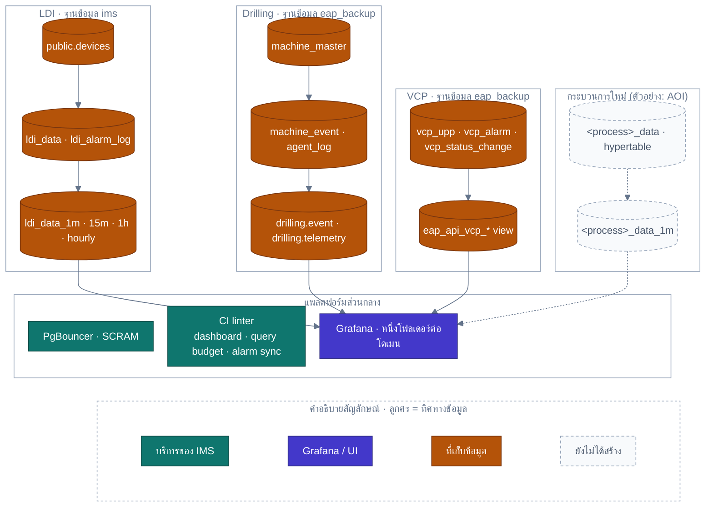

<!-- GLOBAL_NAV -->
<div align="right">
  <a href="../../README.md"> <b>หน้าหลัก</b></a> &nbsp;|&nbsp;
  <a href="../README.md"> <b>ดัชนีเอกสาร</b></a>
</div>
<br/>

<div align="center">
  <h1>สถาปัตยกรรมการขยายโดเมนการผลิตและกระบวนการอุตสาหกรรม IMS (Manufacturing Domain Extensibility)</h1>
  <p><b>รูปแบบการขยายกระบวนการผลิต, สถาปัตยกรรมอ้างอิง LDI, การแยกสคีมาฐานข้อมูล และรายการตรวจสอบความพร้อมในการเพิ่มกระบวนการใหม่</b></p>
  <p>
    <a href="../../../docs/architecture/MANUFACTURING_DOMAIN.md">English</a> |
    <a href="MANUFACTURING_DOMAIN.md">ไทย</a> |
    <a href="../../../zh-CN/docs/architecture/MANUFACTURING_DOMAIN.md">简体中文</a>
  </p>
</div>

---

> **วัตถุประสงค์:** จัดทำพิมพ์เขียวทางสถาปัตยกรรมสำหรับการเชื่อมต่อกระบวนการผลิตเข้ากับ IMS (เช่น LDI Photolithography, CNC Drilling, VCP Plating) เพื่อให้การเพิ่มกระบวนการผลิตใหม่ในอนาคต (เช่น เครื่องตรวจจับข้อบกพร่องทางแสง AOI, การกัดแผ่นวงจร Etching, การประกอบชิ้นส่วน SMT) เป็นไปในรูปแบบการเพิ่มส่วนขยาย (Additive) — เพียงเพิ่มไฟล์ไมเกรชันใหม่, พจนานุกรมการแจ้งเตือนใหม่ และชุดแดชบอร์ด 3 ประสานใหม่ — โดยไม่ต้องแก้ไของค์ประกอบเดิมหรือกระทบต่อสายการผลิตที่กำลังทำงานอยู่
>
> **ที่มา:** รูปแบบทั้งหมดสะท้อนการทำงานจริงของเครื่องจักร LDI, CNC Drilling และสายชุบ VCP ที่ได้รับการยืนยันตรงกับสคีมาฐานข้อมูลและแคตตาล็อกแดชบอร์ดจริง
>
> **ความยืดหยุ่นในการขยายระบบ:** รองรับการเชื่อมต่อกระบวนการผลิตที่หลากหลายโดยไม่มี Downtime และรักษาการแบ่งแยกความรับผิดชอบอย่างเคร่งครัด

---

## 1. แผนผังสถาปัตยกรรมการขยายโดเมนการผลิต (Domain Topology)



---

## 2. รูปแบบมาตรฐาน 5 ระดับสำหรับการขยายระบบ (5-Tier Pattern)

| ระดับสถาปัตยกรรม | การใช้งานจริงของ LDI (Reference Implementation) | รูปแบบทั่วไปสำหรับกระบวนการถัดไป (เช่น AOI / Etching) |
|---|---|---|
| **1. ตัวตนเครื่องจักร (Device Identity)** | กำหนด `public.devices.device_type = 'ldi'`, `public.devices.process_type = 'ldi'` (ไมเกรชัน 067/068) อุปกรณ์ที่ไม่ใช่เครื่องจักรจะมี `process_type = NULL` | ลงทะเบียนอุปกรณ์ด้วย `device_type` เฉพาะ (เช่น `'aoi'`) และระบุ `process_type` (`'aoi'`, `'etching'`) การแยกสองคอลัมน์นี้ช่วยให้สามารถเพิ่มกระบวนการใหม่ได้โดยไม่กระทบต่อตรรกะเดิม |
| **2. การจัดเก็บข้อมูลโทรมาตร** | ตาราง Hypertable `public.ldi_data` เก็บฟิลด์เฉพาะของ LDI (`pe1..pe6`, `je1..je4`, ความหนาแผ่น, ความเร็วสแกน) อ้างอิงตาม `(machine_id, time)` | สร้าง Hypertable 1 ตารางต่อ 1 กระบวนการ โดยมีคีย์ `(device_id, time)` เชื่อมโยงกับ `public.devices` คอลัมน์จะเป็นค่าเฉพาะของกระบวนการนั้นโดยตรง (เช่น จำนวนข้อบกพร่องสำหรับ AOI) |
| **3. พจนานุกรมการแจ้งเตือน** | ตาราง `public.ldi_alarm_ms_code` (รหัส, ความรุนแรง, คำอธิบาย) และประวัติเหตุการณ์ `public.ldi_alarm_log` ตรวจสอบผ่าน `alarm-sync-linter.js` | สร้างตารางรหัสแจ้งเตือน 1 ชุดต่อกระบวนการ (`<process>_alarm_ms_code`) โดยใช้โครงสร้างและ Foreign Key รูปแบบเดียวกันทั้งหมด |
| **4. วิว SPC / RCA** | วิว `public.v_machine_spc_fleet` และ `public.v_ldi_rca_recent_window` (ไมเกรชัน 064) กรองเฉพาะ `device_type = 'ldi'` | สร้างวิวน้องใหม่ (`v_<process>_spc_fleet`) สำหรับคำนวณค่า Cpk และ RCA โดยใช้สูตรมาตรฐานเดียวกัน และกำหนดเวลารีเฟรชผ่าน `add_job` |
| **5. ชุดแดชบอร์ด 3 ประสาน** | **Operator Andon** (`ims-ldi-operator-andon.json`), **Engineering Analytics** (`ims-ldi-engineering-analytics.json`) และ **Manufacturing Overview** (`ims-ldi-manufacturing.json`) | สร้างชุดแดชบอร์ด 3 ประสานสำหรับกระบวนการใหม่ จัดเก็บใน `monitoring/grafana/dashboards/manufacturing/` พร้อมติดแท็ก `["manufacturing", "<process>"]` เพื่อให้ผ่านการตรวจของ Linter |

---

## 3. โค้ด DDL ตัวอย่างสำหรับการเชื่อมต่อกระบวนการผลิตใหม่

เมื่อต้องการเชื่อมต่อกระบวนการผลิตใหม่ ให้สร้างไฟล์ไมเกรชันตามโครงสร้างมาตรฐานดังนี้:

```sql
-- Migration 087: ตัวอย่างการเชื่อมต่อกระบวนการใหม่ (Automated Optical Inspection - AOI)
-- 1. ลงทะเบียนอุปกรณ์ใหม่ลงในแคตตาล็อกหลัก
INSERT INTO public.devices (device_id, hostname, ip_address, device_type, process_type, location, enabled)
VALUES 
  ('AOI-01', 'aoi-station-01.factory.local', '10.20.30.51', 'aoi', 'aoi', 'Floor 2 - SMT Line 1', TRUE),
  ('AOI-02', 'aoi-station-02.factory.local', '10.20.30.52', 'aoi', 'aoi', 'Floor 2 - SMT Line 2', TRUE)
ON CONFLICT (device_id) DO NOTHING;

-- 2. สร้างตารางจัดเก็บโทรมาตรเฉพาะกระบวนการ และแปลงเป็น Hypertable
CREATE TABLE IF NOT EXISTS public.aoi_telemetry (
  "time" TIMESTAMPTZ NOT NULL,
  machine_id VARCHAR(64) NOT NULL REFERENCES public.devices(device_id),
  inspection_cycle_ms NUMERIC(10,2),
  defect_count INT DEFAULT 0,
  false_alarm_rate NUMERIC(5,2),
  optical_lighting_lux NUMERIC(8,2),
  lot_id VARCHAR(64)
);

SELECT create_hypertable('public.aoi_telemetry', 'time', chunk_time_interval => INTERVAL '1 day', if_not_exists => TRUE);

-- 3. เปิดใช้งานการบีบอัดข้อมูลแบบ Columnar อัตโนมัติ
ALTER TABLE public.aoi_telemetry SET (
  timescaledb.compress,
  timescaledb.compress_segmentby = 'machine_id',
  timescaledb.compress_orderby = 'time DESC'
);
SELECT add_compression_policy('public.aoi_telemetry', INTERVAL '7 days');

-- 4. สร้างพจนานุกรมรหัสการแจ้งเตือนและประวัติเหตุการณ์
CREATE TABLE IF NOT EXISTS public.aoi_alarm_ms_code (
  alarm_code VARCHAR(32) PRIMARY KEY,
  severity VARCHAR(16) NOT NULL CHECK (severity IN ('CRITICAL', 'WARNING', 'INFO')),
  description TEXT NOT NULL
);

CREATE TABLE IF NOT EXISTS public.aoi_alarm_log (
  event_id BIGSERIAL PRIMARY KEY,
  "time" TIMESTAMPTZ NOT NULL,
  machine_id VARCHAR(64) NOT NULL REFERENCES public.devices(device_id),
  alarm_code VARCHAR(32) NOT NULL REFERENCES public.aoi_alarm_ms_code(alarm_code),
  status VARCHAR(16) DEFAULT 'OPEN' CHECK (status IN ('OPEN', 'ACKNOWLEDGED', 'RESOLVED')),
  acknowledged_by VARCHAR(64),
  resolved_by VARCHAR(64)
);
```

---

## 4. รายการตรวจสอบความพร้อมในการเพิ่มกระบวนการใหม่ (Checklist)

1. **ไมเกรชันฐานข้อมูล:** ลงทะเบียนเครื่องจักรใน `public.devices` พร้อมระบุ `device_type` และ `process_type` ใหม่ สร้างตาราง Hypertable และนโยบายบีบอัดข้อมูล
2. **พจนานุกรมแจ้งเตือน:** สร้างตารางรหัส `<process>_alarm_ms_code` และตารางประวัติเหตุการณ์ `<process>_alarm_log`
3. **ผลรวมสรุปต่อเนื่องและวิว:** เพิ่ม CAGG Rollups (`cagg_<process>_1m`) และวิว SPC/RCA ประจำกระบวนการ
4. **ชุดแดชบอร์ด 3 ประสาน:** สร้างแดชบอร์ด Operator Andon, Engineering Analytics และ Manufacturing Overview จัดเก็บในโฟลเดอร์ `manufacturing` พร้อมแท็ก `["manufacturing", "<process>"]`
5. **การทดสอบความถูกต้อง:** ลงทะเบียนกระบวนการใหม่ใน `tests/lint/alarm-sync-linter.js` และสั่งรัน `scripts/pre-commit.js` เพื่อยืนยันว่าผ่านเกณฑ์ 100%
6. **อัปเดตเอกสารอัตโนมัติ:** สั่งรัน `node scripts/generate-dashboard-inventory.js` และ `node scripts/generate-schema-inventory.js` เพื่ออัปเดตรายการแดชบอร์ดและสคีมาโดยอัตโนมัติ

---

[⬅️ กลับสู่ภาพรวมสถาปัตยกรรม](ARCHITECTURE.md) | [ หน้าหลักคลังข้อมูล](../../README.md)
