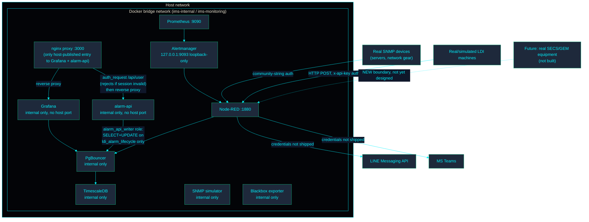

<!-- GLOBAL_NAV -->

  <a href="../../../README.md"> <b>Home</b></a> &nbsp;|&nbsp;
  <a href="../../../docs/README.md"> <b>Docs Index</b></a>

 

# แบบจำลองความปลอดภัย (Security Model)

> **กลุ่มเป้าหมาย:** SRE/ฝ่ายปฏิบัติการ (Operations), QA/ฝ่ายตรวจสอบ (Audit), ทีมทบทวนความปลอดภัย (Security Review)
> **วัตถุประสงค์:** มุมมองขอบเขตความไว้วางใจ (Trust-boundary) เชิงสถาปัตยกรรมของระบบ IMS (หมายเหตุ: โปรดอ่าน `SECURITY.md` ใน root ของ repository เพื่อดูนโยบายความปลอดภัยที่เป็นทางการ)
> **แหล่งที่มา:** ตรวจสอบความถูกต้องจากคอนฟิกของ docker-compose และ proxy ที่ใช้งานจริงเมื่อวันที่ 2026-08-10

---

## ขอบเขตความไว้วางใจ (Trust boundaries)

**ขอบเขตที่ 1 (Boundary 1) — เครือข่าย Host ↔ Docker** เฉพาะบริการ `proxy` (nginx), Node-RED, Prometheus, และ Alertmanager (แบบ loopback-only) เท่านั้นที่เปิดพอร์ตสู่โฮสต์ (host ports) ก่อนหน้านี้ Grafana และ alarm-api เคยเปิดพอร์ตของตนเองโดยตรง แต่ทั้งคู่ได้ถูกย้ายไปอยู่หลัง `proxy` แล้ว ดังนั้นทุกคำขอที่เข้ามาทางเบราว์เซอร์ ทั้งการอ่านและการเขียน จะต้องผ่านประตูหน้าเพียงบานเดียว ส่วน PgBouncer, TimescaleDB และ SNMP simulator จะไม่ถูกเปิดเผยสู่โฮสต์เลย โดยจะเข้าถึงได้ผ่าน DNS ภายในของ Docker เท่านั้น

**ขอบเขตที่ 1a (Boundary 1a) — เซสชัน Grafana ในฐานะข้อมูลประจำตัวสำหรับเส้นทางการเขียน (write-path credential)** `alarm-api` (`services/alarm-api`) เป็นบริการเดียวในสแต็กนี้ที่เปลี่ยนแปลงสถานะจากหน้าแดชบอร์ดของ Grafana (ปุ่ม Acknowledge/Resolve ของ `IMS LDI - Alarm Console` ซึ่งเขียนข้อมูลลงใน `public.ldi_alarm_lifecycle`) บริการนี้ไม่มีระบบล็อกอินเป็นของตัวเอง: ตำแหน่ง `/alarm-api/` ของ `proxy` จะทำการรัน subrequest แบบ `auth_request` ไปยัง `/api/user` ของ Grafana ก่อนที่จะส่งต่อข้อมูลใดๆ ดังนั้นคำขอจะไปถึง alarm-api ได้ก็ต่อเมื่อผู้เรียกมีเซสชัน Grafana ที่ถูกต้องอยู่แล้ว ซึ่งก็คือล็อกอินเดียวกับที่โอเปอเรเตอร์มีอยู่เพื่อดูแดชบอร์ด โดยไม่จำเป็นต้องจัดการข้อมูลประจำตัวชุดที่สอง alarm-api จะเชื่อมต่อกับ Postgres ในฐานะ `alarm_api_writer` (การไมเกรต 078) ซึ่งเป็น role ที่จำกัดสิทธิ์ไว้เฉพาะการ `SELECT`+`UPDATE` บน `ldi_alarm_lifecycle` เท่านั้น ไม่ใช่สิทธิ์ `ims_admin` หรือ `grafana_reader` ช่องว่างที่ทราบ (Known gap): ระบบนี้ตรวจสอบ*ว่า*ผู้เรียกเป็นผู้ใช้ Grafana ที่ล็อกอินอยู่ ไม่ได้ตรวจสอบว่าเป็นผู้ใช้*คนใด* นอกเหนือจากชื่อผู้ดำเนินการที่ไคลเอนต์ส่งมาใน request body (`acknowledged_by`/`resolved_by` เป็นการรายงานด้วยตนเอง ไม่ได้ตรวจสอบไขว้กับชื่อผู้ใช้ในเซสชัน) ซึ่งเป็นสิ่งที่ยอมรับได้สำหรับการใช้งานแบบ single-tenant ที่ผู้ใช้ Grafana ทุกคนเป็นโอเปอเรเตอร์ที่เชื่อถือได้อยู่แล้ว หากข้อเท็จจริงนี้เปลี่ยนไป จะต้องนำกลับมาทบทวนใหม่

**ขอบเขตที่ 2 (Boundary 2) — โดเมนโครงสร้างพื้นฐาน (Infrastructure domain) ↔ โดเมนการผลิต (Manufacturing domain)** ตามที่ระบุใน `docs/architecture/OWNERSHIP.md` นี่เป็นการแยกส่วนเชิง*ตรรกะ*เท่านั้น (ขอบเขตของโฟลเดอร์/แท็ก/CODEOWNERS) ทั้งสองโดเมนใช้ฐานข้อมูลเดียวกัน, Grafana อินสแตนซ์เดียวกัน, และ Node-RED โพรเซสเดียวกัน ไม่มีขอบเขตความปลอดภัยที่เข้มงวดระหว่างสองโดเมนนี้ นี่คือข้อตกลงและจุดสมดุล (trade-off) ที่ยอมรับและระบุไว้อย่างชัดเจนสำหรับการใช้งานแบบ single-tenant ในขนาดปัจจุบัน ไม่ใช่ข้อผิดพลาดแต่อย่างใด

**ขอบเขตที่ 3 (Boundary 3) — ชั้นการเชื่อมต่ออุปกรณ์ (Equipment Integration Layer) (มองไปสู่อนาคต, ยังไม่ได้สร้าง)** ตามที่ระบุใน `docs/architecture/EAP_ARCHITECTURE.md` วันใดที่เครื่องมือที่ใช้โปรโตคอล SECS/GEM ของจริงถูกเชื่อมต่อผ่านอะแดปเตอร์ตัวที่สามที่ยังไม่ได้สร้าง การเชื่อมต่อนั้นจะข้ามเข้าสู่เครือข่ายอุปกรณ์ระดับพื้นโรงงาน ซึ่งถือเป็นขอบเขตความไว้วางใจภายนอกใหม่ที่แท้จริง จำเป็นต้องมีการทบทวนการเสริมความปลอดภัย (การจัดการข้อมูลประจำตัว, การแบ่งส่วนเครือข่าย) เป็นของตัวเองก่อนที่จะมีการเชื่อมต่ออุปกรณ์จริงเข้ามา ที่ยังไม่ได้ออกแบบในตอนนี้เพราะยังไม่มีสิ่งใดให้ใช้อ้างอิงในการออกแบบ

**`IMS_PGBOUNCER_MAX_CLIENT_CONN`**: ห้ามเพิ่มค่าโดยพลการ ขีดจำกัดของหน่วยความจำจะต้องปรับขยายตามไปด้วย (`1 การเชื่อมต่อ ≈ 2MB`)

## การตรวจสอบสิทธิ์ในแต่ละอะแดปเตอร์ (Authentication per adapter)

| อะแดปเตอร์ (Adapter)                                | กลไก (Mechanism)                                                                                                                                       | จุดที่บังคับใช้ (Where enforced)                                                               |
| --------------------------------------------------- | ------------------------------------------------------------------------------------------------------------------------------------------------------ | ---------------------------------------------------------------------------------------------- |
| SNMP (โครงสร้างพื้นฐาน)                             | Community string (v2c) — อิงตามไฟล์, ไม่ได้ฮาร์ดโค้ดในโฟลว์ (flows)                                                                                    | `nodered_data/flows/ingestion.json`, `public.devices.snmp_community`                           |
| HTTP/JSON (LDI)                                     | เฮดเดอร์ `x-api-key` ตรวจสอบกับ `INGEST_API_KEY`                                                                                                       | `nodered_data/flows/ldi_ingestion.json`                                                        |
| Grafana → PgBouncer → TimescaleDB                   | ข้อมูลประจำตัวฐานข้อมูล (DB credentials) ที่มีการทำ connection pool                                                                                    | ตัวแปรสภาพแวดล้อมใน `docker-compose.yaml`, `pgbouncer.ini`                                     |
| Alarm Console → alarm-api (เส้นทางการเขียน)         | เซสชัน Grafana, ตรวจสอบผ่าน `auth_request` ของ nginx โดยเทียบกับ `/api/user` ของ Grafana; ฝั่งฐานข้อมูลใช้ role แบบ least-privilege `alarm_api_writer` | `proxy/nginx.conf`, `services/alarm-api/server.js`, ไฟล์ไมเกรต `078-alarm-api-writer-role.sql` |
| การจัดส่งการแจ้งเตือน (Alert delivery) (LINE/Teams) | Bearer token / webhook URL — **ไม่มีใน `.env` โดยความตั้งใจ (by design)**                                                                              | `nodered_data/flows/alerting.json`                                                             |

การตรวจสอบสิทธิ์แบบ community-string ของ SNMPv2c นั้นอ่อนแอกว่า SNMPv3 โดยธรรมชาติ (ไม่มีการเข้ารหัส, community string มีสถานะเสมือนรหัสผ่านที่ใช้ร่วมกัน) — รายการตรวจสอบการเสริมความปลอดภัย (hardening checklist) ใน `SECURITY.md` ได้ติดตามการย้ายไปใช้ SNMPv3 ก่อนที่จะเชื่อมต่อกับอุปกรณ์การผลิตจริงไว้แล้ว จึงไม่ได้ติดตามซ้ำในเอกสารนี้เพื่อหลีกเลี่ยงไม่ให้เอกสารทั้งสองฉบับมีเนื้อหาขัดแย้งกันเมื่อเวลาผ่านไป

## CODEOWNERS ในฐานะการควบคุมความปลอดภัย (CODEOWNERS as a security control)

บรรทัดที่เกี่ยวข้องกับความปลอดภัยใน `.github/CODEOWNERS` (เช่น `/.env.example`, `docker-compose*.yaml`, `/database/`, `/.github/`) จะบังคับให้ต้องมีการทบทวน (review) ในพาธเหล่านั้น ไม่ว่าจะอยู่ในโดเมนใดก็ตาม บรรทัดที่กำหนดขอบเขตโดเมนซึ่งเพิ่มเข้ามาเพื่อแยกส่วน infra/manufacturing (`docs/architecture/OWNERSHIP.md`) เป็นส่วนเพิ่มเติม (additive) จากส่วนนี้ ไม่ใช่การทดแทน — รายการเหล่านี้ไม่ได้ทำให้รายการที่เกี่ยวข้องกับความปลอดภัยอ่อนแอลงหรือเปลี่ยนลำดับไป

## สิ่งที่เอกสารนี้ไม่ครอบคลุม (What this document does not cover)

- ตารางข้อจำกัดที่ทราบแล้ว (การแลกเปลี่ยนเรื่องการเปิดพอร์ต PgBouncer, การตรวจสอบสิทธิ์แอดมินของ Node-RED, ฯลฯ) — ดู `SECURITY.md`
- ความปลอดภัยของห่วงโซ่อุปทาน (supply-chain security) ของเครื่องมือ AI (MCP servers, ทักษะต่างๆ (skills), ปลั๊กอิน) — ดูหัวข้อ AI Tooling Security ใน `SECURITY.md`
- กระบวนการรายงานช่องโหว่ — ดู `SECURITY.md`

## เอกสารที่เกี่ยวข้อง (Related documents)

- `SECURITY.md` — นโยบายความปลอดภัยที่เป็นทางการ
- `docs/architecture/OWNERSHIP.md` — ขอบเขตระหว่างโดเมน infra/manufacturing
- `docs/architecture/EAP_ARCHITECTURE.md` — รูปแบบอะแดปเตอร์อุปกรณ์และบริบททั้งหมดของขอบเขตที่ 3 (Boundary 3)
- `docs/architecture/IMS_MANUFACTURING_PLATFORM_V2.md` §8 — จุดกำเนิดของกรอบแนวคิดขอบเขตความไว้วางใจ (trust-boundary) นี้

---

[⬅️ กลับสู่คู่มือ IMS Platform (Back to IMS Platform Book)](../../../docs/architecture/IMS_PLATFORM_BOOK.md) | [ ที่เก็บข้อมูลหลัก (Main Repository)](../../../README.md)
