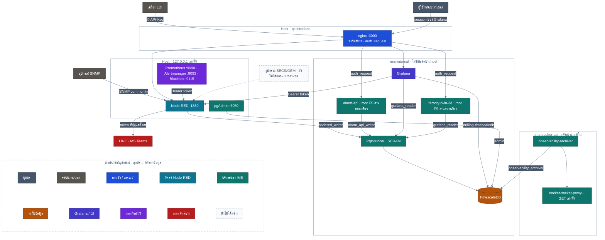

<!-- GLOBAL_NAV -->

  <a href="../../README.md"> <b>หน้าหลัก</b></a> &nbsp;|&nbsp;
  <a href="../README.md"> <b>ดัชนีเอกสาร</b></a>

 

# โมเดลความปลอดภัย

> **ผู้อ่าน:** SRE/ฝ่ายปฏิบัติการ, QA/ฝ่ายตรวจสอบ, ผู้ทบทวนด้านความปลอดภัย
> **วัตถุประสงค์:** มุมมองขอบเขตความเชื่อถือ (trust boundary) เชิงสถาปัตยกรรมของ IMS (หมายเหตุ: นโยบายความปลอดภัยที่เป็นทางการอยู่ใน `SECURITY.md` ที่ root ของ repository)
> **ที่มาของข้อมูล:** ตรวจเทียบกับการตั้งค่า docker-compose และ proxy ที่ใช้งานจริงเมื่อ 2026-08-10 และตรวจซ้ำเทียบกับ `main` (compose, `proxy/nginx.conf`, `.github/CODEOWNERS`, ruleset ของ `main`) เมื่อ 2026-09-26

---

## ขอบเขตความเชื่อถือ

```mermaid
%%{init: {"flowchart": {"nodeSpacing": 20, "rankSpacing": 32, "padding": 10, "wrappingWidth": 150, "curve": "basis"}, "sequence": {"wrap": true, "width": 170, "actorMargin": 36, "boxMargin": 8, "noteMargin": 8, "messageMargin": 30, "mirrorActors": false}, "state": {"padding": 6}, "theme": "base", "themeVariables": {"fontFamily": "Inter, Segoe UI, Helvetica, Arial, sans-serif", "fontSize": "14px", "primaryColor": "#334155", "primaryTextColor": "#ffffff", "primaryBorderColor": "#1e293b", "lineColor": "#64748b", "textColor": "#64748b", "secondaryColor": "#475569", "tertiaryColor": "#f1f5f9", "clusterBkg": "transparent", "clusterBorder": "#94a3b8", "titleColor": "#64748b", "edgeLabelBackground": "#475569", "nodeTextColor": "#ffffff", "noteBkgColor": "#fef3c7", "noteTextColor": "#1e293b", "noteBorderColor": "#d97706", "actorBkg": "#334155", "actorTextColor": "#ffffff", "actorBorder": "#1e293b", "actorLineColor": "#94a3b8", "signalColor": "#64748b", "signalTextColor": "#64748b", "labelBoxBkgColor": "#334155", "labelBoxBorderColor": "#1e293b", "labelTextColor": "#ffffff", "loopTextColor": "#64748b", "activationBkgColor": "#e2e8f0", "sequenceNumberColor": "#ffffff", "stateLabelColor": "#ffffff", "compositeBackground": "transparent", "transitionColor": "#64748b", "transitionLabelColor": "#64748b"}}}%%
flowchart TB
  accTitle: ขอบเขตความเชื่อถือ
  accDescr: มีเพียง nginx ที่เปิดรับทุก interface ของ host ส่วน Node-RED, Prometheus, Alertmanager, Blackbox และ pgAdmin ผูกกับ 127.0.0.1 client ฐานข้อมูลทุกตัวใช้ role ที่มีสิทธิ์น้อยที่สุดของตัวเอง archiver เข้าถึง Docker ผ่าน socket proxy แบบอ่านอย่างเดียวบนเครือข่ายที่แยกออกเท่านั้น และ webhook แจ้งเตือนต้องมี bearer token
  EXT1["เครื่อง LDI"]:::ext
  EXT2["อุปกรณ์ SNMP"]:::ext
  USER["ผู้ใช้ผ่านเบราว์เซอร์"]:::actor
  subgraph PUBLIC["Host · ทุก interface"]
    PROXY["nginx :3000<br/>จำกัดอัตรา · auth_request"]:::ingress
  end
  subgraph LOOP["Host · 127.0.0.1 เท่านั้น"]
    NR["Node-RED :1880"]:::flow
    PROM["Prometheus :9090 · Alertmanager :9093 · Blackbox :9115"]:::obs
    PGADMIN["pgAdmin :5050"]:::app
  end
  subgraph INTERNAL["ims-internal · ไม่มีพอร์ตบน host"]
    GRAF["Grafana"]:::viz
    ALARM["alarm-api · root FS อ่านอย่างเดียว"]:::app
    TWIN["factory-twin-3d · root FS อ่านอย่างเดียว"]:::app
    PGB["PgBouncer · SCRAM"]:::app
    TSDB[("TimescaleDB")]:::store
  end
  subgraph DOCKERAPI["ims-docker-api · เครือข่ายภายใน"]
    ARCH["observability-archiver"]:::app
    SOCK["docker-socket-proxy · GET เท่านั้น"]:::app
  end
  NOTIFY["LINE · MS Teams"]:::notify
  FUT["อุปกรณ์ SECS/GEM · ยังไม่ได้ออกแบบขอบเขต"]:::future

  EXT1 -->|"X-API-Key"| PROXY
  USER -->|"session ของ Grafana"| PROXY
  EXT2 -->|"SNMP community"| NR
  PROXY --> NR
  PROXY --> GRAF
  PROXY -->|"auth_request"| ALARM
  PROXY -->|"auth_request"| TWIN
  NR -->|"nodered_writer"| PGB
  ALARM -->|"alarm_api_writer"| PGB
  GRAF -->|"grafana_reader"| PGB
  TWIN -->|"grafana_reader"| PGB
  PGB --> TSDB
  GRAF -->|"drilling-timescaledb"| TSDB
  ARCH -->|"observability_archiver"| TSDB
  PGADMIN -->|"admin"| TSDB
  ARCH --> SOCK
  PROM -->|"Bearer token"| NR
  GRAF -->|"Bearer token"| NR
  NR -->|"token ที่ผู้ดูแลตั้งค่า"| NOTIFY
  FUT -.-> NR

  subgraph LEGEND["คำอธิบายสัญลักษณ์ · ลูกศร = ทิศทางข้อมูล"]
    direction TB
    subgraph LEGEND_0[" "]
      direction LR
      LG_actor["บุคคล"]:::actor ~~~ LG_ext["ระบบภายนอก"]:::ext ~~~ LG_ingress["ทางเข้า / เกตเวย์"]:::ingress ~~~ LG_flow["โฟลว์ Node-RED"]:::flow ~~~ LG_app["บริการของ IMS"]:::app
    end
    subgraph LEGEND_1[" "]
      direction LR
      LG_store["ที่เก็บข้อมูล"]:::store ~~~ LG_viz["Grafana / UI"]:::viz ~~~ LG_obs["การเฝ้าระวัง"]:::obs ~~~ LG_notify["การแจ้งเตือน"]:::notify ~~~ LG_future["ยังไม่ได้สร้าง"]:::future
    end
    LEGEND_0 ~~~ LEGEND_1
  end
  NOTIFY ~~~ LEGEND
  style LEGEND fill:transparent,stroke:#94a3b8,stroke-dasharray:3 3
  style LEGEND_0 fill:transparent,stroke:transparent
  style LEGEND_1 fill:transparent,stroke:transparent
  classDef actor fill:#475569,stroke:#1e293b,color:#ffffff,stroke-width:1px
  classDef ext fill:#57534e,stroke:#292524,color:#ffffff,stroke-width:1px
  classDef ingress fill:#1d4ed8,stroke:#1e3a8a,color:#ffffff,stroke-width:1px
  classDef app fill:#0f766e,stroke:#134e4a,color:#ffffff,stroke-width:1px
  classDef flow fill:#0e7490,stroke:#164e63,color:#ffffff,stroke-width:1px
  classDef store fill:#b45309,stroke:#78350f,color:#ffffff,stroke-width:1px
  classDef viz fill:#4338ca,stroke:#312e81,color:#ffffff,stroke-width:1px
  classDef obs fill:#6d28d9,stroke:#4c1d95,color:#ffffff,stroke-width:1px
  classDef notify fill:#b91c1c,stroke:#7f1d1d,color:#ffffff,stroke-width:1px
  classDef future fill:#f8fafc,stroke:#94a3b8,color:#475569,stroke-width:1px,stroke-dasharray:4 3
```

**ขอบเขตที่ 1 — Host ↔ เครือข่าย Docker** มีเพียง service `proxy` (nginx, `${GRAFANA_PORT:-3000}`) เท่านั้นที่รับการเชื่อมต่อบน external host interface ส่วน `pgadmin` (`5050`), Node-RED, Prometheus, Alertmanager และ Blackbox exporter เปิดพอร์ตที่ bind ไว้กับ `127.0.0.1` loopback เท่านั้น Grafana, alarm-api และ Factory Twin ล้วนอยู่หลัง `proxy` ทุก request จาก browser จึงผ่านทางเข้าเดียว PgBouncer, TimescaleDB, ตัวจำลอง SNMP และ image renderer ไม่เคยเปิดสู่ host — ใช้ DNS ภายในของ Docker เท่านั้น ส่วน `observability-archiver` เชื่อมต่อ Docker daemon ผ่าน `ims-docker-socket-proxy` ภายในเครือข่ายด้วยสิทธิ์อ่านอย่างเดียว

**ขอบเขตที่ 1a — ใช้ session ของ Grafana เป็น credential ของเส้นทางเขียน** `alarm-api` (`services/alarm-api`) เป็น service เดียวใน stack นี้ที่เปลี่ยนสถานะข้อมูลจากแดชบอร์ด Grafana (ปุ่ม Acknowledge/Resolve ของ `IMS LDI - Alarm Console` ที่เขียนลง `public.ldi_alarm_lifecycle`) โดยไม่มีระบบล็อกอินของตัวเอง: location `/alarm-api/` ของ `proxy` จะส่ง subrequest `auth_request` ไปตรวจกับ `/api/user` ของ Grafana ก่อนส่งต่อทุกครั้ง request จึงไปถึง alarm-api ได้ก็ต่อเมื่อผู้เรียกมี session ของ Grafana ที่ถูกต้องอยู่แล้ว — เป็นการล็อกอินเดียวกับที่ผู้ปฏิบัติงานต้องใช้ดูแดชบอร์ด ไม่ใช่ credential ชุดที่สองที่ต้องจัดการเพิ่ม location `/factory-twin-3d/` ใช้ด่านเดียวกัน alarm-api เชื่อมต่อ Postgres ด้วย role `alarm_api_writer` (migration 078) ซึ่งจำกัดสิทธิ์เพียง `SELECT`+`UPDATE` บน `ldi_alarm_lifecycle` — ไม่ใช่ superuser และไม่ใช่ `grafana_reader` จากนั้น alarm-api จะระบุตัวผู้เรียกเองอีกชั้น โดยถาม Grafana ที่ `/api/user` (ชื่อ login) และ `/api/user/orgs` (role ในองค์กรปัจจุบัน) แล้วบันทึกชื่อ login นั้นเป็นผู้ดำเนินการ ค่า `acknowledged_by` / `resolved_by` ที่ส่งมาใน body จะถูกละเลย และ Viewer จะได้ 403 มีเพียง Editor, Admin หรือ Grafana server admin ที่ acknowledge หรือ resolve ได้ ทั้งหมดนี้ครอบคลุมโดย `tests/unit/alarm-api-server.test.js` และตรวจแบบ end to end ผ่าน nginx กับ Grafana 13.1.2 แล้ว

**ขอบเขตที่ 1b — endpoint รับข้อมูล** `/ldi-telemetry` และ `/inject` เข้าถึงได้โดยทุกคนที่เข้าถึงพอร์ตของประตูหน้าได้ และป้องกันด้วย header `x-api-key` ที่ต้องตรงกับ `INGEST_API_KEY` เพียงอย่างเดียว key นี้จึงต้องเป็น secret ที่สร้างใหม่เสมอ ห้ามใช้ค่าสาธารณะใน `.env.example`

**ขอบเขตที่ 2 — โดเมนโครงสร้างพื้นฐาน ↔ โดเมนการผลิต** ตาม `docs/architecture/OWNERSHIP.md` นี่เป็นการแยกเชิง _ตรรกะ_ เท่านั้น (ขอบเขตของโฟลเดอร์/tag/CODEOWNERS) — ทั้งสองโดเมนใช้ฐานข้อมูล, Grafana และ process ของ Node-RED ร่วมกัน ไม่มีขอบเขตความปลอดภัยแบบแข็งระหว่างกัน นี่คือข้อแลกเปลี่ยนที่ยอมรับและระบุไว้อย่างชัดเจนสำหรับการติดตั้งแบบองค์กรเดียวในขนาดนี้ ไม่ใช่การมองข้าม

**ขอบเขตที่ 3 — ชั้นการเชื่อมต่ออุปกรณ์ (มองไปข้างหน้า ยังไม่ได้สร้าง)** ตาม `docs/architecture/EAP_ARCHITECTURE.md` เมื่อใดที่มีเครื่องมือจริงที่สื่อสารด้วย SECS/GEM เชื่อมต่อผ่าน adapter ตัวที่สามที่ยังไม่ได้พัฒนา การเชื่อมต่อนั้นจะข้ามเข้าสู่เครือข่ายอุปกรณ์หน้างานโรงงาน — ซึ่งเป็นขอบเขตความเชื่อถือภายนอกใหม่อย่างแท้จริง ต้องมีการทบทวนการเสริมความปลอดภัยของตัวเอง (การจัดการ credential การแบ่งเครือข่าย) ก่อนเชื่อมต่ออุปกรณ์จริงใด ๆ ยังไม่ได้ออกแบบเพราะยังไม่มีสิ่งใดให้ออกแบบรองรับ

**`MAX_CLIENT_CONN` ของ PgBouncer** (`200` ใน `docker-compose.yaml`): ห้ามเพิ่มตามอำเภอใจ ต้องปรับขีดจำกัดหน่วยความจำตามไปด้วย (`1 connection ≈ 2MB`)

## การยืนยันตัวตนราย Adapter

| Adapter | กลไก | บังคับใช้ที่ |
| --- | --- | --- |
| SNMP (โครงสร้างพื้นฐาน) | community string (v2c) เก็บรายอุปกรณ์ในฐานข้อมูล — ไม่ได้ฝังไว้ใน flow | `public.devices.snmp_community` อ่านโดย `nodered_data/flows/ingestion.json` |
| HTTP/JSON (LDI) | ตรวจ header `x-api-key` เทียบกับ `INGEST_API_KEY` | `nodered_data/flows/ldi_ingestion.json` เปิดผ่าน `proxy/nginx.conf` |
| Grafana → PgBouncer → TimescaleDB | role `grafana_reader` (อ่านอย่างเดียว) รหัสผ่านจาก `GRAFANA_DB_PASSWORD` | env ใน `docker-compose.yaml`; userlist ของ PgBouncer สร้างโดย `pgbouncer/entrypoint-wrapper.sh`; รหัสผ่านของ role ตั้งโดย `postgres/init/003-grafana-password.sh` |
| Alarm Console → alarm-api (เส้นทางเขียน) | session ของ Grafana ตรวจผ่าน `auth_request` ของ nginx กับ `/api/user` ของ Grafana; ฝั่งฐานข้อมูลใช้ role `alarm_api_writer` ที่มีสิทธิ์น้อยที่สุด | `proxy/nginx.conf`, `services/alarm-api/server.js`, migration `078-alarm-api-writer-role.sql` |
| Browser → Factory Twin 3D | ด่าน `auth_request` ด้วย session ของ Grafana แบบเดียวกัน ทุก route ของทวินตอบ 401 เมื่อไม่มี session ที่ถูกต้อง (ยืนยันโดย browser regression โหมด proxy) | `proxy/nginx.conf`, `services/factory-twin-3d` |
| Node-RED editor / admin API | `adminAuth` ด้วย hash แบบ bcrypt และ Node-RED จะไม่ยอมเริ่มหากไม่มี `NODE_RED_ADMIN_PASSWORD_HASH` | `nodered_data/settings.js` |
| การส่งการแจ้งเตือน (LINE/Teams) | Bearer token / webhook URL — **ตั้งใจไม่ใส่ไว้ใน `.env`** | `nodered_data/flows/alerting.json` |

การยืนยันตัวตนด้วย community string ของ SNMPv2c อ่อนกว่า SNMPv3 โดยธรรมชาติ (ไม่มีการเข้ารหัส และ community string เท่ากับรหัสผ่านที่ใช้ร่วมกัน) — รายการตรวจการเสริมความปลอดภัยใน `SECURITY.md` ติดตามการย้ายไปใช้ SNMPv3 ก่อนเชื่อมต่ออุปกรณ์จริงไว้แล้ว จึงไม่ติดตามซ้ำที่นี่เพื่อไม่ให้สองเอกสารขัดแย้งกันเมื่อเวลาผ่านไป

## CODEOWNERS และการป้องกัน branch ในฐานะมาตรการความปลอดภัย

`.github/CODEOWNERS` ระบุ path ที่อ่อนไหวด้านความปลอดภัย (`/SECURITY.md`, `/.env.example`, `/docker-compose*.yaml`, `/database/`, `/postgres/`, `/.github/`, `/nodered_data/flows/`) และขอ review จากเจ้าของ ruleset ของ `main` กำหนดให้มีผู้อนุมัติ 1 คน ปิด review thread ครบ ประวัติเป็นเส้นตรง และผ่าน status check `validate-architecture` แต่ **ไม่ได้** ตั้ง `require_code_owner_review` CODEOWNERS จึงขอ review โดยไม่บังคับ — และปัจจุบันไม่มี job ใดรายงาน `validate-architecture` การ merge ขณะนี้จึงต้องอาศัยสิทธิ์ข้ามของผู้ดูแลระบบ ทั้งสองเรื่องติดตามเป็นงานต่อเนื่องใน `CONTRIBUTING.md` บรรทัดที่แบ่งตามโดเมนสำหรับการแยกโครงสร้างพื้นฐาน/การผลิต (`docs/architecture/OWNERSHIP.md`) เป็นส่วนเพิ่มจากรายการที่อ่อนไหวด้านความปลอดภัย ไม่ได้ใช้แทน

## สิ่งที่เอกสารนี้ไม่ครอบคลุม

- ตารางข้อจำกัดที่ทราบ (secret ตัวอย่างที่เป็นสาธารณะ, การเปิด pgAdmin, HTTP ธรรมดา ฯลฯ) — ดู `SECURITY.md`
- ความปลอดภัยของ supply chain ของเครื่องมือ AI (MCP server, skill, plugin) — ดูหัวข้อความปลอดภัยของเครื่องมือ AI ใน `SECURITY.md`
- ขั้นตอนการรายงานช่องโหว่ — ดู `SECURITY.md`

## เอกสารที่เกี่ยวข้อง

- `SECURITY.md` — นโยบายความปลอดภัยที่เป็นทางการ
- `docs/architecture/OWNERSHIP.md` — ขอบเขตโดเมนโครงสร้างพื้นฐาน/การผลิต
- `docs/architecture/EAP_ARCHITECTURE.md` — รูปแบบ adapter ของอุปกรณ์และบริบทเต็มของขอบเขตที่ 3
- `docs/architecture/FACTORY_TWIN_SECURITY_MODEL.md` — โมเดลการเปิดเผยข้อมูลของ Factory Twin เอง
- `docs/architecture/IMS_MANUFACTURING_PLATFORM_V2.md` §8 — ที่มาของกรอบแนวคิดขอบเขตความเชื่อถือนี้

---

[⬅️ กลับสู่ IMS Platform Book](IMS_PLATFORM_BOOK.md) | [ Repository หลัก](../../README.md)
