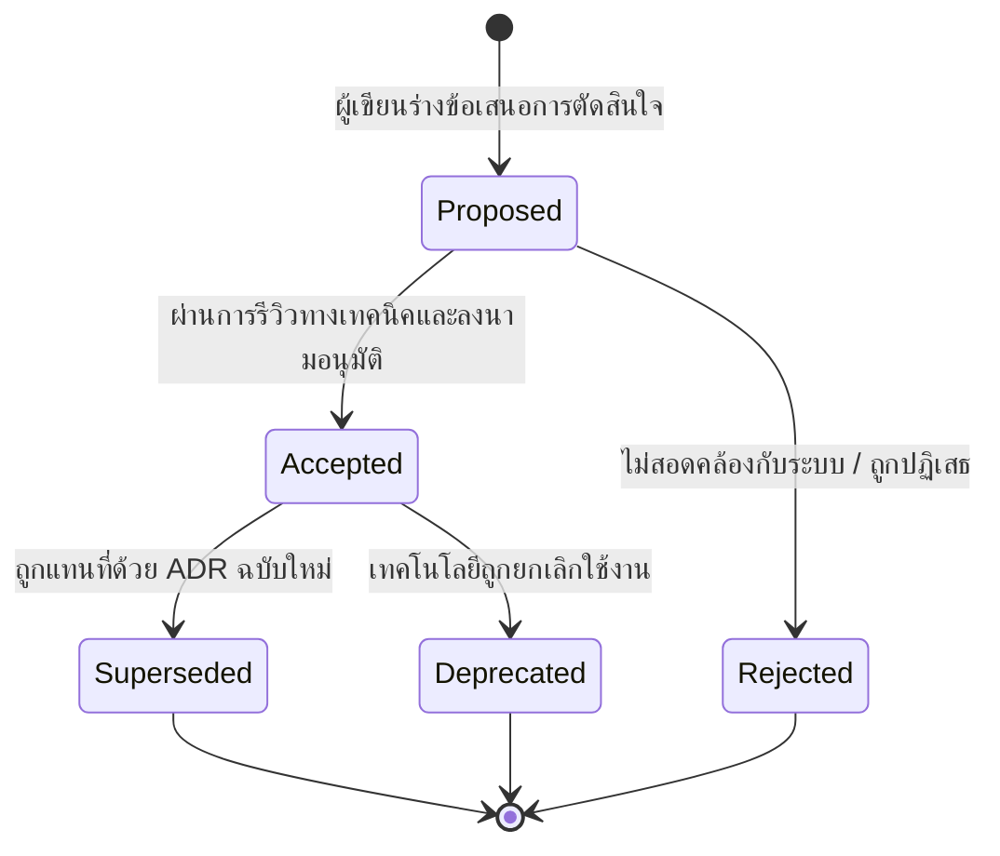
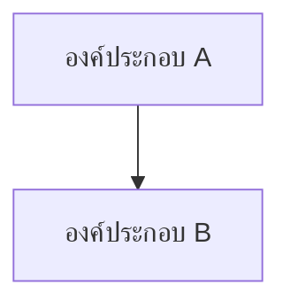

<!-- GLOBAL_NAV -->
<div align="right">
  <a href="../../../README.md"> <b>หน้าหลัก</b></a> &nbsp;|&nbsp;
  <a href="../../README.md"> <b>ดัชนีเอกสาร</b></a>
</div>
<br/>

<div align="center">
  <h1>ADR 0001: บันทึกการตัดสินใจเชิงสถาปัตยกรรม (Record Architecture Decisions)</h1>
  <p><b>มาตรฐานบันทึกการตัดสินใจทางสถาปัตยกรรม วงจรชีวิต และการกำกับดูแลการออกแบบระบบ</b></p>
  <p>
    <a href="../../../../docs/architecture/decisions/0001-record-architecture-decisions.md">English</a> |
    <a href="0001-record-architecture-decisions.md">ไทย</a> |
    <a href="../../../../zh-CN/docs/architecture/decisions/0001-record-architecture-decisions.md">简体中文</a>
  </p>
</div>

---

> **สถานะ (Status):** ยอมรับ (Accepted)  
> **วันที่ (Date):** 2026-08-26  
> **ผู้มีอำนาจตัดสินใจ (Deciders):** หัวหน้าสถาปนิกวิศวกรรม (Lead Architect), ทีมวิศวกร SRE, วิศวกรระบบ OT  
> **ขอบเขตทางเทคนิค (Technical Scope):** มาตรฐานการจัดทำเอกสารสถาปัตยกรรม, การจัดการองค์ความรู้, การกำกับดูแลการเปลี่ยนแปลง

---

## 1. บริบทและปัญหาที่ต้องตัดสินใจ (Context & Problem Statement)

ระบบ **Industrial Monitoring System (IMS)** เป็นแพลตฟอร์มโทรมาตร (Telemetry) ระดับอุตสาหกรรมที่มีภารกิจสำคัญสูง (Mission-Critical) ทำหน้าที่รับ ประมวลผล และแสดงผลข้อมูลจากเครื่องจักรการผลิตแผงวงจรพิมพ์ (PCB) ความเร็วสูง เช่น LDI Photolithography, CNC Drilling, VCP Plating ร่วมกับโครงสร้างพื้นฐานเครือข่าย IT/OT

ตลอดวงจรชีวิตของระบบ มีการตัดสินใจเชิงสถาปัตยกรรมที่มีผลกระทบสูงเกิดขึ้นอย่างต่อเนื่อง เช่น การเลือกฐานข้อมูล, อะแดปเตอร์เชื่อมต่อโปรโตคอล, ตัวจัดการ Connection Pool, การจัดการหน่วยความจำ และการออกแบบแดชบอร์ด หากปราศจากบันทึกการตัดสินใจที่มีการควบคุมเวอร์ชัน จะก่อให้เกิดความเสี่ยงวิกฤต:
1. **การเบี่ยงเบนทางสถาปัตยกรรม (Architectural Drift):** วิศวกรในอนาคตอาจละเมิดข้อจำกัดสำคัญโดยไม่ตั้งใจ (เช่น การบายพาส PgBouncer หรือการสร้างสคีมาต้องห้าม `ims.*`)
2. **การสูญหายขององค์ความรู้ (Tribal Knowledge Loss):** เหตุผลเบื้องหลังการปรับแต่งประสิทธิภาพ (เช่น O(1) GC ใน Node-RED) อาจเลือนหายกลายเป็นเพียงเรื่องเล่า
3. **ช่องโหว่ด้านการตรวจสอบและการปฏิบัติตามมาตรฐาน (Audit & Compliance Gaps):** ขาดหลักฐานการกำกับดูแลการเปลี่ยนแปลงตามมาตรฐานความปลอดภัยอุตสาหกรรม (IEC 62443 / ISO 27001)

---

## 2. ปัจจัยผลักดันการตัดสินใจ (Decision Drivers)

- **ความสามารถในการตรวจสอบผ่าน Version Control:** บันทึกต้องอยู่ใน Git ควบคู่กับโค้ดจริง และอัปเดตไปพร้อมกับ Pull Request
- **ความเร็วในการรับพนักงาน/วิศวกรใหม่ (Onboarding Velocity):** วิศวกรใหม่ต้องเข้าใจไม่เพียงแค่ *ระบบทำอะไร* แต่เข้าใจลึกซึ้งว่า *ทำไมจึงเลือกเทคโนโลยีและข้อจำกัดนั้น*
- **การตรวจสอบอัตโนมัติ (Automated Validation):** เอกสารต้องสามารถอ้างอิงตรงจากคอมเมนต์ในโค้ด และตรวจสอบผ่าน CI Linters ได้
- **รองรับ 3 ภาษาอย่างเท่าเทียม (Tri-lingual Parity):** สถาปัตยกรรมต้องมีเนื้อหาตรงกันแบบ 1:1 ทั้งภาษาอังกฤษ ไทย และจีน เพื่อรองรับโรงงานระดับสากล

---

## 3. ทางเลือกที่ได้รับการพิจารณา (Considered Options)

* **ทางเลือกที่ 1: บันทึกผ่าน Git Commit Messages และคำอธิบายใน PR** — ภาระงานต่ำ แต่กระจัดกระจาย ค้นหายาก และสูญหายเมื่อทำ Squash Merge
* **ทางเลือกที่ 2: ใช้ Wiki กลาง หรือ Confluence Space** — ภาระดูแลรักษาสูง มักไม่อัปเดตตามโค้ดจริง และเข้าถึงไม่ได้ในโรงงานที่เป็นเครือข่ายปิด (Air-gapped Network)
* **ทางเลือกที่ 3: ใช้ Architecture Decision Records (ADRs) ใน Git (ตัวเลือกที่เลือก)** — ไฟล์ Markdown ขนาดกะทัดรัดจัดเก็บในโฟลเดอร์ `docs/architecture/decisions/` มีการควบคุมเวอร์ชันและรีวิวผ่านกระบวนการ Pull Request ตามมาตรฐาน

---

## 4. ผลลัพธ์การตัดสินใจ (Decision Outcome)

เราตัดสินใจนำมาตรฐาน **Architecture Decision Records (ADRs)** ตามรูปแบบ **MADR (Markdown Architectural Decision Records)** มาใช้ในโครงการ

ทุกการตัดสินใจที่มีผลกระทบอย่างมีนัยสำคัญต่อระบบจะต้องจัดทำเป็นไฟล์ ADR แยกเฉพาะภายใต้ `docs/architecture/decisions/`

### แผนผังวงจรชีวิตของ ADR (Lifecycle State Machine)



### โครงสร้างไดเรกทอรีและรูปแบบการตั้งชื่อไฟล์

ไฟล์ ADR ต้องใช้รูปแบบตัวเลข 4 หลักนำหน้า:
```text
docs/architecture/decisions/
├── 0001-record-architecture-decisions.md
├── 0002-timescaledb-for-timeseries.md
└── ...
```

ทุกไฟล์ใน `docs/` จะต้องมีไฟล์แปลที่สอดคล้องกันแบบ 1:1 ใน:
- `th/docs/architecture/decisions/`
- `zh-CN/docs/architecture/decisions/`

---

## 5. เทมเพลตมาตรฐานสำหรับ ADR (Standard ADR Template)

ทุกการบันทึกการตัดสินใจใหม่จะต้องใช้โครงสร้างดังนี้:

```markdown
<!-- GLOBAL_NAV -->
<div align="right">
  <a href="../../../README.md"> <b>Home</b></a> &nbsp;|&nbsp;
  <a href="../../README.md"> <b>Docs Index</b></a>
</div>
<br/>

<div align="center">
  <h1>ADR NNNN: [ชื่อหัวข้อการตัดสินใจแบบกระชับ]</h1>
  <p><b>[สรุปบริบทและผลการตัดสินใจใน 1 บรรทัด]</b></p>
  <p>
    <a href="NNNN-[title].md">English</a> |
    <a href="../../../th/docs/architecture/decisions/NNNN-[title].md">ไทย</a> |
    <a href="../../../zh-CN/docs/architecture/decisions/NNNN-[title].md">简体中文</a>
  </p>
</div>

---

> **Status:** [Proposed | Accepted | Rejected | Deprecated | Superseded by ADR-XXXX]  
> **Date:** YYYY-MM-DD  
> **Deciders:** [รายชื่อผู้มีอำนาจตัดสินใจ]  
> **Technical Scope:** [ระบบย่อย / องค์ประกอบ]

---

## 1. บริบทและปัญหาที่ต้องตัดสินใจ (Context & Problem Statement)
[อธิบายบริบททางวิศวกรรมและปัญหาที่ต้องตัดสินใจ]

## 2. ปัจจัยผลักดันการตัดสินใจ (Decision Drivers)
[ระบุข้อกำหนดด้านประสิทธิภาพ ข้อจำกัด และเงื่อนไขการทำงาน]

## 3. ทางเลือกที่ได้รับการพิจารณา (Considered Options)
* **ทางเลือกที่ 1:** [ชื่อและคำอธิบายย่อ]
* **ทางเลือกที่ 2:** [ชื่อและคำอธิบายย่อ]
* **ทางเลือกที่ 3:** [ชื่อและคำอธิบายย่อ]

## 4. ผลลัพธ์การตัดสินใจ (Decision Outcome)
[ระบุทางเลือกที่เลือก พร้อมเหตุผลทางเทคนิคอย่างละเอียด]

### แผนภาพสถาปัตยกรรม (Architectural Model)


## 5. ผลกระทบและการประนีประนอม (Consequences & Trade-offs)
* **ผลกระทบเชิงบวก:** [ประโยชน์ที่ได้รับ, ประสิทธิภาพที่เพิ่มขึ้น, ความปลอดภัย]
* **ผลกระทบเชิงลบ:** [ความซับซ้อนที่เพิ่มขึ้น, ปริมาณการใช้ทรัพยากร]
* **กลยุทธ์การบรรเทาผลกระทบ:** [วิธีรับมือกับข้อจำกัดเชิงลบ]
```

---

## 6. ผลกระทบและการกำกับดูแล (Consequences & Governance)

* **ผลกระทบเชิงบวก:**
  - มีหลักฐานประวัติศาสตร์ที่โปร่งใสสำหรับการตัดสินใจทางวิศวกรรมที่สำคัญทั้งหมด
  - ช่วยให้วิศวกรใหม่เริ่มงานและเข้าใจระบบได้อย่างรวดเร็ว
  - ควบคุมการปฏิบัติตามกฎเหล็กทางสถาปัตยกรรมอย่างเคร่งครัด (เช่น การใช้เฉพาะสคีมา `public`, การใช้ Transaction Pooling ใน PgBouncer)
* **ผลกระทบเชิงลบ:**
  - มีขั้นตอนการจัดทำเอกสารเพิ่มเติมเล็กน้อยเมื่อเสนอกลยุทธ์ทางสถาปัตยกรรมใหม่
* **กลยุทธ์การบรรเทาผลกระทบ:**
  - เทมเพลตมาตรฐานที่กระชับช่วยให้เขียน ADR เสร็จสิ้นได้ภายในไม่เกิน 30 นาที
  - มีระบบ CI Linters ตรวจสอบความถูกต้องของลิงก์และความเท่าเทียมของเนื้อหาทั้ง 3 ภาษาโดยอัตโนมัติ

---

[⬅️ กลับสู่ภาพรวมสถาปัตยกรรม](../ARCHITECTURE.md) | [ หน้าหลักคลังข้อมูล](../../../README.md)
