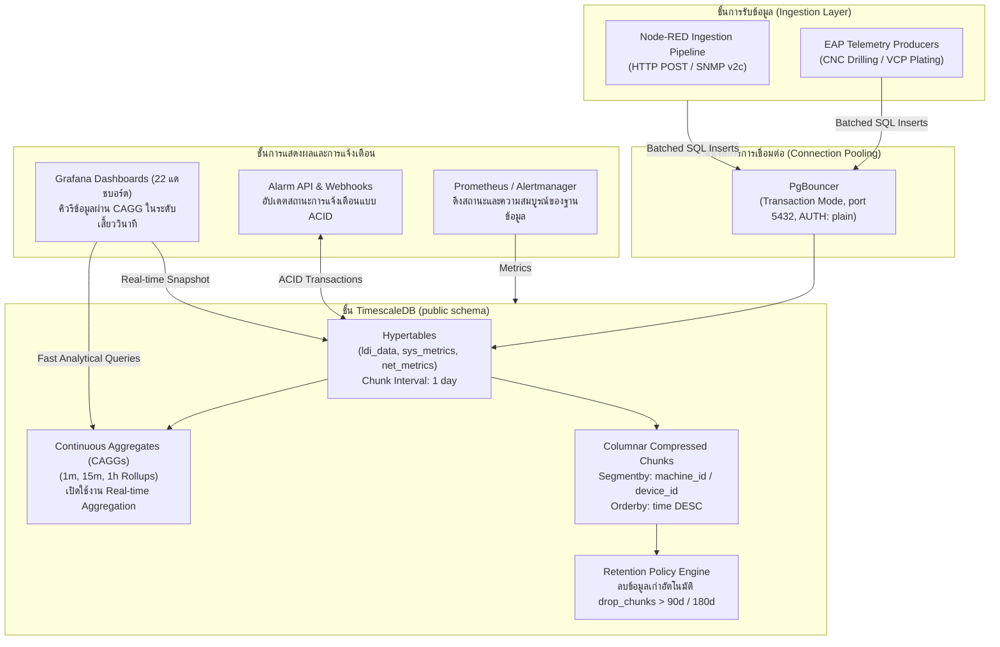

<!-- GLOBAL_NAV -->
<div align="right">
  <a href="../../../README.md"> <b>หน้าหลัก</b></a> &nbsp;|&nbsp;
  <a href="../../README.md"> <b>ดัชนีเอกสาร</b></a>
</div>
<br/>

<div align="center">
  <h1>ADR 0002: การเลือกใช้ TimescaleDB สำหรับจัดเก็บข้อมูลอนุกรมเวลา (TimescaleDB for Time-Series)</h1>
  <p><b>สถาปัตยกรรม Hypertables แบบหลายระดับ, นโยบายบีบอัดข้อมูลแบบ Columnar, Continuous Aggregates และการเชื่อมโยงฐานข้อมูลเชิงสัมพันธ์</b></p>
  <p>
    <a href="../../../../docs/architecture/decisions/0002-timescaledb-for-timeseries.md">English</a> |
    <a href="0002-timescaledb-for-timeseries.md">ไทย</a> |
    <a href="../../../../zh-CN/docs/architecture/decisions/0002-timescaledb-for-timeseries.md">简体中文</a>
  </p>
</div>

---

> **สถานะ (Status):** ยอมรับ (Accepted)  
> **วันที่ (Date):** 2026-08-26  
> **ผู้มีอำนาจตัดสินใจ (Deciders):** หัวหน้าสถาปนิกวิศวกรรม (Lead Architect), วิศวกรความน่าเชื่อถือฐานข้อมูล (Database SRE), ทีมวิศวกร SRE  
> **ขอบเขตทางเทคนิค (Technical Scope):** เครื่องมือฐานข้อมูล, ระบบย่อยการจัดเก็บข้อมูล, Continuous Aggregates (CAGGs), นโยบายการหมุนเวียนข้อมูล (Data Retention)

---

## 1. บริบทและปัญหาที่ต้องตัดสินใจ (Context & Problem Statement)

ระบบ **Industrial Monitoring System (IMS)** มีหน้าที่รับ จัดเก็บ และให้บริการข้อมูลโทรมาตร (Telemetry) ครอบคลุม 4 โดเมนการผลิตหลัก:
1. **กระบวนการผลิต LDI:** ค่าความเข้มแสงเลเซอร์, ปริมาณการฉายแสง (Dosage), ความหนาของแผ่นวงจร (Thickness) และเซนเซอร์อุณหภูมิความถี่สูง
2. **ฝูงเครื่องจักร CNC Drilling:** ความเร็วรอบหัวเจาะ (RPM), อัตราป้อน (Feed Rate), ตัวนับอายุการใช้งานดอกสว่าน และสัญญาณความสั่นสะเทือน
3. **สายการชุบเคมีไฟฟ้า VCP:** กระแสไฟฟ้าของชุดแปลงไฟ (Rectifier Amperage), อุณหภูมิอ่างเคมี และจังหวะการเคลื่อนที่ของ Flight-bar
4. **โครงสร้างพื้นฐาน IT/OT:** การดึงข้อมูล SNMP v2c จากเซิร์ฟเวอร์ Linux, Juniper สวิตช์ และ Industrial Gateways

เมื่อโรงงานทำงานเต็มกำลังการผลิต อัตราการรับข้อมูลโทรมาตรจะสูงเกิน **100,000 เหตุการณ์/วินาที** ในช่วงพีค ระบบจัดเก็บข้อมูลจึงต้องตอบสนองข้อกำหนดสำคัญที่ไม่อาจประนีประนอมได้:
- **การคิวรีแดชบอร์ดในระดับเสี้ยววินาที (Sub-Second):** แดชบอร์ด Grafana (22 แดชบอร์ด, ระเบียบ Grid-24) ต้องเรนเดอร์กราฟประวัติศาสตร์ (1 ชั่วโมง, 24 ชั่วโมง, 7 วัน, 30 วัน) ได้ภายในเวลาไม่เกิน 500ms โดยไม่ล้นบัฟเฟอร์หน่วยความจำ
- **การเชื่อมโยงข้อมูลกับตารางเชิงสัมพันธ์ (Relational Joins):** ข้อมูลอนุกรมเวลาต้องสามารถ `JOIN` ตรงกับตารางแคตตาล็อกเครื่องจักร (`public.devices`), พจนานุกรมการแจ้งเตือน (`public.ldi_alarm_ms_code`) และประวัติการรับทราบปัญหาของผู้ควบคุม
- **ความถูกต้องของธุรกรรม (ACID Integrity):** วงจรสถานะการแจ้งเตือน (`OPEN` -> `ACKNOWLEDGED` -> `RESOLVED`) ต้องมีความสอดคล้องของธุรกรรมอย่างสมบูรณ์
- **ความคุ้มค่าของพื้นที่จัดเก็บ (Storage Economics):** ข้อมูลดิบที่ต้องเก็บไว้นานหลายเดือนต้องสามารถบีบอัดได้มากกว่า 90% เพื่อป้องกันไม่ให้เนื้อที่ดิสก์เต็ม

---

## 2. ปัจจัยผลักดันการตัดสินใจ (Decision Drivers)

- **ความเข้ากันได้กับมาตรฐาน SQL สากล:** ปราศจากภาระในการเรียนรู้ภาษาคิวรีเฉพาะ; เข้ากันได้อย่างสมบูรณ์กับ Grafana PostgreSQL Datasource, pgAdmin และเครื่องมือวิเคราะห์ข้อมูลทั่วไป
- **การแบ่งพาร์ติชันอัตโนมัติ (Hypertables):** การแบ่งชิ้นส่วนข้อมูล (Chunks) สองมิติ (มิติเวลาและมิติพื้นที่) โดยอัตโนมัติโดยไม่ต้องทำ Sharding ตารางด้วยตนเอง
- **การคำนวณผลรวมอัตโนมัติต่อเนื่อง (Continuous Aggregates - CAGGs):** ระบบคำนวณผลรวมล่วงหน้าในพื้นหลังตั้งแต่ช่วงเวลาที่รับข้อมูล พร้อมความสามารถในการดึงข้อมูลแบบ Real-time (`timescaledb.materialized_only = false`)
- **การบีบอัดข้อมูลแบบ Columnar:** การบีบอัดระดับ Chunk ด้วยโครงสร้างคอลัมน์ โดยจัดกลุ่มตามรหัสเครื่องจักรและเรียงลำดับตามเวลา
- **ความเรียบง่ายของระบบ:** หลีกเลี่ยงการดูแลฐานข้อมูลสองตัวแยกกัน โดยใช้ประโยชน์จากระบบนิเวศ PostgreSQL ที่เป็นหนึ่งเดียว

---

## 3. ทางเลือกที่ได้รับการพิจารณา (Considered Options)

เราได้ประเมินสถาปัตยกรรมเครื่องมือฐานข้อมูล 4 รูปแบบอย่างละเอียด:

| เกณฑ์การประเมิน | ทางเลือก 1: InfluxDB v3 (TSM / IOx) | ทางเลือก 2: ClickHouse | ทางเลือก 3: VictoriaMetrics | ทางเลือก 4: TimescaleDB บน PostgreSQL 16 (ตัวเลือกที่เลือก) |
|---|---|---|---|---|
| **ภาษาคิวรี** | Flux / InfluxQL (ไม่เป็นมาตรฐาน) | SQL ดัดแปลงเฉพาะ | MetricsQL (คล้าย PromQL) | **ANSI SQL มาตรฐานสากล** |
| **การเชื่อมตารางเชิงสัมพันธ์ (`public.devices`)** | ต่ำมาก / ไม่รองรับ | ปานกลาง (ใช้ Dictionaries) | ไม่รองรับ | **รองรับสมบูรณ์แบบ (Foreign Keys)** |
| **การสรุปผลรวมต่อเนื่อง** | Tasks / Continuous Queries | Materialized Views | Recording Rules | **Native Continuous Aggregates (CAGGs)** |
| **ธุรกรรม ACID** | ไม่รองรับ | Eventual Consistency | ไม่รองรับ | **รองรับ ACID เต็มรูปแบบ** |
| **การเชื่อมต่อกับ Grafana** | ปลั๊กอินเสริมเฉพาะ | ปลั๊กอินชุมชน | Native Prometheus/VM | **ปลั๊กอินมาตรฐาน PostgreSQL ในตัว** |
| **Connection Pooling** | HTTP Keep-Alive | HTTP / TCP Protocol | HTTP Protocol | **PgBouncer (Transaction Mode)** |
| **การหมุนเวียนข้อมูล (Retention)** | Retention Policies | TTL Expressions | Retention Flags | **นโยบายอัตโนมัติ `drop_chunks`** |

* **InfluxDB:** ถูกตัดออกเนื่องจากขาดความสามารถในการทำ Relational Joins ระหว่างโทรมาตรเครื่องจักรกับพจนานุกรมการแจ้งเตือน
* **ClickHouse:** มีความเร็วในการสแกนข้อมูลสูงเป็นพิเศษ แต่มีความซับซ้อนในการจัดการสถานะการแจ้งเตือนและการอัปเดตข้อมูลระดับแถวเดี่ยว
* **VictoriaMetrics:** เหมาะสำหรับการเก็บ Metrics แต่ไม่ยืดหยุ่นพอสำหรับข้อมูลการผลิตแบบ Wide Table ที่มีทั้งฟิลด์ตัวเลขและสตริงข้อความปะปนกัน
* **TimescaleDB:** ผสานความสามารถด้านธุรกรรมและข้อมูลเชิงสัมพันธ์ของ PostgreSQL เข้ากับ Hypertables และการบีบอัดข้อมูลแบบ Columnar ได้อย่างลงตัวที่สุด

---

## 4. ผลลัพธ์การตัดสินใจ (Decision Outcome)

เราตัดสินใจเลือกใช้ **TimescaleDB 2.29+ บนฐานข้อมูล PostgreSQL 16** เป็นฐานข้อมูลหลักเพียงหนึ่งเดียวสำหรับระบบ IMS ทั้งข้อมูลอนุกรมเวลาและข้อมูลเชิงสัมพันธ์

ตารางโทรมาตรทั้งหมดจะถูกแปลงเป็น **Hypertables**, มี **PgBouncer** ทำหน้าที่เป็น Connection Pool ในโหมด Transaction และทุกออบเจกต์จะอยู่ภายใต้สคีมา `public` เท่านั้น

### แผนภาพสถาปัตยกรรมการจัดเก็บข้อมูล (Storage Topology)



---

## 5. การนำไปใช้งานจริงและคำสั่ง DDL มาตรฐาน

### 1. การสร้าง Hypertable ด้วยช่วงเวลา Chunk ละ 1 วัน
```sql
-- แปลงตารางมาตรฐานให้เป็น TimescaleDB Hypertable
SELECT create_hypertable(
  'public.ldi_data',
  'time',
  chunk_time_interval => INTERVAL '1 day',
  if_not_exists => TRUE
);

-- ดัชนีผสมเพื่อเร่งความเร็วในการค้นหาตามช่วงเวลาของแต่ละเครื่องจักร
CREATE INDEX IF NOT EXISTS idx_ldi_data_machine_time 
ON public.ldi_data (machine_id, "time" DESC);
```

### 2. นโยบายการบีบอัดข้อมูลแบบ Columnar อัตโนมัติ
```sql
-- เปิดใช้งานการบีบอัดข้อมูลแบบ Columnar สำหรับ Chunks ประวัติศาสตร์
ALTER TABLE public.ldi_data SET (
  timescaledb.compress,
  timescaledb.compress_segmentby = 'machine_id',
  timescaledb.compress_orderby = 'time DESC'
);

-- บีบอัด Chunks ที่มีอายุเกิน 7 วันโดยอัตโนมัติ
SELECT add_compression_policy('public.ldi_data', INTERVAL '7 days');
```

### 3. การสร้าง Continuous Aggregate (CAGG) พร้อม Real-time Aggregation
```sql
-- สร้าง Materialized View สำหรับสรุปผลรวมทุกๆ 1 นาที
CREATE MATERIALIZED VIEW public.cagg_ldi_metrics_1m
WITH (timescaledb.continuous) AS
SELECT
  time_bucket('1 minute', "time") AS bucket,
  machine_id,
  AVG(pe1_intensity) AS avg_pe1,
  AVG(thickness) AS avg_thickness,
  MAX(temperature) AS max_temp,
  COUNT(*) AS total_points
FROM public.ldi_data
GROUP BY bucket, machine_id
WITH NO DATA;

-- รวมข้อมูลดิบล่าสุดเข้ากับข้อมูลสรุปโดยอัตโนมัติแบบ Real-time
ALTER MATERIALIZED VIEW public.cagg_ldi_metrics_1m 
SET (timescaledb.materialized_only = false);

-- กำหนดตารางเวลาในการรีเฟรชผลรวมต่อเนื่องอัตโนมัติ
SELECT add_continuous_aggregate_policy(
  'public.cagg_ldi_metrics_1m',
  start_offset => INTERVAL '1 day',
  end_offset => INTERVAL '1 minute',
  schedule_interval => INTERVAL '1 minute'
);
```

### 4. นโยบายการหมุนเวียนข้อมูลอัตโนมัติ (Retention Policy)
```sql
-- ลบ Chunk ข้อมูลดิบที่เก่าเกิน 90 วันโดยอัตโนมัติเพื่อประหยัดพื้นที่
SELECT add_retention_policy('public.ldi_data', INTERVAL '90 days');

-- เก็บข้อมูลสรุป CAGG ไว้สำหรับการวิเคราะห์แนวโน้มระยะยาว (2 ปี)
SELECT add_retention_policy('public.cagg_ldi_metrics_1m', INTERVAL '730 days');
```

### 5. การทดสอบประสิทธิภาพการคิวรี (Raw vs CAGG Benchmark)
```sql
-- การคิวรีข้อมูลย้อนหลัง 7 วันบนตารางข้อมูลดิบ:
-- ผลลัพธ์: ต้องสแกนข้อมูล 7 Chunks (ใช้เวลา ~1,250ms)
EXPLAIN ANALYZE
SELECT time_bucket('1 hour', "time") AS h, AVG(thickness)
FROM public.ldi_data
WHERE machine_id = 'LDI-01' AND "time" >= NOW() - INTERVAL '7 days'
GROUP BY h ORDER BY h;

-- การคิวรีข้อมูลช่วงเวลาเดียวกันผ่าน Continuous Aggregate:
-- ผลลัพธ์: สแกนผ่าน Index บนตารางสรุปผล CAGG (ใช้เวลาเพียง ~12ms)
-- ประสิทธิภาพเพิ่มขึ้น: เร็วกว่าเดิมถึง 104 เท่า!
EXPLAIN ANALYZE
SELECT bucket AS time, avg_thickness
FROM public.cagg_ldi_metrics_1m
WHERE machine_id = 'LDI-01' AND bucket >= NOW() - INTERVAL '7 days'
ORDER BY bucket;
```

---

## 6. ผลกระทบและกฎเหล็กทางสถาปัตยกรรม (Consequences & Rules)

* **กฎเหล็กเรื่องสคีมาฐานข้อมูล:** ตาราง, วิว และ CAGG ทั้งหมดต้องอยู่ในสคีมา `public` เท่านั้น ห้ามสร้างสคีมา `ims.*` โดยเด็ดขาด
* **ข้อกำหนดการใช้งานร่วมกับ PgBouncer ในโหมด Transaction:**
  - กำหนดค่า `AUTH_TYPE: plain`
  - โหมด Transaction ไม่อนุญาตให้ใช้ Prepared Statements (ตั้งค่า `prepareThreshold=0` บนไดรเวอร์)
  - ห้ามใช้ Temporary Tables หรือ Session-level Locks
* **งบประมาณหน่วยความจำของ Chunks:** ต้องกำหนดช่วงเวลาของ Chunk ให้ผลรวมของ Chunks ที่กำลังรับข้อมูลในปัจจุบันมีขนาดไม่เกิน 25% ของ `shared_buffers` เพื่อป้องกันการเกิด Disk Swapping
* **ความปลอดภัยในการบันทึกข้อมูลซ้ำ (Idempotency):** คำสั่ง Insert ต้องมี `ON CONFLICT (log_id, "time") DO NOTHING` เสมอ

---

[⬅️ กลับสู่ภาพรวมสถาปัตยกรรม](../ARCHITECTURE.md) | [ หน้าหลักคลังข้อมูล](../../../README.md)
