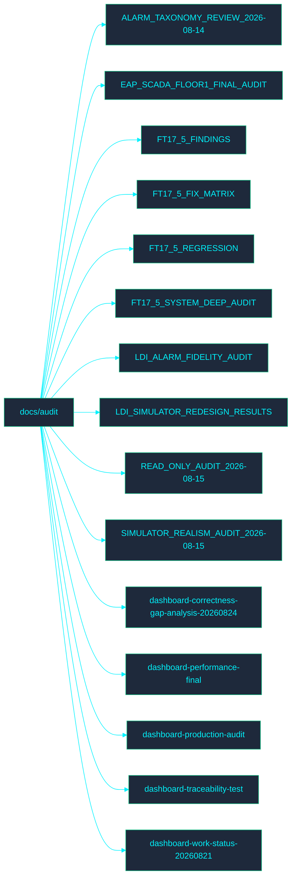

<!-- GLOBAL_NAV -->

  <a href="../../README.md"> <b>Home</b></a> &nbsp;|&nbsp;
  <a href="../README.md"> <b>Docs Index</b></a>

 

#  เอกสารการตรวจสอบ (Audit Documentation)

ยินดีต้อนรับสู่ไดเรกทอรี **Audit** ส่วนนี้ประกอบด้วยเอกสารที่เกี่ยวข้องกับกระบวนการตรวจสอบของ IMS

##  แผนผังไดเรกทอรี

##  ดัชนีไฟล์

- [ALARM_TAXONOMY_REVIEW_2026-08-14.md](ALARM_TAXONOMY_REVIEW_2026-08-14.md)
- [EAP_SCADA_FLOOR1_FINAL_AUDIT.md](EAP_SCADA_FLOOR1_FINAL_AUDIT.md)
- [FT17_5_FINDINGS.md](FT17_5_FINDINGS.md)
- [FT17_5_FIX_MATRIX.md](FT17_5_FIX_MATRIX.md)
- [FT17_5_REGRESSION.md](FT17_5_REGRESSION.md)
- [FT17_5_SYSTEM_DEEP_AUDIT.md](FT17_5_SYSTEM_DEEP_AUDIT.md)
- [LDI_ALARM_FIDELITY_AUDIT.md](LDI_ALARM_FIDELITY_AUDIT.md)
- [LDI_SIMULATOR_REDESIGN_RESULTS.md](LDI_SIMULATOR_REDESIGN_RESULTS.md)
- [READ_ONLY_AUDIT_2026-08-15.md](READ_ONLY_AUDIT_2026-08-15.md)
- [SIMULATOR_REALISM_AUDIT_2026-08-15.md](SIMULATOR_REALISM_AUDIT_2026-08-15.md)
- [dashboard-correctness-gap-analysis-20260824.md](dashboard-correctness-gap-analysis-20260824.md)
- [dashboard-performance-final.md](dashboard-performance-final.md)
- [dashboard-production-audit.md](dashboard-production-audit.md)
- [dashboard-traceability-test.md](dashboard-traceability-test.md)
- [dashboard-work-status-20260821.md](dashboard-work-status-20260821.md)
