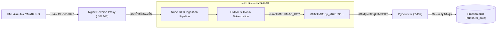

<!-- GLOBAL_NAV -->
<div align="right">
  <a href="../../README.md"> <b>หน้าหลัก</b></a> &nbsp;|&nbsp;
  <a href="../README.md"> <b>ดัชนีเอกสาร</b></a>
</div>
<br/>

<div align="center">
  <h1>นโยบายการกำกับดูแลข้อมูลอุตสาหกรรม, การปฏิบัติตามข้อกำหนด และความเป็นส่วนตัว (IMS Data Governance)</h1>
  <p><b>การจัดระดับชั้นข้อมูล, การปฏิบัติตามมาตรฐาน (IEC 62443, ISO 27001, PDPA), การปกปิดข้อมูลส่วนบุคคล, นโยบายอายุการเก็บรักษาข้อมูล TimescaleDB และการควบคุมสิทธิ์ RBAC</b></p>
  <p>
    <a href="../../../docs/data/DATA_GOVERNANCE.md">English</a> |
    <a href="DATA_GOVERNANCE.md">ไทย</a> |
    <a href="../../../zh-CN/docs/data/DATA_GOVERNANCE.md">简体中文</a>
  </p>
</div>

---

## 1. บทสรุปผู้บริหารและขอบเขตการกำกับดูแล

ระบบ Industrial Monitoring System (IMS) ทำหน้าที่ประมวลผลข้อมูล Telemetry จากเครื่องจักรผลิตแผ่นวงจรพิมพ์ที่มีความแม่นยำสูง (LDI, เครื่องเจาะ CNC, สายชุบทองแดงแนวดิ่ง VCP) และโครงสร้างพื้นฐานระบบเครือข่ายไอที/โอที นโยบายการกำกับดูแลฉบับนี้กำหนดมาตรการควบคุมภาคบังคับสำหรับการจัดหมวดหมู่ข้อมูล, วงจรอายุการจัดเก็บ, การเข้ารหัสความปลอดภัย, การแปลงข้อมูลส่วนบุคคลไม่ให้ระบุตัวตนได้ (De-identification) และการควบคุมสิทธิ์การเข้าถึงตามบทบาท (RBAC) ตลอดทั้งไปป์ไลน์การรับข้อมูล ฐานข้อมูล และแดชบอร์ด

การจัดการข้อมูลทั้งหมดสอดคล้องกับมาตรฐานสากล:
- **IEC 62443-3-3**: เครือข่ายการสื่อสารอุตสาหกรรม – ความมั่นคงปลอดภัยระดับระบบและเครือข่าย (โซน, ทางเชื่อมต่อ conduits และความสมบูรณ์ของข้อมูล)
- **ISO/IEC 27001:2022**: การจัดการความมั่นคงปลอดภัยสารสนเทศและความเป็นส่วนตัว (การควบคุมสิทธิ์ A.9, การเข้ารหัส A.10, ความปลอดภัยในการปฏิบัติการ A.12)
- **พ.ร.บ. คุ้มครองข้อมูลส่วนบุคคล พ.ศ. 2562 (Thailand PDPA)**: การแปลงรหัสพนักงานประจำเครื่องและบันทึกเวรทำงานให้เป็นนามแฝง (Pseudonymization)

---

## 2. ตารางการจัดระดับชั้นข้อมูล 4 ระดับ (Data Classification Matrix)

ข้อมูลและสินทรัพย์ทั้งหมดในระบบ IMS จะถูกจัดหมวดหมู่อยู่ในหนึ่งใน 4 ระดับชั้นความปลอดภัย:

| ระดับความปลอดภัย | คำอธิบายและตัวอย่างข้อมูล | กลไกจัดเก็บหลัก | ข้อกำหนดการเข้ารหัส | ระยะเวลาเก็บรักษามาตรฐาน | สิทธิ์การเข้าถึง |
|:-----------------|:--------------------------|:----------------|:--------------------|:-------------------------|:-----------------|
| **ระดับ 1: สาธารณะ (Public)** | แผนภาพสถาปัตยกรรมระบบ, ข้อกำหนด Schema ทั่วไป, เอกสาร API โอเพนซอร์ส, พจนานุกรม Ontology | Git repository (`docs/`) | ข้อมูลธรรมดา (เปิดอ่านสาธารณะ) | ถาวร / ตามประวัติ Git | ผู้ใช้งานทั่วไป / สาธารณะ |
| **ระดับ 2: ภายใน (Internal)** | ข้อมูลสรุปรวม (15m, 1h CAGGs), โครงร่างแดชบอร์ด Grafana, ข้อกำหนดกฎแจ้งเตือน, เมทริกสุขภาพคอนเทนเนอร์ (`sys_metrics`) | TimescaleDB (`public`), Prometheus TSDB | TLS 1.3 ขณะรับส่ง, AES-256 ขณะจัดเก็บ | 2 ปี | พนักงานที่ยืนยันตัวตนแล้ว / วิศวกร |
| **ระดับ 3: ข้อมูลลับ (Confidential)** | ข้อมูลดิบ LDI (`ldi_data`), การสั่นสะเทือนสปินเดิล CNC (`machine_event`), สารเคมีบ่อชุบ (`vcp_upp`), ตัวนับพอร์ตสวิตช์ (`net_metrics`) | TimescaleDB hypertables, PgBouncer pooler | TLS 1.3 ขณะรับส่ง, เข้ารหัสระดับ Volume | 90 วัน (ข้อมูล Chunk ดิบ) | วิศวกรกระบวนการผลิต / นักวิเคราะห์ |
| **ระดับ 4: ข้อมูลจำกัดสิทธิ์ / PII (Restricted)** | รหัสบัตรพนักงานคุมเครื่อง, บันทึกช่างประจำกะ, แผนผัง IP ภายใน, ข้อมูลยืนยันตัวตนผู้ดูแลระบบฐานข้อมูล | ตัวจัดการ Secret (`.env`), Scrubber pipeline | TLS 1.3 + HMAC-SHA256 ผสม Salt | 30 วัน (ข้อมูลแปลงนามแฝง) | ผู้ดูแลระบบระบบ (System Admin) เท่านั้น |

---

## 3. สถาปัตยกรรมการแปลงข้อมูลส่วนบุคคลเป็นนามแฝง (PII Pseudonymization)

เพื่อปฏิบัติตามกฎหมาย PDPA และ GDPR รหัสบัตรพนักงานและตัวตนผู้ควบคุมเครื่องที่ถูกส่งมาจากหน้าจอ HMI ของเครื่องจักร จะไม่ถูกจัดเก็บเป็นข้อความธรรมดาลงในตาราง Hypertable อย่างเด็ดขาด



### การทำ Data Masking ในไปป์ไลน์ Node-RED (Node.js)

ในฟังก์ชัน Node-RED การแปลงค่า PII จะทำงานบนหน่วยความจำทันทีและเคลียร์ตัวแปรทิ้งเพื่อป้องกัน Memory Leak:

```javascript
// Node-RED Function Node: ซ่อนรหัสพนักงานให้เป็นนามแฝง
const crypto = global.get('crypto') || require('crypto');
const hmacKey = process.env.PII_HMAC_SALT || 'default-ims-secure-salt-2026';

function maskOperatorId(rawOperator) {
  if (!rawOperator || typeof rawOperator !== 'string') {
    return 'ANON-OPERATOR';
  }
  // สร้างโทเคนนามแฝงขนาด 12 ตัวอักษรที่ไม่สามารถย้อนกลับได้
  const hash = crypto.createHmac('sha256', hmacKey)
                     .update(rawOperator.trim().toUpperCase())
                     .digest('hex');
  return `op_${hash.substring(0, 12)}`;
}

// แปลงค่าในเพย์โหลดก่อนส่งเข้าบัฟเฟอร์ฐานข้อมูล
if (msg.payload && msg.payload.operator_id) {
  msg.payload.operator_id = maskOperatorId(msg.payload.operator_id);
}

return msg;
```

---

## 4. นโยบายวงจรอายุข้อมูลและการบีบอัดใน TimescaleDB (Data Retention)

TimescaleDB แบ่งตารางข้อมูลตามช่วงเวลาเป็นก้อน Chunk ย่อย นโยบายการลบข้อมูลเก่า (Retention) และการบีบอัด (Compression) จะทำงานอัตโนมัติผ่านตัวจัดตารางงานพื้นหลังของ TimescaleDB โดยไม่ต้องรัน VACUUM ด้วยตนเอง

```
ข้อมูลดิบความถี่สูง (0 - 7 วัน)
  └── Uncompressed Chunks (ช่วง 1 ชั่วโมง / 1 วัน)
      └── วัตถุประสงค์: ติดตามสถานะสดแบบเรียลไทม์ และวิเคราะห์หาสาเหตุรากเหง้า (Root Cause)

ข้อมูลบีบอัดระดับคอลัมน์ (7 - 90 วัน)
  └── Columnar Compressed Chunks (ประหยัดเนื้อที่ดิสก์มากกว่า 90%)
      └── วัตถุประสงค์: การวิเคราะห์ข้อมูลย้อนหลังรายสัปดาห์

ข้อมูลสรุปรวมต่อเนื่อง (90 วัน - 2 ปี)
  └── Continuous Aggregates (ช่วง 15 นาที, 1 ชั่วโมง)
      └── วัตถุประสงค์: แดชบอร์ดสรุปผลผู้บริหารระยะยาว และการคาดการณ์แนวโน้ม

การทำลายข้อมูลเก่า (> 90 วัน สำหรับข้อมูลดิบ / > 2 ปี สำหรับ CAGGs)
  └── ลบอัตโนมัติผ่านคำสั่ง drop_chunks()
```

### คำสั่ง SQL กำหนดนโยบายอัตโนมัติบน Hypertable

```sql
-- เชื่อมต่อไปยังฐานข้อมูล telemetry (ต้องใช้ public schema เสมอ)
\c factory_telemetry;

-- 1. บังคับใช้การบีบอัดข้อมูลแบบคอลัมน์ (Compression) หลังจาก 7 วัน
ALTER TABLE public.ldi_data SET (
  timescaledb.compress,
  timescaledb.compress_segmentby = 'eqp_id, process',
  timescaledb.compress_orderby = 'time DESC'
);

SELECT add_compression_policy('public.ldi_data', INTERVAL '7 days');

-- 2. ลบก้อนข้อมูลดิบ (Drop Chunks) ที่มีอายุเกิน 90 วันทิ้งอัตโนมัติ
SELECT add_retention_policy('public.ldi_data', INTERVAL '90 days');

-- 3. กำหนดนโยบายอายุการเก็บข้อมูลสรุปรวม (Continuous Aggregates)
SELECT add_retention_policy('public.ldi_data_1m', INTERVAL '14 days');
SELECT add_retention_policy('public.ldi_data_15m', INTERVAL '90 days');
SELECT add_retention_policy('public.ldi_data_1h', INTERVAL '2 years');
SELECT add_retention_policy('public.sys_metrics_1h', INTERVAL '2 years');
SELECT add_retention_policy('public.net_metrics_1h', INTERVAL '2 years');
```

### คำสั่งตรวจสอบขนาดและบำรุงรักษาก้อนข้อมูล (Chunk Inspection)

```sql
-- ตรวจสอบก้อน Chunk ที่ใช้งานอยู่, สถานะการบีบอัด และขนาดพื้นที่บนดิสก์
SELECT
  chunk_name,
  hypertable_name,
  range_start,
  range_end,
  is_compressed,
  pg_size_pretty(before_compression_total_bytes) AS uncompressed_size,
  pg_size_pretty(after_compression_total_bytes) AS compressed_size
FROM timescaledb_information.chunks
WHERE hypertable_name = 'ldi_data'
ORDER BY range_start DESC
LIMIT 10;

-- สั่งลบข้อมูลเก่าที่มีอายุเกิน 90 วันทันทีในกรณีฉุกเฉินเพื่อคืนพื้นที่ดิสก์
SELECT drop_chunks('public.ldi_data', older_than => NOW() - INTERVAL '90 days');
```

---

## 5. การควบคุมการเข้าถึงตามบทบาท (RBAC) และคำสั่ง DDL ของฐานข้อมูล

การกำหนดสิทธิ์ยึดหลักผลประโยชน์น้อยที่สุด (Principle of Least Privilege - PoLP) โดยทุกเซอร์วิสจะเชื่อมต่อผ่าน PgBouncer ในโหมด Transaction Pooling

> [!IMPORTANT]
> **กฎเหล็กด้านสถาปัตยกรรม (Ironclad Rule)**: ตาราง, วิว และ Continuous Aggregates ทั้งหมดต้องอยู่ภายใต้สกีมา `public` เท่านั้น ห้ามสร้างหรือให้สิทธิ์บนสกีมา `ims` อย่างเด็ดขาด

### ตารางสรุปบทบาทผู้ใช้งาน (Role Definition Matrix)

| ชื่อบทบาท (Role) | สิทธิ์ที่ได้รับ | เซอร์วิสหรือผู้ใช้งานที่กำหนด | สิทธิ์เข้า Shell โดยตรง |
|:-----------------|:----------------|:------------------------------|:------------------------|
| `ims_readonly` | `SELECT` ทุกตารางและวิวใน `public` | Grafana data source, ระบบรายงานภายนอก | ไม่มี (ผ่าน PgBouncer เท่านั้น) |
| `ims_ingest` | `INSERT`, `SELECT` บน Hypertable ใน `public` | ไปป์ไลน์ Node-RED Ingestion | ไม่มี (ผ่าน PgBouncer เท่านั้น) |
| `ims_analyst` | `SELECT`, `CREATE TEMP` ใน `public` | สมุดโน้ตวิเคราะห์ข้อมูลดาต้าไซเอนซ์ | ไม่มี (ผ่าน PgBouncer เท่านั้น) |
| `ims_admin` | `ALL PRIVILEGES` บนฐานข้อมูลและสกีมา | สคริปต์ไมเกรชันฐานข้อมูล, DBA | มี (ผ่าน Bastion host ที่อนุญาต) |

### คำสั่ง DDL กำหนดสิทธิ์ผู้ใช้งานบน PostgreSQL

```sql
-- 1. สร้างบทบาทระดับแอปพลิเคชัน
CREATE ROLE ims_readonly WITH LOGIN PASSWORD 'CHANGE_IN_PRODUCTION_ENV';
CREATE ROLE ims_ingest WITH LOGIN PASSWORD 'CHANGE_IN_PRODUCTION_ENV';
CREATE ROLE ims_analyst WITH LOGIN PASSWORD 'CHANGE_IN_PRODUCTION_ENV';

-- 2. ยกเลิกสิทธิ์เริ่มต้นของ public role
REVOKE CREATE ON SCHEMA public FROM PUBLIC;

-- 3. มอบสิทธิ์สำหรับไปป์ไลน์รับข้อมูล (สิทธิ์เท่าที่จำเป็น)
GRANT CONNECT ON DATABASE factory_telemetry TO ims_ingest;
GRANT USAGE ON SCHEMA public TO ims_ingest;
GRANT INSERT, SELECT ON TABLE public.ldi_data TO ims_ingest;
GRANT INSERT, SELECT ON TABLE public.sys_metrics TO ims_ingest;
GRANT INSERT, SELECT ON TABLE public.net_metrics TO ims_ingest;

-- 4. มอบสิทธิ์อ่านอย่างเดียวสำหรับระบบแดชบอร์ด (Grafana)
GRANT CONNECT ON DATABASE factory_telemetry TO ims_readonly;
GRANT USAGE ON SCHEMA public TO ims_readonly;
GRANT SELECT ON ALL TABLES IN SCHEMA public TO ims_readonly;
ALTER DEFAULT PRIVILEGES IN SCHEMA public GRANT SELECT ON TABLES TO ims_readonly;

-- 5. จำกัดจำนวน Connection สูงสุดเพื่อป้องกัน Connection ล้นพูล
ALTER ROLE ims_readonly CONNECTION LIMIT 30;
ALTER ROLE ims_ingest CONNECTION LIMIT 20;
```

---

## 6. บันทึกการตรวจสอบและการตรวจสอบสถานะระบบ (Audit Logging)

การเชื่อมต่อและคำสั่งระดับบริหารทั้งหมดจะถูกบันทึกผ่าน PgBouncer และ PostgreSQL Engine:

```bash
# ตรวจสอบการเชื่อมต่อของไคลเอนต์และพูลเซิร์ฟเวอร์บน PgBouncer
docker exec -it ims-pgbouncer psql -p 6432 -U postgres -c "SHOW CLIENTS;"
docker exec -it ims-pgbouncer psql -p 6432 -U postgres -c "SHOW POOLS;"

# ตรวจสอบสถานะการทำงานของงานเบื้องหลัง TimescaleDB Scheduled Jobs
docker exec -it ims-timescaledb psql -U postgres -d factory_telemetry -c "
SELECT
  job_id,
  application_name,
  schedule_interval,
  last_run_started_at,
  last_successful_finish,
  last_run_status
FROM timescaledb_information.jobs
ORDER BY job_id;
"
```
