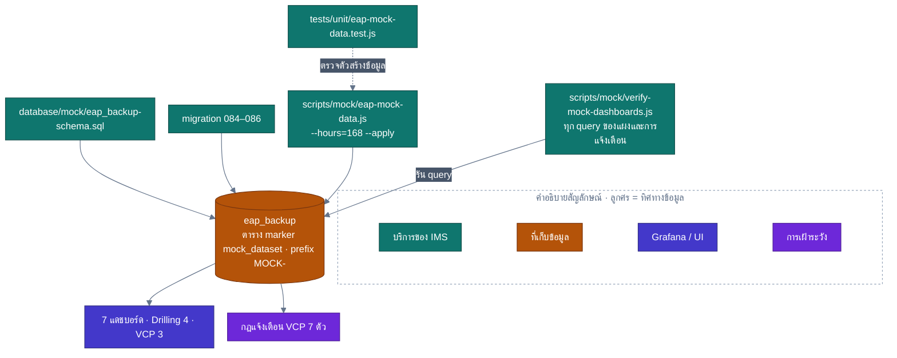

<!-- GLOBAL_NAV -->
<div align="right">
  <a href="../../README.md"> <b>หน้าหลัก</b></a> &nbsp;|&nbsp;
  <a href="../README.md"> <b>ดัชนีเอกสาร</b></a>
</div>
<br/>

<div align="center">
  <h1>สถาปัตยกรรมข้อมูลสังเคราะห์สำหรับงานเจาะ CNC และสายชุบ VCP</h1>
  <p><b>เครื่องมือสร้างฐานข้อมูลจำลองแบบแยกส่วน, ข้อมูลเครื่องจักรสังเคราะห์ตามกฎ, ขอบเขตไมเกรชัน และการทดสอบความถูกต้องของแดชบอร์ด</b></p>
  <p>
    <a href="../../../docs/data/MOCK_DATA.md">English</a> |
    <a href="MOCK_DATA.md">ไทย</a> |
    <a href="../../../zh-CN/docs/data/MOCK_DATA.md">简体中文</a>
  </p>
</div>

---

แดชบอร์ดงานเจาะ (Drilling) และงานชุบ (VCP) อ่านข้อมูลจากฐานข้อมูล `eap_backup` บนเซิร์ฟเวอร์โรงงานจริง ข้อมูลดังกล่าวเป็นข้อมูลที่กู้คืนมาจากระบบโรงงานซึ่งไม่ได้จัดเก็บอยู่ใน Git หน้านี้แสดงวิธีสร้างฐานข้อมูลตัวแทน `eap_backup` จากข้อมูลสังเคราะห์ เพื่อให้แดชบอร์ดงานเจาะ, แดชบอร์ด VCP, กฎการแจ้งเตือน VCP และไมเกรชัน 084–086 สามารถทำงานได้อย่างสมบูรณ์โดยไม่ต้องใช้ข้อมูลจริงจากโรงงาน

---

## 1. แผนภาพสถาปัตยกรรมการสร้างและตรวจสอบข้อมูลสังเคราะห์



---

## 2. องค์ประกอบหลักของระบบ

| องค์ประกอบ | ตำแหน่งไฟล์ในคลังข้อมูล | บทบาทหน้าที่ |
|---|---|---|
| **โครงสร้างสคีมา** | `database/mock/eap_backup-schema.sql` | สร้างตารางและวิวที่จำเป็นสำหรับแดชบอร์ดงานเจาะ, แดชบอร์ด VCP, กฎแจ้งเตือน และไมเกรชัน 084–086 |
| **ตัวสร้างข้อมูล** | `scripts/mock/eap-mock-data.js` | สร้างข้อมูลเหตุการณ์การเจาะและโทรมาตรสายชุบ VCP ตามแบบจำลองเสมือนจริง |
| **ตัวตรวจสอบคิวรี** | `scripts/mock/verify-mock-dashboards.js` | สั่งรันทุกคิวรีบนแดชบอร์ดงานเจาะ, VCP และกฎการแจ้งเตือน พร้อมรายงานจำนวนแถวที่ได้ |
| **ชุดทดสอบ Unit Test** | `tests/unit/eap-mock-data.test.js` | ตรวจสอบตรรกะของตัวสร้างข้อมูลโดยไม่ต้องต่อฐานข้อมูลจริง (ทำงานใน CI) |

ค่าข้อมูลทั้งหมดเป็นข้อมูลสังเคราะห์: จำนวนเครื่องจักร, ค่า Setpoint, สูตร Recipe, ขนาดแผงวงจร, รหัส Lot และข้อความแจ้งเตือน โดยไม่มีการนำข้อมูลจริงของโรงงานมาใช้

ตัวสร้างข้อมูลจำลองรูปแบบข้อมูลตรงตามที่แดชบอร์ดใช้งาน:
- รหัสเหตุการณ์และรูปแบบข้อความแจ้งเตือน
- รูปแบบรหัสเครื่องจักร (ลงท้ายด้วย `-VCP` สำหรับสายชุบ)
- แท็กอุณหภูมิอ่างเคมี (`preset_<bath>` คือค่าที่วัดได้จริง, `actual_<bath>` คือค่า Setpoint เป้าหมาย)
- เงื่อนไขของสูตร: $\text{plating\_time} \times \text{line\_speed} = 54$
- คู่เหตุการณ์แจ้งเตือนแบบ Triggered และ Reset

---

## 3. ความปลอดภัยและการแยกส่วนระบบ

- **ระบบป้องกันการเขียนทับ:** สคริปต์สคีมาจะปฏิเสธการทำงานทันทีหากพบว่าฐานข้อมูลมีตาราง `machine_event` หรือ `vcp_upp` อยู่แล้วแต่ไม่มีตาราง Marker `public.mock_dataset` เพื่อป้องกันไม่ให้เผลอไปรันทับฐานข้อมูลโรงงานจริง
- **ความปลอดภัยของทรานแซกชัน:** พารามิเตอร์ `--apply` จะทำงานภายใต้ทรานแซกชันเดียวและตรวจสอบตาราง Marker ก่อนทำการ Insert เสมอ
- **การลบข้อมูลเฉพาะส่วน:** ทุกแถวที่ถูกสร้างจะมีรหัสขึ้นต้นด้วย `MOCK-` การใช้คำสั่ง `--undo --apply` จะลบเฉพาะข้อมูลที่สร้างขึ้นเท่านั้น

---

## 4. การรันบนระบบที่ติดตั้งใหม่ (Fresh Stack)

เมื่อฐานข้อมูล `eap_backup` ยังไม่มีอยู่ในระบบ ให้รันคำสั่งจากรากของคลังข้อมูล:

```bash
docker exec -i ims-timescaledb sh -c 'psql -U "$POSTGRES_USER" -d postgres -c "CREATE DATABASE eap_backup"'
docker exec -i ims-timescaledb sh -c 'psql -U "$POSTGRES_USER" -d eap_backup -v ON_ERROR_STOP=1' < database/mock/eap_backup-schema.sql
for m in 084 085 086; do
  docker exec -i ims-timescaledb sh -c 'psql -U "$POSTGRES_USER" -d "$POSTGRES_DB" -v ON_ERROR_STOP=1' < database/migrations/$m-*.sql
done
node scripts/mock/eap-mock-data.js --hours=168 --apply   # สร้างข้อมูลย้อนหลัง 7 วัน
```

---

## 5. การรันในคอนเทนเนอร์แบบใช้แล้วทิ้ง (Disposable Container)

เพื่อทดสอบกระบวนการทั้งหมดโดยไม่แตะต้องสภาพแวดล้อมที่กำลังใช้งาน:

```bash
docker run -d --name ims-mock-verify -e POSTGRES_PASSWORD=mockonly -e POSTGRES_DB=ims timescale/timescaledb:2.29.2-pg16
docker exec ims-mock-verify psql -U postgres -d ims -c "CREATE DATABASE eap_backup"
docker exec -i ims-mock-verify psql -U postgres -d eap_backup -v ON_ERROR_STOP=1 < database/mock/eap_backup-schema.sql
for m in 084 085 086; do 
  docker exec -i ims-mock-verify psql -U postgres -d ims -v ON_ERROR_STOP=1 < database/migrations/$m-*.sql
done
node scripts/mock/eap-mock-data.js --hours=168 --apply --container=ims-mock-verify --psql-user=postgres
node scripts/mock/verify-mock-dashboards.js --container=ims-mock-verify --psql-user=postgres
docker rm -f ims-mock-verify
```

---

## 6. พารามิเตอร์และตัวเลือกในการรัน (CLI Options)

| ตัวเลือก | ค่าเริ่มต้น | ความหมาย |
|---|---|---|
| `--hours=N` | `24` | ช่วงเวลาของข้อมูลย้อนหลังนับถึงปัจจุบัน |
| `--seed=N` | `20260928` | ค่า Seed เพื่อให้ได้ชุดข้อมูลเดิมซ้ำได้ |
| `--drilling=N` | `12` | จำนวนเครื่องเจาะที่ต้องการจำลอง (3–200 เครื่อง) |
| `--incidents` | `false` | จำลองเหตุการณ์ผิดปกติในช่วง 35 นาทีสุดท้าย เพื่อทดสอบให้กฎแจ้งเตือน VCP ทั้ง 7 กฎทำงาน |
| `--apply` | `false` | บันทึกข้อมูลลงฐานข้อมูลจริง หากไม่ใส่ ข้อมูลจะถูกเขียนลงไฟล์แทน |
| `--undo` | `false` | เมื่อใช้ร่วมกับ `--apply` จะทำการลบแถวข้อมูลทั้งหมดที่มีรหัสขึ้นต้นด้วย `MOCK-` |
| `--container` | `ims-timescaledb` | ชื่อคอนเทนเนอร์ฐานข้อมูลเป้าหมาย |

---

## 7. ผลการทดสอบที่ได้รับการยืนยันแล้ว

ผลการทดสอบจริงบน TimescaleDB 2.29.2-pg16:
- สคีมาและไมเกรชัน 084, 085, 086 ทำงานได้สำเร็จสมบูรณ์โดยไม่มี Error
- **สภาวะปกติ (168 ชั่วโมง):** รันคิวรีทั้งหมด 41 คิวรีโดยมี **Error เป็น 0** โดยคิวรีพาเนลทั้ง 34 คิวรีคืนค่าแถวข้อมูลถูกต้อง และคิวรีกฎการแจ้งเตือนทั้ง 7 คิวรีไม่พบความผิดปกติ
- **สภาวะจำลองเหตุการณ์ผิดปกติ (`--incidents`):** กฎการแจ้งเตือน VCP ทั้ง 7 กฎตรวจพบความผิดปกติและส่งแจ้งเตือนได้อย่างถูกต้อง

---

[⬅️ กลับสู่ดัชนี Telemetry Ontology](TELEMETRY_ONTOLOGY.md) | [ หน้าหลักคลังข้อมูล](../../README.md)
