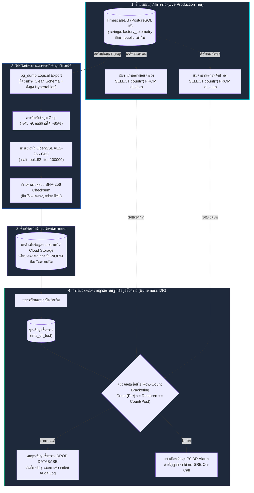

<!-- GLOBAL_NAV -->
<div align="right">
  <a href="../../README.md"> <b>หน้าหลัก</b></a> &nbsp;|&nbsp;
  <a href="../README.md"> <b>ดัชนีเอกสาร</b></a>
</div>
<br/>

<div align="center">
  <h1>ขั้นตอนการสำรองข้อมูล การกู้คืน และการตรวจสอบความถูกต้องฐานข้อมูล IMS</h1>
  <p><b>ไปป์ไลน์ pg_dump ระดับองค์กร, การเข้ารหัส AES-256, การตรวจสอบด้วยเทคนิค Row-Count Bracketing บนฐานข้อมูลชั่วคราว และ Point-In-Time Recovery (PITR)</b></p>
  <p>
    <a href="../../../docs/operations/BACKUP_RESTORE.md">English</a> |
    <a href="BACKUP_RESTORE.md">ไทย</a> |
    <a href="../../../zh-CN/docs/operations/BACKUP_RESTORE.md">简体中文</a>
  </p>
</div>

---

> **กลุ่มเป้าหมายผู้ใช้งาน:** วิศวกร SRE / ทีมปฏิบัติการ, วิศวกรฐานข้อมูล, ผู้ตรวจสอบความมั่นคงปลอดภัย  
> **เป้าหมายการกู้คืนระบบ:** ระยะเวลาสูงสุดในการกู้คืน (RTO) < 15 นาที \| จุดเวลาสูงสุดของข้อมูลที่ยอมรับการสูญหาย (RPO) < 1 ชั่วโมง  
> **มาตรฐานที่สอดคล้อง:** ISO 27001 A.12.3 (Information Backup), IEC 62443-4-2 (Data Integrity)  
> **ที่มา:** อ้างอิงจากการรันสคริปต์ `scripts/dr-test.sh` จริงบน Production Stack ภายใต้สภาวะที่มีข้อมูลไหลเข้าอย่างต่อเนื่อง

---

## 1. สถาปัตยกรรมการสำรองและกู้คืนข้อมูล (Backup & DR Architecture)



---

## 2. ขั้นตอนการสำรองข้อมูลบนระบบจริง (Production Backup Procedure)

การสำรองข้อมูลมาตรฐานจะทำการ Export สคีมาเชิงสัมพันธ์และแถวข้อมูลใน Hypertables ทั้งหมด โดยเชื่อมต่อสตรีมการบีบอัดและเข้ารหัสแบบ AES-256-CBC เพื่อความปลอดภัยสูงสุด

### สคริปต์สำรองข้อมูลอัตโนมัติ (`scripts/backup-production.sh`)

```bash
#!/usr/bin/env bash
set -euo pipefail

# การตั้งค่าตัวแปร
BACKUP_DIR="/var/backups/ims"
TIMESTAMP=$(date -u +"%Y%m%d_%H%M%SZ")
BACKUP_FILE="${BACKUP_DIR}/ims_backup_${TIMESTAMP}.sql.gz.enc"
CHECKSUM_FILE="${BACKUP_FILE}.sha256"
CONTAINER_NAME="ims-timescaledb"
DB_NAME="${POSTGRES_DB:-factory_telemetry}"
DB_USER="${POSTGRES_USER:-postgres}"

mkdir -p "${BACKUP_DIR}"

echo "==> [1/4] กำลังบันทึกจำนวนแถวข้อมูลก่อนเริ่มสำรอง (Pre-count)..."
PRE_COUNT=$(docker exec "${CONTAINER_NAME}" psql -U "${DB_USER}" -d "${DB_NAME}" -tAc "SELECT count(*) FROM public.ldi_data;")

echo "==> [2/4] สั่งรัน pg_dump พร้อมบีบอัด Gzip และเข้ารหัส AES-256..."
# คำเตือน Circular FK บนแคตตาล็อก timescaledb_information เป็นเรื่องปกติและปลอดภัย
docker exec "${CONTAINER_NAME}" pg_dump -U "${DB_USER}" -d "${DB_NAME}"   --format=plain   --no-owner   --no-privileges   | gzip -9   | openssl enc -aes-256-cbc -salt -pbkdf2 -iter 100000 -out "${BACKUP_FILE}" -pass env:BACKUP_ENCRYPTION_KEY

echo "==> [3/4] กำลังบันทึกจำนวนแถวข้อมูลหลังสำรองเสร็จสิ้น (Post-count)..."
POST_COUNT=$(docker exec "${CONTAINER_NAME}" psql -U "${DB_USER}" -d "${DB_NAME}" -tAc "SELECT count(*) FROM public.ldi_data;")

echo "==> [4/4] กำลังสร้างค่าตรวจสอบ SHA-256 Checksum..."
sha256sum "${BACKUP_FILE}" > "${CHECKSUM_FILE}"

echo "=========================================================="
echo "การสำรองข้อมูลเสร็จสมบูรณ์เรียบร้อยแล้ว!"
echo "ไฟล์:     ${BACKUP_FILE}"
echo "ขนาด:     $(du -h "${BACKUP_FILE}" | cut -f1)"
echo "เช็คซัม:   $(cat "${CHECKSUM_FILE}")"
echo "ช่วงค่า:   ${PRE_COUNT} <= Restored <= ${POST_COUNT}"
echo "=========================================================="
```

---

## 3. ระเบียบการกู้คืนและตรวจสอบบนฐานข้อมูลชั่วคราว (Verification Protocol)

เนื่องจาก IMS เป็น **ระบบรับข้อมูลโทรมาตรความถี่สูงแบบ Real-time** การตรวจสอบความเท่ากันของจำนวนแถวแบบตรงตัว (Exact-Match) จะล้มเหลวเสมอเพราะมีข้อมูลใหม่หลั่งไหลเข้ามาระหว่างการ Dump ระบบจึงใช้หลักการ **Row-Count Bracketing**: จำนวนแถวที่กู้คืนได้จะต้องอยู่ภายในช่วง $[Count_{	ext{pre}}, Count_{	ext{post}}]$

### การสั่งรันแบบอัตโนมัติ

สามารถทดสอบกระบวนการ Backup-Restore ได้อย่างปลอดภัยโดยไม่กระทบข้อมูลจริง:

```bash
# รันการซ้อม Backup-Restore ผ่านชุดทดสอบ DR
./scripts/dr-test.sh backup-restore
```

### ขั้นตอนการตรวจสอบด้วยตนเอง (Manual Workflow)

```bash
# 1. ตรวจสอบความถูกต้องของไฟล์ผ่าน SHA-256
sha256sum -c "${BACKUP_FILE}.sha256"

# 2. สร้างฐานข้อมูลชั่วคราวสำหรับทดสอบ (ไม่แตะต้องฐานข้อมูลจริง)
docker exec ims-timescaledb psql -U "$POSTGRES_USER" -d postgres -c "CREATE DATABASE ims_dr_test;"

# 3. ถอดรหัส ขยายไฟล์ และ Restore ลงฐานข้อมูลชั่วคราว
openssl enc -d -aes-256-cbc -pbkdf2 -iter 100000 -in "${BACKUP_FILE}" -pass env:BACKUP_ENCRYPTION_KEY   | gunzip   | docker exec -i ims-timescaledb psql -U "$POSTGRES_USER" -d ims_dr_test -v ON_ERROR_STOP=1

# 4. ตรวจสอบจำนวนแถวข้อมูลที่กู้คืนได้
RESTORED_COUNT=$(docker exec ims-timescaledb psql -U "$POSTGRES_USER" -d ims_dr_test -tAc "SELECT count(*) FROM public.ldi_data;")

echo "จำนวนแถวที่กู้คืนได้: ${RESTORED_COUNT}"
# เงื่อนไขความถูกต้อง: PRE_COUNT <= RESTORED_COUNT <= POST_COUNT

# 5. ลบฐานข้อมูลทดสอบทิ้งเพื่อคืนทรัพยากร
docker exec ims-timescaledb psql -U "$POSTGRES_USER" -d postgres -c "DROP DATABASE ims_dr_test;"
```

---

## 4. การรีเฟรช Continuous Aggregates หลังการกู้คืน

โครงสร้างนิยามของ TimescaleDB Continuous Aggregates (CAGGs) จะติดมากับไฟล์สำรอง แต่ข้อมูลที่ Materialized แล้วจะต้องถูกคำนวณใหม่ หลังจากการกู้คืนฐานข้อมูลจริงเสร็จสิ้น ให้รันคำสั่ง SQL ต่อไปนี้เพื่อบังคับรีเฟรชข้อมูลสรุปทันที:

```sql
-- เชื่อมต่อเข้าสู่ฐานข้อมูลที่กู้คืน
\c factory_telemetry;

-- บังคับรีเฟรชผลรวมสรุปราย 1 นาทีทันที
CALL refresh_continuous_aggregate('public.cagg_ldi_metrics_1m', NULL, NULL);

-- บังคับรีเฟรชผลรวมสรุปราย 1 ชั่วโมงทันที
CALL refresh_continuous_aggregate('public.cagg_ldi_hourly', NULL, NULL);

-- ตรวจสอบสถานะ Chunks และการบีบอัดข้อมูล
SELECT 
  hypertable_name,
  num_chunks,
  compressed_chunks
FROM timescaledb_information.hypertables
WHERE hypertable_schema = 'public';
```

---

## 5. การกู้คืนแบบเจาะจงจุดเวลา (PITR) ผ่าน WAL Archiving

สำหรับสภาพแวดล้อมการผลิตระดับโรงงานที่ต้องการป้องกันข้อมูลสูญหายอย่างสมบูรณ์ (RPO < 5 นาที) จะต้องเปิดใช้งานการเก็บ Write-Ahead Log (WAL)

### การตั้งค่าใน `postgresql.conf`
```ini
# การตั้งค่า WAL Archiving
wal_level = replica
archive_mode = on
archive_command = 'test ! -f /var/lib/postgresql/wal_archive/%f && cp %p /var/lib/postgresql/wal_archive/%f'
archive_timeout = 300
```

### ขั้นตอนการทำ Point-In-Time Recovery
1. สั่งหยุดคอนเทนเนอร์ฐานข้อมูล: `docker compose stop timescaledb`
2. กู้คืน Base Backup ล่าสุดลงในไดเรกทอรีข้อมูล
3. สร้างไฟล์ทริกเกอร์ `recovery.signal` ในโฟลเดอร์ข้อมูลของ PostgreSQL
4. เพิ่มการตั้งค่ากู้คืนลงใน `postgresql.conf`:
   ```ini
   restore_command = 'cp /var/lib/postgresql/wal_archive/%f %p'
   recovery_target_time = '2026-09-28 12:00:00 UTC'
   recovery_target_action = 'promote'
   ```
5. สั่งสตาร์ต `timescaledb`: ฐานข้อมูลจะ Replay ไฟล์ WAL จนถึงจุดเวลาที่กำหนดและเปิดให้ใช้งานตามปกติ

---

## 6. รายการตรวจสอบความพร้อมเมื่อเกิดภัยพิบัติ (DR Checklist)

- [ ] ตรวจสอบความถูกต้องของ Checksum SHA-256 ของไฟล์สำรอง
- [ ] ยืนยันว่าไม่มีทรานแซกชันค้างใน PgBouncer
- [ ] ตรวจสอบว่าออบเจกต์ฐานข้อมูลทั้งหมดอยู่ในสคีมา `public` เท่านั้น
- [ ] รันคำสั่ง `refresh_continuous_aggregate` ครบทุก CAGG
- [ ] ตรวจสอบการเชื่อมต่อของแดชบอร์ด Grafana ที่พอร์ต `http://localhost:3000`
- [ ] ตรวจสอบอัตราการไหลเข้าของข้อมูลโทรมาตรผ่าน Prometheus เมตริก `rate(ims_telemetry_ingested_total[1m])`

---

[⬅️ กลับสู่คู่มือปฏิบัติการ Runbook](../operations-runbook.md) | [ หน้าหลักคลังข้อมูล](../../README.md)
