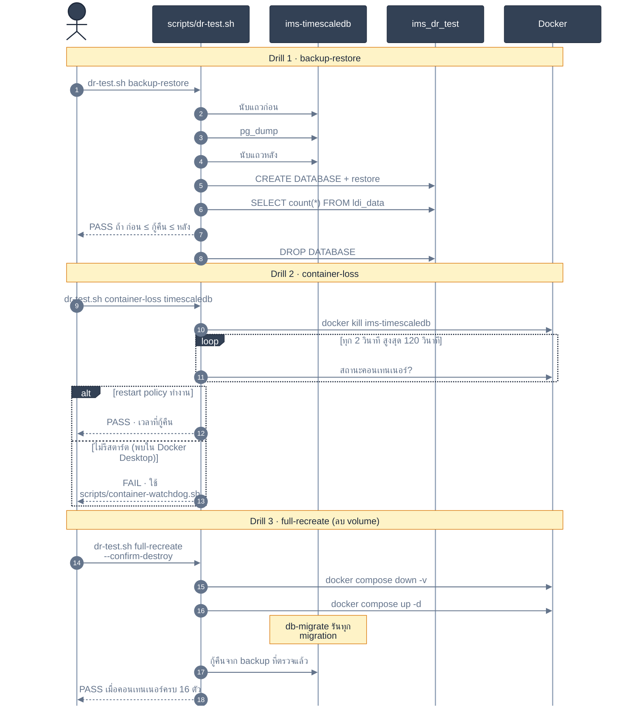

<!-- GLOBAL_NAV -->
<div align="right">
  <a href="../../README.md"> <b>หน้าหลัก</b></a> &nbsp;|&nbsp;
  <a href="../README.md"> <b>ดัชนีเอกสาร</b></a>
</div>
<br/>

<div align="center">
  <h1>แผนการทดสอบและซ้อมกู้คืนระบบเมื่อเกิดภัยพิบัติ IMS (DR Test Plan & Drills)</h1>
  <p><b>การยืนยันการกู้คืนระบบอัตโนมัติ, การตรวจสอบความสมบูรณ์ของไฟล์สำรอง, การฟื้นตัวอัตโนมัติเมื่อคอนเทนเนอร์ล่ม และการสร้างระบบใหม่ทั้งหมดจากศูนย์</b></p>
  <p>
    <a href="../../../docs/operations/DR_TEST_PLAN.md">English</a> |
    <a href="DR_TEST_PLAN.md">ไทย</a> |
    <a href="../../../zh-CN/docs/operations/DR_TEST_PLAN.md">简体中文</a>
  </p>
</div>

---

> **กลุ่มเป้าหมายผู้ใช้งาน:** วิศวกร SRE / ทีมปฏิบัติการ, วิศวกร DevOps, ทีมควบคุมคุณภาพ, ผู้ตรวจสอบความปลอดภัยและมาตรฐาน  
> **เป้าหมายการกู้คืนระบบ:** ระยะเวลาสูงสุดในการกู้คืน (RTO) < 15 นาที \| จุดเวลาสูงสุดของข้อมูลที่ยอมรับการสูญหาย (RPO) < 1 ชั่วโมง \| ระยะเวลาหยุดทำงานสูงสุดที่องค์กรยอมรับได้ (MTD) < 2 ชั่วโมง  
> **โครงสร้างการทดสอบ:** สร้างขึ้นตามรูปแบบของ `scripts/dr-test.sh` และ `scripts/soak-test-report.sh` โดยสั่งรันคำสั่งจริงกับคอนเทนเนอร์จริง และวัดผลเวลาและข้อมูลจริงโดยไม่มีการจำลองผลลัพธ์

---

## 1. วงจรชีวิตและลำดับขั้นตอนการซ้อมกู้คืนระบบ (DR Drill Sequences)



---

## 2. การซ้อมที่ 1 — การตรวจสอบการสำรองและกู้คืนข้อมูล (Backup / Restore)

### วัตถุประสงค์
เพื่อพิสูจน์ว่าฐานข้อมูลที่กำลังรับข้อมูลการผลิตจริงสามารถถูกสำรอง (Dump) และนำไปกู้คืนลงในฐานข้อมูลทดสอบได้อย่างสมบูรณ์ โดยไม่รบกวนการทำงานของระบบหลักและไม่มีข้อมูลเสียหาย

### คำสั่งสำหรับรันการทดสอบ
```bash
./scripts/dr-test.sh backup-restore
```

### เกณฑ์การตัดสินผ่าน/ไม่ผ่าน (Pass/Fail Criteria)
1. **ไม่กระทบฐานข้อมูลจริง:** ฐานข้อมูลหลัก `ims` ต้องทำงานได้ตามปกติอย่างต่อเนื่อง
2. **เงื่อนไข Row-Count Bracketing:** เนื่องจากระบบมีข้อมูลใหม่ส่งเข้ามาตลอดเวลา การตรวจเช็กแบบเท่ากันพอดีจึงใช้ไม่ได้ ระบบจึงทำการบันทึกจำนวนแถว `SELECT count(*) FROM public.ldi_data;` ก่อนและหลังการสำรอง:
   $$\text{Count}_{\text{pre}} \le \text{Count}_{\text{restored}} \le \text{Count}_{\text{post}}$$
3. **การคืนทรัพยากร:** ฐานข้อมูลทดสอบ `ims_dr_test` จะต้องถูกลบทิ้งอย่างสมบูรณ์หลังการตรวจสอบเสร็จสิ้น

---

## 3. การซ้อมที่ 2 — การฟื้นตัวเมื่อคอนเทนเนอร์หยุดทำงาน (Single-Container Loss)

### วัตถุประสงค์
เพื่อตรวจสอบความสามารถในการฟื้นตัวอัตโนมัติ (Self-Healing) เมื่อเกิดเหตุการณ์โปรเซสหยุดทำงานกะทันหัน หรือถูกระบบปฏิบัติการตัดการทำงานเนื่องจากหน่วยความจำเต็ม (OOM Kill)

### คำสั่งสำหรับรันการทดสอบ
```bash
# ทดสอบการหยุดทำงานของคอนเทนเนอร์ TimescaleDB
./scripts/dr-test.sh container-loss timescaledb

# ทดสอบการหยุดทำงานของคอนเทนเนอร์ Node-RED
./scripts/dr-test.sh container-loss node-red
```

### เกณฑ์การตัดสินผ่าน/ไม่ผ่าน
1. **การยุติโปรเซส:** สั่งปิดคอนเทนเนอร์ด้วยคำสั่ง `docker kill` (ส่งสัญญาณ SIGKILL / Exit 137)
2. **การกู้คืนอัตโนมัติ:** Docker Daemon จะต้องสั่งสตาร์ตคอนเทนเนอร์ใหม่ตามนโยบาย `restart: unless-stopped`
3. **การผ่านการตรวจสุขภาพ (Health Check):** คอนเทนเนอร์ต้องกลับสู่สถานะ `healthy` ภายในเวลาไม่เกิน **120 วินาที**
4. **การเชื่อมต่อใหม่ของระบบ:** ไปป์ไลน์ Ingestion (Node-RED `pg.Pool` Watchdog) จะต้องเชื่อมต่อเข้ากับฐานข้อมูลใหม่อัตโนมัติโดยไม่ต้องมีคนเข้าแทรกแซง

---

## 4. การซ้อมที่ 3 — การสร้างระบบใหม่ทั้งหมดจากศูนย์ (Full-Stack Cold Recreate)

### วัตถุประสงค์
เพื่อจำลองสถานการณ์เลวร้ายที่สุด เช่น ฮาร์ดแวร์เซิร์ฟเวอร์เสียหายโดยสิ้นเชิง และต้องสร้างคอนเทนเนอร์, เน็ตเวิร์ก, โวลุ่ม, สคีมา และกู้คืนข้อมูลทั้งหมดขึ้นมาใหม่บนเครื่องใหม่ 100%

> [!WARNING]
> **การดำเนินการที่มีความเสี่ยงสูง (ทำลายข้อมูลเดิม):** การซ้อมที่ 3 จะทำการลบ Docker Named Volumes ทั้งหมด (`timescaledb_data`, `prometheus_data`, `alertmanager_data`, `grafana_data`) จึงต้องระบุพารามิเตอร์ `--confirm-destroy` ชัดเจน และห้ามรันบนเครื่อง Production จริงโดยเด็ดขาด

### คำสั่งสำหรับรันการทดสอบ
```bash
./scripts/dr-test.sh full-recreate --confirm-destroy
```

### เกณฑ์การตัดสินผ่าน/ไม่ผ่าน
1. **การล้างข้อมูลเดิมอย่างสมบูรณ์:** คำสั่ง `docker compose down -v` ทำงานสำเร็จและปลด Volume ออกทั้งหมด
2. **การรันไมเกรชันอย่างเป็นระเบียบ:** ไฟล์ไมเกรชันใน `database/migrations/` (013 ถึง 086) ต้องรันผ่านตามลำดับโดยไม่มีข้อผิดพลาด
3. **การกู้คืนข้อมูลดิบ:** นำเข้าเฉพาะแถวข้อมูลดิบจากการซ้อมที่ 1 ภายหลังการสร้างสคีมาเสร็จสิ้น เพื่อป้องกันปัญหาความขัดแย้งของ Foreign Key บน TimescaleDB Continuous Aggregates
4. **ความพร้อมและการทำงานของบริการหลัก:** `timescaledb` เข้าสู่สถานะ `healthy`, ไมเกรชันผ่านครบไม่มีค้าง/ล้มเหลว, นำเข้าข้อมูลดิบกลับมาได้, และบริการหลัก (`node-red`, `proxy`, `alarm-api`) เข้าสู่สถานะ `running`

---

## 5. กำหนดการซ้อม DR และการกำกับดูแล (Cadence & Governance)

| รูปแบบการซ้อม | ความถี่ในการซ้อม | สภาพแวดล้อมเป้าหมาย | ผู้รับผิดชอบหลัก | แหล่งเก็บหลักฐานการตรวจ |
|---|---|---|---|---|
| **การซ้อมที่ 1 (Backup/Restore)** | **ทุกเดือน** (อัตโนมัติใน CI) | Staging / Pre-prod | วิศวกรความน่าเชื่อถือฐานข้อมูล (Database SRE) | `scripts/dr-test-reports/` |
| **การซ้อมที่ 2 (Container Loss)** | **ทุกไตรมาส** | Non-Production Staging | วิศวกร SRE On-Call Lead | Incident Review Log |
| **การซ้อมที่ 3 (Full Stack Rebuild)** | **ปีละ 2 ครั้ง** | สภาพแวดล้อม Lab แยกเฉพาะ | สถาปนิกโครงสร้างพื้นฐาน (Lead Architect) | SRE Postmortem Records |

---

## 6. เอกสารที่เกี่ยวข้อง

- `docs/operations/BACKUP_RESTORE.md` — สิ่งที่สคริปต์สำรองข้อมูลทำได้จริง วิธีพิสูจน์การกู้คืน และขั้นตอนการเข้ารหัสกับ PITR ที่ยังไม่มีในระบบ
- `docs/operations/INCIDENT_RESPONSE.md` — แผนการรับมือเหตุการณ์วิกฤตและขั้นตอนการประสานงานเมื่อระบบล่ม
- `docs/architecture/DATA_RETENTION.md` — นโยบายการบีบอัดข้อมูลแบบ Columnar และรอบระยะเวลาการหมุนเวียนข้อมูล
- `docs/sre/SLO_DEFINITIONS.md` — ตัวชี้วัดระดับการให้บริการและการคำนวณงบประมาณข้อผิดพลาด

---

[⬅️ กลับสู่คู่มือปฏิบัติการ Runbook](../operations-runbook.md) | [ หน้าหลักคลังข้อมูล](../../README.md)
