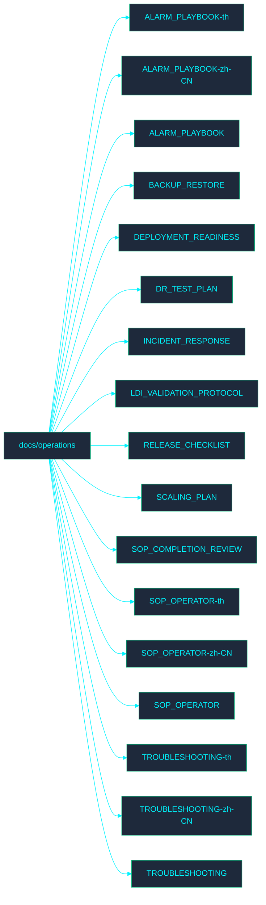

<!-- GLOBAL_NAV -->

  <a href="../../../README.md"> <b>Home</b></a> &nbsp;|&nbsp;
  <a href="../../../docs/README.md"> <b>Docs Index</b></a>

 

#  เอกสารการปฏิบัติงาน (Operations Documentation)

ยินดีต้อนรับสู่ไดเรกทอรี **Operations** ส่วนนี้ประกอบด้วยเอกสารที่เกี่ยวข้องกับกระบวนการปฏิบัติงานของ IMS

## ️ แผนผังไดเรกทอรี (Directory Map)

##  ดัชนีไฟล์ (File Index)

- [ALARM_PLAYBOOK-th.md](ALARM_PLAYBOOK.md)
- [ALARM_PLAYBOOK-zh-CN.md](../../../zh-CN/docs/operations/ALARM_PLAYBOOK.md)
- [ALARM_PLAYBOOK.md](../../../docs/operations/ALARM_PLAYBOOK.md)
- [BACKUP_RESTORE.md](../../../docs/operations/BACKUP_RESTORE.md)
- [DEPLOYMENT_READINESS.md](../../../docs/operations/DEPLOYMENT_READINESS.md)
- [DR_TEST_PLAN.md](../../../docs/operations/DR_TEST_PLAN.md)
- [INCIDENT_RESPONSE.md](../../../docs/operations/INCIDENT_RESPONSE.md)
- [LDI_VALIDATION_PROTOCOL.md](../../../docs/operations/LDI_VALIDATION_PROTOCOL.md)
- [RELEASE_CHECKLIST.md](../../../docs/operations/RELEASE_CHECKLIST.md)
- [SCALING_PLAN.md](../../../docs/operations/SCALING_PLAN.md)
- [SOP_COMPLETION_REVIEW.md](../../../docs/operations/SOP_COMPLETION_REVIEW.md)
- [SOP_OPERATOR-th.md](SOP_OPERATOR.md)
- [SOP_OPERATOR-zh-CN.md](../../../zh-CN/docs/operations/SOP_OPERATOR.md)
- [SOP_OPERATOR.md](../../../docs/operations/SOP_OPERATOR.md)
- [TROUBLESHOOTING-th.md](TROUBLESHOOTING.md)
- [TROUBLESHOOTING-zh-CN.md](../../../zh-CN/docs/operations/TROUBLESHOOTING.md)
- [TROUBLESHOOTING.md](../../../docs/operations/TROUBLESHOOTING.md)
