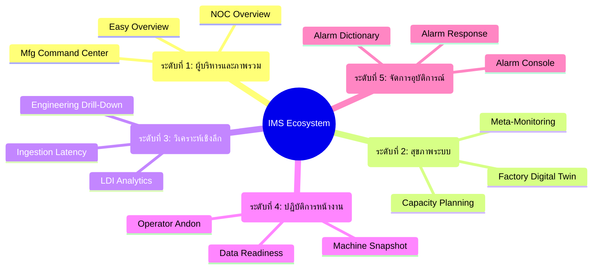

<!-- GLOBAL_NAV -->

  <a href="../../README.md"> <b>หน้าหลัก</b></a> &nbsp;|&nbsp;
  <a href="../README.md"> <b>ดัชนีเอกสาร</b></a>

 

#  ระบบนิเวศแดชบอร์ด IMS: สถาปัตยกรรมระดับมหภาคถึงจุลภาค

**Industrial Monitoring System (IMS)** ใช้ระบบนิเวศ **"Cyberpunk HUD" 15 แดชบอร์ด** ที่ออกแบบมาเพื่อกำจัดภาวะความเหนื่อยล้าจากการแจ้งเตือน (Alarm Fatigue) อย่างสิ้นเชิง และเชื่อมช่องว่างระหว่างไอทีระดับองค์กร (Enterprise IT) กับเทคโนโลยีปฏิบัติการทางกายภาพ (OT)

เอกสารฉบับนี้ทำหน้าที่เป็นแคตตาล็อกหลัก ซึ่งจัดโครงสร้างตาม **ระดับความสูง (Altitude - มหภาคถึงจุลภาค)** เพื่อให้แน่ใจว่าข้อมูลที่ถูกต้องจะไปถึงบุคคลที่เหมาะสมในจังหวะเวลาที่ต้องตัดสินใจพอดี

---

## 🗺️ แผนผังระบบนิเวศ (Ecosystem Topology)

> [!TIP]
> **สถาปัตยกรรมประสิทธิภาพ:** ไม่มีแดชบอร์ดใดที่ดึงข้อมูล Telemetry ดิบสำหรับกรอบเวลาเกิน 24 ชั่วโมง แดชบอร์ดทั้งหมดใช้พลังจาก **TimescaleDB Continuous Aggregates (CAGGs)** รับประกันเวลาโหลดต่ำกว่าหนึ่งวินาที ไม่ว่าจะสืบค้นลึกแค่ไหน หรือมีผู้ใช้พร้อมกันเท่าใด ทุกแดชบอร์ดยึดมั่นในวินัย **Grid-24**

---

##  ระดับที่ 1: ศูนย์บัญชาการผู้บริหารและภาพรวม (30,000 ฟุต - มหภาค)

_**เป้าหมาย**: มองเห็นภาพรวมได้ทันทีสำหรับผู้นำธุรกิจ เน้นที่สุขภาพโดยรวม สถานะขึ้น/ลง และ OEE โดยรวม_
**ผู้ชม**: ผู้บริหารระดับ C-Level, ผู้จัดการโรงงาน, ผู้บัญชาการ NOC

| แดชบอร์ด | คำอธิบาย | ตัวอย่าง |
|-----------|-------------|---------|
| **IMS NOC Overview** | คะแนนสุขภาพ (0-100), กระดานผู้นำโหนดวิกฤต 10 อันดับแรก และไทม์ไลน์ความผิดปกติ |  |
| **LDI Manufacturing** | ประสิทธิผลโดยรวมของเครื่องจักรอุปกรณ์ (OEE) แบบเรียลไทม์, อัตราผลตอบแทน, และคอขวดการผลิต |  |
| **IMS Easy Overview** | การติดตาม KPI ระดับธุรกิจที่เรียบง่าย เวลาทำงาน (Uptime) โดยรวมของระบบและผลผลิตขั้นต้น |  |

---

##  ระดับที่ 2: สุขภาพระบบและความสามารถในการคาดการณ์ (10,000 ฟุต)

_**เป้าหมาย**: ปฏิบัติการเชิงคาดการณ์ (AIOps) แก้ไขปัญหาก่อนที่จะลุกลามจนทำให้ระบบล่ม_
**ผู้ชม**: ผู้อำนวยการไอที, ผู้วางแผนการบำรุงรักษา, SRE

| แดชบอร์ด | คำอธิบาย | ตัวอย่าง |
|-----------|-------------|---------|
| **Capacity Planning** | การพยากรณ์ล่วงหน้าด้วย Linear regression คำนวณ "จำนวนวันจนกว่าความจุจะถึง 100%" |  |
| **Meta-Monitoring** | "การตรวจสอบผู้ตรวจสอบ" ปริมาณงานในไปป์ไลน์, สถานะ SNMP และโควต้าคิวรี |  |
| **Factory Digital Twin** | ตัวแทนทางกายภาพแบบเรียลไทม์ของพื้นที่การผลิต แผนที่เชิงพื้นที่ของสถานะเครื่องจักร | *(Requires specialized 3D plugin)* |

---

##  ระดับที่ 3: วิศวกรรมและการวิเคราะห์เชิงลึก (1,000 ฟุต)

_**เป้าหมาย**: สหสัมพันธ์ของสาเหตุที่แท้จริงระหว่างข้อจำกัดของโครงสร้างพื้นฐานไอทีกับผลผลิต (Yield) ของ OT_
**ผู้ชม**: ผู้ดูแลระบบ (SysAdmins), วิศวกรกระบวนการ, นักวิทยาศาสตร์ข้อมูล

| แดชบอร์ด | คำอธิบาย | ตัวอย่าง |
|-----------|-------------|---------|
| **Engineering Drill-Down** | เมตริกระดับจุลภาค การตรวจจับความผิดปกติแบบ Z-Score เทียบกับเส้นฐานตลอด 24 ชั่วโมง |  |
| **LDI Analytics** | วิทยาการข้อมูลวิศวกรรมกระบวนการเชิงลึก หาความสัมพันธ์ของปัจจัย OT กับข้อบกพร่อง |  |
| **Ingestion Latency** | วัดความล่าช้าการแพร่กระจายระหว่างเซ็นเซอร์ที่โรงงานกับ PostgreSQL (PgBouncer) | *(CAGG aggregation active)* |

---

##  ระดับที่ 4: ปฏิบัติการทางยุทธวิธี (ระดับพื้นดิน)

_**เป้าหมาย**: การตัดสินใจแบบไบนารี โดยไม่มีความหน่วงเวลาสำหรับบุคลากรที่ใช้งานฮาร์ดแวร์จริง_
**ผู้ชม**: พนักงานควบคุมเครื่อง (Floor Operators), หัวหน้าสายการผลิต, ผู้ตรวจสอบคุณภาพ

| แดชบอร์ด | คำอธิบาย | ตัวอย่าง |
|-----------|-------------|---------|
| **Operator Andon** | กระดานสถานะความคมชัดสูง เรียบง่าย ไฟแดง/เขียว ถ้าไฟแดงให้หยุดสายการผลิตทันที |  |
| **Machine Snapshot** | สัญญาณชีพสดของเครื่องจักร สูตร (Recipe) ปัจจุบัน, เลเซอร์, ค่าเซ็นเซอร์ |  |
| **Data Readiness** | การตรวจสอบความสมบูรณ์ของข้อมูล การทุจริตของโครงสร้าง (Schema) และสถานะออฟไลน์ |  |

---

##  ระดับที่ 5: การจัดการและการแก้ไขอุบัติการณ์ (ระดับจุลภาค)

_**เป้าหมาย**: การคัดกรอง การรับทราบ และการแก้ไขความผิดปกติอย่างถาวรโดยใช้คู่มือปฏิบัติ (Playbooks)_
**ผู้ชม**: ทีมสนับสนุน L1/L2, ผู้บัญชาการอุบัติการณ์ (Incident Commanders)

| แดชบอร์ด | คำอธิบาย | กระแสงาน (Flow) |
|-----------|-------------|-------------|
| **LDI Alarm Console** | คิวการแจ้งเตือนสด จัดกลุ่มความผิดปกติ การคัดกรองแบบเรียลไทม์ | `Alertmanager -> Console` |
| **LDI Alarm Response** | การติดตามหลังเหตุการณ์ การปฏิบัติตาม SLA, MTTR, ความถี่ในการยกระดับปัญหา | `Console -> Resolution` |
| **LDI Alarm Dictionary** | ระบบการจับคู่เพื่อแปลงรหัส Hex เป็นคู่มือปฏิบัติที่มนุษย์อ่านได้ | `Database -> Playbook` |

> [!IMPORTANT]
> **ข้อจำกัดความสมบูรณ์ของข้อมูล:** แดชบอร์ดใด ๆ ที่แสดงข้อมูลรวม (ระดับที่ 1-3) จะต้องดึงข้อมูลเฉพาะจาก Continuous Aggregates เท่านั้น เฉพาะแดชบอร์ดระดับที่ 4 และ 5 เท่านั้นที่ได้รับอนุญาตให้สืบค้นตารางข้อมูล Telemetry ดิบ
