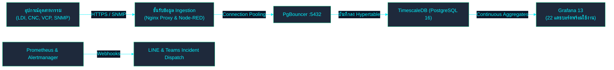

<!-- GLOBAL_NAV -->
<div align="right">
  <a href="../../README.md"> <b>หน้าหลัก</b></a> &nbsp;|&nbsp;
  <a href="../README.md"> <b>ดัชนีเอกสาร</b></a>
</div>
<br/>

<div align="center">
  <h1>คู่มือเริ่มต้นสำหรับวิศวกร IMS (Onboarding Guide)</h1>
  <p><b>ภาพรวมสถาปัตยกรรม ขั้นตอนการติดตั้ง และเวิร์กโฟลว์การทำงานสำหรับทีมวิศวกรระบบ</b></p>
  <p>
    <a href="../../../docs/product/ONBOARDING.md">English</a> |
    <a href="ONBOARDING.md">ไทย</a> |
    <a href="../../../zh-CN/docs/product/ONBOARDING.md">简体中文</a>
  </p>
</div>

---

## 1. ยินดีต้อนรับสู่ทีมวิศวกรรม IMS

ยินดีต้อนรับสู่ทีมพัฒนา **Industrial Monitoring System (IMS)** แพลตฟอร์มมอนิเตอร์และตรวจจับข้อมูล Telemetry ความแม่นยำสูง สำหรับสายการผลิตแผ่นวงจรพิมพ์ (PCB) ขั้นสูง ครอบคลุมเครื่อง Laser Direct Imaging (LDI), เครื่องเจาะ CNC Drilling และสายการผลิตชุบแผ่นแนวดิ่ง (VCP)

### ภาพรวมเชิงสถาปัตยกรรม



---

## 2. การตั้งค่าสภาพแวดล้อมเริ่มต้น (Day-1 Setup)

เริ่มต้นรันระบบทดสอบบนเครื่อง Local ได้ภายใน 5 นาที:

### สิ่งที่จำเป็นต้องมี

- **Docker Desktop** / Docker Engine (รองรับ Compose v2)
- **Node.js** (v18 หรือ v20 LTS)
- **Make** (หรือเรียกสคริปต์เทียบเท่าผ่าน PowerShell บน Windows)

### ขั้นตอนเริ่มต้นใช้งาน

```bash
# 1. โคลนคลังโค้ด
git clone https://github.com/PATTANAKORN025/IMS.git
cd IMS

# 2. ตั้งค่าตัวแปรสภาพแวดล้อม
cp .env.example .env
# แก้ไข .env และเปลี่ยนรหัสผ่านเริ่มต้นเป็นค่าที่ปลอดภัย

# 3. ตรวจสอบความพร้อมของเครื่องมือ
make doctor

# 4. เริ่มต้นรันบริการทั้งหมด 16 คอนเทนเนอร์
make up

# 5. ตรวจสอบสถานะการทำงานของระบบ
make verify
```

เมื่อระบบเริ่มทำงานเรียบร้อย สามารถเปิดเว็บเบราว์เซอร์ไปที่ `http://localhost:3000` เพื่อเข้าสู่ Grafana

---

## 3. เวิร์กโฟลว์การทำงานหลัก

### การตรวจสอบและวิเคราะห์ปัญหา (Triage & Drill-Down)

เมื่อเกิดเหตุขัดข้องในการผลิตหรือมีการแจ้งเตือนจากระบบ:

1. **NOC Overview (`/d/ims-noc-overview`)**:
   - ตรวจสอบภาพรวม Telemetry ของทั้งโรงงาน เช่น อุณหภูมิ, ความเร็วการสแกน หรือความคลาดเคลื่อนของการมาร์กเกอร์
   - คลิกเลือกที่ตัวชี้วัดเพื่อเชื่อมโยง Data Link ไปยังหน้าเจาะลึกรายเครื่องจักร
2. **ศูนย์บัญชาการการผลิต LDI (Manufacturing Fleet Command Center) (`/d/ims-ldi-manufacturing`)**:
   - กรองตาม `$machine_id` (เช่น `LDI-01` ถึง `LDI-10`)
   - วิเคราะห์ดัชนีสมรรถนะกระบวนการผลิต ($C_p, C_{pk}$) และ Z-score แบบเรียลไทม์ผ่าน TimescaleDB Continuous Aggregates
3. **Alarm Console (`/d/ims-ldi-alarm-console`)**:
   - ตรวจสอบรายการแจ้งเตือนที่อยู่ในตาราง `public.ldi_alarm_lifecycle`
   - เจ้าหน้าที่รับทราบเหตุ (Acknowledge) และวิศวกรบันทึกวิธีแก้ไขพร้อมสาเหตุราก (Resolve) ผ่าน `ims-alarm-api`

---

## 4. ข้อกำหนดและมาตรฐานทางวิศวกรรม

- **กฎความปลอดภัยของโฟลว์**: ห้ามแก้ไข `nodered_data/flows.json` โดยตรง ไฟล์ต้นฉบับแยกอยู่ที่ `nodered_data/flows/*.json` ใช้คำสั่ง `make deploy-flows` เพื่อรวมและดีพลอย
- **สคีมาฐานข้อมูล**: ตารางข้อมูลและ hypertable ทั้งหมดต้องอยู่ในสคีมา `public` เท่านั้น
- **การตรวจทานก่อนคอมมิต**: รัน `make check` (หรือ `node scripts/pre-commit.js`) ก่อนส่ง pull request เสมอ การทดสอบทั้งหมดต้องผ่าน 100%

รายละเอียดเชิงลึกเพิ่มเติม ศึกษาได้จาก [ดัชนีเอกสาร](../README.md)
