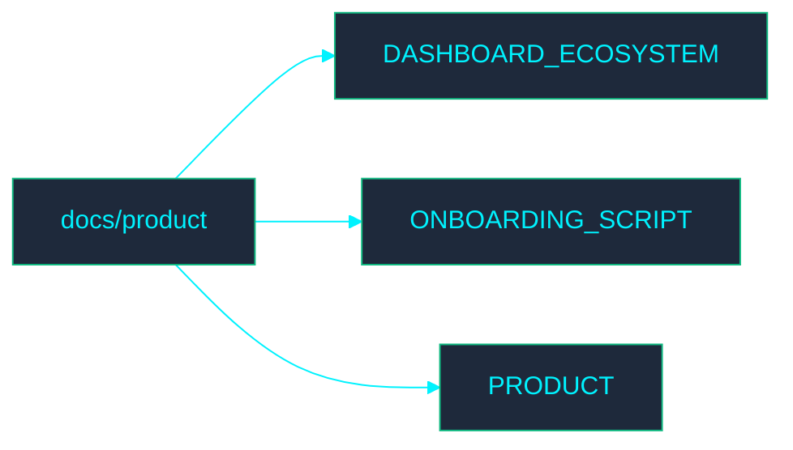

<!-- GLOBAL_NAV -->

  <a href="../../README.md"> <b>หน้าหลัก</b></a> &nbsp;|&nbsp;
  <a href="../README.md"> <b>ดัชนีเอกสาร</b></a>

 

#  เอกสารเกี่ยวกับผลิตภัณฑ์

ยินดีต้อนรับสู่ไดเรกทอรี **Product** (ผลิตภัณฑ์) ส่วนนี้ประกอบด้วยเอกสารที่เกี่ยวข้องกับกระบวนการผลิตภัณฑ์ของ IMS

##  แผนผังไดเรกทอรี

##  ดัชนีไฟล์

- [DASHBOARD_ECOSYSTEM.md](DASHBOARD_ECOSYSTEM.md)
- [ONBOARDING_SCRIPT.md](ONBOARDING_SCRIPT.md)
- [PRODUCT.md](PRODUCT.md)
