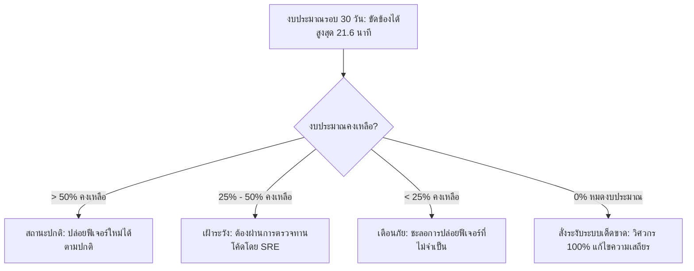

<!-- GLOBAL_NAV -->
<div align="right">
  <a href="../../README.md"> <b>หน้าหลัก</b></a> &nbsp;|&nbsp;
  <a href="../README.md"> <b>ดัชนีเอกสาร</b></a>
</div>
<br/>

<div align="center">
  <h1>วิศวกรรมความน่าเชื่อถือของระบบ IMS (SRE): ข้อกำหนด SLI และ SLO</h1>
  <p><b>ตัวชี้วัดระดับการบริการ (SLIs), วัตถุประสงค์ระดับการบริการ (SLOs), สูตรสมการ PromQL, การแจ้งเตือนอัตราการเผางบประมาณหลายหน้าต่างเวลา และนโยบายระงับการปล่อยระบบ</b></p>
  <p>
    <a href="../../../docs/sre/SLO_DEFINITIONS.md">English</a> |
    <a href="SLO_DEFINITIONS.md">ไทย</a> |
    <a href="../../../zh-CN/docs/sre/SLO_DEFINITIONS.md">简体中文</a>
  </p>
</div>

---

## 1. หลักการพื้นฐานของ SRE และสัญญาณทองคำทั้ง 4 (The 4 Golden Signals)

ระบบ Industrial Monitoring System (IMS) ทำหน้าที่เป็นศูนย์กลางการประมวลผลข้อมูล Telemetry ของการผลิตแผ่นวงจรพิมพ์และโครงสร้างพื้นฐานเครือข่ายที่มีความสำคัญสูงสุด เป้าหมาย SRE อิงตามแนวทางปฏิบัติที่ดีที่สุดของ Google SRE โดยวัดผลผ่าน **สัญญาณทองคำทั้ง 4**:

```
┌─────────────────┐   ┌─────────────────┐   ┌─────────────────┐   ┌─────────────────┐
│     Latency     │   │     Traffic     │   │     Errors      │   │   Saturation    │
│ เวลาประมวลผล    │   │ คำขอรับข้อมูล   │   │ อัตราข้อผิดพลาด │   │ การใช้พื้นที่พูล│
│   Telemetry     │   │ & รอบสำรวจ SNMP │   │ การเขียน & แจ้งเตือน│   │ & ภาระ CPU/RAM  │
└─────────────────┘   └─────────────────┘   └─────────────────┘   └─────────────────┘
```

- **Latency (ความหน่วงเวลา)**: เวลาที่ใช้ตั้งแต่รับข้อมูล, แปลงโครงสร้าง, บันทึกลงฐานข้อมูล จนถึงการแสดงผลบนแดชบอร์ด
- **Traffic (ปริมาณทราฟฟิก)**: อัตราการรับข้อมูล Telemetry ต่อวินาที และจำนวน OID ที่สำรวจต่อรอบผ่านโปรโตคอล SNMP
- **Errors (ข้อผิดพลาด)**: สัดส่วนการปฏิเสธเพย์โหลด HTTP (4xx/5xx), ข้อผิดพลาด Timeout ของฐานข้อมูล และแพ็กเก็ต SNMP ที่สูญหาย
- **Saturation (ความอิ่มตัว)**: สัดส่วนการใช้งาน Connection Pool ของ PgBouncer, ปริมาณการใช้แรม และอัตรา I/O ของดิสก์

---

## 2. ตารางข้อกำหนดหลัก SLI และ SLO (Master Specification Matrix)

วัตถุประสงค์ทั้งหมดจะถูกประเมินผลผ่านหน้าต่างเวลาแบบเลื่อนต่อเนื่อง 30 วัน ($43,200\text{ นาที}$):

| โดเมนบริการ | เมทริก / ตัวชี้วัด (SLI) | เป้าหมายวัตถุประสงค์ (SLO) | งบประมาณข้อผิดพลาด 30 วัน | วิธีการตรวจวัด |
|:------------|:-------------------------|:--------------------------|:--------------------------|:---------------|
| **ความพร้อมใช้งานของระบบรับข้อมูล** | การตอบกลับ HTTP สำเร็จ (`200 OK`) บน `/ldi-telemetry` และ `/api/v1/alarms` | **$\ge 99.95\%$** | ดับได้ไม่เกิน $21.6\text{ นาที}$ | Synthetic Blackbox Probes |
| **ความหน่วงของไปป์ไลน์ข้อมูล** | เวลาตั้งแต่ Nginx รับเพย์โหลดจนกระทั่งบันทึกลง TimescaleDB เสร็จสมบูรณ์ | **$P_{99} < 2.0\text{s}$** | คำขอช้าได้ไม่เกิน $1\%$ | ส่วนต่างเวลาของ Timestamp |
| **ความเร็วการตอบสนองของแดชบอร์ด** | ระยะเวลาที่ Grafana ดึงข้อมูลจาก Continuous Aggregates (15m, 1h) | **$P_{95} < 1.0\text{s}$<br/>$P_{99} < 3.0\text{s}$** | อนุญาตให้เกิน 1.0s ได้ไม่เกิน $5\%$ | เมทริกภายใน Grafana |
| **ความเร็วในการส่งการแจ้งเตือนวิกฤต** | เวลาตั้งแต่ค่าเกินเกณฑ์แจ้งเตือนจนถึงการยิง Webhook เข้า LINE / Teams | **$P_{99.9} < 5.0\text{s}$** | ล่าช้าได้ไม่เกิน $0.1\%$ | ตัวจับเวลา Alertmanager |
| **ความครบถ้วนของการสำรวจ SNMP** | การสำรวจ OID สำเร็จบนเซิร์ฟเวอร์ Linux และสวิตช์ Juniper ทั้งหมด | **$\ge 99.0\%$** | OID สูญหายหรือหมดเวลาไม่เกิน $1.0\%$ | สถิติ Node-RED SNMP Walker |

---

## 3. สมการทางคณิตศาสตร์และคำสั่ง PromQL สำหรับคำนวณ SLI

### 1. สูตรคำนวณความพร้อมใช้งานของระบบรับข้อมูล (Ingestion Availability SLI)

$$\text{SLI}_{\text{avail}} = \frac{\sum \text{HTTP Requests with Status } 2xx}{\sum \text{Total HTTP Ingestion Requests}} \times 100\%$$

```promql
# สัดส่วนความพร้อมใช้งานย้อนหลัง 30 วันสำหรับเอนด์พอยต์รับข้อมูล LDI
(
  sum(increase(nginx_http_requests_total{status=~"2.."}[30d]))
  /
  sum(increase(nginx_http_requests_total[30d]))
) * 100
```

### 2. สูตรคำนวณความหน่วงเปอร์เซ็นไทล์ที่ 99 ของไปป์ไลน์ (Pipeline P99 Latency SLI)

$$\text{SLI}_{\text{latency}} = \text{Quantile}_{0.99}\left(\text{Duration}_{\text{received}} \to \text{Duration}_{\text{persisted}}\right)$$

```promql
# ความหน่วงเวลาเปอร์เซ็นไทล์ที่ 99 ในช่วงหน้าต่าง 5 นาที
histogram_quantile(0.99,
  sum(rate(ims_pipeline_duration_seconds_bucket[5m])) by (le)
)
```

### 3. สูตรคำนวณความเร็วคิวรีแดชบอร์ดเปอร์เซ็นไทล์ที่ 95 (Grafana P95 Latency SLI)

```promql
# ความเร็วในการคิวรีฐานข้อมูลเปอร์เซ็นไทล์ที่ 95 (วินาที)
histogram_quantile(0.95,
  sum(rate(grafana_datasource_request_duration_seconds_bucket{datasource="factory_telemetry"}[5m])) by (le)
)
```

### 4. สูตรคำนวณอัตราความสำเร็จในการสำรวจ SNMP (SNMP Polling SLI)

```promql
# เปอร์เซ็นต์ความสำเร็จของการดึงข้อมูล SNMP ตลอดรอบ 60 วินาที
(
  sum(rate(node_red_snmp_polls_success_total[5m]))
  /
  sum(rate(node_red_snmp_polls_attempted_total[5m]))
) * 100
```

---

## 4. สถาปัตยกรรมการแจ้งเตือนตามอัตราการเผางบประมาณ (Multi-Burn-Rate Alerting)

เพื่อสร้างสมดุลระหว่างการรับมือเหตุการณ์วิกฤตอย่างทันท่วงทีกับการลดความล้าจากการแจ้งเตือน (Alert Fatigue) ระบบ IMS นำแนวทาง Multi-Window Multi-Burn-Rate ของ Google SRE มาใช้ อัตราการเผางบประมาณ (Burn Rate) แสดงถึงความเร็วในการสูญเสียงบประมาณข้อผิดพลาด 30 วัน:

```
อัตราการเผา 1.0x  ───> ผลาญงบประมาณหมดพอดีใน 30 วัน (ไม่มีการแจ้งเตือนฉุกเฉิน)
อัตราการเผา 6.0x  ───> ผลาญงบประมาณไป 5% ภายใน 6 ชั่วโมง (ด่วน: เปิดทิคเก็ตลำดับความสำคัญสูง)
อัตราการเผา 14.4x ───> ผลาญงบประมาณไป 2% ภายใน 1 ชั่วโมง (วิกฤต: เพจเจอร์เรียกทีม On-Call ทันที)
```

### ตารางอัตราการเผางบประมาณ (Burn-Rate Matrix)

| ระดับการแจ้งเตือน | ค่าอัตราการเผา (Burn Rate) | งบประมาณที่ถูกใช้ | หน้าต่างเวลายาว | หน้าต่างเวลาสั้น | การดำเนินการและช่องทางแจ้งเตือน |
|:------------------|:---------------------------|:------------------|:----------------|:-----------------|:--------------------------------|
| **CRITICAL (วิกฤต)** | $14.4\times$ | $2.0\%$ | 1 ชั่วโมง | 5 นาที | LINE On-Call Pager + สัญญาณเตือน |
| **HIGH (สูง)** | $6.0\times$ | $5.0\%$ | 6 ชั่วโมง | 30 นาที | ทิคเก็ตด่วนพิเศษบน MS Teams |
| **MEDIUM (ปานกลาง)**| $1.0\times$ | $10.0\%$ | 3 วัน | 6 ชั่วโมง | เก็บเข้า Sprint Backlog ประจำสัปดาห์ |

### กฎการแจ้งเตือน Prometheus (`prometheus/rules/slo_burn_rate.yml`)

```yaml
groups:
  - name: slo_ingestion_burn_rate
    rules:
      - alert: IngestionErrorBudgetBurningFast
        expr: |
          (
            sum(rate(nginx_http_requests_total{status=~"5.."}[1h]))
            /
            sum(rate(nginx_http_requests_total[1h]))
          ) > (1 - 0.9995) * 14.4
          and
          (
            sum(rate(nginx_http_requests_total{status=~"5.."}[5m]))
            /
            sum(rate(nginx_http_requests_total[5m]))
          ) > (1 - 0.9995) * 14.4
        for: 2m
        labels:
          severity: critical
          tier: tier1
        annotations:
          summary: "ระบบรับข้อมูล LDI กำลังผลาญงบประมาณข้อผิดพลาดที่อัตรา 14.4x (ช่วง 1 ชั่วโมง)"
          description: "อัตราข้อผิดพลาดสูงทำให้สูญเสียงบประมาณข้อผิดพลาดรายเดือนไปมากกว่า 2% ภายในชั่วโมงที่ผ่านมา"
```

---

## 5. นโยบายงบประมาณข้อผิดพลาดและการระงับการปล่อยระบบ (Error Budget Policy)

งบประมาณข้อผิดพลาด (Error Budget) คือข้อตกลงร่วมกันระหว่างทีมวิศวกรรม, ทีม SRE และฝ่ายปฏิบัติการโรงงาน หากงบประมาณยังเหลือ ระบบสามารถปล่อยฟีเจอร์ใหม่ได้อย่างรวดเร็ว แต่หากงบประมาณหมดลง ความน่าเชื่อถือของระบบจะต้องมีความสำคัญสูงสุดทันที



### ลำดับขั้นตอนการยกระดับความเข้มงวด (Escalation Tiers)

1. **สถานะสีเขียว (งบประมาณคงเหลือ $>50\%$)**: ดำเนินการปล่อยระบบอัตโนมัติผ่าน CI/CD ได้ตามปกติ
2. **สถานะสีเหลือง (งบประมาณคงเหลือ $25\% - 50\%$)**:
   - การเปลี่ยนแปลง Flow ของ Node-RED ต้องได้รับการอนุมัติจาก SRE Lead
   - ชะลอการไมเกรตฐานข้อมูลที่ไม่เร่งด่วนไปไว้ในรอบบำรุงรักษาถัดไป
3. **สถานะสีส้ม (งบประมาณคงเหลือ $<25\%$)**:
   - ระงับการปล่อยฟีเจอร์ใหม่ชั่วคราว อนุญาตเฉพาะการแก้บัก (Bug Fix) เท่านั้น
   - ต้องทดสอบประสิทธิภาพบนสภาพแวดล้อม Staging ก่อนทำการ Merge
4. **สถานะสีแดง (งบประมาณถูกใช้หมด 100%)**:
   - **ระงับการปล่อยโค้ดอย่างเด็ดขาด (Hard Deployment Freeze)**: ห้ามรวมโค้ดฟีเจอร์เข้ากิ่ง `main`
   - จัดสรรกำลังทีมวิศวกร 100% ไปแก้ปัญหาความเสถียร, ปรับแต่งคิวรี SQL และฟื้นฟูอุปกรณ์
   - ต้องจัดทำรายงานการวิเคราะห์สาเหตุเชิงลึก (PMR) ภายใน 48 ชั่วโมง

---

## 6. คำสั่งตรวจสอบสถานะ SLI แบบสดผ่าน CLI

วิศวกรสามารถตรวจสอบสุขภาพของ SLI ได้โดยตรงจาก Prometheus ผ่าน cURL:

```bash
# ตรวจสอบอัตราข้อผิดพลาดปัจจุบันในช่วง 1 ชั่วโมงของระบบรับข้อมูล
curl -s -G "http://localhost:9090/api/v1/query" \
  --data-urlencode 'query=(sum(rate(nginx_http_requests_total{status=~"5.."}[1h])) / sum(rate(nginx_http_requests_total[1h]))) * 100' \
  | jq '.data.result[] | {metric: .metric, current_error_rate_pct: .value[1]}'

# ตรวจสอบความหน่วงเปอร์เซ็นไทล์ที่ 99 ของไปป์ไลน์
curl -s -G "http://localhost:9090/api/v1/query" \
  --data-urlencode 'query=histogram_quantile(0.99, sum(rate(ims_pipeline_duration_seconds_bucket[5m])) by (le))' \
  | jq '.data.result[] | {p99_latency_seconds: .value[1]}'
```
