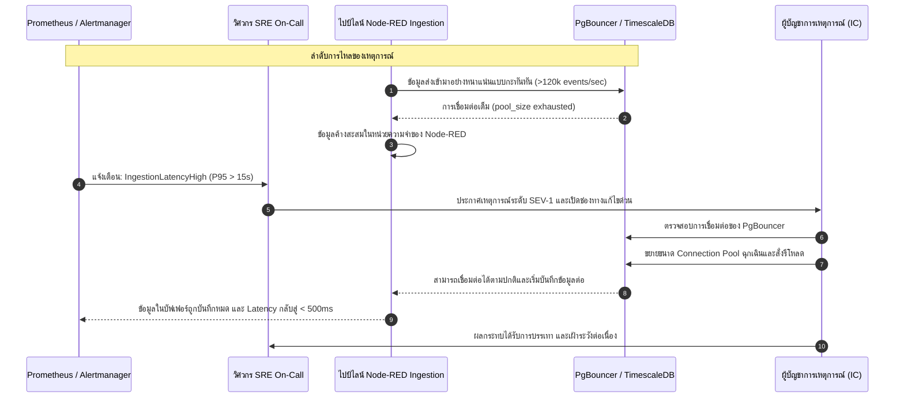
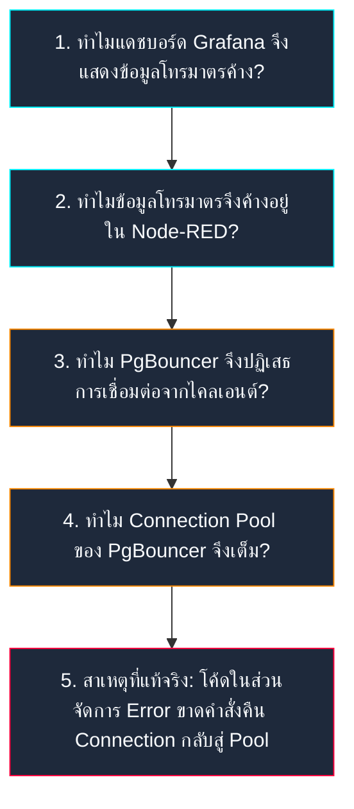

<!-- GLOBAL_NAV -->
<div align="right">
  <a href="../../../README.md"> <b>หน้าหลัก</b></a> &nbsp;|&nbsp;
  <a href="../../README.md"> <b>ดัชนีเอกสาร</b></a>
</div>
<br/>

<div align="center">
  <h1>เทมเพลต Blameless Post-Mortem และการทบทวนเหตุการณ์ขัดข้องระดับองค์กร</h1>
  <p><b>การวิเคราะห์สาเหตุที่แท้จริง (RCA), การเรียงลำดับเหตุการณ์, การประเมินผลกระทบต่อ SLO Error Budget และการกำกับดูแลแผนปฏิบัติการป้องกัน</b></p>
  <p>
    <a href="../../../../docs/sre/postmortems/TEMPLATE.md">English</a> |
    <a href="TEMPLATE.md">ไทย</a> |
    <a href="../../../../zh-CN/docs/sre/postmortems/TEMPLATE.md">简体中文</a>
  </p>
</div>

---

> **ปรัชญาหลักของ Post-Mortem (วัฒนธรรมไร้การกล่าวโทษ):**  
> เรายึดมั่นใน **Blameless Culture** (ตามมาตรฐาน Google SRE / Etsy) โดยเชื่อมั่นว่าวิศวกรทุกคนตัดสินใจและปฏิบัติหน้าที่อย่างดีที่สุดด้วยข้อมูลที่มีในขณะนั้น การทำ Post-mortem มีขึ้นเพื่อตรวจสอบ **ช่องโหว่เชิงระบบ, ขอบเขตสถาปัตยกรรม, ความล้มเหลวของระบบอัตโนมัติ และเครื่องมือปฏิบัติการ** โดยไม่มีการจับผิดหรือลงโทษบุคคล

---

## 1. ข้อมูลภาพรวมเหตุการณ์และข้อมูลจำเพาะ (Incident Overview)

| คุณลักษณะเหตุการณ์ | ค่าที่ระบุ |
|---|---|
| **ชื่อเหตุการณ์** | `[INC-YYYYMMDD-SEVX] ระบุชื่อเหตุการณ์ที่กระชับและชัดเจน` |
| **ระดับความรุนแรง** | **SEV-1** (ระบบหยุดทำงานวิกฤต) \| **SEV-2** (ประสิทธิภาพลดลงอย่างรุนแรง) \| **SEV-3** (เหตุการณ์ผิดปกติเล็กน้อย) |
| **วันที่เกิดเหตุการณ์** | `YYYY-MM-DD` |
| **ผู้บัญชาการเหตุการณ์ (IC)** | `@incident-commander` |
| **วิศวกร SRE หัวหน้าทีมสอบสวน** | `@sre-lead` |
| **ผู้รับผิดชอบการสื่อสาร** | `@comms-lead` |
| **บริการที่ได้รับผลกระทบ** | `ims-timescaledb`, `ims-node-red`, `ims-pgbouncer`, `ims-grafana` |
| **สถานะปัจจุบัน** | `[ ร่างเอกสาร | อยู่ระหว่างการตรวจทาน | อนุมัติและเริ่มแผนงาน | ปิดสมบูรณ์ ]` |

---

## 2. บทสรุปสำหรับผู้บริหารและการประเมินผลกระทบ (Summary & Impact)

### บทสรุปสำหรับผู้บริหาร (Executive Summary)
*(ระบุสรุปความยาว 2-3 ย่อหน้า อธิบายสิ่งที่ล้มเหลว, สิ่งกระตุ้นให้เกิดปัญหา, ขอบเขตความเสียหาย และวิธีที่กู้คืนระบบกลับมา)*

### ผลกระทบต่อธุรกิจและการปฏิบัติการ (Business & Operational Impact)
* **ระยะเวลาที่เกิดเหตุการณ์ทั้งหมด:** `XX ชั่วโมง YY นาที`
* **ระยะเวลาที่ข้อมูลโทรมาตรหยุดชะงัก (Blackout):** `XX นาที`
* **จำนวนข้อมูลโทรมาตรที่สูญหาย / ตกหล่น:** `~X,XXX รายการ`
* **สายการผลิตที่ได้รับผลกระทบ:** `[เช่น สายการผลิต LDI Photolithography 1–4, หัวเจาะ CNC Drilling 01–12]`
* **การใช้นโยบายงบประมาณข้อผิดพลาด (SLO Error Budget):**
  - Ingestion Availability SLO ($99.9\%$ ต่อเดือน): ใช้งบประมาณไป **XX.X%** ของงบ 30 วัน
  - Query Latency SLO ($p95 < 500	ext{ms}$): ใช้งบประมาณไป **YY.Y%**

$$	ext{อัตราการเผาผลาญ Error Budget (Burn Rate)} = rac{	ext{อัตราข้อผิดพลาดที่เกิดขึ้นจริง}}{	ext{อัตราข้อผิดพลาดที่ยอมรับได้}} = rac{1 - 	ext{SLI}}{1 - 	ext{SLO}}$$

---

## 3. ดัชนีชี้วัดวงจรชีวิตของเหตุการณ์ (Incident Lifecycle Metrics)

```text
เวลาตรวจพบ (TTD)       เวลารับทราบปัญหา (TTA)      เวลาบรรเทาผลกระทบ (TTM)      เวลาแก้ไขสมบูรณ์ (TTR)
    [ 4 นาที ] ------------ [ 2 นาที ] ------------- [ 18 นาที ] ------------ [ 35 นาที ]
```

* **เวลาตรวจพบ (Time to Detect - TTD):** `4 นาที` (นับจากเกิดปัญหาจนกระทั่ง Alertmanager ส่งการแจ้งเตือน)
* **เวลารับทราบปัญหา (Time to Acknowledge - TTA):** `2 นาที` (นับจากได้รับแจ้งเตือนจนกระทั่งวิศวกร On-call เริ่มตรวจสอบ)
* **เวลาบรรเทาผลกระทบ (Time to Mitigate - TTM):** `18 นาที` (นับจากเริ่มตรวจจนกระทั่งระบบกลับมาทำงานได้ชั่วคราว)
* **เวลาแก้ไขเสร็จสิ้นสมบูรณ์ (Time to Resolve - TTR):** `35 นาที` (นับจากเริ่มตรวจจนกระทั่งปล่อยแพตช์ถาวรและเคลียร์คิวข้อมูลสำเร็จ)

---

## 4. ลำดับเหตุการณ์และแผนภาพกระบวนการ (Incident Timeline)

บันทึกเวลาทั้งหมดต้องระบุทั้งเวลาสากล **UTC** และเวลาประเทศไทย **ICT (UTC+7)**



### บันทึกเหตุการณ์ตามเวลาอย่างละเอียด
* `14:02 ICT (07:02 UTC)` — เครื่องจักรเชื่อมต่อเครือข่ายกลับเข้ามาพร้อมส่งข้อมูลสะสมจำนวนมาก
* `14:04 ICT (07:04 UTC)` — การเชื่อมต่อไปยัง `ims-pgbouncer` ชนเพดานที่กำหนดไว้ (`max_client_conn`)
* `14:06 ICT (07:06 UTC)` — Prometheus ตรวจพบความล่าช้าและส่งแจ้งเตือน `HighIngestionLatency` ไปยัง Alertmanager
* `14:08 ICT (07:08 UTC)` — วิศวกร SRE On-call รับทราบเหตุการณ์และเปิดวอร์รูมแก้ไขปัญหา
* `14:15 ICT (07:15 UTC)` — ตรวจพบว่าคิวรีที่ไม่มีดัชนีส่งผลให้การทำธุรกรรมค้างและยึดช่องการเชื่อมต่อไว้
* `14:24 ICT (07:24 UTC)` — ใช้คำสั่ง `docker exec ims-pgbouncer kill -HUP 1` เพื่อขยายขนาด Pool อย่างเร่งด่วน
* `14:39 ICT (07:39 UTC)` — ข้อมูลในคิวถูกเขียนลงฐานข้อมูลจนหมด และ Ingestion Latency กลับสู่ระดับปกติที่ 180ms

---

## 5. การวิเคราะห์หาสาเหตุที่แท้จริง (5 Whys Root Cause Analysis)



1. **ทำไมแดชบอร์ด Grafana จึงแสดงข้อมูลโทรมาตรค้าง?**  
   พาเนล Real-time ไม่ได้รับแถวข้อมูลใหม่จากตาราง `public.ldi_data`
2. **ทำไมข้อมูลโทรมาตรจึงค้างอยู่ใน Node-RED?**  
   ไปป์ไลน์ Node-RED ติดปัญหา Backpressure เนื่องจากเกิด Timeout ในการ Insert ข้อมูลลงฐานข้อมูล
3. **ทำไม PgBouncer จึงปฏิเสธการเชื่อมต่อ?**  
   จำนวน Client Connection ที่กำลังใช้งานอยู่ชนขีดจำกัดสูงสุดของ `default_pool_size`
4. **ทำไม Connection Pool จึงถูกใช้งานจนหมด?**  
   การเชื่อมต่อถูกเปิดค้างไว้ระหว่างที่รอการเชื่อมต่อเครือข่ายใหม่จากต้นทาง
5. **ทำไมการเชื่อมต่อจึงค้างอยู่ไม่ยอมปิด (สาเหตุที่แท้จริง)?**  
   โค้ดในบล็อกจัดการข้อผิดพลาด (Exception Handler) ของตัวห่อหุ้มฐานข้อมูลใน Node-RED ขาดคำสั่ง `client.release()` เมื่อเกิด Socket Abort

---

## 6. คำสั่งคิวรีสำหรับวินิจฉัยปัญหา (PromQL & SQL)

คิวรีที่ทีมวิศวกรใช้ในการวินิจฉัยปัญหาขณะเกิดเหตุการณ์จริง:

```promql
# 1. ความล่าช้าในการประมวลผลข้อมูล Ingestion (เปอร์เซ็นไทล์ที่ 95)
histogram_quantile(0.95, sum(rate(ims_telemetry_ingest_duration_seconds_bucket[5m])) by (le))

# 2. จำนวนการเชื่อมต่อที่กำลังใช้งานเทียบกับที่กำลังรอใน PgBouncer
pgbouncer_pools_client_active{database="factory_telemetry"} 
/ 
pgbouncer_pools_client_waiting{database="factory_telemetry"}

# 3. อัตราการตกหล่นของข้อมูลโทรมาตรในไปป์ไลน์
sum(rate(ims_telemetry_dropped_records_total[5m])) by (device_type)
```

```sql
-- ตรวจสอบทรานแซกชันที่กำลังทำงานค้างอยู่ในฐานข้อมูล
SELECT pid, now() - xact_start AS duration, query, state
FROM pg_stat_activity
WHERE state != 'idle' AND query NOT LIKE '%pg_stat_activity%'
ORDER BY duration DESC
LIMIT 10;
```

---

## 7. บทเรียนที่ได้รับและการทบทวนย้อนหลัง (Retrospective)

### สิ่งที่ทำได้ดี (What Went Well)
* ระบบแจ้งเตือนอัตโนมัติของ Prometheus ส่งสัญญาณเตือนได้ภายใน 4 นาที
* ระบบ Watchdog ป้องกันไม่ให้เกิดปัญหาหน่วยความจำรั่วไหลใน `ims-timescaledb`
* การประสานงานระหว่างทีมหน้างาน OT ในโรงงานและทีม IT/SRE เป็นไปอย่างราบรื่น

### สิ่งที่ควรปรับปรุง (What Went Wrong)
* เอกสาร Runbook ขาดคำสั่งตัวอย่างที่ชัดเจนในการสั่ง Hot-reload ค่าคอนฟิกของ PgBouncer โดยไม่ต้องรีสตาร์ตคอนเทนเนอร์
* โค้ดส่วนจัดการ Error ใน Node-RED ขาดการทดสอบ Unit Test ครอบคลุมเคสผิดปกติ

### จุดที่เราโชคดี (Where We Got Lucky)
* ปัญหาเกิดขึ้นในช่วงเปลี่ยนกะการทำงานพอดี ทำให้ไม่มีแผงวงจร PCB เสียหายจากการผลิต
* เครือข่ายสำรอง (Secondary Interface) ช่วยป้องกันไม่ให้เกตเวย์หลุดการเชื่อมต่อไปทั้งหมด

---

## 8. แผนปฏิบัติการแก้ไขและป้องกันปัญหา (Corrective Action Items)

| รหัสรายการ | หมวดหมู่ | รายละเอียดแผนงานที่ต้องปฏิบัติ | ลำดับความสำคัญ | ผู้รับผิดชอบ | กำหนดเสร็จ | ตั๋วอ้างอิง |
|---|---|---|---|---|---|---|
| **ACT-01** | **ป้องกัน (Prevent)** | แก้ไขคำสั่งคืน Connection ใน Node-RED Error Handler พร้อมเพิ่ม Regression Test | `P0` | `@engineer-dev` | `YYYY-MM-DD` | `PR #XXX` |
| **ACT-02** | **ตรวจจับ (Detect)** | เพิ่ม Alert Rule ใน Prometheus แจ้งเตือนเมื่อ PgBouncer มีการรอคิว (`waiting_clients > 10`) | `P1` | `@sre-lead` | `YYYY-MM-DD` | `ISSUE-YYY` |
| **ACT-03** | **บรรเทา (Mitigate)** | เพิ่มคู่มือคำสั่ง PgBouncer Hot-reload (`RELOAD` / `kill -HUP`) ลงใน Incident Playbook | `P1` | `@sre-lead` | `YYYY-MM-DD` | `DOCS-ZZZ` |
| **ACT-04** | **กระบวนการ (Process)** | จัดการซ้อม Chaos Drill จำลองเหตุการณ์ Pool เต็มในทั้ง 4 โดเมนเครื่องจักร | `P2` | `@qa-team` | `YYYY-MM-DD` | `DR-TEST-AAA` |

---

[⬅️ กลับสู่ดัชนี SRE](../SLO_DEFINITIONS.md) | [ หน้าหลักคลังข้อมูล](../../../README.md)
