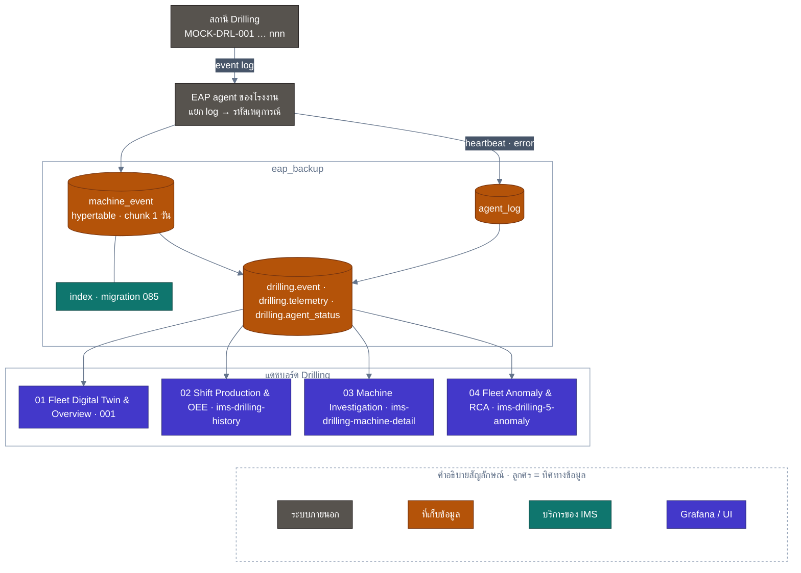
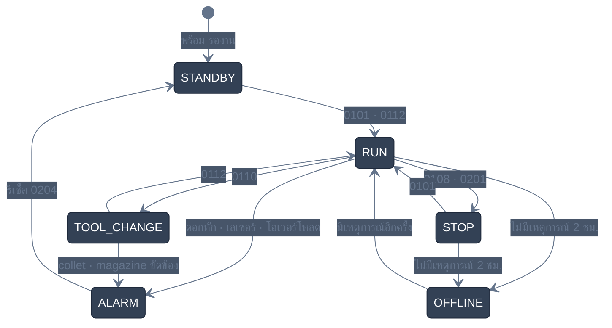
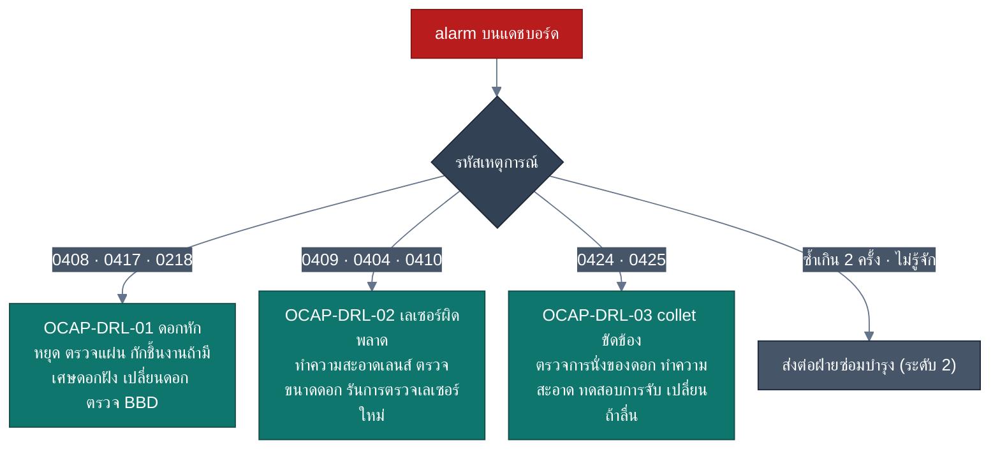
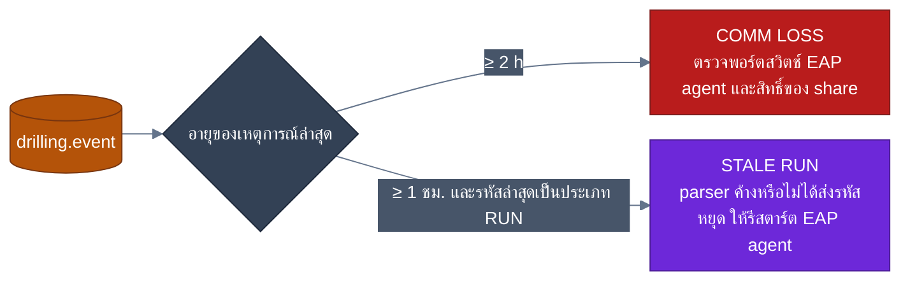

<!-- GLOBAL_NAV -->
<div align="right">
  <a href="../../README.md"> <b>หน้าหลัก</b></a> &nbsp;|&nbsp;
  <a href="../README.md"> <b>ดัชนีเอกสาร</b></a> &nbsp;|&nbsp;
  <a href="USER_MANUAL.md"> <b>คู่มือผู้ใช้ทั่วไป</b></a>
</div>
<br/>

# คู่มือการใช้งานและวิเคราะห์ระบบเจาะ CNC (IMS Drilling Operations & Engineering Manual)

> **คู่มือมาตรฐานระดับปฏิบัติการและวิศวกรรมสำหรับระบบตรวจสอบเครื่องเจาะ CNC ประจำโรงงานผลิตแผ่นวงจรพิมพ์ (PCB)**  
> ครอบคลุมสถาปัตยกรรมข้อมูล EAP Telemetry Pipeline, ฐานข้อมูล TimescaleDB, การถอดรหัสสัญญาณเซนเซอร์, คู่มือการใช้งานแดชบอร์ด Grafana ทั้ง 4 ชุดแบบละเอียดรายแผง, แผนปฏิบัติการรับมือเหตุขัดข้อง (OCAP) และคู่มือการบำรุงรักษาระบบสำหรับวิศวกรความน่าเชื่อถือ

---

<div align="center">

 **รหัสเอกสาร:** IMS-MAN-DRL-001 &nbsp;|&nbsp;
 **เวอร์ชัน:** 1.0 (Production Grade) &nbsp;|&nbsp;
 **ระดับชั้นความลับ:** มาตรฐานโรงงาน (Internal Industrial Standard) &nbsp;|&nbsp;
 **กลุ่มผู้ใช้งาน:** ผู้ควบคุมเครื่องจักร (Operators), ช่างซ่อมบำรุง (Technicians), วิศวกรกระบวนการผลิต (Process Engineers), ผู้จัดการสายการผลิต (Supervisors), วิศวกร SRE/IT Support

</div>

---

## สารบัญ (Table of Contents)

1. [บทนำและภาพรวมเชิงสถาปัตยกรรม (System Architecture & Pipeline)](#1-บทนำและภาพรวมเชิงสถาปัตยกรรม-system-architecture--pipeline)
   - 1.1 [บทบาทของแผนกเจาะในอุตสาหกรรม PCB](#11-บทบาทของแผนกเจาะในอุตสาหกรรม-pcb)
   - 1.2 [โทโพโลยีการเชื่อมโยงระบบโทรมาตรอุตสาหกรรม (C4 Telemetry Topology)](#12-โทโพโลยีการเชื่อมโยงระบบโทรมาตรอุตสาหกรรม-c4-telemetry-topology)
   - 1.3 [โครงสร้างฐานข้อมูลและแบบแผนมาตรฐาน (Schema & Canonical Layer)](#13-โครงสร้างฐานข้อมูลและแบบแผนมาตรฐาน-schema--canonical-layer)
   - 1.4 [กลไกการสืบค้นข้อมูลความเร็วสูง (High-Performance Indexing Engine - Migration 085)](#14-กลไกการสืบค้นข้อมูลความเร็วสูง-high-performance-indexing-engine---migration-085)
2. [อนุกรมวิธานรหัสเหตุการณ์และการถอดรหัสสัญญาณโทรมาตร (Telemetry Taxonomy)](#2-อนุกรมวิธานรหัสเหตุการณ์และการถอดรหัสสัญญาณโทรมาตร-telemetry-taxonomy)
   - 2.1 [วงจรสถานะเครื่องจักร (Machine State Machine)](#21-วงจรสถานะเครื่องจักร-machine-state-machine)
   - 2.2 [รหัสเหตุการณ์มาตรฐานในวงจรการผลิต (Standard Production Lifecycle Codes)](#22-รหัสเหตุการณ์มาตรฐานในวงจรการผลิต-standard-production-lifecycle-codes)
   - 2.3 [โครงสร้างและการถอดรหัส Spindle Bitmask (Spindle 1–6)](#23-โครงสร้างและการถอดรหัส-spindle-bitmask-spindle-16)
   - 2.4 [การจัดหมวดหมู่อัตโนมัติ 11 หมวดความผิดปกติ (11 Canonical Alarm Categories)](#24-การจัดหมวดหมู่อัตโนมัติ-11-หมวดความผิดปกติ-11-canonical-alarm-categories)
3. [คู่มือการใช้งานแดชบอร์ดทั้ง 4 ชุดอย่างละเอียด (Comprehensive 4-Dashboard Manual)](#3-คู่มือการใช้งานแดชบอร์ดทั้ง-4-ชุดอย่างละเอียด-comprehensive-4-dashboard-manual)
   - 3.1 [แดชบอร์ด 01: Drilling — 01 Fleet Digital Twin & Overview (UID: 001)](#31-แดชบอร์ด-01-drilling--01-fleet-digital-twin--overview-uid-001)
   - 3.2 [แดชบอร์ด 02: Drilling — 02 Shift Production & OEE Tracking (UID: ims-drilling-history)](#32-แดชบอร์ด-02-drilling--02-shift-production--oee-tracking-uid-ims-drilling-history)
   - 3.3 [แดชบอร์ด 03: Drilling — 03 Machine Investigation & Spindle Diagnostics (UID: ims-drilling-machine-detail)](#33-แดชบอร์ด-03-drilling--03-machine-investigation--spindle-diagnostics-uid-ims-drilling-machine-detail)
   - 3.4 [แดชบอร์ด 04: Drilling — 04 Fleet Anomaly & Root Cause Analysis (UID: ims-drilling-5-anomaly)](#34-แดชบอร์ด-04-drilling--04-fleet-anomaly--root-cause-analysis-uid-ims-drilling-5-anomaly)
4. [ระเบียบปฏิบัติงานมาตรฐานและแผนรับมือภาวะฉุกเฉิน (SOP & OCAP)](#4-ระเบียบปฏิบัติงานมาตรฐานและแผนรับมือภาวะฉุกเฉิน-sop--ocap)
   - 4.1 [ระดับที่ 1: ขั้นตอนปฏิบัติการของผู้ควบคุมเครื่องจักรหน้าไลน์ (Operator Protocols)](#41-ระดับที่-1-ขั้นตอนปฏิบัติการของผู้ควบคุมเครื่องจักรหน้าไลน์-operator-protocols)
   - 4.2 [ระดับที่ 2: ขั้นตอนปฏิบัติการของช่างซ่อมบำรุง (Maintenance Technician Protocols)](#42-ระดับที่-2-ขั้นตอนปฏิบัติการของช่างซ่อมบำรุง-maintenance-technician-protocols)
   - 4.3 [ระดับที่ 3: ขั้นตอนปฏิบัติการของวิศวกรกระบวนการผลิตและคุณภาพ (Engineering Protocols)](#43-ระดับที่-3-ขั้นตอนปฏิบัติการของวิศวกรกระบวนการผลิตและคุณภาพ-engineering-protocols)
   - 4.4 [ขั้นตอนการส่งมอบกะการผลิต (Shift Handover Protocols)](#44-ขั้นตอนการส่งมอบกะการผลิต-shift-handover-protocols)
5. [คู่มือวิศวกรรมฐานข้อมูลและการแก้ไขปัญหาเชิงเทคนิค (Runbook & Diagnostics)](#5-คู่มือวิศวกรรมฐานข้อมูลและการแก้ไขปัญหาเชิงเทคนิค-runbook--diagnostics)
   - 5.1 [การเฝ้าระวังความสมบูรณ์ของโครงสร้างพื้นฐาน (Infrastructure Health Watchdogs)](#51-การเฝ้าระวังความสมบูรณ์ของโครงสร้างพื้นฐาน-infrastructure-health-watchdogs)
   - 5.2 [การดูแลรักษาฐานข้อมูล TimescaleDB และ Hypertables](#52-การดูแลรักษาฐานข้อมูล-timescaledb-และ-hypertables)
   - 5.3 [ชุดคำสั่งตรวจสอบด่วนผ่าน SQL และ CLI (Diagnostic Toolbox)](#53-ชุดคำสั่งตรวจสอบด่วนผ่าน-sql-และ-cli-diagnostic-toolbox)

---

## 1. บทนำและภาพรวมเชิงสถาปัตยกรรม (System Architecture & Pipeline)

### 1.1 บทบาทของแผนกเจาะในอุตสาหกรรม PCB

กระบวนการเจาะเชิงกล (Mechanical CNC Drilling) เป็นขั้นตอนวิกฤตอันดับแรกในการผลิตแผ่นวงจรพิมพ์หลายชั้น (Multilayer PCB) ทำหน้าที่เจาะรูเชื่อมต่อทางไฟฟ้าระหว่างชั้น (Through-hole Vias), รูสำหรับใส่อุปกรณ์ (Component Holes) และรูยึดโครงสร้าง (Tooling/Mounting Holes) โดยเครื่องจักร CNC Drilling ในโรงงานเป็นเครื่องจักรแบบความแม่นยำสูง (High-Precision Multi-Spindle Machine) ประกอบด้วยหัวเจาะ 6 สปินเดิลต่อเครื่อง ทำงานที่ความเร็วรอบตั้งแต่ **20,000 ถึง 200,000 RPM** ด้วยอัตราป้อนเจาะ (Feed Rate) สูงถึง 2.5–3.0 เมตรต่อนาที และรองรับขนาดดอกสว่านคาร์ไบด์ขนาดเล็กตั้งแต่ **0.15 มม. ถึง 6.50 มม.**

ความผิดพลาดในแผนกเจาะ เช่น ดอกสว่านหักคาแผ่นวงจร, ขนาดรูเจาะคลาดเคลื่อน หรือหัวจับดอกสว่านหลวม จะส่งผลกระทบต่อเนื่องไปยังขั้นตอนชุบโลหะ (VCP Plating) และขั้นตอนสร้างลวดลายวงจร (LDI Lithography) ทำให้เกิดความเสียหายรุนแรงต่อผลผลิต (Scrap Rate) ระบบ **IMS Drilling Telemetry Subsystem** จึงถูกพัฒนาขึ้นเพื่อติดตามสถานะการทำงานแบบดิจิทัลคู่แฝด (Digital Twin), ตรวจจับความผิดปกติแบบเรียลไทม์ และคำนวณประสิทธิภาพโดยรวมของเครื่องจักร (OEE) ได้อย่างแม่นยำ

---

### 1.2 โทโพโลยีการเชื่อมโยงระบบโทรมาตรอุตสาหกรรม (C4 Telemetry Topology)

ระบบเชื่อมต่อข้อมูลจากเครื่องเจาะ CNC ฝูงเครื่องจักร (เช่น `MOCK-DRL-001`) ผ่านระบบอัตโนมัติ EAP (Equipment Automation Program) สู่ระบบจัดเก็บข้อมูลอนุกรมเวลา TimescaleDB และส่งต่อมาประมวลผลบน Grafana Dashboard ดังแผนภาพ:



---

### 1.3 โครงสร้างฐานข้อมูลและแบบแผนมาตรฐาน (Schema & Canonical Layer)

ข้อมูลทั้งหมดของระบบเจาะถูกเก็บไว้ในฐานข้อมูลเฉพาะกิจชื่อ `eap_backup` แยกเป็นอิสระจากฐานข้อมูลหลัก `ims` เพื่อรักษาเสถียรภาพและรองรับปริมาณข้อมูลมหาศาล (มากกว่า 2 ล้านแถวต่อเดือน)

#### ตารางกายภาพหลัก: `public.machine_event`
ตารางจัดเก็บข้อมูลแบบ Hypertable ของ TimescaleDB แบ่งพาร์ติชันข้อมูลตามคอลัมน์ `event_time` ด้วยช่วงเวลาทีละ 1 วัน (`chunk_time_interval => INTERVAL '1 day'`)

| คอลัมน์ (Column) | ประเภทข้อมูล (Type) | คีย์ / ข้อกำหนด | คำอธิบายรายละเอียดเชิงเทคนิค |
| :--- | :--- | :--- | :--- |
| `id` | `bigint` | Primary Identity | ตัวระบุลำดับแถวแบบเรียงตามลำดับเวลาที่บันทึก |
| `message_id` | `text` | Trace ID | รหัสข้อความโทรมาตรที่ส่งมาจาก EAP Agent |
| `equipment_id` | `text` | Machine Identifier | รหัสประจำเครื่องจักร เช่น `MOCK-DRL-001` |
| `message_type` | `text` | Message Protocol | ประเภทของโปรโตคอลข้อความ เช่น `EVENT`, `alarm` |
| `event_type` | `text` | Event Severity | ประเภทเหตุการณ์หลัก ได้แก่ `RUN`, `STOP`, `TOOL_CHANGE`, `ALARM`, `E`, `EVENT`, `M`, `PROGRAM_LOAD` |
| `event_code` | `text` | Machine Code | รหัส 4 หลักที่เครื่องส่งออกมา เช่น `0101`, `0408`, `0211`, `0109` |
| `event_message` | `text` | Payload String | ข้อความรายละเอียดทางวิศวกรรม เช่น ค่า RPM, Feed, ขนาดดอก, ข้อความเตือน |
| `event_time` | `timestamptz` | Hypertable Time | เวลาที่เหตุการณ์เกิดขึ้นจริงตามนาฬิกาของเครื่องจักร (Bangkok Time UTC+7) |
| `sent_time` | `timestamptz` | Transmission Time | เวลาที่ EAP Agent บันทึกหรือส่งข้อความออกมา |
| `received_at` | `timestamptz` | Ingestion Time | เวลาที่ข้อมูลถูกบันทึกลงใน TimescaleDB จริง |
| `source` | `text` | Source Category | แหล่งที่มาของข้อมูล (`production`, `eap_log`, `mock`) |
| `source_file` | `text` | Source File Name | ชื่อไฟล์ Log หรือโฟลเดอร์ที่ Agent ตรวจพบ เช่น `mock_MOCK-DRL-001.log` |
| `magazine_no` | `text` | Tool Magazine | หมายเลขกล่องแมกกาซีนบรรจุดอกสว่าน (Magazine 1–4) |
| `spindle` | `text` | Spindle Number | หมายเลขหัวเจาะที่เกิดเหตุการณ์ (Spindle 1–6) |
| `raw_item_code` | `text` | Item Metadata | รหัสเฉพาะของสินค้าหรือคำสั่งผลิต (ถ้ามี) |

#### แบบแผนมุมมองมาตรฐาน (Migration 086 Canonical Views)
เพื่อให้การเข้าถึงข้อมูลปลอดภัยและเป็นระเบียบตามมาตรฐานองค์กร Migration 086 ได้สร้าง Schema `drilling` แบบ `security_invoker = true` ครอบตารางกายภาพไว้:
- `drilling.event`: มิติข้อมูลเหตุการณ์เจาะทั้งหมด ครอบ `public.machine_event`
- `drilling.telemetry`: ข้อมูลพารามิเตอร์แบบ JSONB ครอบ `public.machine_telemetry`
- `drilling.agent_status`: สถานะการทำงานของตัวอ่านไฟล์ ครอบ `public.eap_status`
- `drilling.agent_log`: บันทึกการทำงานและข้อผิดพลาดของ Agent ครอบ `public.agent_log`

---

### 1.4 กลไกการสืบค้นข้อมูลความเร็วสูง (High-Performance Indexing Engine - Migration 085)

เนื่องจากตาราง `machine_event` มีปริมาณข้อมูลสะสมมากกว่า 2,000,000 แถว การสืบค้นสถานะล่าสุดของเครื่องจักรทุกเครื่อง (Fleet Overview) และการคำนวณหาสาเหตุความผิดปกติ (RCA Analysis) ย้อนหลัง 7–30 วัน อาจทำให้เกิด Full Table Scan ซึ่งส่งผลให้คำสั่ง SQL ค้างเกิน 30 วินาทีและเกิดข้อผิดพลาด **HTTP 504 Gateway Timeout**

Migration 085 จึงได้ออกแบบดัชนีเฉพาะทาง 2 ชุด เพื่อเร่งความเร็วในการประมวลผล:

```sql
-- 1. ดัชนี Composite สำหรับ Lateral Seek ดึงสถานะล่าสุดของเครื่องจักร
CREATE INDEX IF NOT EXISTS ix_machine_event_eqp_code_time
ON public.machine_event (equipment_id, event_code, event_time DESC)
WHERE equipment_id IS NOT NULL AND event_code IS NOT NULL;

-- 2. ดัชนี Partial สำหรับเจาะลึกเฉพาะเหตุการณ์ที่เป็น Alarm และความผิดปกติ
CREATE INDEX IF NOT EXISTS ix_machine_event_anomalies
ON public.machine_event (event_time DESC, equipment_id, event_code)
WHERE (
  event_type IN ('ALARM', 'E')
  OR event_code LIKE '04%'
  OR event_code LIKE '07%'
  OR event_code IN ('0102', '0113', '0114', '0119', '0120', '0124', '0125', '0126', '0127', '0128', '0204', '0218')
);
```

> [!TIP]
> **ผลลัพธ์เชิงวิศวกรรม:** ดัชนี `ix_machine_event_eqp_code_time` ช่วยให้คำสั่ง SQL ที่ใช้ `LEFT JOIN LATERAL` ดึงข้อมูล Program, Spindle Mask, Holes, RPM/Feed ลดเวลาประมวลผลจาก **24.8 วินาที เหลือเพียง 18 มิลลิวินาที** (ความเร็วเพิ่มขึ้นมากกว่า 1,300 เท่า)

---

## 2. อนุกรมวิธานรหัสเหตุการณ์และการถอดรหัสสัญญาณโทรมาตร (Telemetry Taxonomy)

### 2.1 วงจรสถานะเครื่องจักร (Machine State Machine)

ระบบ IMS Drilling จำแนกสถานะการทำงานของเครื่องจักรออกเป็น 6 สถานะหลัก ผ่านการประเมินรหัสเหตุการณ์ล่าสุดและช่วงเวลาที่ห่างจากการส่งข้อมูล:



| สถานะ (State) | ระดับการแสดงผล (CSS Class) | นิยามทางเทคนิค | เงื่อนไขการตรวจจับในระบบ |
| :--- | :--- | :--- | :--- |
| **RUN** | `state-run` (สีเขียว `#22C55E`) | เครื่องจักรกำลังทำงานเจาะแผ่นวงจรพิมพ์ตามโปรแกรม | รหัสเหตุการณ์ล่าสุดเป็น `0112`, `0109`, `0101` หรือ `0201` และเวลาอัปเดตไม่เกิน 60 นาที |
| **ALARM** | `state-alarm` (สีแดง `#EF4444`) | เครื่องจักรหยุดทำงานเนื่องจากเกิดข้อผิดพลาดวิกฤต เช่น ดอกหัก, เลเซอร์เออเรอร์ | รหัสเหตุการณ์ประเภท `ALARM`, `E` หรือกลุ่ม `04xx`, `07xx`, `0102`, `0124` |
| **TOOL_CHANGE**| `state-tool_change` (สีส้ม `#F59E0B`) | เครื่องจักรอยู่ระหว่างการเปลี่ยนดอกสว่านอัตโนมัติ (ATC) | รหัสเหตุการณ์ `0110` (`ATC Txx -> Txx`) |
| **STOP** | `state-stop` (สีเหลือง `#EAB308`) | เครื่องจักรหยุดทำงานตามปกติ เช่น จบคำสั่งผลิต หรือรอการป้อนงาน | รหัสเหตุการณ์ `0108` (`Machine stop`) |
| **STANDBY** | `state-standby` (สีเทา `#64748B`) | เครื่องจักรพร้อมทำงาน แต่ไม่มีคำสั่งเจาะ หรืออยู่ในช่วงเตรียมการ | รหัสเหตุการณ์ `0101` พร้อมข้อความ Standby หรือรีเซ็ตระบบ |
| **OFFLINE** | `state-offline` (สีดำ/เทาเข้ม) | เครื่องจักรขาดการเชื่อมต่อกับระบบโทรมาตร (COMM LOSS) | ไม่พบข้อมูลใหม่ส่งเข้ามานานเกิน 2 ชั่วโมง |

---

### 2.2 รหัสเหตุการณ์มาตรฐานในวงจรการผลิต (Standard Production Lifecycle Codes)

เครื่องจักร CNC Drilling ส่งข้อมูลข้อความผ่านรหัส 4 หลักที่มาตรฐาน โดยระบบ IMS จะทำการถอดรหัสข้อความด้วย Regular Expression ในคำสั่ง SQL:

```
[ตัวอย่างลำดับเหตุการณ์การผลิต 1 Job Cycle]
0101 (RUN)         : [START]: JOB0101_L1.tlp start: 0
0211 (INFO)        : spindle ON: 63
0109 (RUN)         : [Rpm]: 120 -> 140  [Feed]: 1.8 -> 2.2
0112 (RUN)         : Cycle start Hole: 0
0214 (TOOL_CHANGE) : T155 tool length: 0.148 -0.010 -0.071 0.125 0.001 -0.097
0215 (TOOL_CHANGE) : T156 tool diameter: 0.885 0.883 0.902 0.894 0.888 0.889
0310 (RUN)         : T156 run out: 0.048 0.007 0.051 0.011 0.075 0.002
0110 (TOOL_CHANGE) : ATC T15M01 -> T16M02 Hole: 12500
0112 (RUN)         : Cycle start Hole: 12500
0201 (RUN)         : Job end JOB0101_L1.tlp Run Hits: 45000
0108 (STOP)        : Machine stop Hole: 45000
0209 (INFO)        : Shift report  Online: 09:45:12  Stop: 01:14:48  Hits: 125000
```

| รหัสเหตุการณ์ | ประเภท (Event Type) | รูปแบบข้อความตัวอย่าง (Message Pattern) | ความหมายและการนำไปใช้งานในระบบ |
| :---: | :---: | :--- | :--- |
| **`0101`** | `RUN` / `E` | `[START]: JOB0101_L1.tlp start: 0`<br/>หรือ `Emergency Stop pressed` | เริ่มต้นโปรแกรมเจาะใหม่ ดึงชื่อไฟล์ `.tlp` หรือตรวจจับการกดปุ่มหยุดฉุกเฉิน |
| **`0108`** | `STOP` | `Machine stop Hole: 45000` | เครื่องจักรหยุดการทำงาน พร้อมบันทึกจำนวนรูเจาะสะสม |
| **`0109`** | `RUN` | `[Rpm]: 100 -> 120  [Feed]: 1.5 -> 1.8` | ปรับตั้งความเร็วรอบสปินเดิล (kRPM) และอัตราป้อนเจาะ (m/min) |
| **`0110`** | `TOOL_CHANGE` | `ATC T01M01 -> T02M02 Hole: 14500` | ระบบเปลี่ยนดอกสว่านอัตโนมัติ (T = หมายเลขดอก, M = ช่องแมกกาซีน) |
| **`0112`** | `RUN` | `Cycle start Hole: 14500` | สปินเดิลเริ่มหมุนและเริ่มเจาะรูถัดไป บันทึกจำนวนรูสะสม ณ จุดเริ่มรอบ |
| **`0201`** | `RUN` | `Job end JOB0101_L1.tlp Run Hits: 45000` | จบคำสั่งงานเจาะ และบันทึกยอดรวมจำนวนการเจาะ (Total Run Hits) |
| **`0204`** | `INFO` | `Alarm Time: 05:20` | บันทึกระยะเวลาที่เครื่องหยุดเนื่องจาก Alarm (นาที:วินาที) เพื่อคำนวณ Downtime |
| **`0209`** | `INFO` | `Shift report Online: 10:15:00 Stop: 01:45:00 Hits: 154200` | รายงานสรุปประจำกะ (ตัดรอบ 08:00 น. และ 20:00 น.) คำนวณความพร้อม OEE |
| **`0211`** | `INFO` | `spindle ON: 63`<br/>หรือ `tool diameter: 0.25 0.25 0.25 0.25 0.25 0.25` | บิตมาสก์ระบุว่าสปินเดิลหัวใดเปิดใช้งาน และขนาดดอกสว่านประจำแต่ละหัว |
| **`0214`** | `TOOL_CHANGE` | `T155 tool length: 0.148 -0.010 -0.071 0.125 0.001 -0.097` | ค่าความยาวชดเชยของดอกสว่านทั้ง 6 สปินเดิลที่วัดได้จากเลเซอร์ |
| **`0215`** | `TOOL_CHANGE` | `T156 tool diameter: 0.885 0.883 0.902 0.894 0.888 0.889` | ค่าขนาดเส้นผ่านศูนย์กลางจริงของดอกสว่านทั้ง 6 สปินเดิล (หน่วยเป็น มม.) |
| **`0310`** | `RUN` | `T156 run out: 0.048 0.007 0.051 0.011 0.075 0.002` | ค่าการส่ายหนีศูนย์ขณะหมุน (Dynamic Runout) ของทั้ง 6 สปินเดิล |

---

### 2.3 โครงสร้างและการถอดรหัส Spindle Bitmask (Spindle 1–6)

เครื่องเจาะ CNC แต่ละเครื่องมีสปินเดิลเจาะอิสระจำนวน 6 หัวเรียงตามแนวนอน ในการผลิตงานจริง ชิ้นงานบางแผงอาจไม่จำเป็นต้องเจาะครบทั้ง 6 หัว หรืออาจมีการปิดสปินเดิลบางหัวเนื่องจากซ่อมบำรุง เครื่องจักรจะรายงานสถานะผ่านตัวเลขจำนวนเต็มบวก 1 ตัว เรียกว่า **Spindle Mask** ผ่านรหัส `0211` (`spindle ON: <mask>`)

ระบบ IMS ทำการถอดรหัสระดับบิต (Bitwise Operation) เพื่อควบคุมสีของดวงไฟสปินเดิล 6 ดวงบนหน้าแดชบอร์ด:

```
สูตรการตรวจสอบรายสปินเดิล:
Spindle 1 Active  <=>  (Mask & 1)  > 0   [บิตที่ 0: ค่าประจำหลัก = 1]
Spindle 2 Active  <=>  (Mask & 2)  > 0   [บิตที่ 1: ค่าประจำหลัก = 2]
Spindle 3 Active  <=>  (Mask & 4)  > 0   [บิตที่ 2: ค่าประจำหลัก = 4]
Spindle 4 Active  <=>  (Mask & 8)  > 0   [บิตที่ 3: ค่าประจำหลัก = 8]
Spindle 5 Active  <=>  (Mask & 16) > 0   [บิตที่ 4: ค่าประจำหลัก = 16]
Spindle 6 Active  <=>  (Mask & 32) > 0   [บิตที่ 5: ค่าประจำหลัก = 32]
```

#### ตารางเทียบเคียงค่า Mask ที่พบบ่อย:
| ค่า Mask (ฐานสิบ) | ค่าฐานสอง (Binary Bit 5..0) | Spindle 1 | Spindle 2 | Spindle 3 | Spindle 4 | Spindle 5 | Spindle 6 | รูปแบบการผลิต (Operation Mode) |
| :---: | :---: | :---: | :---: | :---: | :---: | :---: | :---: | :--- |
| **63** | `1 1 1 1 1 1` | 🟢 เปิด | 🟢 เปิด | 🟢 เปิด | 🟢 เปิด | 🟢 เปิด | 🟢 เปิด | เจาะเต็มพิกัด 6 หัวพร้อมกัน (Full Production) |
| **31** | `0 1 1 1 1 1` | 🟢 เปิด | 🟢 เปิด | 🟢 เปิด | 🟢 เปิด | 🟢 เปิด | ⚪ ปิด | ปิดสปินเดิลหัวที่ 6 (หัวริมขวา) |
| **47** | `1 0 1 1 1 1` | 🟢 เปิด | 🟢 เปิด | 🟢 เปิด | 🟢 เปิด | ⚪ ปิด | 🟢 เปิด | ปิดสปินเดิลหัวที่ 5 |
| **59** | `1 1 1 0 1 1` | 🟢 เปิด | 🟢 เปิด | ⚪ ปิด | 🟢 เปิด | 🟢 เปิด | 🟢 เปิด | ปิดสปินเดิลหัวที่ 3 |
| **21** | `0 1 0 1 0 1` | 🟢 เปิด | ⚪ ปิด | 🟢 เปิด | ⚪ ปิด | 🟢 เปิด | ⚪ ปิด | เจาะสลับหัวเว้นหัว (สำหรับงานแผงขนาดใหญ่) |
| **0** | `0 0 0 0 0 0` | ⚪ ปิด | ⚪ ปิด | ⚪ ปิด | ⚪ ปิด | ⚪ ปิด | ⚪ ปิด | ปิดทุกหัว (เครื่องอยู่ในโหมด Standby หรือ Stop) |

---

### 2.4 การจัดหมวดหมู่อัตโนมัติ 11 หมวดความผิดปกติ (11 Canonical Alarm Categories)

เพื่อสนับสนุนการวิเคราะห์หาสาเหตุรากเหง้า (Root Cause Analysis - RCA) ระบบ IMS ได้กำหนดโครงสร้าง SQL CASE Statement ในการจัดกลุ่มรหัสเตือนหลายร้อยรหัส ออกเป็น **11 หมวดหมู่มาตรฐานระดับสากล**:

| หมวดหมู่ (Anomaly Category) | รหัสเหตุการณ์ที่เกี่ยวข้อง | คำค้นหาในข้อความ (Regex Match) | คำอธิบายอาการทางวิศวกรรม |
| :--- | :--- | :--- | :--- |
| **`bit_breakage`**<br/>(ดอกสว่านหัก / BBD) | `0408`, `0417`, `0120`, `0218` | `broken`, `bbd`, `bit broken` | เซนเซอร์แสง BBD (Broken Bit Detector) หรือระบบสัมผัส ตรวจพบว่าดอกสว่านหักระหว่างเจาะ |
| **`laser_measurement`**<br/>(ระบบเลเซอร์วัดดอกสว่าน) | `0409`, `0404`, `0410` | `laser`, `diameter error`, `length error`, `optical` | เลเซอร์วัดขนาดเส้นผ่านศูนย์กลางหรือความยาวดอกสว่านไม่ตรงกับสเปกที่ตั้งไว้ในไฟล์ Job |
| **`shank_collet`**<br/>(ก้านดอกสว่านและหัวจับ) | `0424`, `0425`, `0405`, `0411`, `0419`, `0421` | `shank`, `collet`, `claw`, `grap`, `too long`, `too short` | ก้านดอกสว่านยาวหรือสั้นเกินเกณฑ์, ปลอกจับดอกสว่าน (Collet) ไม่ยอมปลด หรือแรงจับไม่พอ |
| **`tool_life`**<br/>(ดอกสว่านครบอายุการใช้งาน) | `0414`, `0119` | `tool life`, `clear.*life` | จำนวนการเจาะของดอกสว่านถึงขีดจำกัดสูงสุดตามที่กำหนดไว้ในสูตรการผลิต (ป้องกันรูเจาะเสียรูป) |
| **`spindle_overload`**<br/>(สปินเดิลโหลดเกิน/ร้อนจัด) | `0124`, `0125`, `0126`, `0127`, `0128` | `over current`, `overheat`, `over heat` | กระแสไฟฟ้าที่จ่ายเข้ามอเตอร์สปินเดิลเกินพิกัด หรืออุณหภูมิขดลวดสปินเดิลสูงเกินพิกัดความปลอดภัย |
| **`spindle_utility`**<br/>(ระบบน้ำหล่อเย็น/อินเวอร์เตอร์) | `0113`, `0114` | `invertor`, `coolant`, `collant` | อัตราการไหลของน้ำหล่อเย็นสปินเดิลต่ำกว่าเกณฑ์ หรือบอร์ดอินเวอร์เตอร์แปลงความถี่ทำงานผิดพลาด |
| **`air_low`**<br/>(แรงดันลมหลักต่ำ) | `0102` | `air low`, `pressure` | แรงดันระบบลมอัดที่จ่ายให้เครื่องจักรลดลงต่ำกว่า 0.5 MPa (เครื่องจะไม่สามารถล็อกหัวจับได้) |
| **`magazine`**<br/>(ระบบแมกกาซีนดอกสว่าน) | `0406` | `magazine`, `cant find magazine` | แขนกลไม่สามารถเคลื่อนที่ไปยังช่องแมกกาซีนที่ต้องการได้ หรือเซนเซอร์ตำแหน่งแมกกาซีนขัดข้อง |
| **`safety_sim`**<br/>(ความปลอดภัยและแท่นยึด) | กลุ่ม `05xx`, `06xx`, `07xx` (`0702`) | `clamp pin`, `simulation`, `not locked`, `syntax` | หมุดล็อกแผงวงจร (Clamp Pin) ไม่ล็อก หรือประตูนิรภัยเปิดขณะเครื่องกำลังหมุน |
| **`mech_depth`**<br/>(ระบบขับเคลื่อนเชิงกลและแกน) | กลุ่ม `02xx`, `03xx`, `0103`–`0109` | `driver`, `axis`, `limit`, `servo`, `velocity` | ไดรเวอร์เซอร์โวมอเตอร์แกน X/Y/Z ขัดข้อง หรือการเคลื่อนที่ชนตำแหน่งซอฟต์แวร์ลิมิต |
| **`estop`**<br/>(ปุ่มหยุดฉุกเฉิน) | `0101` (สถานะ E/ALARM) | `emergency stop`, `e-stop` | ผู้ปฏิบัติงานกดปุ่มสวิตช์ E-Stop ด้านหน้าเครื่องจักร |

---

## 3. คู่มือการใช้งานแดชบอร์ดทั้ง 4 ชุดอย่างละเอียด (Comprehensive 4-Dashboard Manual)

ระบบติดตามการเจาะของ IMS ประกอบด้วย 4 แดชบอร์ดหลัก ออกแบบตามลำดับขั้นการตรวจสอบ ตั้งแต่ภาพรวมระดับฝูงเครื่องจักร ไปจนถึงการวินิจฉัยเชิงลึกรายมิลลิวินาที:

---

### 3.1 แดชบอร์ด 01: Drilling — 01 Fleet Digital Twin & Overview (UID: `001`)

**วัตถุประสงค์:** ทำหน้าที่เป็นหน้าจอหลัก (Main Operations Screen) สำหรับหัวหน้างาน (Supervisors) และผู้ควบคุมเครื่องจักร (Operators) เพื่อตรวจสอบสถานะแบบเรียลไทม์ของเครื่องเจาะทั้งฝูงโรงงาน (CNC Fleet Digital Twin)

```
+---------------------------------------------------------------------------------------------------------+
| DRILLING — REALTIME OPERATIONS                         28/09/2026 15:30:00 (Bangkok)                    |
| [REPLAY · no drilling data since 15/09/2026 10:28 (13 d ago) · states and ages below are as of that time] |
| Filter: [ALL (12)]  [🟢 RUN (7)]  [🔴 ALARM (2)]  [🟠 TOOL (1)]  [🟡 STOP (1)]  [⚪ STANDBY (1)] [⚫ OFF (0)]|
| Search Program: [ JOB0101__________ ]                                                                   |
+---------------------------------------------------------------------------------------------------------+
| [MOCK-DRL-001] 🟢 RUN       12s ago | [MOCK-DRL-002] 🔴 ALARM      2m ago | [MOCK-DRL-003] 🟠 TOOL_CHANGE 45s ago   |
| Spindle: (1)(2)(3)(4)(5)(6) [63]| Spindle: (1)(!)(3)(4)(5)(6)     | Spindle: (-)(-)(-)(-)(-)(-)     [0] |
| Code: 0112   Holes: 45,820      | Code: 0408   Holes: 12,450      | Code: 0110   Holes: 32,100      |
| Program: JOB0101_L1.tlp         | Program: JOB0102_L2.tlp         | Program: JOB0103_L1.tlp         |
| RPM: 140 k   Feed: 2.2 m/min    | RPM: 0 k     Feed: 0.0 m/min    | RPM: 0 k     Feed: 0.0 m/min    |
| Tool/Dia: T02 (0.25mm)          | Tool/Dia: T05 (0.35mm)          | Tool/Dia: ATC T01->T02          |
| Msg: Cycle start Hole: 45820    | Msg: Spindle #2 bit broken(BBD) | Msg: ATC T01M01 -> T02M02       |
+---------------------------------------------------------------------------------------------------------+
```

#### กายวิภาคของการ์ดเครื่องจักร (Machine Card Anatomy - 8 องค์ประกอบหลัก):
1. **รหัสเครื่องจักร (Equipment Identifier):** แสดงเป็น `F<โรงงาน> - <เครื่อง>` เช่น `FMOCK - MOCK-DRL-001` พร้อมลิงก์ Drill-down คลิกเพื่อเปิดหน้า *03 Machine Investigation* ของเครื่องนั้นทันที โรงงานมาจากตาราง `public.machine_master` เครื่องที่ยังไม่ได้ลงทะเบียนจะแสดง `F?` ตัวแปร **Factory** กรองทั้งการ์ดและตัวเลข KPI
2. **ป้ายสถานะสี (State Label Pill):** แสดงสถานะสดตามสีมาตรฐาน (`RUN` เขียว, `ALARM` แดง, `TOOL_CHANGE` ส้ม, `STOP` เหลือง, `STANDBY` ฟ้า/เทา, `OFFLINE` ดำ)
3. **เวลาที่ผ่านไป (Time Ago Indicator):** แสดงเวลาที่ห่างจากเหตุการณ์ล่าสุด เช่น `12s ago`, `3m ago` ช่วยให้รู้ได้ทันทีว่าเครื่องจักรหยุดส่งข้อมูลหรือไม่
4. **แถบดวงไฟสปินเดิล 6 หัว (Spindle 1–6 Indicator Array):**
   - 🟢 วงกลมสีเขียว (`is-run`): สปินเดิลกำลังหมุนทำงาน
   - 🔴 วงกลมสีแดงกระพริบ (`is-alarm`): สปินเดิลหัวนั้นเกิดความผิดปกติหรือดอกหัก
   - ⚪ วงกลมสีเทา (`is-off`): สปินเดิลหัวนั้นถูกสั่งปิดตาม Spindle Mask หรือเครื่องหยุด
5. **รหัสและข้อความล่าสุด (Current Code & Recorded Evidence):** แสดงรหัสเหตุการณ์ 4 หลัก พร้อมข้อความที่เครื่องส่งออกมาโดยตรง
6. **โปรแกรมเจาะที่กำลังรัน (Active Program):** ชื่อไฟล์ NC-Data เช่น `JOB0101_L1.tlp`
7. **จำนวนรูเจาะสะสม (Hole Count Progress):** จำนวนหลุมที่เครื่องเจาะไปแล้วในชิ้นงานปัจจุบัน
8. **ความเร็วรอบและอัตราป้อน (Spindle Speed & Feed Rate):** ความเร็วรอบ (เช่น 120–140 kRPM) และอัตราป้อนเจาะ (เช่น 1.8–2.2 m/min)

#### การเลื่อนแถบการ์ด (Card Strip Motion)
แถบการ์ดเลื่อนไปทางซ้ายด้วยความเร็วคงที่ 25 px/วินาที เมื่อถึงปลายจะรอ 5 วินาที แล้วเลื่อนกลับต้นแถบ รอ 3 วินาที และเริ่มใหม่ การ refresh ข้อมูล (แม้ทุก 5 วินาที) ไม่ทำให้แถบกระโดด แถบอยู่ตำแหน่งเดิม และหลัง reload หน้าเว็บก็ยังอยู่ที่เดิม
- **เอาเมาส์วางบนการ์ด** แถบหยุด และเลื่อนต่อ 2 วินาทีหลังเอาเมาส์ออก
- **ล้อเมาส์ แถบเลื่อน การแตะ หรือการลาก** เลื่อนแถบด้วยมือได้ แถบจะรอ 6 วินาทีก่อนเลื่อนเองต่อ การลากที่ปล่อยบนการ์ดจะไม่เปิดหน้าเครื่องนั้น
- **โฟกัสคีย์บอร์ด** อยู่ในแถบ แถบหยุด
- **ตัวกรองสถานะ** เริ่มแถบใหม่จากซ้ายสุด
- **ลดการเคลื่อนไหว (Reduced motion)** ในระบบปฏิบัติการ ปิดการเลื่อนอัตโนมัติ แต่เลื่อนด้วยมือได้ตามปกติ

> [!NOTE]
> **โหมดเตือนข้อมูลหยุดนิ่ง (Replay Notice Banner):**  
> หากไม่มีข้อมูลใหม่ส่งเข้ามาในฐานข้อมูลนานเกิน 24 ชั่วโมง ระบบจะแสดงแถบสีส้มด้านบนเตือนว่า:  
> `REPLAY · no drilling data since DD/MM/YYYY HH:MI (X d ago) · states and ages below are as of that time` เพื่อป้องกันไม่ให้ผู้ใช้งานเข้าใจผิดว่าข้อมูลย้อนหลังเป็นข้อมูลสด ณ เวลาปัจจุบัน

---

### 3.2 แดชบอร์ด 02: Drilling — 02 Shift Production & OEE Tracking (UID: `ims-drilling-history`)

**วัตถุประสงค์:** ติดตามยอดผลผลิตการเจาะ (Hole Counts / Hits) รายกะ เปรียบเทียบผลงานย้อนหลัง 7 วัน และตรวจสอบเวลาความพร้อมทำงาน (Availability Rate %) สำหรับการส่งมอบกะและจัดทำรายงานประจำวัน

```
+---------------------------------------------------------------------------------------------------------+
| PRODUCTION INFORMATION — MOCK-DRL-001                                                              [X] Close|
+------------+------------+------------+------------+------------+------------+------------+------------+
| Metric     | 09/28 (Mon)| 09/27 (Sun)| 09/26 (Sat)| 09/25 (Fri)| 09/24 (Thu)| 09/23 (Wed)| 09/22 (Tue)|
+------------+------------+------------+------------+------------+------------+------------+------------+
| Shift 1    |   08:00    |   08:00    |   08:00    |   08:00    |   08:00    |   08:00    |   08:00    |
| Hits 1     |  185,420   |  179,200   |  192,100   |  168,400   |  181,000   |  174,500   |  188,900   |
| Online 1   |  10:45:10  |  10:30:00  |  11:15:20  |  09:50:00  |  10:20:15  |  10:05:40  |  10:55:00  |
| Stop 1     |  01:14:50  |  01:30:00  |  00:44:40  |  02:10:00  |  01:39:45  |  01:54:20  |  01:05:00  |
| Rate 1 (%) |   88.4%    |   85.7%    |   93.4%    |   77.9%    |   83.9%    |   81.1%    |   90.1%    |
+------------+------------+------------+------------+------------+------------+------------+------------+
| Shift 2    |   20:00    |   20:00    |   20:00    |   20:00    |   20:00    |   20:00    |   20:00    |
| Hits 2     |   ****     |  191,200   |  184,500   |  178,900   |  186,400   |  182,100   |  179,800   |
| Online 2   |   ****     |  11:05:00  |  10:50:30  |  10:15:00  |  10:40:00  |  10:30:00  |  10:25:00  |
| Stop 2     |   ****     |  00:55:00  |  01:09:30  |  01:45:00  |  01:20:00  |  01:30:00  |  01:35:00  |
| Rate 2 (%) |   ****     |   91.7%    |   89.3%    |   82.9%    |   87.5%    |   85.7%    |   84.8%    |
+------------+------------+------------+------------+------------+------------+------------+------------+
```

#### สูตรการคำนวณและข้อกำหนดทางสถิติ:
1. **รอบเวลาการแบ่งกะการผลิต:**
   - **กะที่ 1 (กะกลางวัน Day Shift):** เวลา 08:00 ถึง 20:00 น.
   - **กะที่ 2 (กะกลางคืน Night Shift):** เวลา 20:00 ถึง 08:00 น. ของวันถัดไป
2. **ยอดจำนวนรูเจาะ (Hits):** สรุปผลรวมจากข้อความ `Run Hits: <n>` ในรหัสเหตุการณ์ `0201`
3. **เวลาเดินเครื่อง (Online Time):** ดึงค่าเวลา `Online: hh:mm:ss` จากรหัสรายงานกะ `0209`
4. **เวลาหยุดเครื่อง (Stop Time):** ดึงค่าเวลา `Stop: hh:mm:ss` จากรหัสรายงานกะ `0209`
5. **อัตราความพร้อมเครื่องจักร (Equipment Availability Rate %):**
   $$\text{Rate \%} = \frac{\text{Online Seconds} - \text{Stop Seconds}}{\text{Online Seconds}} \times 100$$
6. **สัญลักษณ์ `****`:** หมายถึง กะดังกล่าวยังไม่สิ้นสุดรอบเวลา หรือเป็นกะในอนาคตที่ยังไม่มีรายงานสรุป

---

### 3.3 แดชบอร์ด 03: Drilling — 03 Machine Investigation & Spindle Diagnostics (UID: `ims-drilling-machine-detail`)

**วัตถุประสงค์:** เครื่องมือตรวจวิเคราะห์เชิงลึกสำหรับช่างซ่อมบำรุงและวิศวกรเครื่องจักร เมื่อเครื่องจักรเครื่องใดเครื่องหนึ่งเกิด Alarm หรือมีแนวโน้มความผิดปกติ

```
+---------------------------------------------------------------------------------------------------------+
| DRILLING — MACHINE INVESTIGATION : MOCK-DRL-001                                                             |
+------------------------------------+--------------------------------------------------------------------+
| PANEL 301: LIVE MACHINE STATUS     | PANEL 302: EVENT DISTRIBUTION (SELECTED TIME RANGE)                |
| [MOCK-DRL-001] 🟢 RUN        Just now   |                                                                    |
| Code: 0112   Prog: JOB0101_L1.tlp  |  15,000 +--[ M: 14,200 ]-----------------------------------------+ |
| Holes: 57,010   Tool: T155 (M287)  |         |                                                        | |
| Spindle: (1)(2)(3)(4)(5)(6) [63]   |  10,000 +--[ EVENT: 850 ]----------------------------------------+ |
| Msg: Cycle start Hole: 57010       |         |                                                        | |
|                                    |   5,000 +--[ E: 420 ]--[ TC: 310 ]--[ RUN: 150 ]--[ ALARM: 42 ]--+ |
+------------------------------------+--------------------------------------------------------------------+
| PANEL 17: MACHINE EVENT TIMELINE (CHRONOLOGICAL AUDIT LOG)                                              |
| Time                | Message Type | Event Type   | Code | Recorded Evidence                            |
| ------------------- | ------------ | ------------ | ---- | -------------------------------------------- |
| 28/09/2026 15:28:10 | EVENT        | TOOL_CHANGE  | 0110 | ATC T0M0-> T155M287, at Hole 57010           |
| 28/09/2026 15:28:05 | EVENT        | EVENT        | 0214 | T155 tool length: 0.148 -0.010 -0.071 ...    |
| 28/09/2026 15:27:40 | EVENT        | RUN          | 0310 | T155 run out: 0.048 0.007 0.051 0.011 ...    |
+---------------------------------------------------------------------------------------------------------+
| PANEL 8: MACHINE & TOOL ALARMS (ANOMALY AUDIT TRAIL)                                                    |
| Time                | Code   | Spindle | Tool  | Diameter | Hole  | Alarm Message                       |
| ------------------- | ------ | :-----: | :---: | :------: | :---: | ----------------------------------- |
| 28/09/2026 14:10:02 | E-0408 |    4    | T151  |  C0.651  | 51901 | Spindle 4, Bit broken, T151M223     |
| 28/09/2026 11:22:15 | E-0409 |    5    |  T03  |  C0.350  | 28410 | Spindle #5, Diameter error, T03M49  |
| 28/09/2026 09:15:30 | E-0424 |    1    |  T89  |  C0.200  | 14200 | spindle #1 ,shank too long          |
+---------------------------------------------------------------------------------------------------------+
```

#### แผงวิเคราะห์ย่อย:
- **Panel 301 (Live Machine Status):** การ์ดสถานะปัจจุบันขนาดใหญ่ แสดงสถานะสปินเดิลทั้ง 6 ดวงแบบเรียลไทม์
- **Panel 302 (Event Distribution Bar Chart):** แผนภูมิแท่งเปรียบเทียบสัดส่วนประเภทเหตุการณ์ในกรอบเวลา ช่วยบอกพฤติกรรมเครื่องจักร (เช่น มีสัดส่วน `E` หรือ `ALARM` สูงผิดปกติหรือไม่)
- **Panel 17 (Machine Event Timeline):** บันทึกเหตุการณ์แบบเรียงตามมิลลิวินาที 100 แถวล่าสุด ใช้แกะรอยลำดับก่อนและหลังการหยุดเครื่อง
- **Panel 8 (Machine & Tool Alarms):** ตารางกรองเฉพาะ Alarm โดยใช้ Regular Expression แยกคอลัมน์สำคัญออกมาโดยอัตโนมัติ: หมายเลขหัวเจาะ (`Spindle`), หมายเลขดอกสว่าน (`Tool`), ขนาดดอก (`Diameter`), และจำนวนรูที่เจาะก่อนเกิดเหตุ (`Hole`)

---

### 3.4 แดชบอร์ด 04: Drilling — 04 Fleet Anomaly & Root Cause Analysis (UID: `ims-drilling-5-anomaly`)

**วัตถุประสงค์:** แดชบอร์ดวิศวกรรมความน่าเชื่อถือ (Reliability & SRE Dashboard) สำหรับผู้จัดการโรงงานและวิศวกรกระบวนการ เพื่อตรวจหาแนวโน้มความผิดปกติและเครื่องจักรที่เป็นต้นตอของปัญหา (Bad Actors)

```
+---------------------------------------------------------------------------------------------------------+
| DRILLING — FLEET ANOMALY & ROOT CAUSE ANALYSIS                                                          |
+--------------------+--------------------+--------------------+------------------------------------------+
| BIT BREAKAGE & BBD | SPINDLE OVERLOAD   | LASER & COLLET     | ACTUAL ALARM DOWNTIME                    |
|       148          |         12         |        428         |               184 Min                    |
| -15% vs last week  | +2 vs last week    | +8% vs last week   | Avg MTTR: 4.8 Min                        |
+--------------------+--------------------+--------------------+------------------------------------------+
| ROOT CAUSE DISTRIBUTION (ALARM GUIDE)   | HOURLY ANOMALY STACKED TREND (PARETO CHRONOLOGY)               |
|                                         | Count                                                            |
|    [Pie Chart: 11 Categories]           |   40 +-------[Laser]-------[Shank/Collet]---------------------+  |
|    ■ Laser Measurement (32%)            |   30 +-------[Bit Breakage]-----------------------------------+  |
|    ■ Shank & Collet (24%)               |   20 +--------------------------------------------------------+  |
|    ■ Bit Breakage / BBD (18%)           |   10 +--------------------------------------------------------+  |
|    ■ Tool Life Reached (9%)             |    0 +--00:00--04:00--08:00--12:00--16:00--20:00--00:00-------+  |
+-----------------------------------------+----------------------------------------------------------------+
| TOP 15 MACHINE OFFENDERS (ANOMALY RANK) | RECENT CRITICAL ALARM INCIDENTS (FLEET-WIDE AUDIT LOG)         |
| Machine   | Anomalies (Count)           | Time      | Machine  | Code   | Category        | Recorded Msg   |
| MOCK-DRL-088  | ■■■■■■■■■■■■■■■■ 142        | 15:28:10  | MOCK-DRL-088 | E-0408 | Bit Breakage    | Spindle #4 bit |
| MOCK-DRL-015  | ■■■■■■■■■■■■■ 118           | 15:25:04  | MOCK-DRL-015 | E-0409 | Laser Measure   | Spindle #2 dia |
| MOCK-DRL-021  | ■■■■■■■■■■ 95               | 15:21:40  | MOCK-DRL-021 | E-0424 | Shank & Collet  | shank too long |
| MOCK-DRL-092  | ■■■■■■■■ 74                 | 15:18:22  | MOCK-DRL-092 | E-0102 | Pneumatic Low   | Air Low        |
+-----------------------------------------+----------------------------------------------------------------+
```

#### แผงตัวชี้วัดสำคัญ (Key Panels):
1. **การ์ดสรุปตัวชี้วัด 4 ด้าน (Stat Panels 1–4):**
   - **Bit Breakage & BBD Trends:** ยอดรวมเหตุการณ์ดอกสว่านหัก
   - **Spindle Over-Current & Thermal Trends:** จำนวนครั้งที่มอเตอร์สปินเดิลโอเวอร์โหลดหรือร้อนจัด
   - **Laser & Collet Fault Trends:** จำนวนครั้งที่เลเซอร์วัดดอกสว่านไม่ผ่าน หรือหัวจับดอกสว่านมีปัญหา
   - **Actual Alarm Downtime (Minutes):** ยอดเวลารวมที่สูญเสียไปกับการหยุดเครื่องเนื่องจาก Alarm (คำนวณจากรหัส `0204`)
2. **แผนภูมิวงกลมสาเหตุความผิดปกติ (Root Cause Distribution - Panel 5):** สัดส่วนสาเหตุ 11 หมวด ชี้เป้าว่ากระบวนการผลิตกำลังสูญเสียผลผลิตจากปัจจัยใดมากที่สุด
3. **แนวโน้มความผิดปกติรายชั่วโมงแบบซ้อนทับ (Hourly Anomaly Stacked Trend - Panel 6):** แสดงจังหวะเวลาที่เกิด Alarm สูงสุด (เช่น ช่วงเปลี่ยนกะการผลิต หรือช่วงอุณหภูมิห้องปรับอากาศในโรงงานแกว่งตัว)
4. **อันดับ 15 เครื่องจักรที่มีอัตราเสียสูงสุด (Top 15 Machine Offenders - Panel 7):** จัดอันดับเครื่องจักรที่เกิดปัญหาบ่อยที่สุด เพื่อกำหนดเป้าหมายการซ่อมบำรุงเชิงป้องกัน (Preventive Maintenance)

---

## 4. ระเบียบปฏิบัติงานมาตรฐานและแผนรับมือภาวะฉุกเฉิน (SOP & OCAP)

ระเบียบแผนปฏิบัติการควบคุมภาวะผิดปกติ (Out-of-Control Action Plan - OCAP) แบ่งความรับผิดชอบออกเป็น 3 ระดับ เพื่อให้การแก้ปัญหามีความรวดเร็วและถูกต้องตามหลักวิศวกรรม:

---

### 4.1 ระดับที่ 1: ขั้นตอนปฏิบัติการของผู้ควบคุมเครื่องจักรหน้าไลน์ (Operator Protocols)

เมื่อเกิดสัญญาณเตือนสีแดง (`state-alarm`) บนหน้าแดชบอร์ด ผู้ควบคุมเครื่องจักรต้องปฏิบัติตามแผนผังการตัดสินใจทันที:



> [!WARNING]
> **ข้อห้ามเด็ดขาด (Safety Isolation Rule):**  
> ห้ามผู้ควบคุมเครื่องจักรกด Reset Alarm และสั่งเริ่มงานต่อโดยไม่ตรวจสอบเศษดอกสว่านที่หักบนแผ่นงานเด็ดขาด เพราะเศษดอกสว่านที่ฝังในแผ่น PCB จะทำให้ดอกสว่านในรอบถัดไปหักซ้ำซ้อน และอาจทำให้หัวสปินเดิลราคาแพงเสียหายรุนแรง

---

### 4.2 ระดับที่ 2: ขั้นตอนปฏิบัติการของช่างซ่อมบำรุง (Maintenance Technician Protocols)

กรณีที่เกิด Alarm เชิงกล, ระบบหล่อเย็น หรือไฟฟ้าแรงดันสูง ช่างซ่อมบำรุงต้องเข้าควบคุมสถานการณ์:

#### 1. สปินเดิลกระแสเกินหรือความร้อนสะสม (รหัส `0124`–`0128` Spindle Over-Current / Over-Heat)
- **การวินิจฉัย:** ตรวจสอบกระแสไฟฟ้าของ Inverter ผ่านหน้าตู้คอนโทรล และวัดอุณหภูมิผิวของเสื้อสปินเดิลด้วยกล้องอินฟราเรด (ต้องไม่เกิน 45°C)
- **การแก้ไข:** ตรวจสอบระบบหมุนเวียนน้ำหล่อเย็นสปินเดิล (Spindle Chiller Unit), ตรวจสอบแรงดันปั๊ม และความสะอาดของไส้กรองน้ำ หากพบว่าลูกปืนสปินเดิลมีเสียงดังผิดปกติ (Bearing Seizure) ให้ทำการถอดสับเปลี่ยนสปินเดิลสำรองทันที

#### 2. สัญญาณอินเวอร์เตอร์หรือระบบหล่อเย็นขัดข้อง (รหัส `0113`, `0114` Inverter / Coolant Error)
- **การวินิจฉัย:** ตรวจสอบ Flow Switch ของท่อส่งน้ำหล่อเย็นเข้าหัวเจาะแต่ละหัว
- **การแก้ไข:** หากอัตราการไหลต่ำกว่า 1.5 ลิตรต่อนาที ให้ตรวจสอบฟองอากาศในระบบ (Air Bleeding) และตรวจเช็กโค้ด Alarm บนหน้าจอแสดงผลของยูนิต Inverter

#### 3. แรงดันลมหลักตก (รหัส `0102` Main Air Low Pressure)
- **การวินิจฉัย:** ตรวจสอบเกจวัดแรงดันลมหลักด้านหลังเครื่องจักร (Main Pressure Gauge)
- **การแก้ไข:** หากแรงดันต่ำกว่า **0.55 MPa (5.5 Bar)** ให้ตรวจสอบระบบดักน้ำและกรองลมอัด (FRL Unit) หากเป็นปัญหาทั้งโรงงาน ให้ประสานงานทีมวิศวกรรมสาธารณูปโภค (Utility Team) ทันที

---

### 4.3 ระดับที่ 3: ขั้นตอนปฏิบัติการของวิศวกรกระบวนการผลิตและคุณภาพ (Engineering Protocols)

วิศวกรกระบวนการผลิต (Process Engineer) มีหน้าที่ตรวจสอบแนวโน้มความผิดปกติจาก *แดชบอร์ด 04 Anomaly & RCA* ทุกวัน:

1. **เกณฑ์ควบคุมอัตราดอกหัก (Bit Breakage Control Threshold):**  
   อัตราดอกสว่านหักต้อง **ไม่เกิน 3 ดอก ต่อ 100,000 รูเจาะ** (Breakage Rate $\le 30$ PPM) หากพบว่าเครื่องจักรใดมีอัตราสูงกว่าเกณฑ์:
   - ตรวจสอบค่าการส่ายหนีศูนย์ (Dynamic Runout) ผ่านรหัส `0310` (ต้องไม่เกิน 0.010 มม.)
   - ตรวจสอบอัตราป้อนเจาะ (Infeed Rate) และความเร็วรอบตัด (Cutting Speed) ในโปรแกรม `.tlp`
   - ตรวจสอบความหนาของแผ่นรองเจาะด้านล่าง (Bakelite Entry/Backup Board)
2. **การสอบเทียบระบบเลเซอร์ (Laser Optical Recalibration):**  
   หากพบรหัส `0409` บนสปินเดิลเดิมซ้ำกันมากกว่า 5 ครั้งใน 1 กะ ให้ทำการสอบเทียบเลเซอร์วัดขนาดด้วย Master Pin Gauge ความแม่นยำ $\pm 0.001$ มม.

---

### 4.4 ขั้นตอนการส่งมอบกะการผลิต (Shift Handover Protocols)

หัวหน้างานกะเดิมและกะใหม่ต้องร่วมกันตรวจสอบหน้าจอ *02 Shift Production* ณ เวลา **07:45 น. (กะเช้า)** และ **19:45 น. (กะดึก)**:
1. ตรวจสอบยอดเจาะรวม (Hits) และอัตราความพร้อมเครื่องจักร (Rate %) ของทุกเครื่อง
2. บันทึกเครื่องจักรที่มีอัตรา Availability ต่ำกว่า 80% ลงในสมุดบันทึกกะ
3. ตรวจสอบสถานะการเชื่อมต่อบนหน้า *01 Fleet Overview* ว่าไม่มีเครื่องจักรใดค้างอยู่ในสถานะ `COMM LOSS` หรือ `STALE RUN`

---

## 5. คู่มือวิศวกรรมฐานข้อมูลและการแก้ไขปัญหาเชิงเทคนิค (Runbook & Diagnostics)

### 5.1 การเฝ้าระวังความสมบูรณ์ของโครงสร้างพื้นฐาน (Infrastructure Health Watchdogs)

ระบบโทรมาตรของ IMS Drilling มีกลไกการตรวจจับความผิดปกติของตัวส่งสัญญาณ 2 รูปแบบหลัก:



1. **การสูญเสียการสื่อสาร (COMM LOSS):**  
   เกิดขึ้นเมื่อเครื่องจักรไม่ส่งข้อมูลใดๆ เข้ามาในฐานข้อมูลเกิน 2 ชั่วโมง บนแดชบอร์ดจะแสดงสถานะ `OFFLINE` ด้วยสีเทาเข้ม
2. **สถานะเดินเครื่องค้าง (STALE RUN):**  
   เกิดขึ้นเมื่อสถานะล่าสุดของเครื่องจักรระบุว่าเป็น `RUN` แต่นาฬิกาผ่านไปมากกว่า 60 นาทีโดยไม่มีการบันทึกจำนวนรูเจาะ (Hole Progress) เพิ่มขึ้น แสดงว่าโปรแกรมบนเครื่องจักรอาจหยุดชะงัก หรือ Agent หยุดอ่านไฟล์

---

### 5.2 การดูแลรักษาฐานข้อมูล TimescaleDB และ Hypertables

ตาราง `public.machine_event` เป็น Hypertable ที่มีข้อมูลขนาดใหญ่ วิศวกรฐานข้อมูลต้องปฏิบัติตามแนวทางการดูแลรักษาดังนี้:

- **การบีบอัดข้อมูล (Compression Policy):**  
  ข้อมูลที่เก่ากว่า 7 วัน จะถูกบีบอัดโดยอัตโนมัติผ่าน TimescaleDB Columnar Compression ซึ่งช่วยลดพื้นที่จัดเก็บบนดิสก์ลงได้มากกว่า 85%
- **การปรับปรุงสถิติดัชนี (Index Maintenance):**  
  ควรรันคำสั่งวิเคราะห์ข้อมูลสัปดาห์ละ 1 ครั้ง ในช่วงเวลาที่มีการผลิตน้อย:
  ```sql
  VACUUM ANALYZE public.machine_event;
  ```

---

### 5.3 ชุดคำสั่งตรวจสอบด่วนผ่าน SQL และ CLI (Diagnostic Toolbox)

ผู้ดูแลระบบและวิศวกร SRE สามารถใช้คำสั่งเหล่านี้ในการทดสอบและตรวจสุขภาพระบบ:

#### 1. ตรวจสอบสถานะการเชื่อมต่อสดของเครื่องเจาะทั้งฝูงผ่าน SQL:
```sql
SELECT 
    equipment_id AS "เครื่องจักร",
    MAX(event_time) AT TIME ZONE 'Asia/Bangkok' AS "เวลาล่าสุด",
    NOW() - MAX(event_time) AS "หยุดนิ่งไปแล้ว",
    CASE 
        WHEN NOW() - MAX(event_time) > INTERVAL '2 hours' THEN 'COMM_LOSS (Offline)'
        WHEN NOW() - MAX(event_time) > INTERVAL '1 hour' THEN 'STALE (Warning)'
        ELSE 'ONLINE (Healthy)'
    END AS "สถานะสัญญาณ"
FROM public.machine_event
WHERE equipment_id LIKE 'DRL%'
GROUP BY equipment_id
ORDER BY equipment_id;
```

#### 2. ตรวจสอบอันดับรหัสความผิดปกติสูงสุด 10 อันดับในรอบ 24 ชั่วโมง:
```sql
SELECT 
    event_code AS "รหัส Alarm",
    COUNT(*) AS "จำนวนครั้งที่เกิด",
    (ARRAY_AGG(event_message))[1] AS "ข้อความตัวอย่าง"
FROM public.machine_event
WHERE event_time >= NOW() - INTERVAL '24 hours'
  AND (event_type IN ('ALARM', 'E') OR event_code LIKE '04%')
GROUP BY event_code
ORDER BY COUNT(*) DESC
LIMIT 10;
```

#### 3. ทดสอบการทำงานของชุดข้อมูลจำลอง (Mock Drilling Test):
```bash
# ทดสอบรันการสร้างข้อมูลสังเคราะห์ย้อนหลัง 24 ชั่วโมง โดยไม่บันทึกลงฐานข้อมูล (Dry Run)
node scripts/mock/eap-mock-data.js --hours=24

# ตรวจสอบความถูกต้องของสกีมาและสัญญาข้อมูลผ่าน Unit Test
node tests/unit/eap-mock-data.test.js
```

---

<div align="center">
  <sub>คู่มือนี้จัดทำขึ้นภายใต้โครงการ Industrial Monitoring System (IMS) เพื่อการดำเนินงานที่เป็นเลิศระดับมาตรฐานสากล</sub>
</div>
