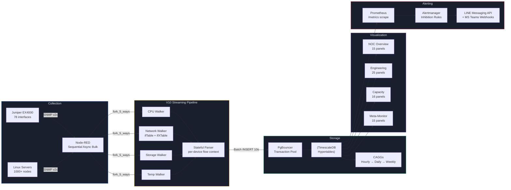

<!-- GLOBAL_NAV -->
<div align="right">
  <a href="README.md"> <b>首页</b></a> &nbsp;|&nbsp;
  <a href="docs/README.md"> <b>文档索引</b></a> &nbsp;|&nbsp; <a href="../README.md">🌐 <b>English</b></a> &nbsp;|&nbsp; <a href="../th/README.md">🇹🇭 <b>ภาษาไทย</b></a> &nbsp;|&nbsp; <a href="README.md">🇨🇳 <b>中文</b></a>
</div>
<br/>

<div align="center">
  <br/>
  <a href="https://github.com/PATTANAKORN025/IMS">
    
    
  </a>
  <br/>
   &nbsp;&nbsp;&nbsp;&nbsp;
   &nbsp;&nbsp;&nbsp;&nbsp;
   &nbsp;&nbsp;&nbsp;&nbsp;
   &nbsp;&nbsp;&nbsp;&nbsp;
   &nbsp;&nbsp;&nbsp;&nbsp;
   &nbsp;&nbsp;&nbsp;&nbsp;
  
  <br/>
  <br/>
</div>

<h1 align="center">工业监控系统 (IMS)</h1>

<div align="center">
 <p>
  <a href="README.md"> <b>English</b></a> |
  <a href="../th/README.md"> <b>ไทย</b></a> |
  <a href="README.md"> <b>中文</b></a>
 </p>
</div>

<div align="center">
 <strong>高精度制造遥测与统计过程控制</strong>
</div>

<br/>

> **目标受众：** 开源社区、系统评估人员、部署工程师。
> **目标：** IMS 代码库的主要入口，概述功能、架构和部署步骤。
> **出处：** 架构和功能已针对 2026-08-10 的实时系统进行了更新和验证。

<div align="center">
  
  <br/>
  <br/>
  <a href="https://git.io/typing-svg"></a>
</div>

<div align="center">
  <a href="#quick-start"></a>
  <a href="LICENSE"></a>
  <a href="https://www.docker.com/"></a>
  <a href="https://grafana.com/"></a>
  <a href="https://nodered.org/"></a>
  <a href="https://www.timescale.com/"></a>
  <br>
  <a href="#quick-start"></a>
  <a href="#quick-start"></a>
  <a href="data-generators"></a>
</div>

<br/>

<div align="center" justify-content="space-between">
  <a href="docs/architecture/IMS_PLATFORM_BOOK.md"></a>
  <a href="docs/architecture/ARCHITECTURE.md"></a>
</div>

<br/>

## 系统概述

**IMS (工业监控系统)** 弥合了高精度制造与企业 IT 之间的差距。它是一个建立在 Node-RED、TimescaleDB 和 Grafana 基础上的遥测监控平台，将 IT 基础架构指标与 OT (操作技术) 数据整合到一个由 PostgreSQL 支持的统一存储库中。

**工厂基层的现实 (OT)：** 在高级 PCB 制造中，激光直接成像 (LDI) 机器需要零延迟决策。激光温度或真空压力的变化会立即导致配准错误，产生昂贵的废料。操作员需要即时、颜色编码的安灯看板，以便在统计过程控制 (SPC) 限制（如 Cpk）降至可接受的阈值以下时停止生产线。

**IT/OT 融合：** IMS 通过将传统的 IT 严谨性与 OT 现实结合起来提供这种可视性。它与 LDI 机器遥测并排监控 1,000 多个基础架构节点（服务器、网络交换机、摄取延迟）的健康状况。当 LDI 对齐失败时，工程师可以使用相同的单一管理视图立即将其与网络中断或服务器 CPU 峰值相关联。

**架构 (IT)：** 在底层，性能由管理异步数据摄取的有状态 Node-RED 管道和处理连接池的 PgBouncer 驱动。TimescaleDB 承担繁重的工作 — 即时计算滚动 3&sigma; 基线 (Z-Scores) 和连续聚合，确保 Grafana 即使在查询数百万行历史遥测数据时也能呈现亚秒级仪表板。

<table style="border:none; border-collapse:collapse; width:100%;">

<tr>
<td align="center" style="border:none; padding:8px; width:33%;">
 <br/>
 <sub><b>NOC 概览</b> — 舰队健康封套</sub>
</td>
<td align="center" style="border:none; padding:8px; width:33%;">
 <br/>
 <sub><b>工程下钻</b> — 单机诊断</sub>
</td>
<td align="center" style="border:none; padding:8px; width:33%;">
 <br/>
 <sub><b>容量规划</b> — 预测性预测</sub>
</td>
</tr>
<tr>
<td align="center" style="border:none; padding:8px; width:33%;">
 <br/>
 <sub><b>LDI 制造</b> — 监控中心</sub>
</td>
<td align="center" style="border:none; padding:8px; width:33%;">
 <br/>
 <sub><b>LDI 安灯板</b> — 操作员车间视图</sub>
</td>
<td align="center" style="border:none; padding:8px; width:33%;">
 <br/>
 <sub><b>LDI 工程</b> — 良率与 SPC 分析</sub>
</td>
</tr>
</table>

>  **探索生态系统：** 查看完整的 [15-仪表板宏观到微观架构指南](docs/product/DASHBOARD_ECOSYSTEM.md) 以深入了解 IMS 如何从高层级业务指标扩展到传感器级诊断数据。

<br/>

---

## 核心功能

<table>
<tr>
<td align="center" width="33%">
 <h3>遥测数据摄取</h3>
 并行 Node-RED walkers 利用顺序批量 SNMP 轮询和 HTTP 端点，通过 PgBouncer 事务池将数据持久化到 TimescaleDB。<br/><br/>
 **已验证：** [nodered-ingestion-20260813.txt](docs/evidence/runtime/nodered-ingestion-20260813.txt)
</td>
<td align="center" width="33%">
 <h3>统计过程控制 (SPC)</h3>
 实时 SPC 指标 (Cpk) 和滚动 3&sigma; 基线 (Z-Score 异常检测) 在数据库级别进行评估，以发出预警。
</td>
<td align="center" width="33%">
 <h3>连续聚合</h3>
 由 TimescaleDB 自动计算每小时、每天和每周的汇总，以便在较长时间范围内保持 Grafana 亚秒级的呈现时间。<br/><br/>
 **已验证：** [cagg-policies-20260813.txt](docs/evidence/runtime/cagg-policies-20260813.txt)
</td>
</tr>
</table>

<br/>

---

## 快速入门（两种路径）

> [!NOTE]
> **模拟器边界：** 两种路径都使用内置的 SNMP/HTTP 数据模拟器 (`ims-snmpsim`) 在本地运行 IMS 堆栈。它们 **不** 连接到真实的工厂设备或外部网络设备。模拟器生成用于验证的真实、有界遥测和警报序列。

根据您的角色和要实现的目标选择路径：

### 路径 A：评估人员之旅（UI 和工作流程）

_专为想要了解仪表板实际运行情况的经理、UI/UX 审阅人员和系统评估人员而设计。_

```bash
git clone https://github.com/PATTANAKORN025/IMS.git
cd IMS
cp .env.example .env
make up      # docker compose up -d (使用模拟器启动堆栈)
sleep 40 && make verify
open http://localhost:3000
```

> **期待什么：** 温和的模拟（约 10-15 行/分钟），让您点击 LDI 制造指挥中心，查看操作员安灯板，并查看实时 Cpk 能力图表。
> **已验证：** `docker compose ps` 在 2026-08-13 的结果，存档在 [`docs/evidence/runtime/compose-ps-20260813.txt`](docs/evidence/runtime/compose-ps-20260813.txt) 中。

### 路径 B：性能试验场（压力测试）

_专为想要验证系统在极端 IT/OT 负载下实际性能的 SRE、DBA 和架构师而设计。_

```bash
git clone https://github.com/PATTANAKORN025/IMS.git
cd IMS
cp .env.example .env
make up-prod   # 以生产级资源分配启动堆栈
make test-load # 触发 K6 压力测试框架
```

> **期待什么：** K6 框架将模拟 1,000 个节点的基础架构环境，冲击 Node-RED 摄取端点并测试 TimescaleDB 的连续聚合极限。您可以在 `IMS Meta-Monitoring` 仪表板上实时监控摄取延迟和 PgBouncer 队列深度。

<details>
<summary><b>已知限制与手动配置</b></summary>

- Nginx 反向代理配置为 `localhost`，需要手动为生产环境部署证书。
- Grafana Alertmanager 集成 (LINE/Teams) 将默认无声失败，除非在 `.env` 文件中提供显式的令牌。

</details>

### 验证和证据

每一项架构声明都有持续集成或明确的测试脚本作为后盾。有关负载测试结果、视觉回归证据和灾难恢复验证，请参阅 **[证据索引](docs/evidence/INDEX.md)**。

<details>
<summary><b>可用命令</b></summary>

| 命令                         | 描述                                                         |
| -------------------------- | ----------------------------------------------------------- |
| `make up`                  | 启动所有服务（带 SNMP 模拟器的开发模式）                        |
| `make down`                | 停止所有服务                                                 |
| `make verify`              | 全面系统运行状况检查（容器、数据库、管道、警报）                    |
| `make test-unit`           | 运行单元测试（18 个解析器 + 计数器测试）                           |
| `make test-load`           | 运行 K6 管道压力测试（50→200 VUs）                              |
| `make test-visual`         | 通过 Playwright 捕获仪表板屏幕截图                              |
| `make validate-dashboards` | 检查仪表板 JSON 中网格重叠 + 十六进制损坏                          |
| `make backup`              | 数据库备份                                                   |

</details>

---

## 架构



<details>
<summary><b>数据流 — 分步说明</b></summary>

1. **Collection** — Node-RED 每 10 秒为网络交换机 (CPU, Storage, Network, Temp) 生成 4 个 walker 并在服务器 (+LDI) 生成 5 个 walker。设备注册表每 5 分钟从 `public.devices` 加载一次。
2. **Walking** — 顺序异步批量拉取（带有 `maxRepetitions: 50` 的 `session.subtree`）。单个 UDP 套接字消除交换机级别的丢包现象。断路器在 2 次失败后跳闸并自动进行 HALF_OPEN 探测。
3. **Parsing** — `sre_parser` 在流上下文中维护每个设备的状态（`dev_state_<deviceId>`），并在 `batch_buf_<deviceId>` 中缓冲数据行。脱机检测（`_walker: "offline"`）会在设备发生故障时立即将所有指标清零。
4. **Storage** — 基于计时器独立刷新：每种表类型 (sys/net/ldi) 只有当缓冲中存在数据时才插入。部分 walker 的失败不会阻塞不相关的数据写入。
5. **Continuous Aggregation** — 连续聚合 (CAGG)，每小时更新一次（每 30 分钟刷新），每日/每周 CAGG 由每小时汇总而来。实时数据保留策略（通过运行数据库核实，而不是迁移历史——详见 `docs/architecture/DATA_RETENTION.md`以了解两者间的漂移记录）：原始数据 `sys_metrics`/`net_metrics`/`ldi_metrics` 保留 30 天，`ldi_data` 保留 180 天，每小时汇总保留 2 年。
6. **Visualization** — 涵盖 2 大领域的 15 个仪表盘：5 个基础架构（NOC概览、工程下钻、AIOps与容量、元监控、采集延迟）+ 10 个制造端（简单概览、LDI 制造、操作员安灯、警报控制台、警报词典、警报响应 (MTTA/MTTR)、工程分析与 SPC、机器快照、数据就绪情况、工厂数字孪生）。
7. **Alerting** — Prometheus 抓取 `/metrics`，Alertmanager 路由至 LINE Messaging API + MS Teams 并附带运行手册链接（真实的推送需要运维人员配置凭证，系统默认不提供）。Z-Score 异常通过基于 TimescaleDB 的 Grafana SQL 进行。

</details>

<details>
<summary><b>仪表板架构</b></summary>

15 个仪表板 — 5 个基础架构，10 个制造 (`monitoring/grafana/dashboards/{infrastructure,manufacturing}/`，分配在不同的 Grafana 文件夹中 — 有关域边界，请参阅 **[所有权](docs/architecture/OWNERSHIP.md)**)。包含面板计数和描述的完整表格：**[仪表板清单](docs/architecture/DASHBOARD_INVENTORY.md)** — 从仪表板 JSON 本身自动生成 (`node scripts/generate-dashboard-inventory.js`)，经过 CI 检查，因此它不能像手动输入的表格那样无声地偏离真实的仪表板。

**设计系统：** 赛博朋克 HUD — `#030407` 背景，Tailwind 调色板 (`#10B981` 健康，`#F59E0B` 警告，`#EF4444` 关键，`#3B82F6` 重点)，用于统计值的 Roboto Mono，拟物化玻璃面板，Grid-24 无重叠布局。

</details>

---

## NOC 墙面显示

```bash
export GRAFANA_API_KEY="your-admin-api-key"
./scripts/create-playlist.sh http://localhost:3000 "$GRAFANA_API_KEY" 30
open "http://localhost:3000/playlists/play/1?kiosk=tv&autofitpanels"
```

| 模式         | URL                       | 用例                                              |
| ------------ | ------------------------- | ----------------------------------------------------- |
| **TV Kiosk** | `?kiosk=tv&autofitpanels` | NOC 墙面显示 — 隐藏所有 chrome，自动适合面板 |
| **Clean**    | `?kiosk`                  | 演示模式 — 隐藏侧边栏 + 顶部导航            |
| **Embedded** | `?kiosk=1`                | iframe 嵌入 — 隐藏所有内容                   |

---

<details>
<summary><b>技术栈</b></summary>

| 层             | 技术                | 目的                                                                       |
| ----------------- | ------------------------- | ----------------------------------------------------------------------------- |
| **编排** | Docker Compose            | 7 服务容器堆栈与 dev/prod 覆盖层                              |
| **采集**    | Node-RED + net-snmp       | 顺序异步批量 SNMP 遍历，5 线程并行 walker                    |
| **数据库**      | TimescaleDB (PostgreSQL)  | 带有 CAGGs 的 Hypertables，7天后 90% 的压缩率              |
| **可视化** | Grafana 13.1.1            | 15 个仪表板（5 个基础架构 + 10 个制造），状态时间线异常 |
| **警报**      | Prometheus + Alertmanager | 指标抓取，抑制规则，LINE Messaging API + MS Teams webhooks     |
| **负载测试**  | K6                        | 管道压力测试 (50→200 VUs)，阈值 p95<500ms                             |
| **SLA 探测**   | Blackbox Exporter         | HTTP/TCP/ICMP 端点监控                                             |

</details>

<details>
<summary><b>数据库模式</b></summary>

- `devices` — 设备注册表，SNMP 轮询基础架构和 LDI 机器的单一事实来源 (`device_type`)
- `sys_metrics` / `net_metrics` — 基础架构遥测（CPU/RAM/磁盘/温度，每接口 RX/TX），hypertables
- `ldi_metrics` — 传统制造吞吐量/PE/JE/湿度/功率/振动，hypertable
- `ldi_data` / `ldi_alarm_log` — V2 规范化 LDI 遥测 + 警报，通过 `related_log_id` 进行精确事件 RCA 连接，hypertables
- `sys_hourly` / `net_hourly` / `ldi_hourly` / `ldi_data_1m` / `ldi_data_15m` / `ldi_data_1h` / `ldi_data_hourly` — 连续聚合
- `v_machine_spc_fleet` / `v_ldi_rca_recent_window` / `v_ldi_rca_truth_test` — 物化视图，每 60 秒刷新一次

精确的列数、完整的视图/CAGG 列表和应用的迁移计数：**[数据库模式清单](docs/architecture/DATABASE_SCHEMA.md)** — 从 `information_schema` + `timescaledb_information.*` (`node scripts/generate-schema-inventory.js`) 自动生成，在实时数据库中通过 CI 检查。

</details>

<details>
<summary><b>项目结构</b></summary>

```text
IMS/
├── monitoring/grafana/        # Grafana 仪表板 + 配置
│  ├── dashboards/          #  10 个 JSON 仪表板文件（真实数据源）
│  └── library-panels/        #  共享库面板（舰队健康评分）
├── nodered_data/           # Node-RED 管道引擎
│  ├── flows/             #  ingestion.json + alerting.json（源）
│  ├── lib/              #  circuit-breaker.js，解析器，units.js
│  └── settings.js          #  functionGlobalContext，身份验证配置
├── postgres/             # 数据库初始化
│  └── init/             #  001-init-timescaledb.sql（模式 + 视图）
├── database/migrations/        #  57 个序列迁移文件（013-082，跳过/存档了一些数字），由 db-migrate 应用
├── tests/               # 测试套件
│  ├── k6/              #  K6 管道压力测试
│  ├── unit/             #  解析器和计数器单元测试
│  └── playwright/          #  视觉回归 + 屏幕截图捕获
├── scripts/              # 运行脚本
│  ├── create-playlist.sh       #  NOC 墙面显示播放列表创建器
│  ├── generate-showcase.sh      #  仪表板屏幕截图生成器
│  ├── snmp-discover.js        #  企业 SNMP OID 发现
│  └── build-flows.js         #  合并 nodered_data/flows/*.json → flows.json（也供 CI 使用）
├── assets/              # 仪表板屏幕截图（自动生成）
├── docs/               # 架构，设计系统，故障排除
│  ├── architecture/         #  ARCHITECTURE.md，GRAFANA_DESIGN_SYSTEM.md
│  ├── operations/          #  TROUBLESHOOTING.md，SCALING_PLAN.md
│  ├── audits/            #  审计报告和技术汇报
│  └── product/            #  PRODUCT.md，ONBOARDING_SCRIPT.md
└── .mimocode/skills/         # 用于 DevOps 自动化的 24 个自定义技能
```

</details>

---

## 文档与社区

<div align="center">

###  执行层与业务策略

|                                 文档                                 | 描述                                                             |
| :----------------------------------------------------------------------: | ----------------------------------------------------------------------- |
|     [**业务价值与 ROI**](docs/business/BUSINESS_VALUE_ROI.md)      | 执行摘要，成本节约，MTTR 减少，及战略影响   |
| [**平台手册 (从这里开始)**](docs/architecture/IMS_PLATFORM_BOOK.md) | 全套文档的导航枢纽，术语表 |
|              [**产品背景**](docs/product/PRODUCT.md)              | 产品目的，目标受众，及产品定位                       |

###  制造与 LDI 智能

|                                       文档                                        | 描述                                                            |
| :-----------------------------------------------------------------------------------: | ---------------------------------------------------------------------- |
| [**制造平台计划**](docs/architecture/IMS_MANUFACTURING_PLATFORM_V2.md) | 基础架构/制造领域分离，验证/浸泡/灾难恢复上线计划 |
|         [**制造领域**](docs/architecture/MANUFACTURING_DOMAIN.md)         | LDI 模式/仪表板模式及上线流程                   |
|                [**LDI SPC 指南**](docs/architecture/LDI_SPC_GUIDE.md)                | 过程能力 (Cpk) 方法和公式                       |
|                [**LDI RCA 指南**](docs/architecture/LDI_RCA_GUIDE.md)                | 根本原因相关性 (提升度/置信度) 方法                   |
|       [**LDI 验证协议**](docs/operations/LDI_VALIDATION_PROTOCOL.md)       | 4 阶段生产签收程序                                  |

###  核心架构与安全

|                                 文档                                 | 描述                                                 |
| :----------------------------------------------------------------------: | ----------------------------------------------------------- |
|          [**架构**](docs/architecture/ARCHITECTURE.md)           | 系统上下文，ADRs，流式架构，CAGG 策略 |
|   [**可视化架构**](docs/architecture/ARCHITECTURE_DIAGRAM.md)   | Mermaid C4 模型图和序列流                |
|             [**数据流**](docs/architecture/DATA_FLOW.md)              | 端到端管道图，实际的 CAGG 汇总链    |
|       [**数据库模式**](docs/architecture/DATABASE_SCHEMA.md)        | 自动生成的表/列/视图参考 (经过 CI 检查)     |
|        [**安全模型**](docs/architecture/SECURITY_MODEL.md)         | 信任边界，每个适配器的身份验证，及 RBAC      |
| [**设备集成 (EAP)**](docs/architecture/EAP_ARCHITECTURE.md) | SNMP、HTTP/JSON 和 SECS/GEM 适配器约定             |
|             [**所有权**](docs/architecture/OWNERSHIP.md)              | 通过 `CODEOWNERS` 强制执行域边界                 |
|     [**设计系统**](docs/architecture/GRAFANA_DESIGN_SYSTEM.md)      | 语义调色板，排版，阈值约定     |
|   [**仪表板清单**](docs/architecture/DASHBOARD_INVENTORY.md)    | 自动生成的仪表板/面板计数表 (经过 CI 检查)     |

### 运营与 SRE 手册

|                               文档                                | 描述                                                     |
| :-------------------------------------------------------------------: | --------------------------------------------------------------- |
|              [**用户手册**](docs/user/USER_MANUAL.md)              | 仪表板指南，指标参考，警报响应手册     |
|            [**管理员手册**](docs/admin/ADMIN_MANUAL.md)             | 容器操作，设备注册，迁移，备份/恢复 |
|          [**操作员 SOP**](docs/operations/SOP_OPERATOR.md)          | 工厂车间 / 1 级 NOC 的标准操作程序   |
|   [**故障排除和警报**](docs/operations/ALARM_PLAYBOOK.md)   | 警报代码解析和故障排除手册              |
|     [**事件响应**](docs/operations/INCIDENT_RESPONSE.md)     | 严重性框架 + 实际发生的事件示例              |
| [**警报严重性指南**](docs/architecture/ALARM_SEVERITY_GUIDE.md) | 4 级严重性分类，ISA-18.2 范围                    |
|       [**备份和恢复**](docs/operations/BACKUP_RESTORE.md)       | 真实的 dr-test.sh 证据，程序和注意事项                |
|          [**灾难恢复测试计划**](docs/operations/DR_TEST_PLAN.md)          | 3 次演习的灾难恢复测试计划                             |
|       [**数据保留**](docs/architecture/DATA_RETENTION.md)       | 实时保留/压缩策略                               |
|     [**发布检查清单**](docs/operations/RELEASE_CHECKLIST.md)     | 标记发布版本前需要验证的内容                         |
|       [**故障排除**](docs/operations/TROUBLESHOOTING.md)       | 常见问题，调试命令，恢复程序          |

###  社区与参考

|                             文档                             | 描述                                               |
| :--------------------------------------------------------------: | --------------------------------------------------------- |
| [**视频入门脚本**](docs/product/ONBOARDING_SCRIPT.md) | 录制入门 GIF/视频的故事板和指南 |
|               [**贡献**](CONTRIBUTING.md)                | 开发工作流程，分支命名，提交约定   |
|            [**行为准则**](CODE_OF_CONDUCT.md)             | 社区标准和执行                       |
|                [**安全策略**](SECURITY.md)                | 漏洞报告                                   |
|      [**错误报告**](.github/ISSUE_TEMPLATE/bug_report.md)      | 报告错误或退化                                |
| [**功能请求**](.github/ISSUE_TEMPLATE/feature_request.md) | 建议新功能                                     |

</div>

---

<div align="center">

**以精密制造。为正常运行而设计。**

[MIT License](LICENSE) — 2026 IMS 贡献者

</div>
