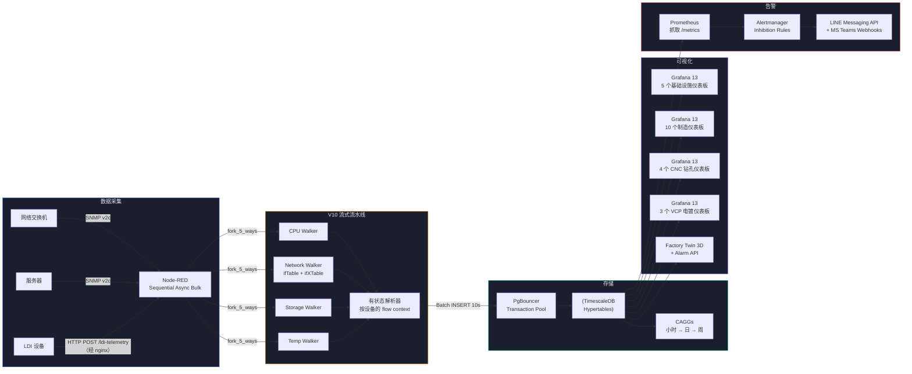

<!-- GLOBAL_NAV -->
<div align="right">
  <a href="README.md"> <b>首页</b></a> &nbsp;|&nbsp;
  <a href="docs/README.md"> <b>文档索引</b></a>
</div>
<br/>

<div align="center">
  <br/>
  <a href="https://github.com/PATTANAKORN025/IMS">
    
  </a>
  <br/><br/>
   &nbsp;&nbsp;&nbsp;&nbsp;
   &nbsp;&nbsp;&nbsp;&nbsp;
   &nbsp;&nbsp;&nbsp;&nbsp;
   &nbsp;&nbsp;&nbsp;&nbsp;
   &nbsp;&nbsp;&nbsp;&nbsp;
   &nbsp;&nbsp;&nbsp;&nbsp;
  
  <br/>
  <br/>
</div>

<h1 align="center">工业监控系统 (IMS)</h1>

<div align="center">
 <p>
  <a href="../README.md"> <b>English</b></a> |
  <a href="../th/README.md"> <b>ไทย</b></a> |
  <a href="README.md"> <b>简体中文</b></a>
 </p>
</div>

<div align="center">
 <strong>高精度制造遥测与统计过程控制 (SPC)</strong>
</div>

<br/>

> **读者：** 开源社区、系统评估人员、部署工程师。
> **目的：** IMS 代码库的主要入口，概述功能、架构与部署步骤。
> **依据：** 架构、版本与命令已于 2026-09-26 对照代码仓库（合并 PR #22/#23 之后的 `main`）重新核实；运行时证据链接各自标注采集日期。

<div align="center">
  
  <br/>
  <br/>
  <a href="https://git.io/typing-svg"></a>
</div>

<div align="center">
  <a href="#快速开始两条路径"></a>
  <a href="../LICENSE"></a>
  <a href="https://www.docker.com/"></a>
  <a href="https://grafana.com/"></a>
  <a href="https://nodered.org/"></a>
  <a href="https://www.timescale.com/"></a>
  <br>
  <a href="#验证与证据"></a>
  <a href="#快速开始两条路径"></a>
  <a href="../data-generators"></a>
</div>

<br/>

<div align="center" justify-content="space-between">
  <a href="docs/architecture/IMS_PLATFORM_BOOK.md"></a>
  <a href="docs/architecture/ARCHITECTURE.md"></a>
</div>

<br/>

## 系统概述

**IMS（工业监控系统）** 连接高精度制造与企业 IT。它是基于 Node-RED、TimescaleDB 与 Grafana 构建的遥测监控平台，将 IT 基础设施指标与 OT（运营技术）数据汇集到同一个 PostgreSQL 数据库中。

**工厂现场（OT）：** 在先进 PCB 制造中，激光直接成像（LDI）设备需要即时决策。激光温度或真空吸附压力的细微变化，都可能立刻造成图形对位偏差（registration error），产生高成本报废。操作员需要以颜色区分状态的安灯（Andon）看板，以便在 Cpk 等统计过程控制（SPC）指标低于可接受阈值时停线。

**IT/OT 融合：** IMS 将 IT 的工程规范带入 OT 场景：在监控基础设施健康状况（服务器、网络交换机、数据接入延迟）的同时监控 LDI 设备遥测；其接入链路已通过 K6 对模拟设备群进行负载测试（默认 100 台服务器，可调整）。当 LDI 对位异常时，工程师可在同一视图中立即与网络中断或服务器 CPU 飙升进行关联分析。

**架构（IT）：** 性能来自有状态的 Node-RED 流水线（异步接入数据）与负责连接池的 PgBouncer；TimescaleDB 承担繁重计算，包括滚动 3&sigma; 基线（Z-Score）与连续聚合 (Continuous Aggregates)，即使查询数百万行历史遥测，Grafana 也能在亚秒级内完成渲染。


<table style="border:none; border-collapse:collapse; width:100%;">

<tr>
<td align="center" style="border:none; padding:8px; width:33%;">
 <br/>
 <sub><b>NOC Overview</b> — 设备群健康总览</sub>
</td>
<td align="center" style="border:none; padding:8px; width:33%;">
 <br/>
 <sub><b>Engineering Drill-Down</b> — 单机诊断</sub>
</td>
<td align="center" style="border:none; padding:8px; width:33%;">
 <br/>
 <sub><b>Capacity Planning</b> — 容量预测</sub>
</td>
</tr>
<tr>
<td align="center" style="border:none; padding:8px; width:33%;">
 <br/>
 <sub><b>LDI Manufacturing</b> — 生产指挥中心</sub>
</td>
<td align="center" style="border:none; padding:8px; width:33%;">
 <br/>
 <sub><b>LDI Andon Board</b> — 产线操作员视图</sub>
</td>
<td align="center" style="border:none; padding:8px; width:33%;">
 <br/>
 <sub><b>LDI Engineering</b> — 良率与 SPC 分析</sub>
</td>
</tr>
</table>

>  **了解整体生态：** 阅读 [22 个仪表板从宏观到微观的架构指南](docs/product/DASHBOARD_ECOSYSTEM.md)，了解 IMS 如何在 4 个运营领域（基础设施、LDI、钻孔、VCP）从管理层业务指标一路下钻到传感器级诊断数据。

<br/>

---

## 核心能力

<table>
<tr>
<td align="center" width="33%">
 <h3>遥测接入</h3>
 并行的 Node-RED walker 以顺序批量方式轮询 SNMP，并提供 HTTP 接入端点，经 PgBouncer 事务连接池写入 TimescaleDB。<br/><br/>
 **证据：** [nodered-ingestion-20260813.txt](../docs/evidence/runtime/nodered-ingestion-20260813.txt)
</td>
<td align="center" width="33%">
 <h3>统计过程控制 (SPC)</h3>
 实时 SPC 指标（Cpk）与滚动 3&sigma; 基线（Z-Score 异常检测）在数据库层计算，用于提前预警。
</td>
<td align="center" width="33%">
 <h3>连续聚合 (Continuous Aggregates)</h3>
 TimescaleDB 自动计算小时、日、周汇总，确保 Grafana 在大时间范围内仍能亚秒级渲染。<br/><br/>
 **证据：** [cagg-policies-20260813.txt](../docs/evidence/runtime/cagg-policies-20260813.txt)
</td>
</tr>
</table>

<br/>

---

## 快速开始（两条路径）

> [!NOTE]
> **模拟器边界：** 两条路径都在本地运行 IMS，并使用内置的 SNMP/HTTP 数据模拟器（`ims-snmpsim`），**不会**连接真实工厂设备或外部网络设备。模拟器生成真实感强且有界的遥测与告警序列，用于验证。

请按角色与目标选择路径：

### 路径 A：评估者导览（UI 与工作流）

_面向希望实际查看仪表板运行效果的经理、UI/UX 评审人员与系统评估人员。_

```bash
git clone https://github.com/PATTANAKORN025/IMS.git
cd IMS
cp .env.example .env   # 首次启动前替换其中的每一个密钥值（见下文）
make up                # build-flows + docker compose up -d（全部 15 个服务，含模拟器）
sleep 40 && make verify
# 浏览 http://localhost:3000（nginx 统一入口；Grafana 不直接发布端口）
```

> [!WARNING]
> `.env.example` 中的值是公开的。除一次性试用的笔记本外，任何环境首次启动前都必须为 `.env` 中的每个密码、令牌与密钥生成新值（`POSTGRES_PASSWORD`、`GRAFANA_ADMIN_PASSWORD`、`GRAFANA_DB_PASSWORD`、`ALARM_API_DB_PASSWORD`、`INGEST_API_KEY`、`ALERT_WEBHOOK_TOKEN`、`NODE_RED_CREDENTIAL_SECRET`、`NODE_RED_ADMIN_PASSWORD_HASH`、`PGADMIN_DEFAULT_PASSWORD`、`GRAFANA_RENDERER_TOKEN`）。详见 [SECURITY.md](SECURITY.md)。

> **预期效果：** 温和的模拟数据流（约 10–15 行/分钟），可浏览 LDI Manufacturing Command Center、Operator Andon Board 以及实时 Cpk 能力图。
> **证据：** 2026-08-13 的 `docker compose ps`，存档于 [`docs/evidence/runtime/compose-ps-20260813.txt`](../docs/evidence/runtime/compose-ps-20260813.txt)。

### 路径 B：性能验证场（压力测试）

_面向希望在高强度 IT/OT 负载下验证系统真实性能的 SRE、DBA 与架构师。_

```bash
git clone https://github.com/PATTANAKORN025/IMS.git
cd IMS
cp .env.example .env   # 先替换每一个密钥值
make up-prod           # 基础 compose 文件 + docker-compose.prod.yaml 资源限制
make test-load         # k6 run tests/k6/pipeline-stress.js（需要 PATH 中有 k6）
```

> **预期效果：** K6 逐级增加模拟服务器（默认 `TARGET_SERVERS=100`，可通过该环境变量扩大规模）压测 Node-RED 接入端点，通过阈值为 `pipeline_success` 成功率 > 95 %、`e2e_duration` p95 < 10 秒。可在 `IMS Meta-Monitoring` 仪表板上实时观察接入延迟与 PgBouncer 队列深度。

<details>
<summary><b>已知限制与手动配置</b></summary>

- nginx 统一入口使用明文 HTTP（主机端口 `${GRAFANA_PORT:-3000}`，容器端口 80）；生产环境需另行配置 TLS 终止。
- 在 `.env` 中设置 `LINE_CHANNEL_ACCESS_TOKEN`、`LINE_USER_ID` 与 `TEAMS_WEBHOOK_URL` 之前，Alertmanager 不会向 LINE/Teams 发送任何消息。
- 除 nginx 统一入口外，`pgadmin` 是唯一在**所有**网络接口上发布端口（`5050`）的服务；在实验环境之外，请用主机防火墙加以限制，或绑定到 `127.0.0.1`。
- Makefile 混用多种 shell：`backup`、`restore`、`test-load`、`snapshot-flows` 与 `deploy-flows` 需要 POSIX shell（Windows 上使用 Git Bash）；`doctor` 使用 cmd 风格的重定向。

</details>

### 验证与证据

架构层面的结论均有测试脚本与带日期的证据文件支撑。只要仓库可以使用 GitHub Actions，`.github/workflows/ci.yml` 就会运行与 `node scripts/pre-commit.js` 相同的检查，并额外执行 gitleaks、compose 校验与 Prometheus lint。负载测试结果、可视化回归证据与灾难恢复验证，请参阅 **[证据索引](docs/evidence/INDEX.md)**。

<details>
<summary><b>可用命令</b></summary>

| 命令 | 说明 |
| --- | --- |
| `make doctor` | 检查前置条件（docker、compose、node） |
| `make up` | 构建 flows，然后启动全部 15 个服务（含模拟器） |
| `make up-prod` | 同上，并叠加 `docker-compose.prod.yaml` 资源配置 |
| `make down` / `make restart` | 停止整个栈 / 重启 node-red、grafana、alertmanager、prometheus |
| `make logs` | 跟踪 Node-RED 日志 |
| `make verify` | 全面健康检查（容器、数据库、流水线、告警） |
| `make build-flows` / `make validate-flows` | 将 `nodered_data/flows/*.json` 合并为 `flows.json` / 校验其有效性 |
| `make snapshot-flows` / `make deploy-flows` | 备份 `flows.json` / 将拆分的 flows 提交到 Node-RED |
| `make test-unit` | 4 个核心解析器/边界单元测试文件 |
| `make test-load` | K6 流水线压力测试（`TARGET_SERVERS`，默认 100） |
| `make test-visual` / `make test-visual-ldi` | 基于 Playwright 的仪表板截图回归 |
| `make validate-dashboards` | 在仪表板 JSON 中搜索损坏的十六进制颜色码 |
| `make backup` / `make restore FILE=<path>` | 数据库转储 / 恢复 |

完整的提交前检查（全部单元测试、`tests/lint/` 下的 linter、仪表板与 flow 的 JSON 校验）通过 `node scripts/pre-commit.js` 运行。

</details>

---

## 架构


```mermaid
flowchart LR
  subgraph Collection ["数据采集"]
    J["网络交换机"] -->|SNMP v2c| W["Node-RED\nSequential Async Bulk"]
    S["服务器"] -->|SNMP v2c| W
    L["LDI 设备"] -->|"HTTP POST /ldi-telemetry（经 nginx）"| W
  end

  subgraph Processing ["V10 流式流水线"]
    W -->|fork_5_ways| CPU[CPU Walker]
    W -->|fork_5_ways| NET["Network Walker\nifTable + ifXTable"]
    W -->|fork_5_ways| STO[Storage Walker]
    W -->|fork_5_ways| TMP[Temp Walker]
    CPU --> P["有状态解析器\n按设备的 flow context"]
    NET --> P
    STO --> P
    TMP --> P
  end

  subgraph Storage ["存储"]
    P -->|Batch INSERT 10s| B["PgBouncer\nTransaction Pool"]
    B --> T["(TimescaleDB\nHypertables)"]
    T --> CAGG["CAGGs\n小时 → 日 → 周"]
  end

  subgraph Visualization ["可视化"]
    T --> G1["Grafana 13\n5 个基础设施仪表板"]
    T --> G2["Grafana 13\n10 个制造仪表板"]
    T --> G3["Grafana 13\n4 个 CNC 钻孔仪表板"]
    T --> G4["Grafana 13\n3 个 VCP 电镀仪表板"]
    T --> FT["Factory Twin 3D\n+ Alarm API"]
  end

  subgraph Alerting ["告警"]
    T --> PR["Prometheus\n抓取 /metrics"]
    PR --> AM["Alertmanager\nInhibition Rules"]
    AM --> WEB["LINE Messaging API\n+ MS Teams Webhooks"]
  end

  style Collection fill:#1a1f2e,stroke:#3B82F6,color:#e2e8f0
  style Processing fill:#1a1f2e,stroke:#F59E0B,color:#e2e8f0
  style Storage fill:#1a1f2e,stroke:#10B981,color:#e2e8f0
  style Visualization fill:#1a1f2e,stroke:#8B5CF6,color:#e2e8f0
  style Alerting fill:#1a1f2e,stroke:#EF4444,color:#e2e8f0
```

<details>
<summary><b>数据流：逐步说明</b></summary>

1. **采集** — 每 30 秒（`Poll Fleet (30s)`），Node-RED 为网络交换机派生 4 个 walker（CPU、Storage、Network、Temp），为服务器派生 5 个（另加 LDI）。设备注册表每 5 分钟从 `public.devices` 重新加载。LDI 设备还会经 nginx 向 `POST /ldi-telemetry` 推送 JSON，并以 `INGEST_API_KEY` 进行认证。
2. **遍历（walk）** — 顺序异步批量遍历（`session.subtree`，`maxRepetitions: 50`），单一 UDP 套接字避免交换机侧丢包。熔断器在连续失败 2 次后断开，并自动以 HALF_OPEN 状态探测恢复。
3. **解析** — `sre_parser` 在 flow context 中保存每台设备的状态（`dev_state_<deviceId>`），并将数据行缓存在 `batch_buf_<deviceId>` 中。设备故障时，离线心跳（`_walker: "offline"`）会立即将所有指标置零。
4. **存储** — 按定时器独立刷写：每类表（sys/net/ldi）仅在自身缓冲区有数据时才执行插入，部分 walker 失败不会阻塞无关数据的写入。
5. **连续聚合** — TimescaleDB 刷新策略的执行间隔从每分钟（`ldi_data_1m`、`ldi_oee_1m`）到每 6 小时（周汇总）不等；基础设施的日、周 CAGG 基于小时 CAGG 汇总（见 [Data Flow](docs/architecture/DATA_FLOW.md)）。实际保留期（对照运行中的数据库核实，而非依据迁移历史——两者之间的偏差记录在 `docs/architecture/DATA_RETENTION.md`）：原始 `sys_metrics`/`net_metrics`/`ldi_metrics` 30 天，`ldi_data` 180 天，小时汇总 2 年。
6. **可视化** — 四个 Grafana 文件夹共 22 个仪表板：01 钻孔（4 个：机群总览、班次产量、单机排查、异常与根因分析），02 LDI（10 个：管理层总览、操作员 Andon、工厂数字孪生、机群指挥中心、单机快照、工程分析与 SPC、告警控制台、告警响应 MTTA/MTTR、告警字典、数据就绪度），03 平台与 NOC（5 个：NOC 总览、工程下钻、AIOps 容量、采集延迟、元监控），04 VCP 电镀（3 个：产线总览、操作控制台、实时墙屏）。
7. **告警** — Prometheus 抓取 `/metrics`，Alertmanager 附带 runbook 链接路由到 LINE Messaging API 与 MS Teams（实际投递需要运维人员自行配置凭据，默认有意不提供）。Z-Score 异常通过 Grafana 对 TimescaleDB 的 SQL 查询计算。

</details>

<details>
<summary><b>仪表板架构</b></summary>

22 个仪表板——4 个钻孔、10 个 LDI 制造、5 个基础设施、3 个 VCP 电镀（`monitoring/grafana/dashboards/{drilling,manufacturing,infrastructure,vcp}/`，每个领域预置到一个 Grafana 文件夹；领域边界见 **[Ownership](docs/architecture/OWNERSHIP.md)**）。钻孔与 VCP 仪表板通过数据源 `drilling-timescaledb` 读取 `eap_backup` 数据库；没有工厂数据时，可加载 **[合成数据](docs/data/MOCK_DATA.md)**。含面板数量与说明的完整表格见 **[Dashboard Inventory](docs/architecture/DASHBOARD_INVENTORY.md)**：该表由仪表板 JSON 自动生成（`node scripts/generate-dashboard-inventory.js`）并经 CI 检查，不会像手工表格那样悄悄偏离真实仪表板。

**设计系统：** Cyberpunk HUD —— `#030407` 背景，Tailwind 调色板（`#22C55E` 正常、`#F59E0B` 警告、`#EF4444` 严重、`#00F2FE` 信息、`#3B82F6` 强调——即 [GRAFANA_DESIGN_SYSTEM.md](docs/architecture/GRAFANA_DESIGN_SYSTEM.md) §2.1 中批准的 token），统计数值使用 Roboto Mono，玻璃拟态面板，Grid-24 无重叠布局。

</details>

---

## NOC 大屏显示

在 **Dashboards → Playlists** 中创建播放列表，并从播放列表页面启动；Grafana 13 会以 kiosk 模式播放每个仪表板。`scripts/create-playlist.sh` 可自动完成此步骤，但仍调用 Grafana 旧版基于 id 的播放列表 API，因此每次升级 Grafana 后都应重新检查。

| 模式 | URL 参数 | 用途 |
| --- | --- | --- |
| **Kiosk** | `?kiosk` | 大屏显示——隐藏导航栏 |
| **Kiosk + 自适应** | `?kiosk&autofitpanels` | 大屏显示——同时按屏幕高度缩放面板 |
| **Operator Andon** | `/d/ims-ldi-operator-andon?kiosk` | 只读的产线看板；需要交互的操作请在 Alarm Console 上完成 |

请使用 `kiosk`：旧的 TV 模式（`kiosk=tv`）不属于 Grafana 13 的 kiosk 选项（本仓库部分仪表板链接中仍带有该值）。

---

<details>
<summary><b>技术栈</b></summary>

| 层级 | 技术 | 用途 |
| --- | --- | --- |
| **编排** | Docker Compose | 15 个服务的栈（`docker-compose.yaml`）+ 生产资源叠加配置 |
| **采集** | Node-RED + net-snmp | 顺序异步批量 SNMP 遍历，5 线程并行 walker |
| **数据库** | TimescaleDB 2.29 (PostgreSQL 16) + PgBouncer 1.25 | Hypertable、CAGG 汇总、原生压缩、保留策略 |
| **可视化** | Grafana 13.1.2 + image renderer | 22 个仪表板（4 个钻孔 + 10 个 LDI + 5 个基础设施 + 3 个 VCP） |
| **告警** | Prometheus + Alertmanager | 指标抓取、抑制规则、LINE Messaging API + MS Teams webhooks |
| **负载测试** | K6 | 流水线压力测试，阈值：成功率 > 95 %、端到端 p95 < 10 秒 |
| **服务** | Node.js 22 (Express) | `alarm-api`（确认/解决写入路径）、`factory-twin-3d`（一楼数字孪生） |
| **统一入口** | nginx 1.27 | 唯一发布的 UI 端口；同源路由至 Grafana、alarm-api、孪生服务与 Node-RED 接入端点 |
| **SLA 探测** | Blackbox Exporter | HTTP/TCP/ICMP 端点监控 |

</details>

<details>
<summary><b>数据库结构</b></summary>

- `devices` —— 设备注册表，SNMP 轮询的基础设施与 LDI 设备（`device_type`）共用的唯一事实来源
- `sys_metrics` / `net_metrics` —— 基础设施遥测（CPU/内存/磁盘/温度、各接口 RX/TX），hypertable
- `ldi_metrics` —— 旧版制造数据（吞吐量/PE/JE/湿度/功率/振动），hypertable
- `ldi_data` / `ldi_alarm_log` —— V2 规范化的 LDI 遥测与告警，通过 `related_log_id` 进行精确事件级 RCA 关联，hypertable
- `sys_hourly` / `net_hourly` / `ldi_hourly` / `ldi_data_1m` / `ldi_data_15m` / `ldi_data_1h` / `ldi_data_hourly` —— 连续聚合 (Continuous Aggregates)
- `v_machine_spc_fleet` / `v_ldi_rca_recent_window` / `v_ldi_rca_truth_test` —— 物化视图，每 60 秒刷新

精确的列数、完整的视图/CAGG 列表以及已应用迁移数量，见 **[Database Schema Inventory](docs/architecture/DATABASE_SCHEMA.md)**：由 `information_schema` + `timescaledb_information.*` 自动生成（`node scripts/generate-schema-inventory.js`），并在 CI 中对照真实数据库检查。

</details>

<details>
<summary><b>项目结构</b></summary>

```text
IMS/
├── docker-compose.yaml         # 15 个服务；docker-compose.prod.yaml 增加资源限制
├── proxy/nginx.conf            # 唯一统一入口（Grafana、alarm-api、孪生服务、LDI 接入）
├── monitoring/
│  ├── grafana/
│  │  ├── dashboards/{drilling,manufacturing,infrastructure,vcp}/  # 预置的 4 + 10 + 5 + 3 个仪表板（事实来源）
│  │  ├── library-panels/        # 共享库面板（Fleet Health Score）
│  │  └── provisioning/, grafana.ini
│  ├── prometheus/, alertmanager/, blackbox/, snmpsim/
├── nodered_data/
│  ├── flows/                  # 5 个拆分的 flow 文件（源文件）；flows.json 为构建产物
│  ├── lib/                    # circuit-breaker.js、parser.js、snmp-normalize.js、units.js
│  └── settings.js
├── postgres/init/              # 首次启动的引导 SQL + grafana 密码脚本
├── database/migrations/        # 按编号、仅向前的迁移（最大 086），由 db-migrate 应用
├── services/
│  ├── alarm-api/              # 确认/解决写入路径（Express + pg）
│  └── factory-twin-3d/        # 一楼数字孪生（Express、lib/*.js + public/ 前端查看器）
├── tests/                      # unit/ + lint/（无需基础设施）、e2e/、smoke/、playwright/、k6/ 等
├── scripts/                    # build-flows.js、migrate-entrypoint.sh、verify-deployment.*、备份/恢复、生成器
├── assets/                     # README 截图与横幅
├── docs/                       # 英文文档：architecture/、operations/、user/、admin/、audit/、evidence/ 等
├── th/, zh-CN/                 # 泰文与简体中文文档镜像
└── .agents/skills/             # 供 AI 工具使用的 agent skills
```

</details>

---

## 文档与社区

<div align="center">

###  管理层与业务战略

| 文档 | 说明 |
| :---: | --- |
| [**业务价值与 ROI**](docs/business/BUSINESS_VALUE_ROI.md) | 管理层摘要、成本节约、MTTR 降低与战略影响 |
| [**Platform Book（从这里开始）**](docs/architecture/IMS_PLATFORM_BOOK.md) | 整套文档的导航中心与术语表 |
| [**产品背景**](docs/product/PRODUCT.md) | 产品目的、目标用户与定位 |

###  制造与 LDI 智能

| 文档 | 说明 |
| :---: | --- |
| [**制造平台规划**](docs/architecture/IMS_MANUFACTURING_PLATFORM_V2.md) | 基础设施/制造领域分离，验证/浸泡/容灾推进计划 |
| [**制造领域**](docs/architecture/MANUFACTURING_DOMAIN.md) | LDI 的数据结构/仪表板模式与新设备接入流程 |
| [**LDI SPC 指南**](docs/architecture/LDI_SPC_GUIDE.md) | 过程能力（Cpk）方法与公式 |
| [**LDI RCA 指南**](docs/architecture/LDI_RCA_GUIDE.md) | 根因关联（Lift/Confidence）方法 |
| [**LDI 验证规程**](docs/operations/LDI_VALIDATION_PROTOCOL.md) | 四阶段投产签核流程 |

###  核心架构与安全

| 文档 | 说明 |
| :---: | --- |
| [**架构**](docs/architecture/ARCHITECTURE.md) | 系统上下文、ADR、流式架构、CAGG 策略 |
| [**架构图**](docs/architecture/ARCHITECTURE_DIAGRAM.md) | Mermaid C4 模型图与时序图 |
| [**数据流**](docs/architecture/DATA_FLOW.md) | 端到端流水线图与实际使用的 CAGG 汇总链 |
| [**数据库结构**](docs/architecture/DATABASE_SCHEMA.md) | 自动生成的表/列/视图参考（经 CI 检查） |
| [**安全模型**](docs/architecture/SECURITY_MODEL.md) | 信任边界、各适配器认证与 RBAC |
| [**设备集成 (EAP)**](docs/architecture/EAP_ARCHITECTURE.md) | SNMP、HTTP/JSON 与 SECS/GEM 适配器契约 |
| [**归属**](docs/architecture/OWNERSHIP.md) | 通过 `CODEOWNERS` 强制执行的领域边界 |
| [**设计系统**](docs/architecture/GRAFANA_DESIGN_SYSTEM.md) | 语义化配色、排版与阈值约定 |
| [**Dashboard Inventory**](docs/architecture/DASHBOARD_INVENTORY.md) | 自动生成的仪表板/面板数量表（经 CI 检查） |
| [**合成模拟数据 (Mock Data)**](docs/data/MOCK_DATA.md) | 用于钻孔和 VCP 仪表板验证的替代数据生成器 |

### 运维与 SRE 手册

| 文档 | 说明 |
| :---: | --- |
| [**用户手册**](docs/user/USER_MANUAL.md) | 仪表板指南、指标参考、告警响应手册 |
| [**管理员手册**](docs/admin/ADMIN_MANUAL.md) | 容器运维、设备注册、迁移、备份/恢复 |
| [**操作员 SOP**](docs/operations/SOP_OPERATOR.md) | 工厂现场 / 一线 NOC 标准作业程序 |
| [**故障排除与告警**](docs/operations/ALARM_PLAYBOOK.md) | 告警代码处理与故障排除手册 |
| [**事件响应**](docs/operations/INCIDENT_RESPONSE.md) | 严重级别框架与真实事件案例 |
| [**告警严重级别指南**](docs/architecture/ALARM_SEVERITY_GUIDE.md) | 4 级严重级别分类，ISA-18.2 适用范围 |
| [**备份与恢复**](docs/operations/BACKUP_RESTORE.md) | dr-test.sh 实测证据、步骤与注意事项 |
| [**DR 测试计划**](docs/operations/DR_TEST_PLAN.md) | 3 项灾难恢复演练计划 |
| [**数据保留**](docs/architecture/DATA_RETENTION.md) | 实际生效的保留/压缩策略 |
| [**发布检查清单**](docs/operations/RELEASE_CHECKLIST.md) | 打发布标签前需验证的事项 |
| [**故障排除**](docs/operations/TROUBLESHOOTING.md) | 常见问题、调试命令与恢复步骤 |
| [**运维手册（Runbook）**](docs/operations-runbook.md) | 日常栈运维与恢复命令 |
| [**Factory Twin 操作员指南**](docs/architecture/FACTORY_TWIN_OPERATOR_GUIDE.md) | 如何解读一楼数字孪生及其证据状态 |
| [**生产就绪度**](PRODUCTION-READINESS.md) | 发布闸门状态与未关闭风险 |

###  社区与参考

| 文档 | 说明 |
| :---: | --- |
| [**入门视频脚本**](docs/product/ONBOARDING_SCRIPT.md) | 录制入门 GIF/视频的分镜与指南 |
| [**贡献指南**](CONTRIBUTING.md) | 开发流程、分支命名、提交约定 |
| [**行为准则**](CODE_OF_CONDUCT.md) | 社区标准与执行 |
| [**安全策略**](SECURITY.md) | 漏洞报告 |
| [**变更日志**](CHANGELOG.md) | 发布与合并历史 |
| [**缺陷报告**](.github/ISSUE_TEMPLATE/bug_report.md) | 报告缺陷或回归 |
| [**功能请求**](.github/ISSUE_TEMPLATE/feature_request.md) | 建议新功能 |

</div>

---

<div align="center">

**精于制造，久于运行。**

[MIT License](../LICENSE) — 2026 IMS 贡献者

</div>
