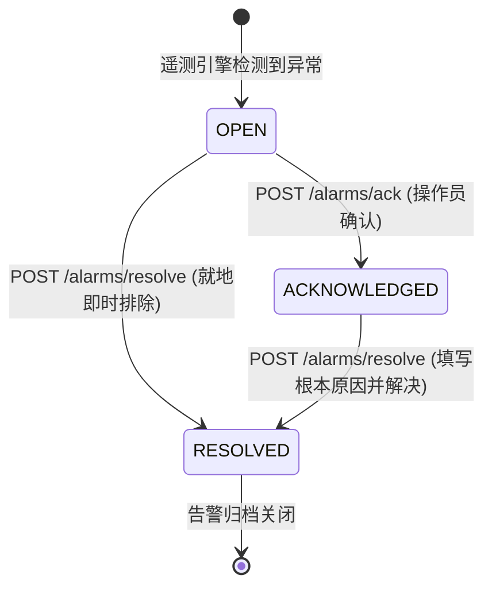

<!-- GLOBAL_NAV -->
<div align="right">
  <a href="../../README.md"> <b>首页</b></a> &nbsp;|&nbsp;
  <a href="../README.md"> <b>文档索引</b></a>
</div>
<br/>

<div align="center">
  <h1>IMS API 参考手册 (API Reference Manual)</h1>
  <p><b>高频工业遥测数据接入、告警全生命周期管理与警报 Webhook 生产级技术规范</b></p>
  <p>
    <a href="../../../docs/api/API_REFERENCE.md">English</a> |
    <a href="../../../th/docs/api/API_REFERENCE.md">ไทย</a> |
    <a href="API_REFERENCE.md">简体中文</a>
  </p>
</div>

---

## 1. 架构总览与网络拓扑 (Architecture & Network Topology)

工业监控系统 (Industrial Monitoring System: IMS) 提供了基于 HTTP、WebSocket 和 SNMP 的多维度集成接口，供车间边缘硬件设备、制造执行系统 (MES)、可编程逻辑控制器 (PLC) 及 NOC 自动化运维脚本接入。

所有来自外部的客户端流量（默认统一接入网关：`http://localhost:3000`）均由高性能 Nginx 反向代理统一调度与终结。网关层负责应用来源 IP 限流策略 (`limit_req zone=grafana_limit rate=100r/s burst=2500 nodelay`)、配置大尺寸客户端请求头缓冲区 (`4 16k`)，并安全路由至隔离的内部容器网络。

```mermaid
flowchart TD
    subgraph External["外部客户端与工业现场"]
        LDI["LDI 制造设备"]
        PLC["车间现场 PLC / 传感器"]
        OPS["NOC 运维与工艺工程师"]
        PROM["Prometheus 监控探针"]
    end

    subgraph FrontDoor["入口统一网关 (端口 3000 / 80)"]
        PROXY["Nginx 反向代理\n(ims-proxy)"]
    end

    subgraph InternalServices["隔离的应用服务网络"]
        NR["Node-RED 接入流水线\n(:1880)"]
        ALARM["告警生命周期服务\n(ims-alarm-api :4000)"]
        GRAFANA["Grafana 可视化平台\n(ims-grafana :3000)"]
        AM["Alertmanager 告警路由\n(ims-alertmanager :9093)"]
        TWIN["3D 数字孪生 POC\n(ims-factory-twin-3d :4100)"]
    end

    subgraph StorageLayer["数据持久化层"]
        PGB["PgBouncer 连接池\n(:6432)"]
        TSDB["TimescaleDB 时序数据库\n(:5432)"]
    end

    LDI -->|POST /ldi-telemetry| PROXY
    PLC -->|POST /inject| PROXY
    OPS -->|POST /alarm-api/alarms/*| PROXY
    PROM -->|POST /alert-webhook| PROXY

    PROXY -->|转发 /ldi-telemetry| NR
    PROXY -->|转发 /inject| NR
    PROXY -->|转发 /alarm-api/* (鉴权校验)| ALARM
    PROXY -->|转发 /api/* 及 UI 界面| GRAFANA
    PROXY -->|转发 /factory-twin-3d/*| TWIN

    PROXY -.->|内部会话鉴权 /auth-check| GRAFANA

    NR -->|批量写入 (Batched INSERT)| PGB
    ALARM -->|更新 ldi_alarm_lifecycle| PGB
    GRAFANA -->|分析查询 / CAGGs| PGB
    PGB --> TSDB
```

### 身份认证与权限隔离机制 (Authentication Models)

IMS 在系统各边界之间采用多层防御的鉴权机制：

1. **接入专用 API 密钥 (`X-API-Key`)**：用于边缘设备向 Node-RED 推送遥测数据 (`/ldi-telemetry`)。该令牌由反向代理或内部流水线校验环境变量密钥 (`INGEST_API_KEY`)。
2. **会话 Cookie 鉴权网关 (`auth_request /auth-check`)**：用于告警状态变更 (`/alarm-api/`) 与数字孪生视图 (`/factory-twin-3d/`)。Nginx 将用户请求头中的 Cookie 转发至 Grafana 的 `/api/user` 验证，未授权会话在网关层直接拦截并返回 `401 Unauthorized`。
3. **数据库最小特权角色隔离**：`alarm-api` 通过 PgBouncer 以专用受限用户 `alarm_api_writer` 连接数据库，权限严格限定在 `public.ldi_alarm_lifecycle` 表的生命周期字段更新。

---

## 2. 遥测数据接入 API (Telemetry Ingestion API)

接收来自 LDI 激光曝光设备的高频制造时序遥测数据。

### `POST /ldi-telemetry`

将结构化的设备运行指标、对位偏移量、曝光剂量以及真空负压传感器读数直接推入 Node-RED 内存缓冲队列，以便批量落盘至 TimescaleDB。

- **网关 URL**: `http://localhost:3000/ldi-telemetry`
- **内部容器直连 URL**: `http://node-red:1880/ldi-telemetry`
- **请求方式**: `POST`
- **请求标头 (Headers)**:
  - `Content-Type: application/json`
  - `X-API-Key: ${INGEST_API_KEY}` (必填)

#### 请求 JSON 架构 (Schema)

```json
{
  "time": "2026-09-28T04:00:00Z",
  "factory": "F1",
  "process": "LDI",
  "eqp_id": "LDI-01",
  "mo": "MO-001234",
  "fpn": "PN-5678",
  "layer_name": "L1",
  "resist_dosage": 45.5,
  "scale_x": 1.002,
  "scale_y": 0.998,
  "temperature": 24.5,
  "humidity": 45.0,
  "scan_speed": 120.0,
  "air_vacuum": -15.2,
  "thickness": 1.2,
  "board_no": 1,
  "total_board": 100,
  "total_time": 450.5,
  "state": true,
  "pe_1": 1.1,
  "je_1": 2.2,
  "log_id": "LOG-10001"
}
```

#### 字段词典 (Field Dictionary)

| 字段名称 | 数据类型 | 必填 | 单位 / 格式 | 说明 |
|:---------|:---------|:-----|:------------|:-----|
| `time` | ISO 8601 字符串 | 是 | UTC 时间戳 | 设备边缘端采集测量的标准 UTC 时间。 |
| `factory` | 字符串 | 是 | 厂区编号 | 工厂或车间标识码（例如 `F1`）。 |
| `process` | 字符串 | 是 | 工序标识 | 制造工序名称（例如 `LDI`、`DRILLING`、`VCP`）。 |
| `eqp_id` | 字符串 | 是 | 机台编号 | 唯一的设备物理标识符（例如 `LDI-01`）。 |
| `mo` | 字符串 | 是 | 字母数字 | 生产制造工单编号 (Manufacturing Order ID)。 |
| `fpn` | 字符串 | 是 | 字母数字 | 产品料号标识 (Factory Part Number)。 |
| `layer_name` | 字符串 | 是 | 字母数字 | PCB 制造板层代号（例如 `L1`、`L2`、`TOP`、`BOT`）。 |
| `resist_dosage` | 浮点数 | 是 | $\text{mJ/cm}^2$ | 干膜光刻胶曝光能量剂量。 |
| `scale_x` | 浮点数 | 是 | 比例 | X 轴光学胀缩补偿系数。 |
| `scale_y` | 浮点数 | 是 | 比例 | Y 轴光学胀缩补偿系数。 |
| `temperature` | 浮点数 | 是 | $^\circ\text{C}$ | 曝光工作室环境温度。 |
| `humidity` | 浮点数 | 是 | $\% \text{RH}$ | 工作室环境相对湿度。 |
| `scan_speed` | 浮点数 | 是 | $\text{mm/s}$ | 激光光学扫描头移动速度。 |
| `air_vacuum` | 浮点数 | 是 | $\text{kPa}$ | 承载工作台气动真空吸附负压值。 |
| `thickness` | 浮点数 | 是 | $\text{mm}$ | PCB 芯板基材厚度。 |
| `board_no` | 整数 | 是 | 计数器 | 当前生产批次内的连续板号。 |
| `total_board` | 整数 | 是 | 数量 | 该工单预计生产的总板数。 |
| `total_time` | 浮点数 | 是 | 秒 | 本批次机台累计有效曝光加工时间。 |
| `state` | 布尔值 | 是 | True/False | 机台运行状态（`true` = 运行中，`false` = 待机/故障）。 |
| `pe_1` | 浮点数 | 选填 | $\mu\text{m}$ | 靶标通道 1 测量对位误差 (Position Error)。 |
| `je_1` | 浮点数 | 选填 | $\mu\text{m}$ | 光学扫描头 1 抖动误差 (Jitter Error)。 |
| `log_id` | 字符串 | 是 | 字母数字 | 用于全链路追踪的唯一日志流水号。 |

#### HTTP 响应代码 (Responses)

- **`202 Accepted`**: 载荷已通过格式校验，并已入列 Node-RED 内存缓冲以待批量入库。
  ```json
  {
    "status": "accepted",
    "timestamp": "2026-09-28T04:00:00.104Z",
    "records_queued": 1
  }
  ```
- **`400 Bad Request`**: JSON 格式错误或缺失必填字段。
  ```json
  {
    "error": "Bad Request",
    "message": "Missing mandatory field 'eqp_id'"
  }
  ```
- **`401 Unauthorized`**: 未提供 API Key 或 `X-API-Key` 令牌无效。
  ```json
  {
    "error": "Unauthorized",
    "message": "Invalid or missing X-API-Key token"
  }
  ```

#### 实时 cURL 调用示例

```bash
curl -X POST http://localhost:3000/ldi-telemetry \
  -H "Content-Type: application/json" \
  -H "X-API-Key: ${INGEST_API_KEY}" \
  -d '{
    "time": "2026-09-28T04:00:00Z",
    "factory": "F1",
    "process": "LDI",
    "eqp_id": "LDI-01",
    "mo": "MO-001234",
    "fpn": "PN-5678",
    "layer_name": "L1",
    "resist_dosage": 45.5,
    "scale_x": 1.002,
    "scale_y": 0.998,
    "temperature": 24.5,
    "humidity": 45.0,
    "scan_speed": 120.0,
    "air_vacuum": -15.2,
    "thickness": 1.2,
    "board_no": 1,
    "total_board": 100,
    "total_time": 450.5,
    "state": true,
    "pe_1": 1.1,
    "je_1": 2.2,
    "log_id": "LOG-10001"
  }'
```

---

## 3. 通用指标接入 API (General Metric Ingestion API)

为非 LDI 辅助制造设备、车间温湿度传感器节点以及自动化测试脚本提供灵活的键值遥测注入。

### `POST /inject`

- **网关 URL**: `http://localhost:3000/inject`
- **内部容器直连 URL**: `http://node-red:1880/inject`
- **请求方式**: `POST`
- **请求标头**: `Content-Type: application/json`

#### 请求有效载荷

```json
{
  "device_id": "SENSOR-ENV-01",
  "metric": "ambient_temperature",
  "value": 23.4,
  "unit": "celsius",
  "timestamp": 1790568000
}
```

#### 响应代码

- **`200 OK`**: 数据已成功接收并送入处理管线。
  ```json
  {
    "status": "ok",
    "received": 1
  }
  ```

#### cURL 调用示例

```bash
curl -X POST http://localhost:3000/inject \
  -H "Content-Type: application/json" \
  -d '{"device_id": "CHILLER-01", "metric": "flow_rate_lpm", "value": 48.2, "timestamp": 1790568000}'
```

---

## 4. 告警全生命周期管理 API (Alarm Lifecycle API)

`alarm-api` 微服务 (`services/alarm-api`) 负责处理持久化在 `public.ldi_alarm_lifecycle` 中的车间告警状态流转。

告警状态遵循严格的确定性有限状态机逻辑：



### 调用权限

`alarm-api` 不发布主机端口，只能通过 nginx 的 `/alarm-api/` 访问，或由内部网络中的其他容器通过 `http://alarm-api:4000` 访问。

每个 ack/resolve 请求都需要 Grafana 会话 cookie，并依次通过两道检查：

1. **nginx** 把 cookie 交给 Grafana 校验（`auth_request` → `/api/user`）。会话缺失或无效时，请求在到达服务之前就返回 **401**。
2. **alarm-api** 再次询问 Grafana，同时调用 `/api/user` 和 `/api/user/orgs`，取得调用者的登录名以及在当前组织中的角色：
   - **Editor** 或 **Admin** 可以写入，Grafana 服务器管理员也可以。
   - **Viewer** 返回 **403**。

写入 `acknowledged_by` / `resolved_by` 的操作人始终是该会话的 Grafana 登录名，请求体中的 `acknowledged_by` 或 `resolved_by` 字段会被忽略。

### `POST /alarm-api/alarms/ack`

确认告警：`OPEN` → `ACKNOWLEDGED`。

- **URL**：`http://<host>:3000/alarm-api/alarms/ack`
- **请求头**：`Content-Type: application/json`、`Cookie: grafana_session=…`

#### 请求体

| 字段 | 类型 | 必填 | 说明 |
|:------|:-----|:---------|:------------|
| `logdate_ms` | Number | 是 | 告警时间，Unix 毫秒时间戳。 |
| `logid` | String | 是 | 告警日志条目标识。 |

```json
{ "logdate_ms": 1790568000000, "logid": "LOG-10001" }
```

#### 响应

- **`200 OK`**：已变为 `ACKNOWLEDGED`；响应体返回该行数据，`acknowledged_by` 为调用者的 Grafana 登录名。
- **`400 Bad Request`**：`{"error": "logdate_ms (number) and logid are required"}`
- **`401 Unauthorized`**：没有有效的 Grafana 会话（由 nginx 返回；直接调用服务时由服务返回）。
- **`403 Forbidden`**：`{"error": "insufficient permission (Viewer role cannot acknowledge/resolve alarms)"}`
- **`404 Not Found`**：找不到与 `logdate_ms` 和 `logid` 对应的生命周期记录。
- **`409 Conflict`**：告警不处于 `OPEN` 状态，例如 `{"error": "cannot transition to ACKNOWLEDGED from current status ACKNOWLEDGED"}`。
- **`500 Internal Error`**：数据库不可达或出现意外错误。

#### cURL 示例

```bash
curl -X POST http://localhost:3000/alarm-api/alarms/ack \
  -H "Content-Type: application/json" \
  -H "Cookie: grafana_session=<your session cookie>" \
  -d '{"logdate_ms": 1790568000000, "logid": "LOG-10001"}'
```

---

### `POST /alarm-api/alarms/resolve`

解决告警：`OPEN` 或 `ACKNOWLEDGED` → `RESOLVED`，可附加备注。

- **URL**：`http://<host>:3000/alarm-api/alarms/resolve`
- **请求头**：`Content-Type: application/json`、`Cookie: grafana_session=…`

#### 请求体

| 字段 | 类型 | 必填 | 说明 |
|:------|:-----|:---------|:------------|
| `logdate_ms` | Number | 是 | 告警时间，Unix 毫秒时间戳。 |
| `logid` | String | 是 | 告警日志条目标识。 |
| `resolution_note` | String | 否 | 根因与纠正措施。 |

```json
{ "logdate_ms": 1790568000000, "logid": "LOG-10001", "resolution_note": "Replaced the chuck filter; vacuum back in range." }
```

#### 响应

状态码与 `ack` 相同。`200` 返回 `status: "RESOLVED"` 的行，`resolved_by` 为调用者的 Grafana 登录名；`409` 表示告警已是 `RESOLVED`。

#### cURL 示例

```bash
curl -X POST http://localhost:3000/alarm-api/alarms/resolve \
  -H "Content-Type: application/json" \
  -H "Cookie: grafana_session=<your session cookie>" \
  -d '{"logdate_ms": 1790568000000, "logid": "LOG-10001", "resolution_note": "Replaced the chuck filter."}'
```

---

### `GET /alarm-api/healthz`

存活与数据库检查（通过连接池执行 `SELECT 1`）。服务本身不要求会话，但 nginx 上的 `/alarm-api/` 仍然需要会话，因此 Docker 健康检查改在容器内部调用它。

- **经 nginx**：`http://<host>:3000/alarm-api/healthz`，需要带 Grafana 会话 cookie
- **容器内部**：`http://127.0.0.1:4000/healthz`（Docker 健康检查调用的地址）；其他容器可使用 `http://alarm-api:4000/healthz`

#### 响应

- **`200 OK`**：`{"status": "ok"}`
- **`503 Service Unavailable`**：`{"status": "db unreachable"}`

```bash
docker exec ims-alarm-api wget -qO- http://127.0.0.1:4000/healthz
```

---

## 5. 警报与通知 Webhook API (Alertmanager API)

允许外部 Prometheus 实例、现场边缘探针或第三方监控网关向 Prometheus Alertmanager 推送告警。

### `POST /api/v2/alerts`

- **网关 URL**: `http://localhost:3000/alert-webhook` (或直连 `http://localhost:9093/api/v2/alerts`)
- **请求方式**: `POST`
- **请求标头**: `Content-Type: application/json`

#### Prometheus Alertmanager v2 标准载荷

```json
[
  {
    "labels": {
      "alertname": "LdiHighLaserDosage",
      "severity": "critical",
      "instance": "LDI-01",
      "process": "LDI",
      "factory": "F1"
    },
    "annotations": {
      "summary": "激光曝光能量超出安全阈值上限",
      "description": "机台 LDI-01 实测光刻胶曝光能量达 48.5 mJ/cm2 (上限值: 46.0 mJ/cm2)，需立即停机检查。"
    },
    "startsAt": "2026-09-28T04:10:00Z",
    "endsAt": "2026-09-28T04:20:00Z",
    "generatorURL": "http://prometheus:9090/graph"
  }
]
```

#### cURL 调用示例

```bash
curl -X POST http://localhost:9093/api/v2/alerts \
  -H "Content-Type: application/json" \
  -d '[
    {
      "labels": {
        "alertname": "LdiVacuumDrop",
        "severity": "warning",
        "instance": "LDI-02",
        "process": "LDI"
      },
      "annotations": {
        "summary": "曝光工作室真空负压跌落",
        "description": "真空负压低于 -12.0 kPa 持续超过 3 分钟。"
      },
      "startsAt": "2026-09-28T04:12:00Z"
    }
  ]'
```

---

## 6. 系统网关与看门狗端点 (Gateway System APIs)

| 端点 (Endpoint) | 协议 | 目标服务 | 说明 |
|:----------------|:-----|:---------|:-----|
| `/api/health` | HTTP GET | Grafana `:3000` | 平台核心健康状态与数据库连通性端点。 |
| `/api/login/ping` | HTTP GET | Grafana `:3000` | 工业大屏与 Kiosk 终端专用的轻量级会话看门狗探针。 |
| `/api/live/ws` | WebSocket | Grafana `:3000` | 用于仪表板亚秒级数据实时刷新的双向流通道。 |
| `/auth-check` | HTTP GET | Grafana `:3000` | Nginx 反向代理内部用于子请求鉴权的会话校验端点。 |

---

## 7. 错误代码排查指南 (Troubleshooting & Error Codes)

| 状态码 | 产生原因 | 诊断与处置步骤 |
|:-------|:---------|:---------------|
| `400 Bad Request` | 请求架构校验失败 | 对照字段词典检查 JSON 键名与数据类型，确保 `logdate_ms` 是纯数值。 |
| `401 Unauthorized` | 鉴权失败 | 检查请求头中的 `X-API-Key`，或确认浏览器中已成功登录 Grafana 会话。 |
| `404 Not Found` | 目标实体不存在 | 检查 `public.ldi_alarm_lifecycle` 表中是否存在对应的 `logid` 与 `logdate`。 |
| `409 Conflict` | 非法状态转换 | 已处于 RESOLVED 状态的告警不可回退至 ACKNOWLEDGED 状态。 |
| `429 Too Many Requests` | 超过网关速率限制 | 客户端请求频率超过 100 次/秒，请降低推送频率或加入指数退避重试。 |
| `502 Bad Gateway` | 上游微服务离线 | 上游容器重建导致 IP 变动，请在网关容器执行 `docker exec ims-proxy nginx -s reload`。 |
| `503 Service Unavailable` | 数据库断开 | PgBouncer 或 TimescaleDB 无法响应，请运行 `make verify` 进行全局巡检。 |
