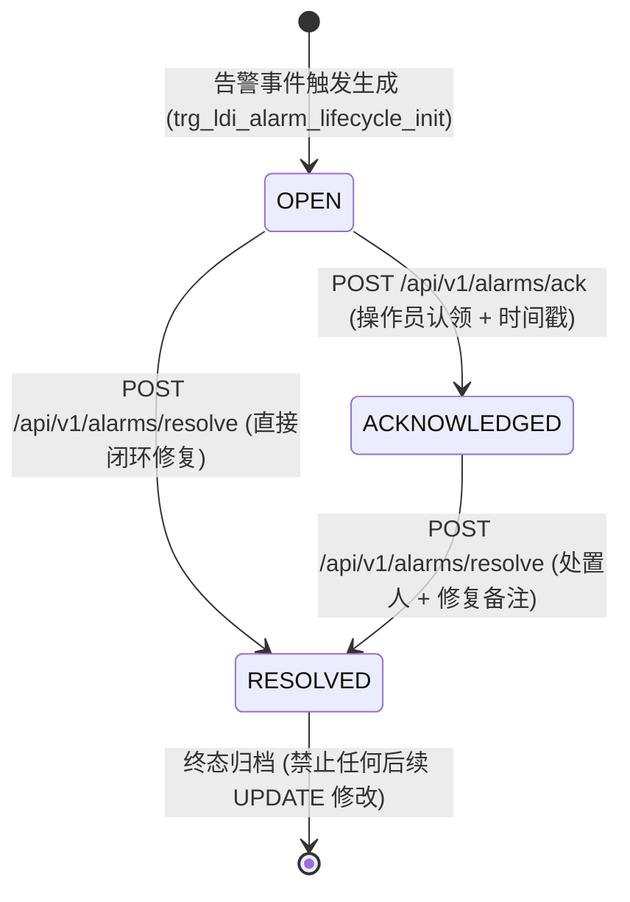

<!-- GLOBAL_NAV -->
<div align="right">
  <a href="../../README.md"> <b>首页</b></a> &nbsp;|&nbsp;
  <a href="../README.md"> <b>文档索引</b></a>
</div>
<br/>

<div align="center">
  <h1>IMS 工业告警严重度分级体系与生命周期架构规范</h1>
  <p><b>4 级严重度分类、规范颜色令牌 (Canonical Color Tokens)、有限状态机 (OPEN → ACKNOWLEDGED → RESOLVED) 与 ISA-18.2 对齐准则</b></p>
  <p>
    <a href="../../../docs/architecture/ALARM_SEVERITY_GUIDE.md">English</a> |
    <a href="../../../th/docs/architecture/ALARM_SEVERITY_GUIDE.md">ไทย</a> |
    <a href="ALARM_SEVERITY_GUIDE.md">简体中文</a>
  </p>
</div>

---

## 1. 概述与运维规范范围

工业监控系统 (IMS) 贯彻确定性告警治理架构，旨在抑制操作员告警风暴 (Alarm Floods)、强化处置责任人闭环机制，并在车间安灯看板 (Andon) 与工程数据分析中提供切实可行的操作上下文。

告警流转解耦为两大核心数据库实体：
1. **纯追加事实表 (`public.ldi_alarm_log`)**: 高并发、不可变的底层时序超表，记录每一条告警触发事件。
2. **可变生命周期状态表 (`public.ldi_alarm_lifecycle`)**: 专用于追踪责任归属、操作员认领及最终闭环归档的时间状态表。

---

## 2. 4 级严重度分级与规范颜色令牌 (Canonical Color Tokens)

`public.ldi_alarm_ms_code` 中的每一个告警代码均受数据库 `CHECK` 约束保护，严格限定为以下 4 级严重度：

| 严重度等级 | 规范颜色令牌 | 颜色十六进制 | 视觉呈现标识 | 运维处置响应优先级 |
|:-----------|:-------------|:-------------|:-------------|:-------------------|
| **Critical (致命)** | `critical` | `#EF4444` | 绯红警示 | 最高优先级 — 面临停机或报废风险。响应时限 $< 2\text{ 分钟}$。 |
| **Major (严重)** | `warning` | `#F59E0B` | 琥珀橙黄 | 重大设备故障或参数严重漂移。需在 $< 15\text{ 分钟}$ 内介入。 |
| **Minor (轻微)** | `severity-minor` | `#EAB308` | 金黄预警 | 影响较小的预警或预防性维护提示。在当班作业周期内响应。 |
| **Warning (注意)** | `accent` | `#3B82F6` | 精度冷蓝 | 信息性提示或操作建议。映射至高亮蓝以避免与 Major 发生视觉混淆。 |

> [!TIP]
> **设计系统合规细节**: 最低层级的 **Warning** 有意映射至 `#3B82F6`（accent 蓝），而 **Major** 占用 `#F59E0B`（amber 琥珀色）。这种设计确保车间操作员仅需一瞥即可迅速区分常规操作建议与重大故障隐患。

---

## 3. 有限状态机生命周期设计 (Migration 077)

告警生命周期的状态跃迁由 PostgreSQL 服务端触发器 `trg_ldi_alarm_lifecycle_guard` 进行强一致性保证：



### 状态定义与触发器约束

- **`OPEN`**: 初始状态。当事件写入 `public.ldi_alarm_log` 时自动创建，表明尚无操作人员介入。
- **`ACKNOWLEDGED`**: 责任认领状态。强制要求传入 `acknowledged_by` 责任人标识，并由服务端自动记录 `acknowledged_at`。
- **`RESOLVED`**: 终态归档。强制要求传入 `resolved_by` 处置人，并可附加 `resolution_note`。一旦标记为 `RESOLVED`，该记录即变为永久只读，任何后续 UPDATE 均会被数据库抛出异常拦截。

---

## 4. ISA-18.2 标准对齐与架构技术边界

IMS 系统广泛吸收了 **ANSI/ISA-18.2-2016**（过程工业告警管理系统标准）的核心理念。在工程审计中，本系统准确定位为 **"ISA-18.2 风格 (ISA-18.2-style)"**：

### 已实现的核心特性
- **标准 4 级严重度梯队**: 具有清晰优先级的结构化告警分类法。
- **操作员闭环生命周期状态机**: 追踪全生命周期变迁 (`OPEN` $\to$ `ACKNOWLEDGED` $\to$ `RESOLVED`)。
- **可审计的认领确认机制**: 集成 REST API (`ims-alarm-api`)，全量留存处置人与时间戳。
- **车间安灯可视化 (ISA-101)**: 面向生产现场终端高对比度态势感知展示。

### 暂未纳入的特性 (经架构评估延后)
- **告警抑制与挂起 (Shelving & Suppression)**: 目前通过设备手动维修模式实现，而非自动定时挂起。
- **动态合理化配置库**: 告警合理化规则固化于关系型文档表中，而非运行时动态修改。

---

## 5. 实时 SQL 巡检查询与 API 交互示例

### 查询当前未闭环活跃告警清单 (Andon 排队队列)

```sql
SELECT
  l.logid,
  l.logdate,
  l.equipmentid,
  m.alarm_code,
  m.alarm_msg,
  m.severity,
  COALESCE(lc.status, 'OPEN') AS status,
  lc.acknowledged_by,
  ROUND(EXTRACT(EPOCH FROM (NOW() - l.logdate)) / 60.0, 1) AS elapsed_minutes
FROM public.ldi_alarm_log l
JOIN public.ldi_alarm_ms_code m ON l.errorcode = m.alarm_code
LEFT JOIN public.ldi_alarm_lifecycle lc ON (l.logdate = lc.logdate AND l.logid = lc.logid)
WHERE lc.status IS DISTINCT FROM 'RESOLVED'
  AND l.logdate > NOW() - INTERVAL '24 hours'
ORDER BY
  CASE m.severity
    WHEN 'Critical' THEN 1
    WHEN 'Major'    THEN 2
    WHEN 'Minor'    THEN 3
    ELSE 4
  END ASC,
  l.logdate DESC;
```

### 使用 cURL 认领与解决告警

```bash
# 1. 车间技术员认领处于 OPEN 状态的告警
curl -X POST "http://localhost:8080/api/v1/alarms/ack" \
  -H "Content-Type: application/json" \
  -d '{
    "logid": "ALM-2026-0928-001",
    "logdate": "2026-09-28T04:15:00Z",
    "acknowledged_by": "OP-9842"
  }'

# 2. 维修工程师排除故障后提交闭环归档并附带维修备注
curl -X POST "http://localhost:8080/api/v1/alarms/resolve" \
  -H "Content-Type: application/json" \
  -d '{
    "logid": "ALM-2026-0928-001",
    "logdate": "2026-09-28T04:15:00Z",
    "resolved_by": "TECH-104",
    "resolution_note": "已更换曝光腔体真空密封圈，负压读数已恢复标称值。"
  }'
```
