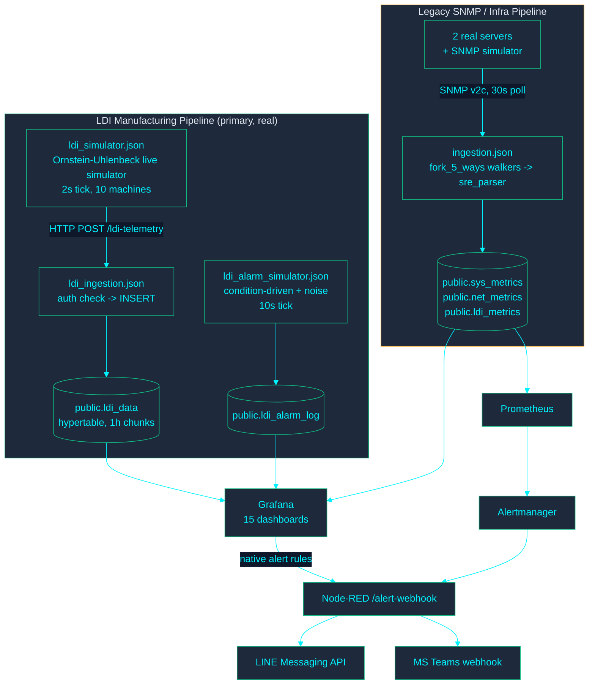

<!-- GLOBAL_NAV -->

  <a href="../../README.md"> <b>首页</b></a> &nbsp;|&nbsp;
  <a href="../README.md"> <b>文档索引</b></a>

 

 

 <a href="../../../docs/architecture/ARCHITECTURE.md"> <b>English</b></a> |
 <a href="../../../th/docs/architecture/ARCHITECTURE.md"> <b>ไทย</b></a> |
  <b>简体中文</b>
 

# IMS 系统架构

> **读者：** 系统架构师、SRE 与后端开发人员。
> **目的：** 系统拓扑、数据流与运行架构的唯一事实来源。
> **依据：** 2026-08-05 对照运行中的系统核实；容器清单、告警、仪表板与 CI 闸门已于 2026-09-26 对照 `main` 重新核实。证明下文内容的运行日志与截图见 **[证据索引](../evidence/INDEX.md)**。

---

## 系统上下文

IMS 是一个 Docker Compose 栈，包含**两条相互独立的遥测流水线**，共同写入同一个 TimescaleDB，通过 **15 个 Grafana 仪表板**进行可视化，并同时借助 Grafana 原生告警引擎与 Prometheus/Alertmanager 发出告警。

**为何存在两条流水线：**

- **传统 SNMP 流水线（`ingestion.json`）：** 系统最初的设计。轮询 SNMP 设备，由有状态的 `sre_parser` 解析，并写入 `sys_metrics` / `net_metrics` / `ldi_metrics`。
- **LDI 制造流水线（`ldi_data`）：** 后来为经 HTTP POST 接入更高保真度的遥测而增加。制造仪表板需要逐样本的 PE/JE/Cpk 精度，而合成数据表 `ldi_metrics` 无法支持。

> [!NOTE]
> **所有 Grafana 仪表板中的 LDI 工艺内容都读取 `ldi_data`，而不是 `ldi_metrics`。** 虽然 `ldi_metrics` 仍在接收数据，但对 LDI 类设备而言，其 LDI 专属列（`throughput`、`power_watt`、`vibration`）恒为 `0`。见下文"系统约束与技术边界"。

---

## 容器清单

| 服务 | 容器 | 用途 |
| --- | --- | --- |
| `timescaledb` | `ims-timescaledb` | PostgreSQL + TimescaleDB——所有持久化存储 |
| `pgbouncer` | `ims-pgbouncer` | 位于 TimescaleDB 之前的事务模式连接池 |
| `node-red` | `ims-node-red` | 两条遥测流水线（模拟器 + 接入）以及告警投递 flow |
| `grafana` | `ims-grafana` | 仪表板、预置告警规则、原生告警。自身没有主机端口——只能经 `proxy` 访问（见下文）。 |
| `proxy` | `ims-proxy` | nginx 反向代理；Grafana 与 `alarm-api` 在主机上唯一的入口。`/alarm-api/` 需先通过基于 Grafana 会话的 `auth_request` 检查（`proxy/nginx.conf`）——见 `SECURITY_MODEL.md`。 |
| `alarm-api` | `ims-alarm-api` | `public.ldi_alarm_lifecycle` 的写入路径（确认/解决，由 `IMS LDI - Alarm Console` 调用）。无主机端口，只能经 `proxy` 访问。以最小权限角色 `alarm_api_writer`（迁移 078）连接 Postgres。 |
| `renderer` | `ims-grafana-renderer` | 外部 `grafana-image-renderer` 服务（为告警/报告导出 PNG） |
| `prometheus` | `ims-prometheus` | 抓取与 `sys_metrics` 相关的 exporter 及 Node-RED 健康状况；评估自身的告警规则 |
| `alertmanager` | `ims-alertmanager` | 将 Prometheus 告警路由到 Node-RED 的 `/alert-webhook` |
| `blackbox-exporter` | (blackbox) | 用于 SLA 监控的 HTTP/TCP/ICMP 探测 |
| `snmpsim` | (snmpsim) | 为传统流水线提供开发/测试目标的模拟 SNMP 代理 |
| `db-migrate` | `ims-db-migrate` | 一次性迁移执行器（`scripts/migrate-entrypoint.sh`），在完成前阻止 `node-red` 与 `alarm-api` 启动 |
| `factory-twin-3d` | `ims-factory-twin-3d` | 一楼数字孪生（Express，内部端口 4100）。无主机端口；只能经 `proxy` 在 `/factory-twin-3d/` 访问，受同一 `auth_request` 闸门保护。只读：不向数据库写入任何内容。 |
| `observability-archiver` | `ims-observability-archiver` | 定期将容器/数据库可观测性快照归档到 `./ops-logs`；以只读方式挂载 Docker 套接字。 |
| `pgadmin` | `ims-pgadmin4` | 数据库管理界面（`dpage/pgadmin4`），不在运行时数据路径上。 |

仅限内部的服务（PgBouncer、SNMP 模拟器、Grafana、alarm-api、factory-twin-3d、renderer）从不直接暴露给主机。主机端口如下：`proxy` 位于 `${GRAFANA_PORT:-3000}`（所有接口——唯一的 UI 入口，前置 Grafana、alarm-api、孪生服务以及 Node-RED 的 `/ldi-telemetry` + `/inject`），`pgadmin` 位于 `5050`（所有接口），Node-RED（1880）、Prometheus（9090）、Alertmanager（9093）与 Blackbox（9115）仅绑定在 `127.0.0.1`。

---

## LDI 制造流水线（所有仪表板实际使用的流水线）

1. **`ldi_simulator.json`**（"LDI Live Simulator" 选项卡）为每台设备运行 Ornstein-Uhlenbeck 均值回归过程（10 台模拟 LDI 设备，分属 DF INNER、DF OUTER、SM 3 个工艺），每 2 秒一个周期，并将批次 POST 到 `/ldi-telemetry`。
2. **`ldi_ingestion.json`**（"IMS LDI Ingestion" 选项卡）接收 POST，校验请求头 `x-api-key` 是否与 `INGEST_API_KEY` 一致，然后写入 `public.ldi_data`。
3. **`ldi_alarm_simulator.json`**（"LDI Alarm Simulator" 选项卡）每 10 秒运行一次。与真实工艺参数存在已知关联的告警代码（温度/湿度、PE/JE 对位误差、扫描速度）由条件驱动——只有在最新读取的遥测确实超出规格时才会触发，所用阈值与 `v_ldi_alarm_context`（迁移 045）评估 RCA 时相同。没有已知参数关联的代码（校准故障、成像设备故障等）则按真实历史频率，从加权随机的噪声池中抽取。`VACUUM`（告警代码 `91009`）被有意设为纯噪声：每台设备按配方固定的 `air_vacuum` 值无论何时都已落在 `flag_vac_out_of_spec` 的"超规格"范围内，因此任何告警时序策略都无法产生真实的关联信号——这是标志阈值与配方不匹配的问题，而不应在模拟器中伪造修复。
4. 两者都写入 `public.ldi_data` / `public.ldi_alarm_log`，所有 LDI Grafana 仪表板与 RCA Truth Test 面板都从这里读取。

**良率（Yield）** 只有一个事实来源：`public.f_ldi_yield_pct()`（迁移 046）——取 PE 合格率与 JE 合格率中较差者，并以每行自身的 `pe_setting`/`je_setting` 为基准（而非硬编码阈值）。NOC Overview 与 Manufacturing 调用同一个函数，因此在结构上不可能给出不同的数字。

**Cpk** 过程能力公式（`LEAST((limit-mean)/(3*sigma), (mean+limit)/(3*sigma))`，样本标准差）在 5 处独立实现（3 个仪表板面板 + `v_machine_spc_fleet` + `v_machine_spc_ranking`），而非共享同一实现——`tests/e2e/golden-dataset-spc.js` 用一个手工计算的合成数据集分别跑通这 5 处并断言结果一致，作为防止它们再次出现偏差的常设 CI 闸门。

---

## 传统 SNMP / 基础设施流水线

`ingestion.json`（"IMS Ingestion Pipeline" 选项卡）每 30 秒通过 SNMP v2c 轮询已登记设备：

- 设备注册表从 `public.devices` 加载到 `global.deviceRegistry`（每 5 分钟刷新）。
- `fork_5_ways` 为每台设备派发并行 walker（CPU、Storage、Network、Temperature、LDI）。
- `sre_parser`（"SRE AIOps Parser v9 Batch"）在 flow context 中保存每台设备的状态，缓存数据行，并按表独立批量写入 `sys_metrics` / `net_metrics` / `ldi_metrics`（部分 walker 失败不会阻塞无关数据）。
- 一个 k6 风格的合成负载模拟器（`inject_fleet` -> `generate_fleet_targets` -> `pace_limiter` -> 同一 fork/parser 路径）也向这条流水线写入数据，用于负载测试。

这条流水线实际支撑 NOC Overview 的基础设施面板（2 台真实服务器 `<linux-server>` / `<windows-server>` 的 CPU/内存/磁盘/温度）以及 AIOps & Capacity Forecast 仪表板。它**不**支撑任何 LDI 工艺/质量面板——见上文的流水线划分。

---

## 数据库结构（截至迁移 047）

> 列数、完整的视图/物化视图/CAGG 列表以及当前已应用迁移数量，由 **[DATABASE_SCHEMA.md](DATABASE_SCHEMA.md)** 自动生成（`node scripts/generate-schema-inventory.js`，在 CI 中对照真实数据库检查）。本表补充生成器无法从 `information_schema` 推断出的"为什么"——每张表由谁写入、用于什么。

| 表 | 类型 | 数据来源 | 用途 |
| --- | --- | --- | --- |
| `devices` | 表 | 手动/种子数据 | 所有受监控对象的注册表（`device_type`：`ldi` 或 `server`） |
| `ldi_data` | Hypertable，1 小时分块 | `ldi_ingestion.json` | 真实 LDI 工艺遥测——PE/JE、温度、湿度、真空、扫描速度，逐样本。所有 LDI 仪表板面板的数据源。 |
| `ldi_alarm_log` | Hypertable，7 天分块 | `ldi_alarm_simulator.json` | 逐次告警事件行，自当时的模拟器修复起与工况条件相关联 |
| `ldi_alarm_ms_code` | 表 | 迁移 036（模拟种子） | 告警主代码参考（20 个真实生产代码，仅含功能性描述——并非厂商目录） |
| `sys_metrics` / `net_metrics` / `ldi_metrics` | Hypertable，1 天分块 | `ingestion.json`（传统流水线） | 基础设施遥测 + 存在已知缺口的 k6 合成 LDI 指标表（见下文） |
| `schema_migrations` | 表 | `scripts/migrate-entrypoint.sh` | 迁移跟踪——`(version, filename, applied_at)`，规范结构中没有 `checksum` 列 |

**值得了解的视图：** `v_ldi_alarm_context`（迁移 045，将告警与其前 5 分钟内的遥测读数关联——RCA Truth Test 正是基于它计算相关性）、`v_machine_spc_fleet` / `v_machine_spc_ranking`（Cpk，全设备群与按选择分别计算）、`v_fleet_health` / `v_fleet_score`（迁移 047，仅限 `device_type='server'`——此前包含了 LDI 设备恒为零的占位行，拉低了基础设施健康评分）。

---

## 迁移治理

**唯一的规范迁移执行器**：`scripts/migrate-entrypoint.sh`。Docker Compose 的一次性 `db-migrate` 服务会自动运行它（`node-red` 依赖 `db-migrate: condition: service_completed_successfully`）；`scripts/migrate.sh` 只是一层薄封装（`docker compose run --rm db-migrate`），用于在不启动栈其他部分的情况下手动重跑。

本仓库此前存在 3 个跟踪行为各不相同的独立迁移执行器（`migrate.sh` 有自己的循环和一个未使用的 `checksum` 列，`migrate-entrypoint.sh` 没有该列，`init-migrations.sh` 完全没有跟踪表，靠匹配错误文本来猜测）——在某个数据库上最先运行的那个，会悄无声息地决定该库 `schema_migrations` 的实际结构。这正是至少一次已确认的跟踪漂移事件的根因（迁移 038 实际已应用，但其跟踪行仍未标记）。`init-migrations.sh` 已被删除；现在只有一个执行器和一种跟踪结构。

所有迁移都应可重复执行（`CREATE ... IF NOT EXISTS`、针对重命名的 `DO $$ ... IF EXISTS ...` 保护等），这样对已迁移数据库重新运行始终是安全的空操作。**迁移 020 是一个警示案例**：它最初以无条件的 `DROP TABLE ldi_data CASCADE` 开头，只有在项目早期、尚无真实数据时才安全——后来却发现它在一个存有 28.4 万多行真实数据的数据库上被标记为"已应用"但从未实际执行。它已被改写为"缺失时创建、原地调优"，而不再删除表。

迁移 048 完成了 020 未竟的工作：将 `ldi_data` 的 `DOUBLE PRECISION` 列转换为 `REAL`，该转换在压缩分块上曾悄无声息地未生效。它会先解压，删除并重建依赖的连续聚合链（`ldi_data_1m` → `15m` → `1h`，以及 `ldi_data_hourly`）和 7 个依赖的普通视图，转换列类型，并从原始数据刷新每个 CAGG——若列已是 `REAL`（任何经 `postgres/init/001` 的全新部署都是如此），则由保护条件使其成为空操作。迁移 049 删除已弃用的 `alert_rules`/`alert_history` 表（见"系统约束与技术边界"）。迁移 050 将 RCA 的 Lift/Confidence 逻辑提升为真正的共享视图 `v_ldi_rca_recent_window`。

迁移 064 将 `v_machine_spc_fleet` 与 `v_ldi_rca_recent_window` 从普通视图转换为物化视图（名称与输出列不变，因此读取它们的 4 个面板无需修改），通过 TimescaleDB 内置的通用作业调度器每 60 秒刷新一次（`add_job`——本栈未安装 `pg_cron` 扩展，因此无法使用它）。它还把 Engineering Analytics 中 "RCA Truth Test" 面板内联的 CTE 抽取为新的物化视图 `v_ldi_rca_truth_test`，这_确实_需要修改一行面板 SQL（改为 `SELECT ... FROM v_ldi_rca_truth_test`，而不是每次读取都重新计算 CTE 链）。两项改动都基于实测的 `EXPLAIN ANALYZE` 数据而非猜测：LDI 查询套件的 P95 延迟从 60.12 ms 降至 5.30 ms。

---

## 告警

两个相互独立的告警评估引擎汇入同一个 Node-RED 投递 flow：

1. **Grafana 原生告警**（`monitoring/grafana/provisioning/alerting/rules.yml`、`ldi-rules.yml`）——由 Grafana 自身调度器直接针对 TimescaleDB 评估的设备级规则：基础设施阈值（High CPU/RAM/Disk Usage、High Temperature、Interface Down、网络错误/丢包、带宽预测）、Z-score 异常，以及 LDI 规则（数据库中出现告警、PE/JE 漂移、Cpk 低于 1.33、温度超出规格、设备离线、振动严重）。唯一的联络点 `ims-node-red-webhook` 会 POST 到 `http://node-red:1880/alert-webhook`。
2. **Prometheus + Alertmanager**——`monitoring/prometheus/rules/ims-alerts.yml` 中的平台规则（Prometheus/Alertmanager/抓取目标存活、blackbox 的 `ServiceDown`/延迟/SLA/TLS 证书到期、`Watchdog`，以及 Node-RED 流水线指标 `ims_pipeline_*` / `ims_circuit_breaker_state`），由 Alertmanager（`monitoring/alertmanager/alertmanager.yml`）按严重级别分组路由，并配置了三条抑制规则（同一设备上 critical 抑制 warning）。

**两条路径汇集于 `nodered_data/flows/alerting.json`**（"IMS Alerting Pipeline" 选项卡），它在 `POST /alert-webhook` 接收两路 webhook，格式化告警后分发到：

- **LINE Messaging API**（不是 LINE Notify——LINE 已于 2025 年停止该 API，本系统未使用），通过 `LINE_CHANNEL_ACCESS_TOKEN` + `LINE_USER_ID`。
- **MS Teams**，通过 `TEAMS_WEBHOOK_URL`，以 Adaptive Card 形式发送。

若任一凭据未设置，对应的投递函数会调用 `node.error()`（可在 flow 的 "Alert Delivery Failure" 调试节点中看到，节点本身也会持续显示红色状态），而不是悄悄丢弃告警——但在 `.env` 中配置真实凭据之前，仍不会实际投递。此前一个指向占位 URL、直接发往 Slack 的联络点已被删除，而不是任由它在每次 critical 告警时失败。

---

## 仪表板清单

> 面板数量与说明由 **[DASHBOARD_INVENTORY.md](DASHBOARD_INVENTORY.md)** 自动生成（`node scripts/generate-dashboard-inventory.js`，经 CI 检查）。本表补充生成器无法从 JSON 推断的架构层面的"为什么"——范围边界与相互引用；新增或重命名仪表板时，请保持此处 UID/Title 列与生成文件一致。

| UID | Title | 范围 |
| --- | --- | --- |
| `ims-noc-overview` | IMS NOC Overview | 仅基础设施（服务器 + 网络）——LDI 工艺内容位于其他仪表板，见下文 |
| `ims-ldi-manufacturing` | IMS LDI - Manufacturing Command Center | 完整的 4 层 RCA 仪表板：管理层 KPI、设备遥测、生产上下文、告警流 |
| `ims-ldi-operator-andon` | IMS LDI - Operator Andon Board | 产线 kiosk 看板，只读；在 1920x1080 与 3840x2160 下无需滚动（自 PR #22 起不支持 1280x720） |
| `ims-ldi-alarm-console` | IMS LDI - Alarm Console | 唯一可交互的仪表板：经 `alarm-api` 将确认/解决写入 `public.ldi_alarm_lifecycle` |
| `ims-ldi-alarm-response` | IMS LDI - Alarm Response (MTTA/MTTR) | 基于真实告警生命周期计算的响应时间 KPI |
| `ims-ldi-alarm-dictionary` | IMS LDI - Alarm Dictionary | 查询厂商告警代码及其最近发生记录；通过下钻链接进入 |
| `ims-ldi-factory-digital-twin` | IMS LDI - Factory Digital Twin | 按区域（`public.devices.location`）分组的上报 LDI 设备 Canvas 平面图 |
| `ims-ldi-engineering-analytics` | IMS LDI - Engineering Analytics & SPC | Cpk/SPC 排名、RCA Truth Test、PE/JE 分布 |
| `ims-ldi-machine-snapshot` | IMS LDI - Machine Snapshot | 逐事件下钻（点击告警/日志进行检查） |
| `ldi-data-readiness` | LDI Data Readiness & Integration Gaps | 自检式数据质量仪表板（板件键重复、覆盖率 %、告警主数据匹配率） |
| `ims-easy-overview` | IMS Easy Overview | 零配置全设备群一览，完全基于共享视图/函数构建（`v_ldi_machine_latest_full`、`v_ldi_alarm_context`、`f_ldi_yield_pct`、`v_machine_spc_fleet`）——无需设置模板变量 |
| `ims-engineering` | IMS Engineering Drill-Down | 侧重基础设施：各服务器的 CPU/内存/存储/网络，以及 LDI 吞吐量/质量（传统流水线） |
| `ims-capacity` | IMS AIOps & Capacity Forecast | 距离耗尽/饱和天数的回归预测（基础设施） |
| `ims-meta-monitoring` | IMS Pipeline Health & Meta-Monitoring | 接入流水线自身的健康状况（行/秒、批次成功率、重试队列深度） |
| `ims-ingestion-latency` | IMS Ingestion Latency | 基于迁移 081 的 `ingest_ts` 列、只读的 source_ts → ingest_ts 延迟证据 |

NOC Overview 在当时已与 LDI/制造内容拆分（此前它重复展示了 Manufacturing 的良率面板）——基础设施与制造的关注点现在有意分放在不同仪表板上，而不是混在同一个"总览"页面。

---

## 系统约束与技术边界

为便于运维理解与架构可见性，记录如下：

- **对每台 LDI 设备而言，`ldi_metrics.throughput` / `.power_watt` / `.vibration` 恒为 `0`**（在 2,300 多行、全部 10 台设备上得到确认）。这些参数为将来的集成预留，目前以 0 上报。因此 `ims-ldi-vibration-critical` 告警规则处于暂停状态。这**不**影响任何读取 `ldi_data`（主流水线）的仪表板——只影响传统的 `ldi_metrics` 表以及直接查询它的内容。
- **LDI-01/LDI-04 上的板件键重复**（分别有 157 / 121 对重复的 `(mo, board_no)`，其余 8 台为 0）已查明根因：不同作业周期之间随机生成的 `MO-NNNNN` 字符串发生碰撞（生日悖论——5 位数字只有约 90,000 种可能取值，而数据集历史中每台设备抽取了 175–257 次），并非真实的重复计数。实时模拟器与历史批量生成器中的随机 ID 空间均已扩大 10 倍（6 位数），以支持未来更大的基数。
- **真实告警投递（LINE/Teams）需要外部提供凭据**——`.env` 中的 `LINE_CHANNEL_ACCESS_TOKEN`、`LINE_USER_ID`、`TEAMS_WEBHOOK_URL` 默认为空。流水线会端到端执行校验并记录投递状态，等待运维配置凭据。
- **VACUUM（91009）RCA 相关性校准已于 2026-08-07 完成**。超规格阈值已围绕模拟器自身的 DF INNER 配方范围重新校准（`air_vacuum > -8 OR < -30`，迁移 057——源自模拟器，而非厂商规格），DF OUTER/SM 正确地发送 `NULL` 而不是表示"不适用"的 `0.0` 哨兵值（迁移 054，并在迁移 060 中回填历史数据），遥测生成器会注入罕见的弱真空故障事件，从而产生可供关联的真实偏离（`nodered_data/flows.json`，`ldisim_gen`）。**Lift 数值反映当前运行状态。** `docs/architecture/LDI_RCA_GUIDE.md` 给出当前方法与带日期的快照表；如需当天数字，请运行 `SELECT * FROM public.v_ldi_rca_truth_test`。
- **MOTION（70004）呈正相关，但可能需要更长的采样时间才能达到 `v_ldi_rca_recent_window` 中 n≥30 的置信下限**（24 小时滚动窗口的运行视图——全数据集验证视图 `v_ldi_rca_truth_test` 通常事件数足够）。扫描速度偏离被正确关联，只是在当前配方分布下比温度/湿度/对位事件更少见。当所读取窗口内积累的事件足够多时，该类别即可获得 "OK" 置信度。当前数字见 `LDI_RCA_GUIDE.md`。
- **不同初始化路径之间的保留策略配置不一致（2026-08-10 实时核实）**——`postgres/init/001` 将 `sys_metrics`/`net_metrics`/`ldi_metrics` 的保留期设为 30 天；`database/migrations/016-aggressive-retention.sql` 将同样的表设为 14 天。实际数据库与 `postgres/init/` 的 30 天一致，说明该部署是全新引导的，而非按顺序应用每个迁移构建而成。`postgres/init/032` 还设置了 `ldi_data`（180 天）与 `ldi_alarm_log`（365 天）的保留期。完整的实际策略表见 `docs/architecture/DATA_RETENTION.md`。
- **Golden-dataset SPC 回归闸门的验证方式已优化（2026-08-12）。** `tests/e2e/golden-dataset-spc.js` 在一个必定回滚的事务中插入合成数据，但迁移 064 将 `v_machine_spc_fleet` 从普通视图改为物化视图，而物化视图在结构上无法看到未提交事务中的插入（物化视图是独立的物理快照，并不会重新执行其定义查询）。修复方式是把该视图的精确公式内联到测试中（与该套件中另外 3 项面板级检查已采用的模式相同），而不是查询实际的物化对象。现在 7/7 项断言全部通过。见 `docs/architecture/LDI_SPC_GUIDE.md`。
- **DR 测试期间观察到的 `restart: unless-stopped` 容器恢复行为（2026-08-10）**——通过实时流式 `docker events` 两次确认：只触发了 `kill`/`die` 事件，没有自动 `start`，尽管 `docker inspect` 确认容器的重启策略已正确应用。同一次演练的连带发现：手动恢复后，LDI 接入的连接池重连看门狗（`ldiDbConnFailureStreak`，当时专为这种故障模式而构建）在约 6 分钟内都没有自动触发 Node-RED 重启——只有手动 `docker restart ims-node-red` 才解决问题。完整时间线见 `IMS_MANUFACTURING_PLATFORM_V2.md` 的 DR Test Evidence（Drill 2）。看门狗计数阈值的进一步优化已列入后续运维周期。
- **领域边界与未来的制造工艺类型单独记录，不在本文件中**——基础设施/制造的划分（`monitoring/grafana/dashboards/{infrastructure,manufacturing}/`，由 `CODEOWNERS` 强制执行）见 `docs/architecture/OWNERSHIP.md`；未来的工艺类型（AOI、电镀、蚀刻、钻孔）如何在不触及 LDI 数据结构或仪表板的前提下接入，见 `docs/architecture/MANUFACTURING_DOMAIN.md`。`docs/architecture/EAP_ARCHITECTURE.md` 记录了两个真实的设备适配器（SNMP、HTTP/JSON）以及一个尚未实现的 SECS/GEM 适配器契约。`docs/architecture/IMS_MANUFACTURING_PLATFORM_V2.md` 则是这三份文档所源自的推进计划与证据日志。
- **告警严重级别分类采用 ISA-18.2 风格的严重级别。** Critical/Major/Minor/Warning 四级命名及其专用颜色 token（`GRAFANA_DESIGN_SYSTEM.md` §2.1）借用了 ISA-18.2 的严重级别术语。`ldi_alarm_log` 记录所有告警的严重级别状态。若面向相关方的文档需要描述告警管理，应表述为"ISA-18.2 风格的严重级别分类"。ISA-**101**（另一项关于 HMI 设计的标准）仅被正确且有限地用于 Operator Andon Board 的 kiosk 布局——不受本说明影响。

---

## 治理 / CI 闸门

以下自动化闸门在 CI（`.github/workflows/ci.yml`）中运行：lint 类闸门位于 `lint` 作业，需要真实数据库的闸门位于 `integration-chaos` 作业。每个闸门捕捉一类原本需要人工审阅才能发现的失败：

| 闸门 | 脚本 | 证明内容 |
| --- | --- | --- |
| 仪表板结构 | `tests/lint/dashboard-linter.js` | 网格对齐、标准面板高度、kiosk 免滚动高度上限（按仪表板设定，例如 `ims-ldi-operator-andon`：20 个网格单位） |
| RCA 类别覆盖 | `tests/lint/rca-mapping-coverage.js` | ≥70% 的告警主代码已映射到 RCA 类别，且每个仪表板引用都有效 |
| 查询预算（结构） | `tests/lint/query-budget-linter.js` | 没有面板对原始 `ldi_data` 做范围扫描，而是使用 `_1m`/`_15m`/`_1h` CAGG 层级 |
| 查询预算（实测） | `tests/e2e/query-timing-check.js` | 针对真实数据库的服务器端 `EXPLAIN ANALYZE` 实测耗时，P95 < 80 ms |
| 面板数据正确性 | `tests/e2e/panel-data-check.js` | 每个面板_实际解析后_的 SQL 在真实数据库上运行，并返回带有正确 `time` 列的真实数据行 |
| 结构漂移 | `scripts/migrate.sh`（断言 `Pending: 0`） | 迁移目录与实际 `schema_migrations` 表一致 |
| 孤立对象 | `tests/lint/orphan-object-linter.js` | 实际数据库中的每张表/视图至少被一个仪表板、告警规则、flow 或迁移引用——不存在悄然闲置的对象 |
| Golden-dataset SPC | `tests/e2e/golden-dataset-spc.js` | 5 处独立的 Cpk/Cp 实现在已知合成数据集上与教科书公式结果一致 |

颜色 token（`GRAFANA_DESIGN_SYSTEM.md`）：凡是表达设备/告警状态的阈值步长与值映射颜色，都使用 5 个 token 之一——OK `#22C55E`、Warning `#F59E0B`、Critical `#EF4444`、No Data `#64748B`、Info `#2563EB`。装饰性颜色（区分图表序列、背景、边框、品牌强调色）有意豁免——仅靠 5 种饱和色无法构建仪表板。

浏览器级闸门同样在 CI 中运行：`factory-twin-regression` 作业（`tests/playwright/factory-twin-regression.js`，以及故障模式与检查器 E2E 套件）和 `visual-regression` 作业（`tests/playwright/ldi-responsive-regression.js`，1920 与 3840 px 下免滚动）。`tests/playwright/ui-visual-baseline/` 下的 UI 基线已提交；`tests/playwright/dashboard-visual-regression.js` 仍只为文档截图，不做任何断言。

---

## 参考资料

| 资源 | 链接 |
| --- | --- |
| TimescaleDB 文档 | <https://docs.timescale.com/> |
| Node-RED 文档 | <https://nodered.org/docs/> |
| Grafana 文档 | <https://grafana.com/docs/> |
| Prometheus 文档 | <https://prometheus.io/docs/> |
| Alertmanager 文档 | <https://prometheus.io/docs/alerting/latest/configuration/> |
| LINE Messaging API | <https://developers.line.biz/en/docs/messaging-api/> |

本仓库相关文档：`GRAFANA_DESIGN_SYSTEM.md`（颜色/token 约定）、`../operations/TROUBLESHOOTING.md`、`../archive/IMS_FULL_SYSTEM_AUDIT.md`（系统基线审计）、`DASHBOARD_INVENTORY.md` 与 `DATABASE_SCHEMA.md`（自动生成的清单）。
