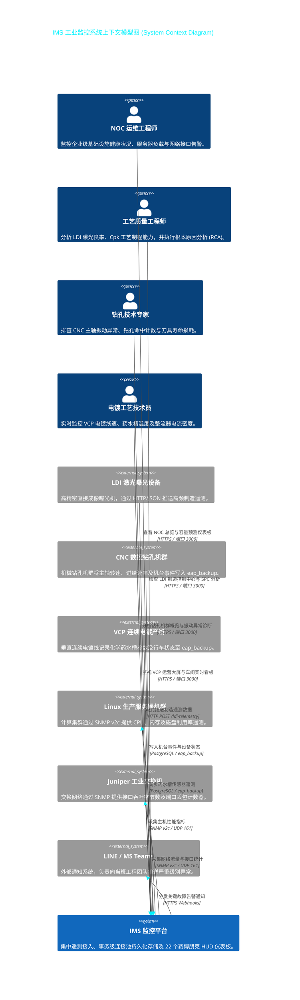
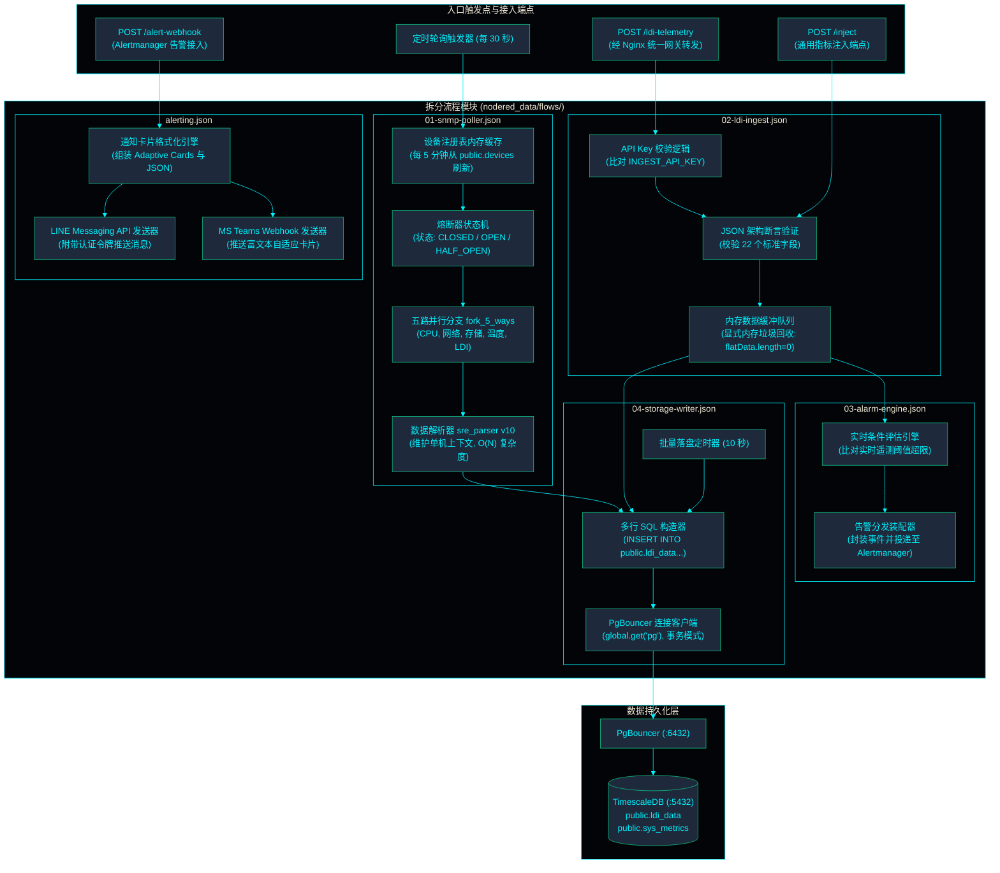
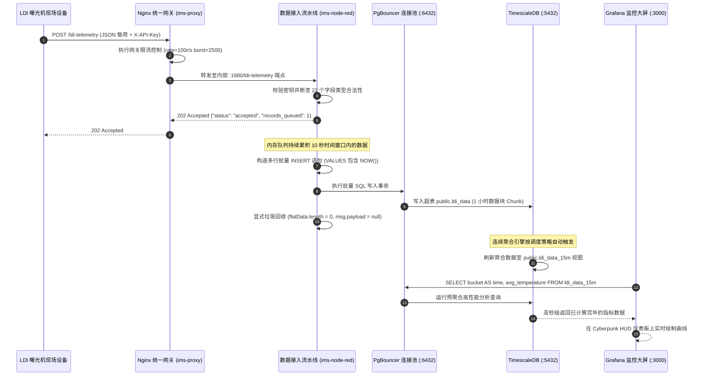
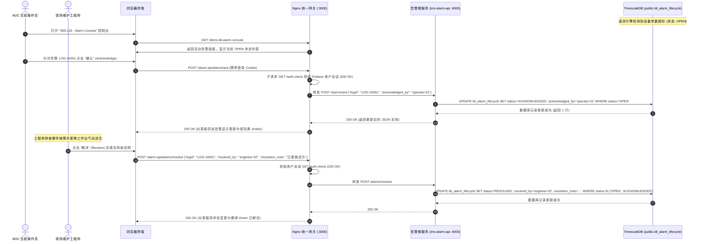
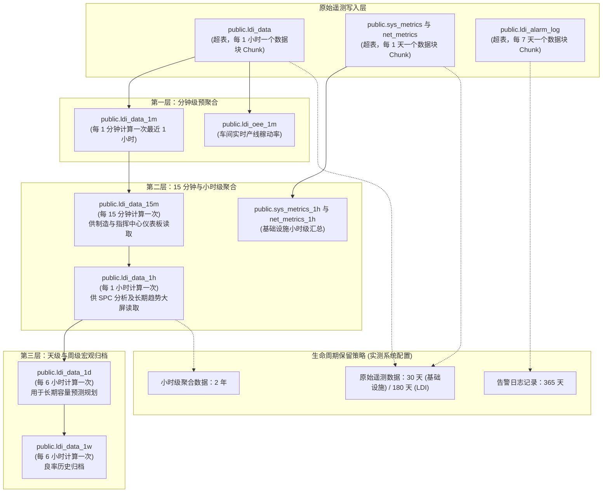
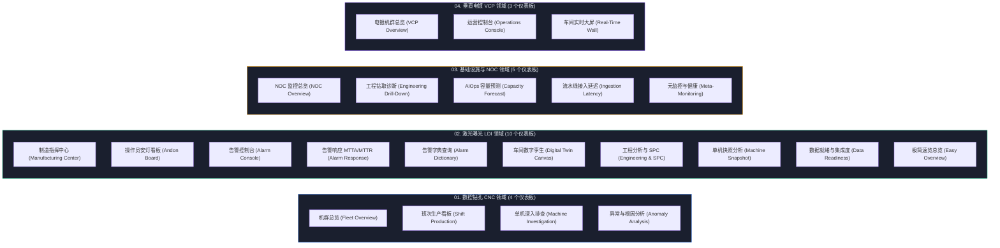

<!-- GLOBAL_NAV -->
<div align="right">
  <a href="../../README.md"> <b>首页</b></a> &nbsp;|&nbsp;
  <a href="../README.md"> <b>文档索引</b></a>
</div>
<br/>

<div align="center">
  <h1>IMS 可视化架构与系统拓扑参考 (Visual Architecture Reference)</h1>
  <p><b>工业监控系统的全景 C4 模型、动态时序流、网关安全拓扑与分层存储结构</b></p>
  <p>
    <a href="../../../docs/architecture/ARCHITECTURE_DIAGRAM.md">English</a> |
    <a href="../../../th/docs/architecture/ARCHITECTURE_DIAGRAM.md">ไทย</a> |
    <a href="ARCHITECTURE_DIAGRAM.md">简体中文</a>
  </p>
</div>

---

> [!TIP]
> **原始 Mermaid 定义文件**：如需在 IDE 插件或 CI 流水线中独立渲染，可直接访问原始 Mermaid 文件：[ims-system-architecture.mermaid](../../../docs/architecture/ims-system-architecture.mermaid)。

## 1. 系统上下文模型图 (C4 Model - Level 1: System Context)

系统上下文图展示了运维操作员、工艺工程师、车间现场设备、企业 IT 计算集群、网络交换机以及外部告警分发平台与 IMS 核心遥测引擎的交互关系。



---

## 2. 容器拓扑模型图 (C4 Model - Level 2: Container Topology)

本图详细展示了 IMS Docker Compose 环境下的全部 15 项服务、内部容器网络架构以及外部端口映射：

```mermaid
%%{init: {'theme': 'base', 'themeVariables': { 'primaryColor': '#1e293b', 'primaryTextColor': '#00F2FE', 'primaryBorderColor': '#10B981', 'lineColor': '#00F2FE', 'secondaryColor': '#0f172a', 'tertiaryColor': '#0f172a', 'clusterBkg': '#030407', 'clusterBorder': '#00F2FE'}}}%%
C4Container
 title IMS 容器架构拓扑图 (15 项服务)

 Person(user, "工程师与运维人员", "通过浏览器访问监控仪表板、三维数字孪生与告警处置 API。")
 System_Ext(ext_dev, "车间现场工业边缘设备", "LDI、CNC 钻机、VCP 电镀线、服务器、交换机。")

 System_Boundary(c1, "IMS 内部容器网络 (ims_net)") {
   Container(proxy, "反向代理 (ims-proxy)", "Nginx Alpine", "统一入口网关、客户端限流与会话安全鉴权。")
   Container(grafana, "Grafana 13 (ims-grafana)", "Go", "承载涵盖 4 大业务领域的 22 个赛博朋克 HUD 仪表板。")
   Container(alarm_api, "告警 API (ims-alarm-api)", "Node.js Express", "管理 public.ldi_alarm_lifecycle 表上的告警确认与解决生命周期。")
   Container(twin_3d, "三维数字孪生 (ims-factory-twin-3d)", "Node.js Express", "一楼车间数字孪生空间可视化服务（只读模式）。")
   Container(renderer, "图像渲染引擎 (ims-grafana-renderer)", "Chromium", "生成用于告警通知与报表的面板静态 PNG 截图。")

   Container(nodered, "接入流水线 (ims-node-red)", "Node.js / Node-RED", "并行轮询采集、遥测解析、队列缓冲与告警路由。")
   Container(pgbouncer, "连接池管理器 (ims-pgbouncer)", "C / PgBouncer", "事务级连接池化，保护 TimescaleDB 免受并发耗尽。")
   ContainerDb(timescaledb, "TimescaleDB (ims-timescaledb)", "PostgreSQL 16 + TimescaleDB", "持久化存储超表 (Hypertables)、连续聚合 (CAGGs) 与告警记录。")

   Container(prometheus, "Prometheus (ims-prometheus)", "Go", "抓取服务状态指标并执行告警评估规则。")
   Container(alertmanager, "Alertmanager (ims-alertmanager)", "Go", "处理告警去重、抑制及向 Node-RED 投递通知。")
   Container(blackbox, "黑盒探针 (ims-blackbox)", "Go", "执行 HTTP/TCP 探针以验证系统服务 SLA。")
   Container(snmpsim, "SNMP 模拟器 (ims-snmpsim)", "Python", "本地开发环境下模拟 Linux 主机与交换机节点。")
   Container(archiver, "可观测性归档器 (ims-observability-archiver)", "Bash", "定期备份容器与数据库监控快照至 ops-logs。")
   Container(db_migrate, "数据库迁移器 (ims-db-migrate)", "Bash / psql", "一次性执行脚本，顺序运行 001 至 086 迁移文件。")
   Container(pgadmin, "PgAdmin 4 (ims-pgadmin4)", "Python", "Web 端数据库管理平台 (映射端口 5050)。")
 }

 Rel(user, proxy, "访问界面与各服务接口", "HTTPS / 端口 3000")
 Rel(ext_dev, proxy, "推送设备遥测", "POST /ldi-telemetry")
 Rel(nodered, ext_dev, "采集 SNMP 遥测", "UDP 161")

 Rel(proxy, grafana, "反向代理 UI 及 Grafana 内部接口", "HTTP :3000")
 Rel(proxy, alarm_api, "反向代理 /alarm-api/* (已鉴权)", "HTTP :4000")
 Rel(proxy, twin_3d, "反向代理 /factory-twin-3d/* (已鉴权)", "HTTP :4100")
 Rel(proxy, nodered, "反向代理 /ldi-telemetry 及 /inject", "HTTP :1880")
 Rel(proxy, grafana, "内部鉴权校验 (/auth-check)", "HTTP :3000")

 Rel(grafana, renderer, "请求渲染面板截图", "HTTP :8081")
 Rel(grafana, pgbouncer, "查询 CAGG 预聚合视图", "TCP :6432")
 Rel(alarm_api, pgbouncer, "更新告警生命周期 (alarm_api_writer 权限)", "TCP :6432")
 Rel(nodered, pgbouncer, "批量写入遥测数据 (Batch INSERT)", "TCP :6432")
 Rel(pgbouncer, timescaledb, "事务级数据库连接", "TCP :5432")

 Rel(prometheus, timescaledb, "抓取性能指标", "TCP :5432")
 Rel(prometheus, alertmanager, "触发告警事件", "HTTP :9093")
 Rel(alertmanager, nodered, "发送 Webhook 至 /alert-webhook", "HTTP :1880")
```



---

## 3. Node-RED 流水线组件模型图 (C4 Model - Level 3: Components)

展现 `ims-node-red` 容器内部的模块化拆分流程与数据处理管线：



---

## 4. 高频遥测数据写入与渲染时序图 (High-Throughput Sequence Flow)

展示从 LDI 曝光机硬件采集开始，经网关接入、批量持久化到 Grafana 亚秒级聚合查询渲染的全链路：



---

## 5. 告警全生命周期确定性状态流转时序图 (Alarm Lifecycle Sequence)

展示从告警产生、操作员确认到工程人员排查解决的全流程闭环：



---

## 6. SNMP 采集容错机制：熔断器模式 (Circuit Breaker Pattern)

防止边缘设备失联或网络震荡时引发 SNMP 请求雪崩效应：

```mermaid
sequenceDiagram
  autonumber
  participant Timer as Node-RED 调度定时器 (每 30 秒)
  participant Walker as SNMP 批量采集器
  participant Breaker as 熔断器状态机 (Context State)
  participant Target as 目标边缘设备 (离线故障)
  participant DB as TimescaleDB (sys_metrics)

  Timer->>Walker: 触发本轮采集周期
  Walker->>Breaker: 查询目标设备 "SW-CORE-01" 运行状态

  alt 熔断器状态为 CLOSED (健康通行)
    Walker->>Target: 发送 SNMP GETBULK 请求 (UDP 161)
    Target--xWalker: 无响应 (超时 5000ms)
    Walker->>Breaker: 记录异常计数 (failureCount++)

    alt failureCount < 2
      Breaker-->>Walker: 维持 CLOSED 状态 (下轮继续尝试)
    else failureCount >= 2
      Breaker->>Breaker: 切换状态为 OPEN (立即熔断)
      Breaker->>DB: 写入节点离线状态 (即刻将各项指标置 0 以免误判)
      Note over Breaker: 启动 120 秒静默冷却计时器
    end

  else 熔断器状态为 OPEN (熔断阻断)
    Breaker-->>Walker: 拦截采集请求 (保护物理网络免受风暴冲击)
    Note over Walker: 跳过本轮 SNMP 报文发送

  else 冷却超时结束: 切换为 HALF_OPEN (半开探测模式)
    Breaker->>Walker: 仅允许发送单条轻量探测请求
    Walker->>Target: 发送轻量 SNMP GET 请求
    alt 设备已恢复
      Target-->>Walker: 返回正常响应报文
      Walker->>Breaker: 清空计数 failureCount = 0; 切换为 CLOSED
      Breaker->>DB: 恢复节点在线状态
    else 探测失败
      Target--xWalker: 依旧超时
      Walker->>Breaker: 重新进入 OPEN 熔断状态; 重启 120 秒冷却
    end
  end
```

---

## 7. 时序数据分层存储与连续聚合架构 (TimescaleDB Topology)



---

## 8. 4 大业务领域仪表板生态图谱 (Dashboard Ecosystem)

系统内置纳管的全部 22 个 Grafana 仪表板划分在 4 大核心业务领域中：



---

## 9. 真实生产环境架构巡检命令 (Verification Commands)

直接通过命令行核验当前运行的容器与数据库内部状态：

```bash
# 1. 检查全量 14 个运行中容器的状态与端口暴露情况
docker ps --format "table {{.Names}}\t{{.Status}}\t{{.Ports}}"

# 2. 检查 PgBouncer 连接池客户端及服务端连接复用状态
docker exec -i ims-timescaledb psql -U ims_admin -p 6432 -h ims-pgbouncer -d ims_telemetry -c "SHOW POOLS;"

# 3. 检查 TimescaleDB 内部各超表的数据块分布与压缩率
docker exec -i ims-timescaledb psql -U ims_admin -d ims_telemetry -c "
SELECT hypertable_name, num_chunks, total_size, compressed_total_size
FROM timescaledb_information.hypertables
ORDER BY total_size DESC;"

# 4. 检查连续聚合视图的刷新任务与调度间隔
docker exec -i ims-timescaledb psql -U ims_admin -d ims_telemetry -c "
SELECT view_name, schedule_interval, max_interval_per_job
FROM timescaledb_information.continuous_aggregate_stats;"
```
