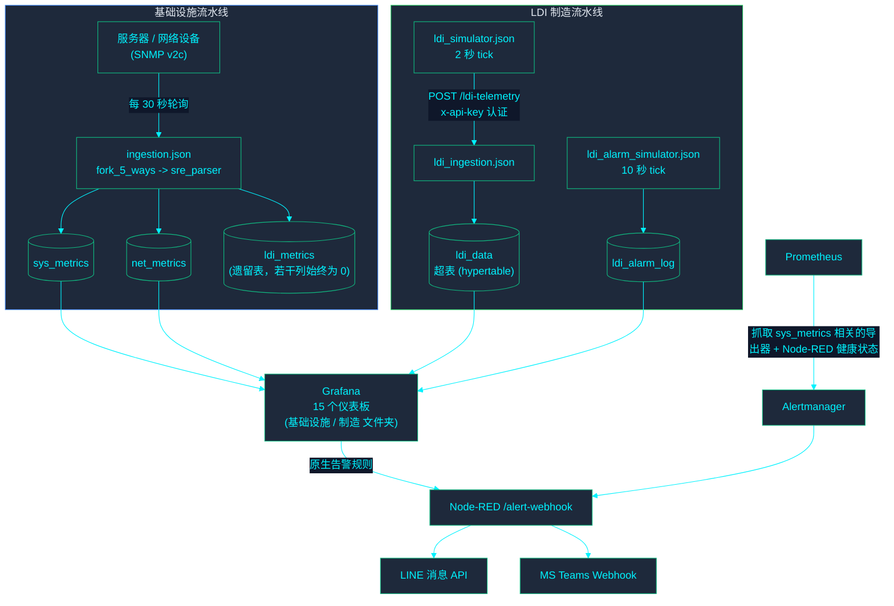
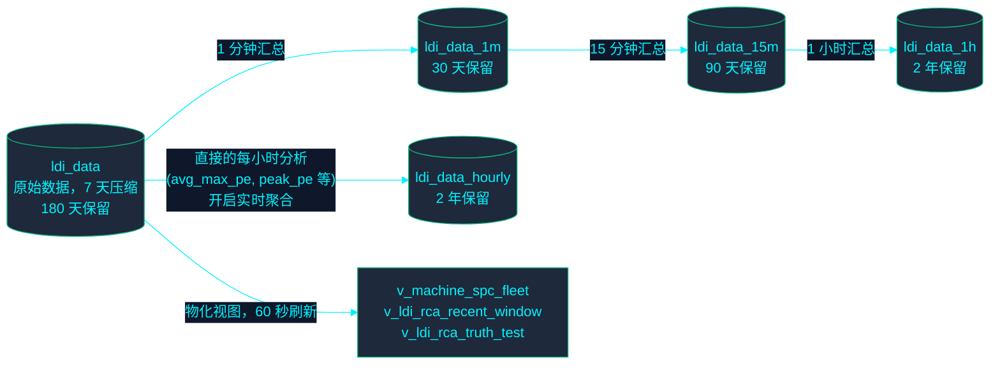
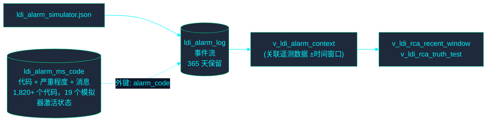

<!-- GLOBAL_NAV -->

  <a href="../../README.md"> <b>Home</b></a> &nbsp;|&nbsp;
  <a href="../README.md"> <b>Docs Index</b></a>

 

# 数据流

> **目标读者：** SRE/运维，新开发者，QA/审计。
>
> **来源溯源：** 以下的每一个表/视图名称及连续聚合 (CAGG) 关系，均已在 2026-08-10 直接通过生产数据库 (`timescaledb_information.continuous_aggregates`) 和实际的迁移脚本 (migrations) 进行了核对。

---

## 端到端：双流水线

**分发注意事项：** LINE/Teams 消息分发需要运维人员配置 `LINE_CHANNEL_ACCESS_TOKEN`/`TEAMS_WEBHOOK_URL` — 根据设计，这些变量在当前代码库的 `.env` 文件中是被省略的。直到分发之前的格式化和尝试分发逻辑都是真实且正确的。

---

## LDI 遥测数据：CAGG 汇总链

原始的 `ldi_data` 数据提供给两条独立的聚合路径，每条路径服务于不同目的 —— 不要认为它们是冗余的：

`ldi_data_1m → 15m → 1h` 是一条链式汇总路径（每一级汇总其下一级的数据），用于提升仪表板时间范围查询的性能。`ldi_data_hourly` 是一个 _独立的_、专门构建的每小时视图，直接从原始数据计算得出，拥有其专属的分析列（`avg_max_pe`，`peak_pe` 等），并且设置了 `timescaledb.materialized_only = false`（实时聚合 — 位于迁移脚本 065 中），因为这些特定的指标需要反映当前正在进行的这一小时的局部数据，而不是等待下一次预定的刷新。

## 告警主表与严重程度

请参阅 `docs/architecture/ALARM_SEVERITY_GUIDE.md` 和 `docs/architecture/LDI_RCA_GUIDE.md` 了解构建于此基础上的分类法与相关性方法论。

## 相关文档

- `docs/architecture/ARCHITECTURE.md` — 完整的系统上下文，容器清单。
- `docs/architecture/DATABASE_SCHEMA.md` — 自动生成的表/列/视图参考。
- `docs/architecture/DATA_RETENTION.md` — 上文展示的保留/压缩数值，包含治理注意事项。
- `docs/architecture/EAP_ARCHITECTURE.md` — 更为详细的两种数据接入 (ingestion) 适配器 (SNMP, HTTP/JSON)。
