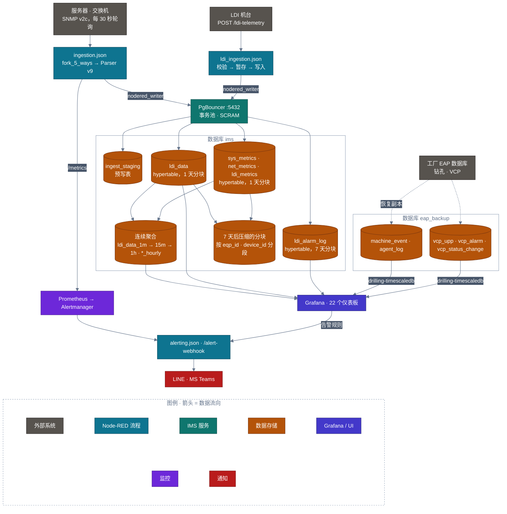
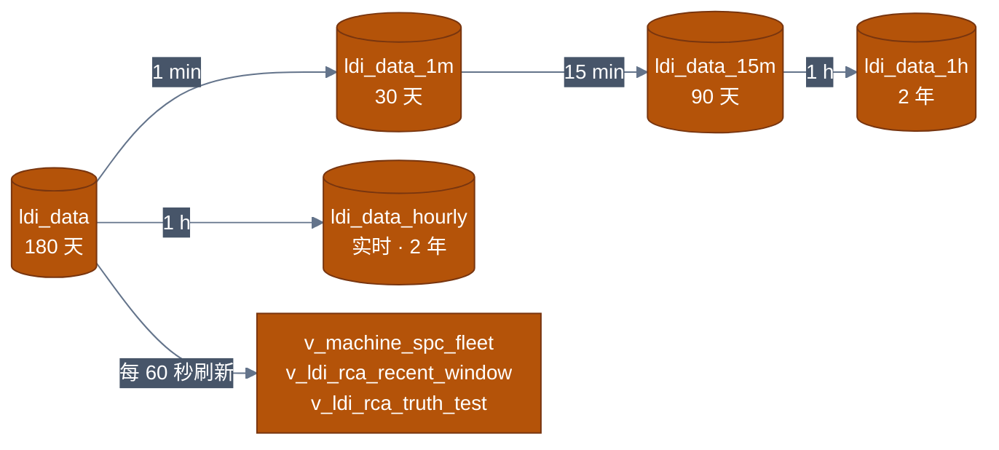

<!-- GLOBAL_NAV -->
<div align="right">
  <a href="../../README.md"> <b>首页</b></a> &nbsp;|&nbsp;
  <a href="../README.md"> <b>文档索引</b></a>
</div>
<br/>

<div align="center">
  <h1>IMS 遥测数据管道与全流程数据流转架构 (Data Flow Architecture)</h1>
  <p><b>多工业领域接入流水线、Node-RED 沙箱转换机制、PgBouncer 事务连接池、TimescaleDB CAGG 持续聚合链及 Grafana 消费呈现</b></p>
  <p>
    <a href="../../../docs/architecture/DATA_FLOW.md">English</a> |
    <a href="../../../th/docs/architecture/DATA_FLOW.md">ไทย</a> |
    <a href="DATA_FLOW.md">简体中文</a>
  </p>
</div>

---

> **受众对象:** SRE / 运维工程师、数据工程师、系统架构师、QA 质量保证团队  
> **遥测业务范围:** 涵盖四大工业领域 (IT/OT 基础设施网络、LDI 激光直接成像光刻、CNC 数控钻孔设备群、VCP 垂直连续电镀线)  
> **数据源真实性出处:** 下文提及的全部数据表、视图、计算逻辑及持续聚合视图均经过 live 数据库 (`timescaledb_information.continuous_aggregates`)、迁移脚本 013–093 以及运行中 Node-RED 流水线的严格校验。

---

## 1. 端到端多领域数据流向总拓扑 (Pipeline Topology)


```mermaid
%%{init: {"flowchart": {"nodeSpacing": 20, "rankSpacing": 32, "padding": 10, "wrappingWidth": 150, "curve": "basis"}, "sequence": {"wrap": true, "width": 170, "actorMargin": 36, "boxMargin": 8, "noteMargin": 8, "messageMargin": 30, "mirrorActors": false}, "state": {"padding": 6}, "theme": "base", "themeVariables": {"fontFamily": "Inter, Segoe UI, Helvetica, Arial, sans-serif", "fontSize": "14px", "primaryColor": "#334155", "primaryTextColor": "#ffffff", "primaryBorderColor": "#1e293b", "lineColor": "#64748b", "textColor": "#64748b", "secondaryColor": "#475569", "tertiaryColor": "#f1f5f9", "clusterBkg": "transparent", "clusterBorder": "#94a3b8", "titleColor": "#64748b", "edgeLabelBackground": "#475569", "nodeTextColor": "#ffffff", "noteBkgColor": "#fef3c7", "noteTextColor": "#1e293b", "noteBorderColor": "#d97706", "actorBkg": "#334155", "actorTextColor": "#ffffff", "actorBorder": "#1e293b", "actorLineColor": "#94a3b8", "signalColor": "#64748b", "signalTextColor": "#64748b", "labelBoxBkgColor": "#334155", "labelBoxBorderColor": "#1e293b", "labelTextColor": "#ffffff", "loopTextColor": "#64748b", "activationBkgColor": "#e2e8f0", "sequenceNumberColor": "#ffffff", "stateLabelColor": "#ffffff", "compositeBackground": "transparent", "transitionColor": "#64748b", "transitionLabelColor": "#64748b"}}}%%
flowchart TB
  accTitle: 端到端数据流
  accDescr: SNMP 与 LDI 数据经 Node-RED 和 PgBouncer 进入 ims 数据库，由 ingest_staging 保护 LDI 批次，并运行连续聚合与压缩；钻孔与 VCP 数据位于 eap_backup；Grafana 读取两者，告警经 Node-RED 发出。

  SNMP["服务器 · 交换机<br/>SNMP v2c，每 30 秒轮询"]:::ext
  LDIM["LDI 机台<br/>POST /ldi-telemetry"]:::ext
  EAPSRC["工厂 EAP 数据库<br/>钻孔 · VCP"]:::ext

  NRS["ingestion.json<br/>fork_5_ways → Parser v9"]:::flow
  NRL["ldi_ingestion.json<br/>校验 → 暂存 → 写入"]:::flow
  PGB["PgBouncer :5432<br/>事务池 · SCRAM"]:::app

  subgraph IMSDB["数据库 ims"]
    STG[("ingest_staging<br/>预写表")]:::store
    HSYS[("sys_metrics · net_metrics · ldi_metrics<br/>hypertable，1 天分块")]:::store
    HLDI[("ldi_data<br/>hypertable，1 天分块")]:::store
    HALM[("ldi_alarm_log<br/>hypertable，7 天分块")]:::store
    CAGG[("连续聚合<br/>ldi_data_1m → 15m → 1h · *_hourly")]:::store
    COMP[("7 天后压缩的分块<br/>按 eqp_id · device_id 分段")]:::store
  end
  subgraph EAPDB["数据库 eap_backup"]
    EDRL[("machine_event · agent_log")]:::store
    EVCP[("vcp_upp · vcp_alarm · vcp_status_change")]:::store
  end

  GRAF["Grafana · 22 个仪表板"]:::viz
  PROM["Prometheus → Alertmanager"]:::obs
  HOOK["alerting.json · /alert-webhook"]:::flow
  NOTIFY["LINE · MS Teams"]:::notify

  SNMP --> NRS
  LDIM --> NRL
  NRS -->|"nodered_writer"| PGB
  NRL -->|"nodered_writer"| PGB
  PGB --> STG
  PGB --> HSYS
  PGB --> HLDI
  PGB --> HALM
  HLDI --> CAGG
  HSYS --> CAGG
  HLDI --> COMP
  HSYS --> COMP
  EAPSRC -.->|"恢复副本"| EDRL
  EAPSRC -.-> EVCP
  CAGG --> GRAF
  HLDI --> GRAF
  HALM --> GRAF
  EDRL -->|"drilling-timescaledb"| GRAF
  EVCP -->|"drilling-timescaledb"| GRAF
  NRS -->|"/metrics"| PROM
  PROM --> HOOK
  GRAF -->|"告警规则"| HOOK
  HOOK --> NOTIFY

  subgraph LEGEND["图例 · 箭头 = 数据流向"]
    direction TB
    subgraph LEGEND_0[" "]
      direction LR
      LG_ext["外部系统"]:::ext ~~~ LG_flow["Node-RED 流程"]:::flow ~~~ LG_app["IMS 服务"]:::app ~~~ LG_store["数据存储"]:::store ~~~ LG_viz["Grafana / UI"]:::viz
    end
    subgraph LEGEND_1[" "]
      direction LR
      LG_obs["监控"]:::obs ~~~ LG_notify["通知"]:::notify
    end
    LEGEND_0 ~~~ LEGEND_1
  end
  NOTIFY ~~~ LEGEND
  style LEGEND fill:transparent,stroke:#94a3b8,stroke-dasharray:3 3
  style LEGEND_0 fill:transparent,stroke:transparent
  style LEGEND_1 fill:transparent,stroke:transparent
  classDef actor fill:#475569,stroke:#1e293b,color:#ffffff,stroke-width:1px
  classDef ext fill:#57534e,stroke:#292524,color:#ffffff,stroke-width:1px
  classDef ingress fill:#1d4ed8,stroke:#1e3a8a,color:#ffffff,stroke-width:1px
  classDef app fill:#0f766e,stroke:#134e4a,color:#ffffff,stroke-width:1px
  classDef flow fill:#0e7490,stroke:#164e63,color:#ffffff,stroke-width:1px
  classDef store fill:#b45309,stroke:#78350f,color:#ffffff,stroke-width:1px
  classDef viz fill:#4338ca,stroke:#312e81,color:#ffffff,stroke-width:1px
  classDef obs fill:#6d28d9,stroke:#4c1d95,color:#ffffff,stroke-width:1px
  classDef notify fill:#b91c1c,stroke:#7f1d1d,color:#ffffff,stroke-width:1px
  classDef future fill:#f8fafc,stroke:#94a3b8,color:#475569,stroke-width:1px,stroke-dasharray:4 3
```

---

## 2. Node-RED 沙箱转换与内存垃圾回收规范

在 **Node-RED 接入流水线** 内部，Function 节点运行于隔离的 V8 运行时中，系统禁止调用 `require()`，所有外部模块统一经由 `global.get()` 提取。为了彻底防止高并发写入洪峰 (>100,000 事件/秒) 引发内存溢出，数据转换严格遵循 **O(N) 单趟线性遍历** 与 **显式垃圾回收 (Explicit GC)** 规范：

```javascript
// Node-RED Function 节点数据标准化与 GC 内存回收示例
const pg = global.get('pg');
const pool = global.get('pgPool');

const rawPayload = msg.payload;
if (!Array.isArray(rawPayload) || rawPayload.length === 0) {
    return null;
}

const flatData = [];
const insertTime = new Date().toISOString();

// O(N) 单趟线性数据解析与转换
for (let i = 0; i < rawPayload.length; i++) {
    const item = rawPayload[i];
    flatData.push([
        insertTime,
        item.eqp_id,
        Number(item.pe1_intensity) || 0.0,
        Number(item.pe2_intensity) || 0.0,
        Number(item.thickness) || 0.0,
        Number(item.temperature) || 0.0,
        item.lot_id || 'UNKNOWN'
    ]);
}

// 构造参数化批量 SQL
const columns = '("time", machine_id, pe1_intensity, pe2_intensity, thickness, temperature, lot_id)';
const values = flatData.map((_, idx) => {
    const offset = idx * 7;
    return '($' + (offset + 1) + ', $' + (offset + 2) + ', $' + (offset + 3) + ', $' + (offset + 4) + ', $' + (offset + 5) + ', $' + (offset + 6) + ', $' + (offset + 7) + ')';
}).join(', ');

const query = `
    INSERT INTO public.ldi_data ${columns}
    VALUES ${values}
    ON CONFLICT (log_id, "time") DO NOTHING;
`;

const flattenedParams = flatData.flat();

// 严苛的显式垃圾回收纪律：彻底释放 V8 堆内存占用
flatData.length = 0;
msg.payload = null;

// 发送至 PgBouncer 连接池执行
msg.topic = query;
msg.params = flattenedParams;
return msg;
```

---

## 3. TimescaleDB 持续聚合汇总链路 (CAGG Rollup Chain)

入库至 `public.ldi_data` 的原始时序数据流经两个彼此独立的计算通道：


```mermaid
%%{init: {"flowchart": {"nodeSpacing": 20, "rankSpacing": 32, "padding": 10, "wrappingWidth": 150, "curve": "basis"}, "sequence": {"wrap": true, "width": 170, "actorMargin": 36, "boxMargin": 8, "noteMargin": 8, "messageMargin": 30, "mirrorActors": false}, "state": {"padding": 6}, "theme": "base", "themeVariables": {"fontFamily": "Inter, Segoe UI, Helvetica, Arial, sans-serif", "fontSize": "14px", "primaryColor": "#334155", "primaryTextColor": "#ffffff", "primaryBorderColor": "#1e293b", "lineColor": "#64748b", "textColor": "#64748b", "secondaryColor": "#475569", "tertiaryColor": "#f1f5f9", "clusterBkg": "transparent", "clusterBorder": "#94a3b8", "titleColor": "#64748b", "edgeLabelBackground": "#475569", "nodeTextColor": "#ffffff", "noteBkgColor": "#fef3c7", "noteTextColor": "#1e293b", "noteBorderColor": "#d97706", "actorBkg": "#334155", "actorTextColor": "#ffffff", "actorBorder": "#1e293b", "actorLineColor": "#94a3b8", "signalColor": "#64748b", "signalTextColor": "#64748b", "labelBoxBkgColor": "#334155", "labelBoxBorderColor": "#1e293b", "labelTextColor": "#ffffff", "loopTextColor": "#64748b", "activationBkgColor": "#e2e8f0", "sequenceNumberColor": "#ffffff", "stateLabelColor": "#ffffff", "compositeBackground": "transparent", "transitionColor": "#64748b", "transitionLabelColor": "#64748b"}}}%%
flowchart LR
  accTitle: LDI 汇总链
  accDescr: ldi_data 依次汇总为 1 分钟、15 分钟和 1 小时聚合，另有独立的实时小时聚合；3 个 SPC 与 RCA 物化视图每分钟刷新。
  RAW[("ldi_data<br/>180 天")]:::store
  M1[("ldi_data_1m<br/>30 天")]:::store
  M15[("ldi_data_15m<br/>90 天")]:::store
  M1H[("ldi_data_1h<br/>2 年")]:::store
  MH[("ldi_data_hourly<br/>实时 · 2 年")]:::store
  MV["v_machine_spc_fleet<br/>v_ldi_rca_recent_window<br/>v_ldi_rca_truth_test"]:::store
  RAW -->|"1 min"| M1 -->|"15 min"| M15 -->|"1 h"| M1H
  RAW -->|"1 h"| MH
  RAW -->|"每 60 秒刷新"| MV
  classDef actor fill:#475569,stroke:#1e293b,color:#ffffff,stroke-width:1px
  classDef ext fill:#57534e,stroke:#292524,color:#ffffff,stroke-width:1px
  classDef ingress fill:#1d4ed8,stroke:#1e3a8a,color:#ffffff,stroke-width:1px
  classDef app fill:#0f766e,stroke:#134e4a,color:#ffffff,stroke-width:1px
  classDef flow fill:#0e7490,stroke:#164e63,color:#ffffff,stroke-width:1px
  classDef store fill:#b45309,stroke:#78350f,color:#ffffff,stroke-width:1px
  classDef viz fill:#4338ca,stroke:#312e81,color:#ffffff,stroke-width:1px
  classDef obs fill:#6d28d9,stroke:#4c1d95,color:#ffffff,stroke-width:1px
  classDef notify fill:#b91c1c,stroke:#7f1d1d,color:#ffffff,stroke-width:1px
  classDef future fill:#f8fafc,stroke:#94a3b8,color:#475569,stroke-width:1px,stroke-dasharray:4 3
```

* **级联多层预聚合 (`1m -> 15m -> 1h`):** 逐级汇总历史颗粒度，确保 Grafana 在加载大时间跨度 (7 天、30 天) 报表时实现亚秒级渲染。
* **实时直算小时聚合 (`ldi_data_hourly`):** 配置参数 `timescaledb.materialized_only = false` (迁移脚本 065)，直接基于原始表聚合关键质量指标 (`avg_max_pe`, `peak_pe`)，实现最新未物化数据与历史聚合的实时无缝拼合。

---

## 4. 报警上下文关联合并与根因分析流水线 (RCA)


```mermaid
%%{init: {"flowchart": {"nodeSpacing": 20, "rankSpacing": 32, "padding": 10, "wrappingWidth": 150, "curve": "basis"}, "sequence": {"wrap": true, "width": 170, "actorMargin": 36, "boxMargin": 8, "noteMargin": 8, "messageMargin": 30, "mirrorActors": false}, "state": {"padding": 6}, "theme": "base", "themeVariables": {"fontFamily": "Inter, Segoe UI, Helvetica, Arial, sans-serif", "fontSize": "14px", "primaryColor": "#334155", "primaryTextColor": "#ffffff", "primaryBorderColor": "#1e293b", "lineColor": "#64748b", "textColor": "#64748b", "secondaryColor": "#475569", "tertiaryColor": "#f1f5f9", "clusterBkg": "transparent", "clusterBorder": "#94a3b8", "titleColor": "#64748b", "edgeLabelBackground": "#475569", "nodeTextColor": "#ffffff", "noteBkgColor": "#fef3c7", "noteTextColor": "#1e293b", "noteBorderColor": "#d97706", "actorBkg": "#334155", "actorTextColor": "#ffffff", "actorBorder": "#1e293b", "actorLineColor": "#94a3b8", "signalColor": "#64748b", "signalTextColor": "#64748b", "labelBoxBkgColor": "#334155", "labelBoxBorderColor": "#1e293b", "labelTextColor": "#ffffff", "loopTextColor": "#64748b", "activationBkgColor": "#e2e8f0", "sequenceNumberColor": "#ffffff", "stateLabelColor": "#ffffff", "compositeBackground": "transparent", "transitionColor": "#64748b", "transitionLabelColor": "#64748b"}}}%%
flowchart LR
  accTitle: 告警与根因分析管道
  accDescr: 告警模拟器写入 ldi_alarm_log，其 equipmentid 引用 devices；告警按代码关联告警主表，并关联此前 5 分钟的遥测，供 RCA 视图使用。
  SIM["ldi_alarm_simulator.json"]:::flow
  DEV[("devices")]:::store
  LOG[("ldi_alarm_log<br/>365 天")]:::store
  MASTER[("ldi_alarm_ms_code<br/>1,820 个代码")]:::store
  CTX["v_ldi_alarm_context<br/>经 related_log_id 关联的读数，否则取此前 5 分钟内最新值"]:::store
  RCA["v_ldi_rca_recent_window<br/>v_ldi_rca_truth_test"]:::store
  SIM --> LOG
  LOG -.->|"FK equipmentid"| DEV
  MASTER -.->|"关联 errorcode = alarm_code"| CTX
  LOG --> CTX --> RCA
  classDef actor fill:#475569,stroke:#1e293b,color:#ffffff,stroke-width:1px
  classDef ext fill:#57534e,stroke:#292524,color:#ffffff,stroke-width:1px
  classDef ingress fill:#1d4ed8,stroke:#1e3a8a,color:#ffffff,stroke-width:1px
  classDef app fill:#0f766e,stroke:#134e4a,color:#ffffff,stroke-width:1px
  classDef flow fill:#0e7490,stroke:#164e63,color:#ffffff,stroke-width:1px
  classDef store fill:#b45309,stroke:#78350f,color:#ffffff,stroke-width:1px
  classDef viz fill:#4338ca,stroke:#312e81,color:#ffffff,stroke-width:1px
  classDef obs fill:#6d28d9,stroke:#4c1d95,color:#ffffff,stroke-width:1px
  classDef notify fill:#b91c1c,stroke:#7f1d1d,color:#ffffff,stroke-width:1px
  classDef future fill:#f8fafc,stroke:#94a3b8,color:#475569,stroke-width:1px,stroke-dasharray:4 3
```

报警事件实时写入 `public.ldi_alarm_log` 并通过外键关联合法报警字典 `public.ldi_alarm_ms_code`。下游视图 (`v_ldi_alarm_context`) 会以报警发生时间为中心，自动抓取机器前后 ±5 分钟 的遥测窗口数据，为现场工程师提供统计学根因分析依据。

---

## 5. 核心架构约束与工程准则

1. **Schema 隔离铁律:** 所有数据表、视图及持续聚合必须存放于 `public` 命名空间，严禁引入 `ims.*`。
2. **PgBouncer 代理模式:** 强制使用事务模式，客户端通过 SCRAM 认证（`AUTH_TYPE: scram-sha-256`），严格禁止 Prepared Statements。
3. **写入操作幂等性:** 所有批量插入必须携带 `ON CONFLICT (log_id, "time") DO NOTHING`。
4. **外部敏感凭证安全:** 涉及 LINE 及 Teams 的通知密钥由运维人员本地注入，禁止提交至 Git 代码仓库。

---

[⬅️ 返回架构总览](ARCHITECTURE.md) | [ 主代码仓库](../../README.md)
