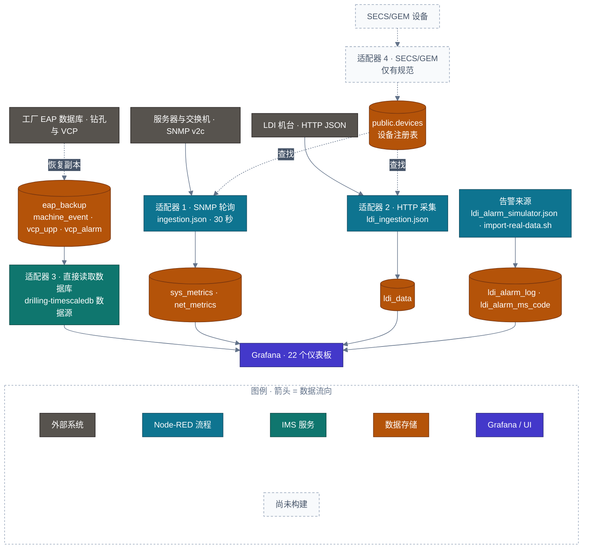

<!-- GLOBAL_NAV -->

  <a href="../../README.md"> <b>首页</b></a> &nbsp;|&nbsp;
  <a href="../README.md"> <b>文档索引</b></a>

 

  <h1>设备自动化集成层架构规范 (EAP)</h1>
  
<b>设备自动化程序 (Equipment Automation Program) 适配器模式、多协议遥测接入、SECS/GEM 接口契约及统一设备注册表</b>

  

    <a href="../../../docs/architecture/EAP_ARCHITECTURE.md">English</a> |
    <a href="../../../th/docs/architecture/EAP_ARCHITECTURE.md">ไทย</a> |
    <a href="EAP_ARCHITECTURE.md">简体中文</a>
  

---

> **EAP = Equipment Automation Program (设备自动化程序)** — 遵循 SECS/GEM 工业标准的设备接口层，依据系统设计范围确立 (非企业应用平台 "Enterprise Application Platform")。基石技术规范请参阅 `docs/architecture/IMS_MANUFACTURING_PLATFORM_V2.md` §3。
>
> **现实边界声明:** IMS 是一套纯粹的运行监控平台 (Monitoring-only)。它仅负责采集运行遥测数据并分发预警；绝不向下位机写入控制指令、下发生产配方 (Recipes) 或维系设备运行状态机。当前生产线上的 LDI 机台通过 SNMP 轮询与 HTTP 接口采集。本文档不声明完全符合 SECS/GEM 规范，亦不模拟虚构的 SECS/GEM 协议栈，而是对生产就绪的各适配器进行标准化梳理，并为未来的物理机台接入建立严格的接口契约。
>
> **数据源真实性:** 下文所述的 SNMP、HTTP/JSON 及 EAP 适配器均直接基于 `nodered_data/flows/ingestion.json`、`nodered_data/flows/ldi_ingestion.json` 及 `scripts/mock/eap-mock-data.js` 的源码实现。

---

## 1. 多协议设备接入总体架构拓扑 (EAP Topology)

---

## 2. 四大设备适配器接口契约

无论下位机采用何种物理通信协议，所有适配器的核心任务完全一致：将来自设备或模拟源的遥测数据和报警事件接入 `public.devices` 以及对应的时序超表中，并以 `device_id` 作为贯穿全系统监控大屏、SPC/RCA 视图及报警主字典的唯一主键。

### 适配器 1 — SNMP (IT/OT 基础设施网络设备)
* **代码物理位置:** `nodered_data/flows/ingestion.json` ("IMS Ingestion Pipeline" 流水线标签)。
* **设备元数据模型:** `public.devices` 中 `device_type IN ('server','workstation','network')` 的数据行，维护 `hostname`、`ip_address`、`snmp_community`、`snmp_port`、`poll_interval` 等字段。
* **数据采集方案:** 每隔 30 秒，`fork_5_ways` 并发派发针对各注册设备的 SNMP v2c Walk 轮询 (采集 CPU、存储、网络、温度及 LDI OID)。
* **事件/报警采集:** 协议层零报警机制 — 此适配器仅负责采集指标，报警由下游阈值分析计算触发。
* **数据映射入库:** `sre_parser` 维护每台设备的运行状态，并批量入库至 `sys_metrics`、`net_metrics` 与 `ldi_metrics`。

### 适配器 2 — HTTP/JSON (LDI 制造工序高频遥测)
* **代码物理位置:** `nodered_data/flows/ldi_ingestion.json` ("IMS LDI Ingestion" 流水线标签)。
* **设备元数据模型:** `public.devices` 中 `device_type='ldi'` 且 `process_type='ldi'` 的设备记录 (数据库迁移 067/068)。
* **数据采集方案:** 设备通过 HTTP POST 向 `POST /ldi-telemetry` 推送 JSON 批次数组 (携带 `x-api-key` 鉴权)。每个批次包含 `eqp_id` (映射至 `device_id`)、PE1-6、JE1-4、板件厚度、扫描速度及曝光剂量。
* **事件/报警采集:** 独立的数据流向 `public.ldi_alarm_log` 写入报警流水，通过 `device_id` + `event_id` 与时序数据精准对齐。
* **数据映射入库:** 批量执行 `INSERT INTO public.ldi_data ON CONFLICT (log_id, "time") DO NOTHING` 确保写入幂等。

### 适配器 3 — EAP 运行适配器 (CNC 数控钻孔与 VCP 电镀生产线)
* **代码物理位置:** `scripts/mock/eap-mock-data.js` 与 `database/mock/eap_backup-schema.sql`。
* **设备元数据模型:** 覆盖钻孔机群 (`drl001`–`drl010`) 与连续电镀线 (`vcp001`–`vcp005`)。
* **数据采集方案:** 精准仿真物理机台的实际加工周期：
  - **钻孔 (Drilling):** 加工程序启动、主轴转速 (RPM)、进给速度 (Feed Rate)、刀具物理寿命损耗计数及班次生产报表。
  - **电镀 (VCP):** 线体运行态切换 (RUN, IDLE, DOWN)、整流器输出电流、化学药水槽体热力学温度以及飞靶传送物理守恒公式 ($\text{plating\_time} \times \text{line\_speed} = 54$)。
* **数据映射入库:** 写入 `eap_backup` 数据库中的 `machine_event`、`vcp_upp` 及 `catalog.object_registry`，驱动 4 块钻孔车间大屏和 3 块电镀线大屏。

### 适配器 4 — SECS/GEM 接口契约 (未来物理新机台)
当前仓库中暂无适配器 4 的运行代码。未来物理机台采用 SECS/GEM 通信时，必须实现该标准契约接口：

| EAP 概念 | 适配器需实现的规范 | 映射的系统底层架构 |
|---|---|---|
| **设备元数据注册** | 在 `public.devices` 中注册设备身份 (`device_id`, `device_type`, `process_type`)。 | `public.devices` 元数据主表 |
| **事件收集报告 (CEID)** | 将 SECS-II 采集事件报告解析为以 `device_id` 为主键的结构化报警行。 | `<process>_alarm_ms_code` 字典与流水 |
| **状态变量报告 (SVID/ECID)** | 将 SECS-II 设备状态参数报告转换为以 `(device_id, time)` 为键的时序行。 | `public.<process>_data` 超表 |
| **契约显式版本化** | 严格遵循版本化适配器接口规范 (`adapter-contract-v1`)。 | API 网关与输入校验器 |

---

## 3. 工业安全合规边界 (IEC 62443 Security Boundaries)

将物理车间下位机接入监控系统涉及跨越运营技术 (OT) 网络安全边界：
* **边界 1（入口）：** nginx 反向代理。**目前以明文 HTTP 提供服务，尚未配置 TLS 终止。** `/alarm-api/` 和 `/factory-twin-3d/` 需要有效的 Grafana 会话（`auth_request`）；`/ldi-telemetry` 和 `/inject` 需要 `X-API-Key` 请求头（由 Node-RED 校验），并有速率限制。
* **边界 2（内部服务）：** 各服务在 Docker 内部网络中通过事务池模式的 PgBouncer 访问 TimescaleDB，并各自使用独立角色（见 `docs/data/DATA_GOVERNANCE.md`）；`alarm-api` 使用参数化查询。
* **边界 3 (车间物理设备网):** 未来部署适配器 4 时，必须配置工业级 OT 防火墙物理隔离、启用 mTLS 双向认证及 IP 白名单，并采用单向只读物理分流 (Read-only network tap)，杜绝监控系统向现场生产机台回传下发写入指令的潜在隐患。

---

[⬅️ 返回架构总览](ARCHITECTURE.md) | [ 主代码仓库](../../README.md)
