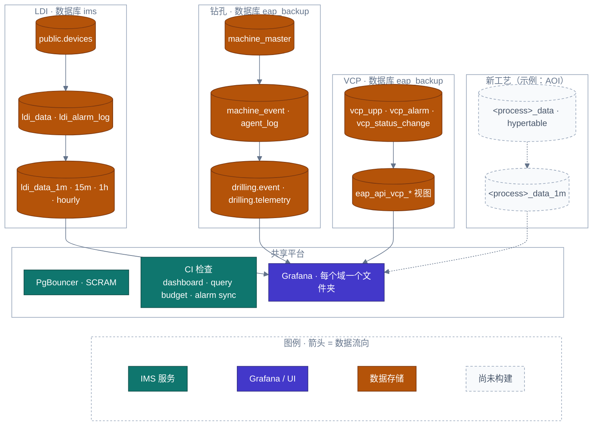

<!-- GLOBAL_NAV -->
<div align="right">
  <a href="../../README.md"> <b>首页</b></a> &nbsp;|&nbsp;
  <a href="../README.md"> <b>文档索引</b></a>
</div>
<br/>

<div align="center">
  <h1>IMS 制造工序领域横向扩展与架构模式规范 (Manufacturing Domain Extensibility)</h1>
  <p><b>多工艺扩展蓝图、LDI 参考架构模式、数据库命名空间隔离与新设备工序接入核对清单</b></p>
  <p>
    <a href="../../../docs/architecture/MANUFACTURING_DOMAIN.md">English</a> |
    <a href="../../../th/docs/architecture/MANUFACTURING_DOMAIN.md">ไทย</a> |
    <a href="MANUFACTURING_DOMAIN.md">简体中文</a>
  </p>
</div>

---

> **制定目标:** 为 IMS 工业制造工序接入 (如 LDI 光刻曝光、CNC 钻孔设备群、VCP 连续电镀生产线) 确立通用标准化架构范式，确保未来接入*全新工序类型* (例如：AOI 自动光学检测、化学蚀刻 Etching、表面贴装 SMT) 能够以完全增量 (Additive) 的形式落地 —— 仅需追加一个数据库版本迁移脚本、一套专属报警字典以及一组全新的工序三联仪表盘 —— 绝不重构或破坏现存运行中的生产流水线。
>
> **数据源真实性:** 下文所述的架构模式完整反映了 LDI、CNC 钻孔和 VCP 电镀生产线的实际工程落地，并与活动数据库元数据及仪表盘资产库严格对齐。
>
> **高内聚可扩展性:** 确保在跨越多生产制造阶段横向扩展时零系统停机，并恪守严格的关注点分离原则。

---

## 1. 制造工序横向扩展架构拓扑 (Domain Topology)



---

## 2. 标准五层扩展范式对比矩阵 (5-Tier Pattern)

| 架构层级 | LDI 光刻曝光 (生产标准参考范例) | 适用于下一工序的通用范式 (如 AOI / 蚀刻) |
|---|---|---|
| **1. 设备身份标识** | `public.devices.device_type = 'ldi'`, `public.devices.process_type = 'ldi'` (迁移 067/068)。非制造硬件 `process_type` 为 `NULL`。 | 为机台注册明确的 `device_type` (如 `'aoi'`) 以及独立的 `process_type` (`'aoi'`, `'etching'`)。解耦双字段支持未来设备复用网络采集协议而保持工艺独立。 |
| **2. 时序数据存储** | `public.ldi_data` — 时序超表，承载专用参数 (`pe1..pe6`, `je1..je4`, 厚度, 扫描速度)，以 `(machine_id, time)` 为联合主键。 | 每种工艺工序建立专属超表，以 `(device_id, time)` 为键并外键关联 `public.devices`。字段设计严格遵循工艺物理指标 (如 AOI 存储缺陷数，蚀刻存储药水浓度)。 |
| **3. 报警主字典** | `public.ldi_alarm_ms_code` (代码, 严重等级, 文本描述) 与 `public.ldi_alarm_log` 事件流水，受 `alarm-sync-linter.js` 门禁约束。 | 每个工序建立一套专属报警字典表 (`<process>_alarm_ms_code`)，遵循相同外键约束与字段定义，并在代码检查工具中完成注册。 |
| **4. SPC / RCA 分析视图** | `public.v_machine_spc_fleet` 与 `public.v_ldi_rca_recent_window` (迁移 064)，基于 `device_type = 'ldi'` 进行过滤。 | 创建平级的工艺专用视图 (`v_<process>_spc_fleet`)，共享通用的 Cpk 计算与根因分析算法模型，并通过后台定时任务 `add_job` 自动刷新。 |
| **5. 监控大屏三联套件** | **操作员安灯看板** (`ims-ldi-operator-andon.json`)、**深度工程分析** (`ims-ldi-engineering-analytics.json`) 及 **制造指挥中心** (`ims-ldi-manufacturing.json`)。 | 统一在 `monitoring/grafana/dashboards/manufacturing/` 目录下交付该工艺的专用三联看板，打上 `["manufacturing", "<process>"]` 标签并通过 Linter 自动化校验。 |

---

## 3. 生产标准 DDL 迁移扩建模版

接入新工序时，只需编写增量版本化迁移脚本：

```sql
-- Migration 087: 接入新制造工艺 (以自动光学检测 AOI 为例)
-- 1. 在设备主表中注册新增设备
INSERT INTO public.devices (device_id, hostname, ip_address, device_type, process_type, location, enabled)
VALUES 
  ('AOI-01', 'aoi-station-01.factory.local', '10.20.30.51', 'aoi', 'aoi', 'Floor 2 - SMT Line 1', TRUE),
  ('AOI-02', 'aoi-station-02.factory.local', '10.20.30.52', 'aoi', 'aoi', 'Floor 2 - SMT Line 2', TRUE)
ON CONFLICT (device_id) DO NOTHING;

-- 2. 创建工艺专属时序表并转化为 TimescaleDB 超表
CREATE TABLE IF NOT EXISTS public.aoi_telemetry (
  "time" TIMESTAMPTZ NOT NULL,
  machine_id VARCHAR(64) NOT NULL REFERENCES public.devices(device_id),
  inspection_cycle_ms NUMERIC(10,2),
  defect_count INT DEFAULT 0,
  false_alarm_rate NUMERIC(5,2),
  optical_lighting_lux NUMERIC(8,2),
  lot_id VARCHAR(64)
);

SELECT create_hypertable('public.aoi_telemetry', 'time', chunk_time_interval => INTERVAL '1 day', if_not_exists => TRUE);

-- 3. 启用列式存储历史压缩
ALTER TABLE public.aoi_telemetry SET (
  timescaledb.compress,
  timescaledb.compress_segmentby = 'machine_id',
  timescaledb.compress_orderby = 'time DESC'
);
SELECT add_compression_policy('public.aoi_telemetry', INTERVAL '7 days');

-- 4. 创建专用报警字典表与事件流水记录表
CREATE TABLE IF NOT EXISTS public.aoi_alarm_ms_code (
  alarm_code VARCHAR(32) PRIMARY KEY,
  severity VARCHAR(16) NOT NULL CHECK (severity IN ('CRITICAL', 'WARNING', 'INFO')),
  description TEXT NOT NULL
);

CREATE TABLE IF NOT EXISTS public.aoi_alarm_log (
  event_id BIGSERIAL PRIMARY KEY,
  "time" TIMESTAMPTZ NOT NULL,
  machine_id VARCHAR(64) NOT NULL REFERENCES public.devices(device_id),
  alarm_code VARCHAR(32) NOT NULL REFERENCES public.aoi_alarm_ms_code(alarm_code),
  status VARCHAR(16) DEFAULT 'OPEN' CHECK (status IN ('OPEN', 'ACKNOWLEDGED', 'RESOLVED')),
  acknowledged_by VARCHAR(64),
  resolved_by VARCHAR(64)
);
```

---

## 4. 新工序接入标准化核对清单 (Checklist)

1. **版本化数据库迁移:** 在 `public.devices` 中注册设备身份，设定全新的 `device_type` 与 `process_type`；在同个迁移中创建时序超表与列式压缩策略。
2. **报警字典表初始化:** 建立 `<process>_alarm_ms_code` 报警主表并植入报警码字典，同步建立 `<process>_alarm_log` 事件流水表。
3. **物化持续聚合与分析视图:** 建立对应的高效 CAGG 物化汇总视图 (`cagg_<process>_1m`) 与 SPC 分析视图。
4. **大屏三联看板交付:** 构建操作员安灯板、工程分析板与指挥中心大屏，规范存放于 `manufacturing` 目录并配置对应标签。
5. **门禁与自动化单测覆盖:** 在 `tests/lint/alarm-sync-linter.js` 中注册新工序报警校验规则，执行 `scripts/pre-commit.js` 确保 100% 通过。
6. **自动刷新资产清单:** 运行 `node scripts/generate-dashboard-inventory.js` 与 `node scripts/generate-schema-inventory.js` 自动刷新架构文档。

---

[⬅️ 返回架构总览](ARCHITECTURE.md) | [ 主代码仓库](../../README.md)
