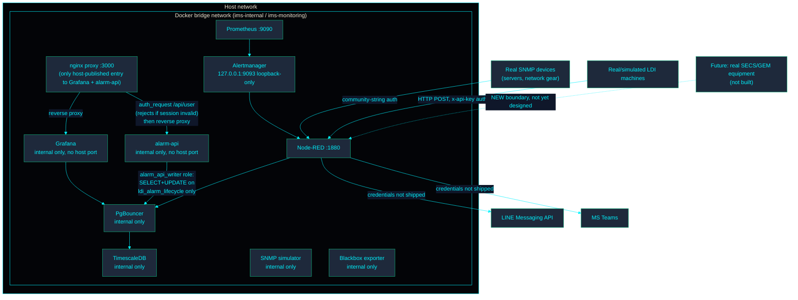

<!-- GLOBAL_NAV -->

  <a href="../../README.md"> <b>Home</b></a> &nbsp;|&nbsp;
  <a href="../README.md"> <b>Docs Index</b></a>

 

# 安全模型 (Security Model)

> **受众:** SRE/运维团队 (Operations)、QA/审计团队 (Audit)、安全审查团队 (Security Review)。
> **目标:** IMS 的架构级信任边界 (Trust-boundary) 视图。（注：有关权威的安全策略，请阅读仓库根目录下的 `SECURITY.md`）。
> **出处:** 已针对 2026-08-10 的生产环境 docker-compose 和 proxy 配置进行了验证。

---

## 信任边界 (Trust boundaries)

**边界 1 (Boundary 1) — 主机与 Docker 网络 (Host ↔ Docker network)。** 只有 `proxy` 服务 (nginx)、Node-RED、Prometheus 和 Alertmanager（仅回环/loopback-only）向主机发布了端口。Grafana 和 alarm-api 过去直接发布它们自己的端口；现在它们都被移到了 `proxy` 后面，因此每一个面向浏览器的请求——无论是读还是写——都会通过同一个前门。PgBouncer、TimescaleDB 和 SNMP 模拟器从不暴露给主机——它们仅限内部 Docker DNS 访问。

**边界 1a (Boundary 1a) — Grafana 会话作为写入路径的凭证 (Grafana session as the write-path credential)。** `alarm-api` (`services/alarm-api`) 是此堆栈中唯一一个可以从 Grafana 仪表板 (`IMS LDI - Alarm Console` 的确认/解决 (Acknowledge/Resolve) 按钮，写入 `public.ldi_alarm_lifecycle`) 改变状态的服务。它没有自己的登录系统：`proxy` 的 `/alarm-api/` 位置会在转发任何内容之前，针对 Grafana 自身的 `/api/user` 运行 `auth_request` 子请求。因此，只有当调用者已经持有有效的 Grafana 会话时，请求才能到达 alarm-api——这与操作员查看仪表板所需的登录是同一个，无需管理第二套凭证。alarm-api 作为 `alarm_api_writer`（迁移文件 078）连接到 Postgres，该角色的权限仅限于对 `ldi_alarm_lifecycle` 执行 `SELECT` 和 `UPDATE`，而不是 `ims_admin` 或 `grafana_reader`。已知缺陷 (Known gap)：它验证了调用者是某个已登录的 Grafana 用户，但除此之外没有验证具体是*哪一个*用户，它只依赖客户端在请求体中发送的操作者名称（`acknowledged_by`/`resolved_by` 是自我报告的，没有与会话本身的用户名进行交叉验证）。对于每个 Grafana 用户都已经受信任的操作员的单租户 (single-tenant) 部署来说，这是可以接受的；如果情况发生改变，需要重新审视这一点。

**边界 2 (Boundary 2) — 基础设施域与制造域 (Infrastructure domain ↔ Manufacturing domain)。** 根据 `docs/architecture/OWNERSHIP.md` 的说明，这仅仅是一个*逻辑上*的分离（文件夹/标签/CODEOWNERS 边界）——这两个域共享同一个数据库、同一个 Grafana 实例和同一个 Node-RED 进程。它们之间没有硬性的安全边界。这是针对目前规模下单租户部署所做出的被接受且明确声明的权衡 (trade-off)，而不是疏忽。

**边界 3 (Boundary 3) — 设备集成层 (Equipment Integration Layer) (前瞻性，尚未构建)。** 根据 `docs/architecture/EAP_ARCHITECTURE.md` 的说明，当未来真正的 SECS/GEM 设备通过尚未实现的第三个适配器连接时，该连接将跨越进入车间设备网络——这是一个真正全新的外部信任边界。在接入任何真实设备之前，它需要进行专门的安全加固审查（凭证处理、网络分段）。目前尚未设计，因为目前还没有可以作为设计参照的实体存在。

**`IMS_PGBOUNCER_MAX_CLIENT_CONN`**: 不要随意提高此值。内存限制必须随之按比例扩展（`1 个连接 ≈ 2MB`）。

## 各适配器的身份验证 (Authentication per adapter)

| 适配器 (Adapter)                     | 机制 (Mechanism)                                                                                                         | 执行位置 (Where enforced)                                                                    |
| ------------------------------------ | ------------------------------------------------------------------------------------------------------------------------ | -------------------------------------------------------------------------------------------- |
| SNMP (基础设施)                      | Community string (v2c) — 基于文件，未硬编码在流程中                                                                      | `nodered_data/flows/ingestion.json`, `public.devices.snmp_community`                         |
| HTTP/JSON (LDI)                      | 检查 `x-api-key` 标头是否匹配 `INGEST_API_KEY`                                                                           | `nodered_data/flows/ldi_ingestion.json`                                                      |
| Grafana → PgBouncer → TimescaleDB    | 使用连接池的数据库凭证                                                                                                   | `docker-compose.yaml` 环境变量, `pgbouncer.ini`                                              |
| Alarm Console → alarm-api (写入路径) | Grafana 会话，通过 nginx 针对 Grafana `/api/user` 的 `auth_request` 验证；数据库端使用最小权限的 `alarm_api_writer` 角色 | `proxy/nginx.conf`, `services/alarm-api/server.js`, 迁移文件 `078-alarm-api-writer-role.sql` |
| 告警推送 (LINE/Teams)                | Bearer token / webhook URL — **设计上刻意不在 `.env` 中提供**                                                            | `nodered_data/flows/alerting.json`                                                           |

SNMPv2c 的 community-string 身份验证本质上比 SNMPv3 弱（没有加密，community string 实际上是共享密码）——在连接真实的生产设备之前迁移到 SNMPv3 这一事项已经在 `SECURITY.md` 的加固检查清单中追踪了；为了避免两份文档随着时间的推移出现分歧，此处不再重复追踪。

## CODEOWNERS 作为安全控制手段 (CODEOWNERS as a security control)

`.github/CODEOWNERS` 中对安全敏感的行（如 `/.env.example`、`docker-compose*.yaml`、`/database/`、`/.github/`）会强制要求对这些路径进行代码审查，无论其属于哪个域。为了基础设施/制造域分离 (`docs/architecture/OWNERSHIP.md`) 而添加的带有作用域的行是对这一点的补充 (additive)，而不是替代——它们不会削弱或重新排序安全敏感的条目。

## 本文档未涵盖的内容 (What this document does not cover)

- 已知的局限性表格（PgBouncer 端口暴露的权衡、Node-RED 管理员身份验证等）——请参阅 `SECURITY.md`。
- AI 工具链的供应链安全（MCP servers、skills、插件）——请参阅 `SECURITY.md` 中的 AI Tooling Security 章节。
- 漏洞报告流程——请参阅 `SECURITY.md`。

## 相关文档 (Related documents)

- `SECURITY.md` — 权威的安全策略文档。
- `docs/architecture/OWNERSHIP.md` — 基础设施/制造域边界说明。
- `docs/architecture/EAP_ARCHITECTURE.md` — 设备适配器模式以及边界 3 (Boundary 3) 的完整上下文。
- `docs/architecture/IMS_MANUFACTURING_PLATFORM_V2.md` §8 — 本信任边界框架的起源。

---

[⬅️ 返回 IMS 平台手册 (Back to IMS Platform Book)](IMS_PLATFORM_BOOK.md) | [ 主仓库 (Main Repository)](../../README.md)
