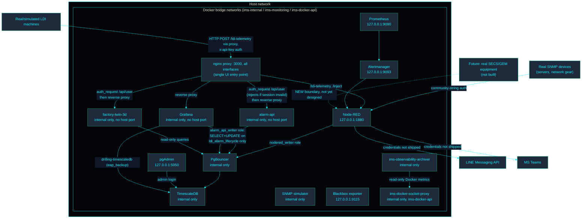

<!-- GLOBAL_NAV -->

  <a href="../../README.md"> <b>首页</b></a> &nbsp;|&nbsp;
  <a href="../README.md"> <b>文档索引</b></a>

 

# 安全模型

> **读者：** SRE/运维、QA/审计、安全评审。
> **目的：** IMS 在架构层面的信任边界视图。（注：权威的安全策略见仓库根目录的 `SECURITY.md`。）
> **依据：** 2026-08-10 对照运行中的 docker-compose 与代理配置核实；2026-09-26 对照 `main`（compose、`proxy/nginx.conf`、`.github/CODEOWNERS`、`main` 规则集）重新核实。

---

## 信任边界

```mermaid
%%{init: {'theme': 'base', 'themeVariables': { 'primaryColor': '#1e293b', 'primaryTextColor': '#00F2FE', 'primaryBorderColor': '#10B981', 'lineColor': '#00F2FE', 'secondaryColor': '#0f172a', 'tertiaryColor': '#0f172a', 'clusterBkg': '#030407', 'clusterBorder': '#00F2FE'}}}%%
flowchart TB
 subgraph HOST["Host network"]
  subgraph DOCKER["Docker bridge networks (ims-internal / ims-monitoring / ims-docker-api)"]
   PROXY["nginx proxy :3000, all interfaces\n(single UI entry point)"]
   GRAFANA["Grafana\ninternal only, no host port"]
   ALARMAPI["alarm-api\ninternal only, no host port"]
   TWIN["factory-twin-3d\ninternal only, no host port"]
   NODERED["Node-RED\n127.0.0.1:1880"]
   PROM["Prometheus\n127.0.0.1:9090"]
   AM["Alertmanager\n127.0.0.1:9093"]
   PGB["PgBouncer\ninternal only"]
   TSDB["TimescaleDB\ninternal only"]
   PGADMIN["pgAdmin\n127.0.0.1:5050"]
   SNMPSIM["SNMP simulator\ninternal only"]
   BLACKBOX["Blackbox exporter\n127.0.0.1:9115"]
    SOCKPROXY["ims-docker-socket-proxy\ninternal only, ims-docker-api"]
    ARCHIVER["ims-observability-archiver\ninternal only"]
  end
 end

 EXT1["Real SNMP devices\n(servers, network gear)"] -->|"community-string auth"| NODERED
 EXT2["Real/simulated LDI machines"] -->|"HTTP POST /ldi-telemetry via proxy,\nx-api-key auth"| PROXY
 PROXY -->|"/ldi-telemetry, /inject"| NODERED
 NODERED -->|"nodered_writer role"| PGB --> TSDB
 PROXY -->|"reverse proxy"| GRAFANA
 PROXY -->|"auth_request /api/user\n(rejects if session invalid)\nthen reverse proxy"| ALARMAPI
 PROXY -->|"auth_request /api/user\nthen reverse proxy"| TWIN
 GRAFANA --> PGB
 ALARMAPI -->|"alarm_api_writer role:\nSELECT+UPDATE on\nldi_alarm_lifecycle only"| PGB
 TWIN -->|"read-only queries"| PGB
 PGADMIN -->|"admin login"| TSDB
 PROM --> AM
 AM --> NODERED
 NODERED -->|"credentials not shipped"| LINE["LINE Messaging API"]
 NODERED -->|"credentials not shipped"| TEAMS["MS Teams"]

 
 ARCHIVER -->|"read-only Docker metrics"| SOCKPROXY
 GRAFANA -->|"drilling-timescaledb (eap_backup)"| TSDB
 FUTURE["Future: real SECS/GEM equipment\n(not built)"] -.->|"NEW boundary, not yet designed"| NODERED
```

**边界 1——主机 ↔ Docker 网络。** 唯一监听外部网络接口的服务是 `proxy` 服务（nginx，`${GRAFANA_PORT:-3000}`）。`pgadmin`（`5050`）、Node-RED、Prometheus、Alertmanager 与 Blackbox exporter 发布的端口均绑定在 `127.0.0.1` 本地回环。Grafana、alarm-api 与 Factory Twin 均位于 `proxy` 之后，因此所有面向浏览器的请求统一经过唯一入口。PgBouncer、TimescaleDB、SNMP 模拟器与 image renderer 从不暴露给主机——只使用 Docker 内部 DNS。`observability-archiver` 通过内部网络的 `ims-docker-socket-proxy` 访问 Docker 守护进程，并具备受控的只读权限。

**边界 1a——以 Grafana 会话作为写入路径的凭据。** `alarm-api`（`services/alarm-api`）是本栈中唯一会从 Grafana 仪表板改变状态的服务（`IMS LDI - Alarm Console` 的确认/解决按钮，写入 `public.ldi_alarm_lifecycle`）。它没有自己的登录：`proxy` 的 `/alarm-api/` location 在转发任何内容之前，都会针对 Grafana 自身的 `/api/user` 发起一次 `auth_request` 子请求，因此只有调用方已持有有效 Grafana 会话时，请求才能到达 alarm-api——这与操作员查看仪表板本就需要的登录相同，而不是另一套需要管理的凭据。`/factory-twin-3d/` location 使用同一闸门。alarm-api 以 `alarm_api_writer` 角色（迁移 078）连接 Postgres，该角色仅对 `ldi_alarm_lifecycle` 拥有 `SELECT`+`UPDATE` 权限——既不是超级用户，也不是 `grafana_reader`。随后 alarm-api 会自行识别调用方：它向 Grafana 查询 `/api/user`（登录名）和 `/api/user/orgs`（在当前组织中的角色），并把该登录名记录为操作人。请求体中提交的 `acknowledged_by` / `resolved_by` 会被忽略，Viewer 会收到 403；只有 Editor、Admin 或 Grafana 服务器管理员可以确认或解决告警。`tests/unit/alarm-api-server.test.js` 覆盖了这些行为，并已经通过 nginx 对 Grafana 13.1.2 做过端到端验证。

**边界 1b——数据接入端点。** 任何能访问统一入口端口的人都能访问 `/ldi-telemetry` 与 `/inject`。它们仅受请求头 `x-api-key` 与 `INGEST_API_KEY` 是否一致的保护，因此该密钥必须是新生成的，绝不能使用 `.env.example` 中的公开值。

**边界 2——基础设施领域 ↔ 制造领域。** 按照 `docs/architecture/OWNERSHIP.md`，这只是*逻辑*上的划分（文件夹/标签/CODEOWNERS 边界）——两个领域共用一个数据库、一个 Grafana 实例、一个 Node-RED 进程，彼此之间没有硬性的安全边界。这是在该规模的单租户部署下明确说明、有意接受的权衡，并非疏忽。

**边界 3——设备集成层（前瞻性，尚未构建）。** 按照 `docs/architecture/EAP_ARCHITECTURE.md`，一旦有真实的 SECS/GEM 设备通过尚未实现的第三个适配器接入，该连接就会进入工厂现场的设备网络——这是一个真正全新的外部信任边界。在接入任何真实设备之前，都需要单独进行加固评审（凭据处理、网络隔离）。由于目前还没有可供设计的对象，因此尚未设计。

**PgBouncer `MAX_CLIENT_CONN`**（`docker-compose.yaml` 中为 `200`）：不要随意调高。内存限制必须随之调整（`1 connection ≈ 2MB`）。

## 各适配器的认证方式

| 适配器 | 机制 | 执行位置 |
| --- | --- | --- |
| SNMP（基础设施） | community string（v2c），按设备存放在数据库中——未硬编码在 flow 里 | `public.devices.snmp_community`，由 `nodered_data/flows/ingestion.json` 读取 |
| HTTP/JSON（LDI） | 校验请求头 `x-api-key` 是否与 `INGEST_API_KEY` 一致 | `nodered_data/flows/ldi_ingestion.json`，经 `proxy/nginx.conf` 暴露 |
| Grafana → PgBouncer → TimescaleDB | `grafana_reader` 角色（只读），密码来自 `GRAFANA_DB_PASSWORD` | `docker-compose.yaml` 环境变量；PgBouncer userlist 由 `pgbouncer/entrypoint-wrapper.sh` 生成；角色密码由 `postgres/init/003-grafana-password.sh` 设置 |
| Alarm Console → alarm-api（写入路径） | Grafana 会话，经 nginx `auth_request` 针对 Grafana 的 `/api/user` 校验；数据库侧使用最小权限的 `alarm_api_writer` 角色 | `proxy/nginx.conf`、`services/alarm-api/server.js`、迁移 `078-alarm-api-writer-role.sql` |
| 浏览器 → Factory Twin 3D | 同一个基于 Grafana 会话的 `auth_request` 闸门；没有有效会话时，孪生的每个路由都返回 401（由代理模式下的浏览器回归测试断言） | `proxy/nginx.conf`、`services/factory-twin-3d` |
| Node-RED 编辑器 / 管理 API | 使用 bcrypt 哈希的 `adminAuth`；未设置 `NODE_RED_ADMIN_PASSWORD_HASH` 时 Node-RED 拒绝启动 | `nodered_data/settings.js` |
| 告警投递（LINE/Teams） | Bearer 令牌 / webhook URL——**按设计不在 `.env` 中提供** | `nodered_data/flows/alerting.json` |

SNMPv2c 的 community string 认证天生弱于 SNMPv3（无加密，community string 实际上就是一个共享密码）——`SECURITY.md` 的加固检查清单已跟踪"接入真实生产设备前迁移到 SNMPv3"这一事项；此处不再重复跟踪，以免两份文档日后出现分歧。

## 作为安全控制的 CODEOWNERS 与分支保护

`.github/CODEOWNERS` 列出了安全敏感路径（`/SECURITY.md`、`/.env.example`、`/docker-compose*.yaml`、`/database/`、`/postgres/`、`/.github/`、`/nodered_data/flows/`），并为其请求所有者评审。`main` 规则集要求 1 个批准、所有评审讨论已解决、线性历史以及 `validate-architecture` 状态检查，但**没有**设置 `require_code_owner_review`，因此 CODEOWNERS 只会请求评审而不会强制——而且目前没有任何作业上报 `validate-architecture`，所以合并暂时依赖管理员绕过。这两点都作为后续事项记录在 `CONTRIBUTING.md` 中。为基础设施/制造划分新增的领域路径（`docs/architecture/OWNERSHIP.md`）是对安全敏感条目的补充，而非替代。

## 本文档不涵盖的内容

- 已知限制表（公开的示例密钥、pgAdmin 暴露、明文 HTTP 等）——见 `SECURITY.md`。
- AI 工具供应链安全（MCP 服务器、skill、插件）——见 `SECURITY.md` 的 AI 工具安全一节。
- 漏洞报告流程——见 `SECURITY.md`。

## 相关文档

- `SECURITY.md`——权威的安全策略。
- `docs/architecture/OWNERSHIP.md`——基础设施/制造领域边界。
- `docs/architecture/EAP_ARCHITECTURE.md`——设备适配器模式以及边界 3 的完整背景。
- `docs/architecture/FACTORY_TWIN_SECURITY_MODEL.md`——Factory Twin 自身的信息披露模型。
- `docs/architecture/IMS_MANUFACTURING_PLATFORM_V2.md` §8——这一信任边界框架的出处。

---

[⬅️ 返回 IMS Platform Book](IMS_PLATFORM_BOOK.md) | [ 主仓库](../../README.md)
