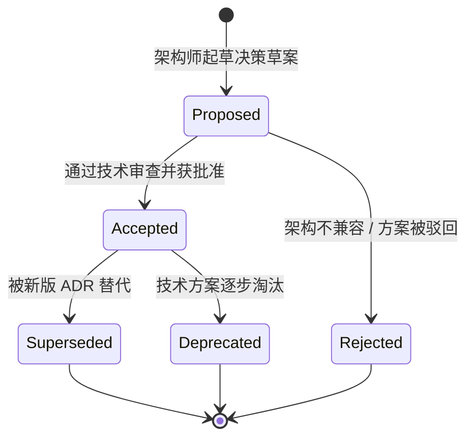
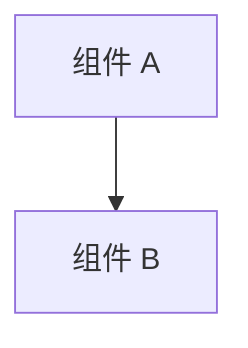

<!-- GLOBAL_NAV -->
<div align="right">
  <a href="../../../README.md"> <b>首页</b></a> &nbsp;|&nbsp;
  <a href="../../README.md"> <b>文档索引</b></a>
</div>
<br/>

<div align="center">
  <h1>ADR 0001: 记录架构决策 (Record Architecture Decisions)</h1>
  <p><b>架构决策记录标准、生命周期管理与设计治理体系</b></p>
  <p>
    <a href="../../../../docs/architecture/decisions/0001-record-architecture-decisions.md">English</a> |
    <a href="../../../../th/docs/architecture/decisions/0001-record-architecture-decisions.md">ไทย</a> |
    <a href="0001-record-architecture-decisions.md">简体中文</a>
  </p>
</div>

---

> **状态 (Status):** 已接受 (Accepted)  
> **日期 (Date):** 2026-08-26  
> **决策者 (Deciders):** 首席架构师 (Lead Architect), SRE 团队, OT 系统工程师  
> **技术范围 (Technical Scope):** 架构文档标准、知识管理、变更治理体系

---

## 1. 背景与问题陈述 (Context & Problem Statement)

**工业监控系统 (IMS)** 是关键任务级 (Mission-Critical) 工业遥测平台，负责接收、处理并可视化来自高速 PCB 制造设备 (如 LDI 光刻机、CNC 钻孔机、VCP 垂直连续电镀线) 以及企业级 IT/OT 网络基础设施的高频运行数据。

在工程研发与维护生命周期中，必须针对数据库引擎、协议适配器、连接池架构、内存回收机制及前端仪表盘制定关键架构决策。若缺乏具备版本控制且不可篡改的架构决策日志，将引发严重风险：
1. **架构漂移 (Architectural Drift):** 未来的工程师可能会无意中推翻关键限制 (例如绕过 PgBouncer 事务连接池或引入被禁止的 `ims.*` 独立 Schema)。
2. **隐性知识流失 (Tribal Knowledge Loss):** 性能优化背后的底层原理 (如 Node-RED 中 O(1) 单趟垃圾回收机制) 会退化为口口相传的信息。
3. **合规与审计断层 (Audit & Compliance Gaps):** 无法满足工业安全标准 (IEC 62443 / ISO 27001) 所要求的变更可追溯性与治理审计。

---

## 2. 决策驱动因素 (Decision Drivers)

- **版本控制与全面可追溯性:** 架构决策必须与代码同处于 Git 仓库中，并通过 Pull Request 同步演进。
- **开发人员入职效率 (Onboarding Velocity):** 新团队成员不仅需要了解系统*具备什么功能*，更需深刻理解*为何采用该技术选型与架构约束*。
- **自动化验证体系 (Automated Validation):** 决策必须能够从代码注释、预提交检查脚本 (Pre-commit Linters) 和测试套件中直接引用。
- **三语言同等支持 (Tri-lingual Parity):** 架构文档必须在英语、泰语和简体中文之间保持严格的 1:1 内容对称，支持跨国工厂的实际部署。

---

## 3. 备选方案评估 (Considered Options)

* **方案 1: 零散的 Git Commit 提交信息与 PR 描述** — 维护开销低，但信息碎片化、不可全局检索，且在 Squash Merge 时容易丢失。
* **方案 2: 集中式外部 Wiki / Confluence 空间** — 维护成本极高，极易与实际生产代码脱节，且无法在物理隔离的工业局域网 (Air-gapped) 中访问。
* **方案 3: 代码仓库内的 Markdown 架构决策记录 (ADRs) (入选)** — 存放在 `docs/architecture/decisions/` 下的轻量级 Markdown 文件，通过标准 PR 流程审查并受到版本控制。

---

## 4. 决策结果 (Decision Outcome)

我们决定采纳基于 **MADR (Markdown Architectural Decision Records)** 标准的 **架构决策记录 (ADRs)**。

任何对系统具有重大架构影响的技术决策，必须以独立 ADR 文件的形式记录在 `docs/architecture/decisions/` 目录下。

### ADR 生命周期状态机 (Lifecycle State Machine)



### 目录结构与文件命名规范

ADR 文件采用 4 位零填充数字作为前缀：
```text
docs/architecture/decisions/
├── 0001-record-architecture-decisions.md
├── 0002-timescaledb-for-timeseries.md
└── ...
```

`docs/` 目录下的每个 ADR 文件必须在以下路径保持严格的 1:1 对称翻译：
- `th/docs/architecture/decisions/`
- `zh-CN/docs/architecture/decisions/`

---

## 5. 标准 ADR 模板规范 (Standard ADR Template)

新起草的 ADR 必须遵循以下标准化结构：

```markdown
<!-- GLOBAL_NAV -->
<div align="right">
  <a href="../../../README.md"> <b>Home</b></a> &nbsp;|&nbsp;
  <a href="../../README.md"> <b>Docs Index</b></a>
</div>
<br/>

<div align="center">
  <h1>ADR NNNN: [简明决策标题]</h1>
  <p><b>[一句话概括背景与最终决策结果]</b></p>
  <p>
    <a href="NNNN-[title].md">English</a> |
    <a href="../../../th/docs/architecture/decisions/NNNN-[title].md">ไทย</a> |
    <a href="../../../zh-CN/docs/architecture/decisions/NNNN-[title].md">简体中文</a>
  </p>
</div>

---

> **Status:** [Proposed | Accepted | Rejected | Deprecated | Superseded by ADR-XXXX]  
> **Date:** YYYY-MM-DD  
> **Deciders:** [决策责任人列表]  
> **Technical Scope:** [子系统 / 模块]

---

## 1. 背景与问题陈述 (Context & Problem Statement)
[描述工程背景以及必须做出决策的具体技术问题。]

## 2. 决策驱动因素 (Decision Drivers)
[列出性能要求、可靠性指标及运营边界约束。]

## 3. 备选方案评估 (Considered Options)
* **方案 1:** [标题与简要说明]
* **方案 2:** [标题与简要说明]
* **方案 3:** [标题与简要说明]

## 4. 决策结果 (Decision Outcome)
[明确说明入选方案并提供深入的技术论证。]

### 架构模型 (Architectural Model)


## 5. 影响与权衡取舍 (Consequences & Trade-offs)
* **积极影响:** [性能提升、收益与安全增强]
* **负面影响:** [系统复杂度增加、资源开销]
* **缓解措施:** [如何化解负面影响]
```

---

## 6. 影响与治理 (Consequences & Governance)

* **积极影响:**
  - 为所有重大工程决策建立了不可磨灭的历史审计追溯链。
  - 大幅缩短了分布式研发团队的新人上手周期。
  - 强制执行核心架构铁律 (例如：仅使用 `public` 命名空间，PgBouncer 事务连接池)。
* **负面影响:**
  - 提出重大架构重构时需要编写简短的文档记录。
* **缓解措施:**
  - 标准化轻量模板确保编写 ADR 通常可在 30 分钟内完成。
  - CI 自动化流水线保障三语言内容对称性与链接有效性。

---

[⬅️ 返回架构总览](../ARCHITECTURE.md) | [ 主代码仓库](../../../README.md)
