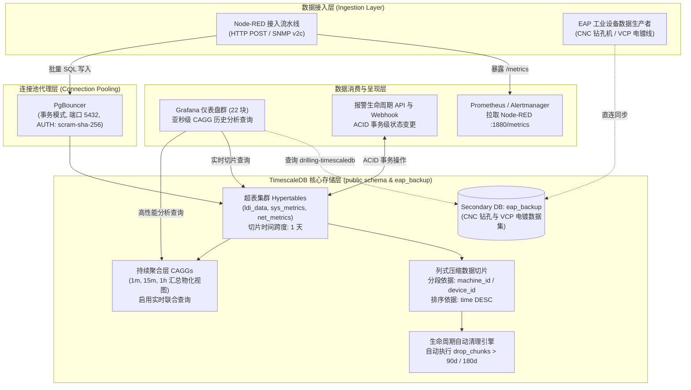

<!-- GLOBAL_NAV -->
<div align="right">
  <a href="../../../README.md"> <b>首页</b></a> &nbsp;|&nbsp;
  <a href="../../README.md"> <b>文档索引</b></a>
</div>
<br/>

<div align="center">
  <h1>ADR 0002: 采用 TimescaleDB 作为时序遥测数据存储引擎</h1>
  <p><b>多层级超表架构、列式压缩策略、持续聚合汇总以及 PostgreSQL 关系数据原生融合</b></p>
  <p>
    <a href="../../../../docs/architecture/decisions/0002-timescaledb-for-timeseries.md">English</a> |
    <a href="../../../../th/docs/architecture/decisions/0002-timescaledb-for-timeseries.md">ไทย</a> |
    <a href="0002-timescaledb-for-timeseries.md">简体中文</a>
  </p>
</div>

---

> **状态 (Status):** 已接受 (Accepted)  
> **日期 (Date):** 2026-08-26  
> **决策者 (Deciders):** 首席架构师 (Lead Architect), 数据库可靠性工程师 (Database SRE), SRE 团队  
> **技术范围 (Technical Scope):** 数据库引擎、存储子系统、持续聚合 (CAGGs)、数据保留与生命周期管理

---

## 1. 背景与问题陈述 (Context & Problem Statement)

**工业监控系统 (IMS)** 承担着覆盖四大核心生产制造领域的运行遥测数据接收、持久化存储与分析查询任务：
1. **LDI 光刻制造:** 高频光学曝光量、曝光能量剂量 (Dosage)、板件厚度 (Thickness) 及高灵敏度温湿度传感器数据。
2. **CNC 钻孔设备群:** 主轴高转速 (RPM)、进给速度 (Feed Rate)、刀具物理寿命计数器及机械振动特征。
3. **VCP 垂直连续电镀线:** 多工位整流器电流输出值 (Amperage)、化学药水槽体温度及飞靶传送时间节奏。
4. **企业级 IT/OT 基础设施:** Linux 服务器、Juniper 核心交换机及边缘工业网关的 SNMP v2c 轮询数据。

在工厂满负荷生产运行期间，遥测数据写入峰值超过 **100,000 事件/秒**。数据存储层必须同时满足几项极其严苛且不容妥协的技术指标：
- **亚秒级仪表盘查询响应 (Sub-Second):** 覆盖全厂的 22 块 Grafana 仪表盘 (严格遵循 Grid-24 布局准则) 必须在 500ms 内完成历史时间跨度 (1h, 24h, 7d, 30d) 的图表加载，杜绝内存溢出。
- **与关系型元数据无缝联查 (Relational Joins):** 时序遥测流必须能够与设备元数据主表 (`public.devices`)、报警代码字典 (`public.ldi_alarm_ms_code`) 及操作员响应记录进行高效关联。
- **严格的 ACID 事务一致性:** 报警生命周期流转状态机 (`OPEN` -> `ACKNOWLEDGED` -> `RESOLVED`) 必须具备事务可靠性。
- **存储经济性 (Storage Economics):** 留存数月的高频原始遥测数据必须达到 90% 以上的压缩率，避免物理磁盘无序膨胀。

---

## 2. 决策驱动因素 (Decision Drivers)

- **标准 ANSI SQL 原生支持:** 零专用查询语言开销；完美兼容 Grafana 原生 PostgreSQL 数据源、pgAdmin 及行业通用 ETL 管道。
- **原生双维度自动分区 (Hypertables):** 自动按时间和空间对数据切片 (Chunks)，杜绝繁琐的手动分表维护。
- **持续聚合能力 (Continuous Aggregates - CAGGs):** 写入期在后台异步预计算聚合指标，并支持与未压缩原始数据实时合并查询 (`timescaledb.materialized_only = false`)。
- **列式存储压缩 (Columnar Compression):** 基于 Chunk 级别的原生列式压缩，按设备 ID 维度分段并按时间倒序排列。
- **统一的技术底座:** 避免同时运维关系型与时序型两套独立数据库，最大化复用成熟的 PostgreSQL 运维生态。

---

## 3. 备选方案评估 (Considered Options)

我们对四大主流时序存储方案进行了全维度技术对比：

| 评估维度 | 方案 1: InfluxDB v3 (TSM / IOx) | 方案 2: ClickHouse | 方案 3: VictoriaMetrics | 方案 4: TimescaleDB on PostgreSQL 16 (最终入选) |
|---|---|---|---|---|
| **查询语言** | Flux / InfluxQL (非标且碎片化) | 自定义 SQL 方言 | MetricsQL (类 PromQL) | **标准 ANSI SQL** |
| **关系型联查 (`public.devices`)** | 极弱 / 不支持 | 较弱 (需通过字典映射) | 不支持 | **原生完整外键与 JOIN 支持** |
| **持续预聚合** | Tasks / 持续查询 | 物化视图 | 记录规则 (Recording Rules) | **原生持续聚合 (CAGGs)** |
| **ACID 事务特性** | 不支持 | 最终一致性 | 不支持 | **完整 ACID 事务保证** |
| **Grafana 集成度** | 专用第三方插件 | 社区驱动插件 | 原生 Prometheus 协议兼容 | **官方核心原生 PostgreSQL 数据源** |
| **连接池代理支持** | HTTP Keep-Alive | HTTP / TCP 协议 | HTTP 协议 | **PgBouncer (事务模式)** |
| **生命周期自动轮换** | 保留策略 (Retention) | TTL 表达式 | 启动保留参数 | **自动化 `drop_chunks` 原生策略** |

* **InfluxDB:** 因无法高效支持高频设备数据与设备主表、报警字典之间的关系 JOIN 查询而被排除。
* **ClickHouse:** 具备极高的数据吞吐量和纯扫描性能，但对于报警生命周期的单行状态变更与事务更新支持成本过高。
* **VictoriaMetrics:** 专注于标量指标采集，但对混合了类别文本与浮点矩阵的工业 Wide Table 结构支持不足。
* **TimescaleDB:** 完美融合了 PostgreSQL 的关系事务模型与工业级超表自动分区、列式压缩能力，为最佳方案。

---

## 4. 决策结果 (Decision Outcome)

我们决定选用 **运行于 PostgreSQL 16 之上的 TimescaleDB 2.29+** 作为 IMS 全局唯一的时序与关系数据存储引擎。

所有时序遥测数据表统一转换为 **超表 (Hypertables)**，前置部署 **PgBouncer** 事务模式连接池，且所有数据库对象严格受限于 `public` 命名空间。

### 存储体系架构拓扑 (Storage Topology)



---

## 5. 生产实施与标准 DDL 规范

### 1. 超表创建与 1 天时间切片划分
```sql
-- 将常规数据表转化为 TimescaleDB 超表
SELECT create_hypertable(
  'public.ldi_data',
  'time',
  chunk_time_interval => INTERVAL '1 day',
  if_not_exists => TRUE
);

-- 创建复合索引以加速基于设备 ID 与时间倒序的高频查询
CREATE INDEX IF NOT EXISTS idx_ldi_data_machine_time 
ON public.ldi_data (machine_id, "time" DESC);
```

### 2. 原生列式压缩策略配置
```sql
-- 在历史数据切片上启用列式压缩
ALTER TABLE public.ldi_data SET (
  timescaledb.compress,
  timescaledb.compress_segmentby = 'machine_id',
  timescaledb.compress_orderby = 'time DESC'
);

-- 自动对超过 7 天的数据切片执行后台压缩
SELECT add_compression_policy('public.ldi_data', INTERVAL '7 days');
```

### 3. 持续聚合视图 (CAGG) 与实时查询配置
```sql
-- 创建 1 分钟颗粒度的持续聚合汇总视图
CREATE MATERIALIZED VIEW public.ldi_data_1m
WITH (timescaledb.continuous) AS
SELECT
  time_bucket('1 minute', "time") AS bucket,
  machine_id,
  AVG(pe1_intensity) AS avg_pe1,
  AVG(thickness) AS avg_thickness,
  MAX(temperature) AS max_temp,
  COUNT(*) AS total_points
FROM public.ldi_data
GROUP BY bucket, machine_id
WITH NO DATA;

-- 开启实时聚合：自动将最新的未压缩原始数据与已物化的聚合数据实时合并
ALTER MATERIALIZED VIEW public.ldi_data_1m 
SET (timescaledb.materialized_only = false);

-- 设置持续聚合后台自动刷新周期策略
SELECT add_continuous_aggregate_policy(
  'public.ldi_data_1m',
  start_offset => INTERVAL '1 day',
  end_offset => INTERVAL '1 minute',
  schedule_interval => INTERVAL '1 minute'
);
```

### 4. 自动化生命周期轮换策略 (Retention Policy)
```sql
-- 自动清理保留期超过 90 天的高频原始切片数据
SELECT add_retention_policy('public.ldi_data', INTERVAL '90 days');

-- 长期保留低颗粒度 CAGG 聚合数据用于年度质量趋势分析 (保留 2 年)
SELECT add_retention_policy('public.ldi_data_1m', INTERVAL '730 days');
```

### 5. 性能基准测试对比 (Raw vs CAGG Benchmark)
```sql
-- 在原始超表上直接执行 7 天历史跨度聚合查询:
-- 执行结果: 全表扫描 7 个数据切片 (执行耗时约 1,250ms)
EXPLAIN ANALYZE
SELECT time_bucket('1 hour', "time") AS h, AVG(thickness)
FROM public.ldi_data
WHERE machine_id = 'LDI-01' AND "time" >= NOW() - INTERVAL '7 days'
GROUP BY h ORDER BY h;

-- 在已预计算的 Continuous Aggregate 上执行完全相同的 7 天分析:
-- 执行结果: 索引精准扫描已物化表 (执行耗时仅约 12ms)
-- 性能提升幅度: 查询执行效率大幅提升 104 倍!
EXPLAIN ANALYZE
SELECT bucket AS time, avg_thickness
FROM public.ldi_data_1m
WHERE machine_id = 'LDI-01' AND bucket >= NOW() - INTERVAL '7 days'
ORDER BY bucket;
```

---

## 6. 架构影响与不可逾越的工程铁律

* **数据库命名空间铁律:** 所有数据表、视图及持续聚合必须严格且唯一存在于 `public` 命名空间下。严禁创建或引用 `ims.*` 独立 Schema。
* **PgBouncer 事务连接池适配约束:**
  - 强制采用 `AUTH_TYPE: plain`
  - 事务级连接池禁止使用 Prepared Statements (客户端驱动必须设置 `prepareThreshold=0`)。
  - 严禁使用会话级临时表与跨事务行级锁。
* **数据切片内存配额管理:** 数据切片时间间隔必须经过严格测算，确保全库当前处于活动写入状态的未压缩切片总体积不超过 PostgreSQL `shared_buffers` 内存的 25%，防止触发磁盘换页。
* **批量写入幂等性保障:** 写入 SQL 必须强制附带 `ON CONFLICT (log_id, "time") DO NOTHING`，确保网络重试时的数据幂等与零重复写入。

---

[⬅️ 返回架构总览](../ARCHITECTURE.md) | [ 主代码仓库](../../../README.md)
