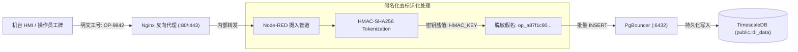

<!-- GLOBAL_NAV -->
<div align="right">
  <a href="../../README.md"> <b>首页</b></a> &nbsp;|&nbsp;
  <a href="../README.md"> <b>文档索引</b></a>
</div>
<br/>

<div align="center">
  <h1>IMS 工业数据治理、合规与隐私策略 (Data Governance)</h1>
  <p><b>数据分级分类、合规性框架 (IEC 62443, ISO 27001, PDPA)、个人数据假名化、TimescaleDB 保留策略与基于角色的访问控制 (RBAC)</b></p>
  <p>
    <a href="../../../docs/data/DATA_GOVERNANCE.md">English</a> |
    <a href="../../../th/docs/data/DATA_GOVERNANCE.md">ไทย</a> |
    <a href="DATA_GOVERNANCE.md">简体中文</a>
  </p>
</div>

---

## 1. 概述与治理范围

工业监控系统 (IMS) 负责处理来自精密 PCB 制造设备（LDI 激光直接成像机、CNC 数控钻孔机、VCP 垂直连续电镀线）以及企业 IT/OT 网络基础设施的高频遥测数据。本治理策略为数据分级分类、生命周期保留周期、加密保护、个人身份信息 (PII) 去标识化以及跨摄入管道、存储引擎和可视化展现层的基于角色的访问控制制定强制性规范。

所有数据处理均严格遵循以下国际合规标准：
- **IEC 62443-3-3**: 工业通信网络 – 网络与系统安全（分区、管道与数据完整性）。
- **ISO/IEC 27001:2022**: 信息安全、网络安全与隐私保护（访问控制 A.9、加密机制 A.10、操作安全 A.12）。
- **泰国个人数据保护法 (PDPA B.E. 2562)**: 设备操作员身份编号及工作站交接班记录的去标识化与假名化。

---

## 2. 四级数据分级分类矩阵 (Data Classification Matrix)

IMS 系统内的所有数据资产均被划归至以下四个安全级别之一：

| 安全级别 | 数据描述与典型示例 | 主存储引擎 | 加密要求 | 默认保留周期 | 访问权限级别 |
|:---------|:-------------------|:-----------|:---------|:-------------|:-------------|
| **第 1 级: 公开 (Public)** | 系统架构设计图、公开 Schema 定义、开源 API 规范文档、遥测指标 Ontology 字典。 | Git 代码仓库 (`docs/`) | 明文存储（公开只读） | 永久保存 / Git 版本化 | 匿名用户 / 完全公开 |
| **第 2 级: 内部 (Internal)** | 聚合时序数据 (15m, 1h CAGGs)、Grafana 仪表板配置、告警规则定义、容器运行指标 (`sys_metrics`)。 | TimescaleDB (`public`), Prometheus TSDB | 传输中 TLS 1.3，静态存储 AES-256 | 2 年 | 经认证员工 / 工程师 |
| **第 3 级: 机密 (Confidential)** | LDI 原始遥测 (`ldi_data`)、CNC 主轴高频振动 (`machine_event`)、电镀槽药水浓度 (`vcp_upp`)、交换机端口计数器 (`net_metrics`)。 | TimescaleDB 超表, PgBouncer 连接池 | 传输中 TLS 1.3，底层卷加密 | 90 天 (原始 Chunk) | 生产工程师 / 数据分析师 |
| **第 4 级: 绝密 / PII (Restricted)** | 机台操作员工号徽章 ID、班次技术员交接备注、内部静态 IP 网络拓扑映射、数据库管理员凭证。 | 凭证管理器 (`.env`), 脱敏管道 | 传输 TLS 1.3 + HMAC-SHA256 加盐哈希 | 30 天 (假名化脱敏后) | 仅限系统超级管理员 |

---

## 3. PII 假名化与去标识化架构 (PII Pseudonymization)

为满足 PDPA 与 GDPR 合规要求，机台 HMI 界面采集的操作员工号绝不能以明文形式持久化存储至时序超表中。



### 摄入管道脱敏实现代码 (Node.js)

在 Node-RED 摄入函数节点中，PII 脱敏在内存中同步执行，杜绝内存堆泄漏风险：

```javascript
// Node-RED Function Node: 操作员工号假名化脱敏
const crypto = global.get('crypto') || require('crypto');
const hmacKey = process.env.PII_HMAC_SALT || 'default-ims-secure-salt-2026';

function maskOperatorId(rawOperator) {
  if (!rawOperator || typeof rawOperator !== 'string') {
    return 'ANON-OPERATOR';
  }
  // 生成确定性的 12 字符单向哈希假名
  const hash = crypto.createHmac('sha256', hmacKey)
                     .update(rawOperator.trim().toUpperCase())
                     .digest('hex');
  return `op_${hash.substring(0, 12)}`;
}

// 在将有效载荷送入数据库写入缓冲队列前执行转换
if (msg.payload && msg.payload.operator_id) {
  msg.payload.operator_id = maskOperatorId(msg.payload.operator_id);
}

return msg;
```

---

## 4. TimescaleDB 数据保留策略与 Chunk 生命周期

TimescaleDB 将时序表按时间切分为底层离散的 Chunk 分区。保留与压缩策略由 TimescaleDB 后台任务调度器自动触发执行，无需人工执行昂贵的 VACUUM 维护。

```
原始高频遥测 (0 - 7 天)
  └── 未压缩 Chunks (1 小时 / 1 天时间间隔)
      └── 查询场景: 实时生产监控与微观根因下钻分析

列式高比例压缩历史 (7 - 90 天)
  └── Columnar 压缩 Chunks (磁盘压缩率达 90% 以上)
      └── 查询场景: 周度趋势比对与批量离线分析

持续聚合视图 (90 天 - 2 年)
  └── Continuous Aggregates (15 分钟、1 小时预计算桶)
      └── 查询场景: 管理层长期 KPI 报表与产能规划预测

超期数据自动修剪 (> 90 天原始数据 / > 2 年 CAGGs)
  └── 自动执行 drop_chunks() 物理释放磁盘空间
```

### 超表生命周期自动管理 SQL DDL

```sql
-- 连接至遥测时序数据库 (遵循铁律: 仅使用 public schema)
\c factory_telemetry;

-- 1. 针对超过 7 天的数据启用列式压缩 (Columnar Compression)
ALTER TABLE public.ldi_data SET (
  timescaledb.compress,
  timescaledb.compress_segmentby = 'eqp_id, process',
  timescaledb.compress_orderby = 'time DESC'
);

SELECT add_compression_policy('public.ldi_data', INTERVAL '7 days');

-- 2. 自动丢弃超过 90 天的原始 Chunk 数据
SELECT add_retention_policy('public.ldi_data', INTERVAL '90 days');

-- 3. 配置持续聚合视图 (Continuous Aggregates) 的生命周期保留策略
SELECT add_retention_policy('public.ldi_data_1m', INTERVAL '14 days');
SELECT add_retention_policy('public.ldi_data_15m', INTERVAL '90 days');
SELECT add_retention_policy('public.ldi_data_1h', INTERVAL '2 years');
SELECT add_retention_policy('public.sys_metrics_1h', INTERVAL '2 years');
SELECT add_retention_policy('public.net_metrics_1h', INTERVAL '2 years');
```

### 手动 Chunk 巡检与空间维护查询

```sql
-- 检查当前活跃 Chunk 分区、压缩状态及磁盘占用大小
SELECT
  chunk_name,
  hypertable_name,
  range_start,
  range_end,
  is_compressed,
  pg_size_pretty(before_compression_total_bytes) AS uncompressed_size,
  pg_size_pretty(after_compression_total_bytes) AS compressed_size
FROM timescaledb_information.chunks
WHERE hypertable_name = 'ldi_data'
ORDER BY range_start DESC
LIMIT 10;

-- 紧急情况下手动释放 90 天前数据以腾挪磁盘空间
SELECT drop_chunks('public.ldi_data', older_than => NOW() - INTERVAL '90 days');
```

---

## 5. 基于角色的访问控制 (RBAC) 与数据库授权 DDL

权限分配严格遵循最小权限原则 (PoLP)。所有应用端连接均通过事务连接池模式下的 PgBouncer 进行中继。

> [!IMPORTANT]
> **铁律架构规范 (Ironclad Rule)**: 所有表、视图以及持续聚合对象均必须置于 `public` 模式下，严禁创建或授权使用 `ims` 模式。

### 角色权限配置矩阵 (Role Matrix)

| 角色名称 | 赋予的权限 | 目标服务或访问主体 | 直接终端 Shell 权限 |
|:---------|:-----------|:-------------------|:--------------------|
| `ims_readonly` | 对 `public` 模式下所有表与视图拥有 `SELECT` 权限 | Grafana 数据源、报表工具 | 无 (仅限 PgBouncer) |
| `ims_ingest` | 对 `public` 模式下超表拥有 `INSERT`, `SELECT` 权限 | Node-RED 摄入管道 | 无 (仅限 PgBouncer) |
| `ims_analyst` | 对 `public` 模式拥有 `SELECT`, `CREATE TEMP` 权限 | 数据科学探索分析交互式终端 | 无 (仅限 PgBouncer) |
| `ims_admin` | 对数据库与模式拥有 `ALL PRIVILEGES` 权限 | 数据库升级迁移脚本、DBA | 有 (仅限授权堡垒机) |

### PostgreSQL 用户与权限分配 DDL 脚本

```sql
-- 1. 创建应用服务系统角色
CREATE ROLE ims_readonly WITH LOGIN PASSWORD 'CHANGE_IN_PRODUCTION_ENV';
CREATE ROLE ims_ingest WITH LOGIN PASSWORD 'CHANGE_IN_PRODUCTION_ENV';
CREATE ROLE ims_analyst WITH LOGIN PASSWORD 'CHANGE_IN_PRODUCTION_ENV';

-- 2. 撤销 public 角色的默认建表权限
REVOKE CREATE ON SCHEMA public FROM PUBLIC;

-- 3. 授予摄入管道最小写入与查询权限
GRANT CONNECT ON DATABASE factory_telemetry TO ims_ingest;
GRANT USAGE ON SCHEMA public TO ims_ingest;
GRANT INSERT, SELECT ON TABLE public.ldi_data TO ims_ingest;
GRANT INSERT, SELECT ON TABLE public.sys_metrics TO ims_ingest;
GRANT INSERT, SELECT ON TABLE public.net_metrics TO ims_ingest;

-- 4. 授予仪表板展示层只读权限 (Grafana)
GRANT CONNECT ON DATABASE factory_telemetry TO ims_readonly;
GRANT USAGE ON SCHEMA public TO ims_readonly;
GRANT SELECT ON ALL TABLES IN SCHEMA public TO ims_readonly;
ALTER DEFAULT PRIVILEGES IN SCHEMA public GRANT SELECT ON TABLES TO ims_readonly;

-- 5. 设置连接数上限防止突发占用打满连接池
ALTER ROLE ims_readonly CONNECTION LIMIT 30;
ALTER ROLE ims_ingest CONNECTION LIMIT 20;
```

---

## 6. 审计日志与系统状态巡检命令

所有系统管理运维操作及连接行为均由 PgBouncer 和 PostgreSQL 引擎完整留存审计：

```bash
# 检查 PgBouncer 当前客户端与服务端连接池状态
docker exec -it ims-pgbouncer psql -p 6432 -U postgres -c "SHOW CLIENTS;"
docker exec -it ims-pgbouncer psql -p 6432 -U postgres -c "SHOW POOLS;"

# 巡检 TimescaleDB 后台调度任务执行状态
docker exec -it ims-timescaledb psql -U postgres -d factory_telemetry -c "
SELECT
  job_id,
  application_name,
  schedule_interval,
  last_run_started_at,
  last_successful_finish,
  last_run_status
FROM timescaledb_information.jobs
ORDER BY job_id;
"
```
