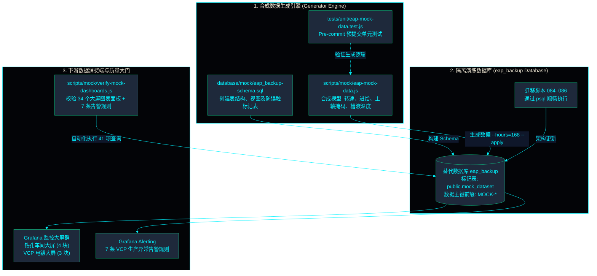

<!-- GLOBAL_NAV -->
<div align="right">
  <a href="../../README.md"> <b>首页</b></a> &nbsp;|&nbsp;
  <a href="../README.md"> <b>文档索引</b></a>
</div>
<br/>

<div align="center">
  <h1>CNC 钻孔与 VCP 电镀合成数据生成架构规范</h1>
  <p><b>隔离替代数据库生成器、规则驱动的合成时序数据、数据库迁移边界及监控仪表盘自动化校验</b></p>
  <p>
    <a href="../../../docs/data/MOCK_DATA.md">English</a> |
    <a href="../../../th/docs/data/MOCK_DATA.md">ไทย</a> |
    <a href="MOCK_DATA.md">简体中文</a>
  </p>
</div>

---

钻孔 (Drilling) 与垂直连续电镀 (VCP) 仪表板读取 `eap_backup` 数据库。在生产工厂服务器上，该数据库是实际恢复的历史工厂数据，不在 Git 仓库中。本指南阐述如何通过程序自动构建一个高保真的替代数据库 `eap_backup`，使钻孔大屏群、VCP 大屏群、VCP 告警规则以及数据库迁移 084–086 在脱离实际生产数据的情况下仍能完整运行与测试。

---

## 1. 合成数据生成管道与验证拓扑



---

## 2. 核心组成部分

| 组件名称 | 仓库路径 | 核心职责 |
|---|---|---|
| **模式定义** | `database/mock/eap_backup-schema.sql` | 建立钻孔/VCP 大屏、告警规则及迁移 084–086 所需的完整数据表与视图。 |
| **数据生成脚本** | `scripts/mock/eap-mock-data.js` | 按规则生成钻孔机作业事件与 VCP 电镀线遥测数据（全部为合成值）。 |
| **查询校验器** | `scripts/mock/verify-mock-dashboards.js` | 逐一执行钻孔与 VCP 大屏的全部图表面板查询及告警规则，验证返回行数。 |
| **单元测试套件** | `tests/unit/eap-mock-data.test.js` | 在无需连接实际数据库的情况下对生成器逻辑与数据格式进行断言验证。 |

所有数据指标均为程序合成：机台台数、设定阈值、工艺配方、板件物理尺寸、批次编号及报警报文，绝无真实工厂数据的泄露风险。

生成脚本严格遵循下游大屏所解析的真实数据格式：
- 事件代码与报警消息文本结构。
- 设备标识符规范 (电镀线统一采用 `-VCP` 后缀)。
- 槽液测定标签逆序逻辑 (`preset_<bath>` 为实际检测读数，`actual_<bath>` 为工艺目标设定值)。
- 配方恒等式: $\text{plating\_time} \times \text{line\_speed} = 54$。
- 成对出现的触发 (Triggered) 与复位 (Reset) 报警流水。

---

## 3. 安全防护与隔离机制

- **生产防护锁:** 若目标数据库已存在 `machine_event` 或 `vcp_upp` 表却缺少 `public.mock_dataset` 标记表，模式脚本将立刻拒绝执行，防止误抹除生产工厂真实还原库。
- **事务级原子写入:** 携带 `--apply` 参数时在单事务中执行，并在首行插入前强制校验标记表有效性。
- **精准数据清理:** 所有生成的模拟数据行主键均以 `MOCK-` 为前缀。配合 `--undo --apply` 指令可精准物理清除生成的数据行，绝不波及其它元数据。

---

## 4. 全新部署技术栈下的执行步骤

在全新安装且尚未建立 `eap_backup` 的环境中，于仓库根目录执行以下指令：

```bash
docker exec -i ims-timescaledb sh -c 'psql -U "$POSTGRES_USER" -d postgres -c "CREATE DATABASE eap_backup"'
docker exec -i ims-timescaledb sh -c 'psql -U "$POSTGRES_USER" -d eap_backup -v ON_ERROR_STOP=1' < database/mock/eap_backup-schema.sql
for m in 084 085 086; do
  docker exec -i ims-timescaledb sh -c 'psql -U "$POSTGRES_USER" -d "$POSTGRES_DB" -v ON_ERROR_STOP=1' < database/migrations/$m-*.sql
done
node scripts/mock/eap-mock-data.js --hours=168 --apply   # 生成 7 天 (168 小时) 拟真运行数据
```

---

## 5. 一次性临时容器内验证方案

在不干扰当前开发技术栈的前提下验证全套模拟管道：

```bash
docker run -d --name ims-mock-verify -e POSTGRES_PASSWORD=mockonly -e POSTGRES_DB=ims timescale/timescaledb:2.29.2-pg16
docker exec ims-mock-verify psql -U postgres -d ims -c "CREATE DATABASE eap_backup"
docker exec -i ims-mock-verify psql -U postgres -d eap_backup -v ON_ERROR_STOP=1 < database/mock/eap_backup-schema.sql
for m in 084 085 086; do 
  docker exec -i ims-mock-verify psql -U postgres -d ims -v ON_ERROR_STOP=1 < database/migrations/$m-*.sql
done
node scripts/mock/eap-mock-data.js --hours=168 --apply --container=ims-mock-verify --psql-user=postgres
node scripts/mock/verify-mock-dashboards.js --container=ims-mock-verify --psql-user=postgres
docker rm -f ims-mock-verify
```

---

## 6. 生成器核心参数与命令行标志

| 命令行标志 | 默认值 | 功能说明 |
|---|---|---|
| `--hours=N` | `24` | 以当前时间为终点的历史数据时间跨度 (小时)。 |
| `--seed=N` | `20260928` | 确定性随机数种子，保障多次生成数据的一致可复现性。 |
| `--drilling=N` | `12` | 拟真模拟的钻孔机台总数 (有效范围: 3–200)。 |
| `--incidents` | `false` | 在最后 35 分钟窗口内注入设备异常工况，触发全部 7 条 VCP 生产告警规则。 |
| `--apply` | `false` | 真正提交写入数据库。缺省时数据仅以 SQL 文件形式输出。 |
| `--undo` | `false` | 与 `--apply` 配合使用，批量物理删除所有以 `MOCK-` 开头的数据行。 |
| `--container` | `ims-timescaledb` | 目标数据库容器名称。 |

---

## 7. 实测验证结论

基于 TimescaleDB 2.29.2-pg16 容器环境的严格实测记录：
- 模式脚本及迁移 084、085、086 均顺利无异常执行。
- **正常基线 (168 小时数据):** 41 项查询全部通过且 **0 报错**。全部 34 个大屏图表面板查询均成功返回数据行，7 条告警规则查询均返回 0 行 (表明无异常报警，符合健康标准)。
- **故障注入工况 (`--incidents`):** 全部 7 条 VCP 告警规则在最后 35 分钟内准确命中并触发报警。

---

[⬅️ 返回遥测本体论手册](TELEMETRY_ONTOLOGY.md) | [ 主代码仓库](../../README.md)
