<!-- GLOBAL_NAV -->

  <a href="../../README.md"> <b>首页</b></a> &nbsp;|&nbsp;
  <a href="../README.md"> <b>文档索引</b></a>

 

#  证据文档 (Evidence Documentation)

欢迎来到 **Evidence** 目录。本节包含与 IMS 证据流程相关的文档。

```mermaid
%%{init: {'theme': 'base', 'themeVariables': { 'primaryColor': '#1e293b', 'primaryTextColor': '#00F2FE', 'primaryBorderColor': '#10B981', 'lineColor': '#00F2FE', 'secondaryColor': '#0f172a', 'tertiaryColor': '#0f172a', 'clusterBkg': '#030407', 'clusterBorder': '#00F2FE'}}}%%
flowchart LR
  ROOT["docs/evidence"]
  ROOT --> F0["ALARM_LATENCY_MEASUREMENT_NOTE"]
  ROOT --> F1["BROWSER_E2E_VERIFICATION"]
  ROOT --> F2["CREDENTIAL_ROTATION_P10R"]
  ROOT --> F3["CREDENTIAL_ROTATION_P10R8"]
  ROOT --> F4["CSS_UI_UX_EXCELLENCE_AUDIT"]
  ROOT --> F5["CSS_UI_UX_EXCELLENCE_FINAL"]
  ROOT --> F6["CVE_TRIAGE"]
  ROOT --> F7["DATA_INTEGRITY_VALIDATION_2026-08-15"]
  ROOT --> F8["DR_DRILL_3_FINDINGS"]
  ROOT --> F9["EVIDENCE_PACK"]
  ROOT --> F10["FACTORY_TWIN_3D_DEEP_AUDIT"]
  ROOT --> F11["FACTORY_TWIN_3D_PERFORMANCE"]
  ROOT --> F12["FACTORY_TWIN_3D_UX"]
  ROOT --> F13["FAILURE_DETECTION_MATRIX"]
  ROOT --> F14["FAULT_INJECTION_PLAN"]
  ROOT --> F15["FINAL_ACCEPTANCE_MATRIX_2026-08-15"]
  ROOT --> F16["FINAL_SECURITY_GATE_P11"]
  ROOT --> F17["FINAL_SECURITY_GATE_P12"]
  ROOT --> F18["GRAFANA_ANDON_COMPLIANCE_TIMELINE_REDESIGN"]
  ROOT --> F19["GRAFANA_ANDON_FT_INTEGRATION_RENDER"]
  ROOT --> F20["GRAFANA_DATA_INTEGRITY_P20_FINAL"]
  ROOT --> F21["GRAFANA_FRONTEND_EXCELLENCE_AUDIT"]
  ROOT --> F22["GRAFANA_FRONTEND_EXCELLENCE_FINAL"]
  ROOT --> F23["GRAFANA_FRONTEND_EXCELLENCE_P15"]
  ROOT --> F24["GRAFANA_FRONTEND_EXCELLENCE_P15R_AUDIT"]
  ROOT --> F25["GRAFANA_FRONTEND_EXCELLENCE_P15R_FINAL"]
  ROOT --> F26["GRAFANA_FRONTEND_EXCELLENCE_P15_FINAL"]
  ROOT --> F27["GRAFANA_FRONTEND_P16_FINAL"]
  ROOT --> F28["GRAFANA_FRONTEND_P17_FINAL"]
  ROOT --> F29["GRAFANA_FRONTEND_P18_FINAL"]
  ROOT --> F30["HISTORICAL_DATA_RECONCILIATION_2026-08-15"]
  ROOT --> F31["IMS_SECURITY_AND_INTEGRITY_P21"]
  ROOT --> F32["INDEX"]
  ROOT --> F33["KIOSK_LOAD_TEST"]
  ROOT --> F34["NODERED_4_1_13_VALIDATION"]
  ROOT --> F35["P11E_PRODUCTION_UPGRADE"]
  ROOT --> F36["PR22_MAIN_ONLY_COMMITS"]
  ROOT --> F37["PR22_MAIN_RECONCILIATION"]
  ROOT --> F38["SCALE_TEST_2026-08-15"]
  ROOT --> F39["SECURITY_CONTAINER_SCAN"]
  ROOT --> F40["SECURITY_GATE"]
  ROOT --> F41["SECURITY_MITIGATION_P7"]
  ROOT --> F42["SECURITY_REACHABILITY"]
  ROOT --> F43["SOAK_TEST_LOG"]
  ROOT --> F44["SYSTEM_TRUST_REPORT"]
  ROOT --> F45["TELEMETRY_READINESS"]
  ROOT --> F46["TV_WALL_FIELD_VALIDATION"]
```

##  目录结构图

##  文件索引

- [ALARM_LATENCY_MEASUREMENT_NOTE.md](ALARM_LATENCY_MEASUREMENT_NOTE.md)
- [BROWSER_E2E_VERIFICATION.md](BROWSER_E2E_VERIFICATION.md)
- [CREDENTIAL_ROTATION_P10R.md](CREDENTIAL_ROTATION_P10R.md)
- [CREDENTIAL_ROTATION_P10R8.md](CREDENTIAL_ROTATION_P10R8.md)
- [CSS_UI_UX_EXCELLENCE_AUDIT.md](CSS_UI_UX_EXCELLENCE_AUDIT.md)
- [CSS_UI_UX_EXCELLENCE_FINAL.md](CSS_UI_UX_EXCELLENCE_FINAL.md)
- [CVE_TRIAGE.md](CVE_TRIAGE.md)
- [DATA_INTEGRITY_VALIDATION_2026-08-15.md](DATA_INTEGRITY_VALIDATION_2026-08-15.md)
- [DR_DRILL_3_FINDINGS.md](DR_DRILL_3_FINDINGS.md)
- [EVIDENCE_PACK.md](EVIDENCE_PACK.md)
- [FACTORY_TWIN_3D_DEEP_AUDIT.md](FACTORY_TWIN_3D_DEEP_AUDIT.md)
- [FACTORY_TWIN_3D_PERFORMANCE.md](FACTORY_TWIN_3D_PERFORMANCE.md)
- [FACTORY_TWIN_3D_UX.md](FACTORY_TWIN_3D_UX.md)
- [FAILURE_DETECTION_MATRIX.md](FAILURE_DETECTION_MATRIX.md)
- [FAULT_INJECTION_PLAN.md](FAULT_INJECTION_PLAN.md)
- [FINAL_ACCEPTANCE_MATRIX_2026-08-15.md](FINAL_ACCEPTANCE_MATRIX_2026-08-15.md)
- [FINAL_SECURITY_GATE_P11.md](FINAL_SECURITY_GATE_P11.md)
- [FINAL_SECURITY_GATE_P12.md](FINAL_SECURITY_GATE_P12.md)
- [GRAFANA_ANDON_COMPLIANCE_TIMELINE_REDESIGN.md](GRAFANA_ANDON_COMPLIANCE_TIMELINE_REDESIGN.md)
- [GRAFANA_ANDON_FT_INTEGRATION_RENDER.md](GRAFANA_ANDON_FT_INTEGRATION_RENDER.md)
- [GRAFANA_DATA_INTEGRITY_P20_FINAL.md](GRAFANA_DATA_INTEGRITY_P20_FINAL.md)
- [GRAFANA_FRONTEND_EXCELLENCE_AUDIT.md](GRAFANA_FRONTEND_EXCELLENCE_AUDIT.md)
- [GRAFANA_FRONTEND_EXCELLENCE_FINAL.md](GRAFANA_FRONTEND_EXCELLENCE_FINAL.md)
- [GRAFANA_FRONTEND_EXCELLENCE_P15.md](GRAFANA_FRONTEND_EXCELLENCE_P15.md)
- [GRAFANA_FRONTEND_EXCELLENCE_P15R_AUDIT.md](GRAFANA_FRONTEND_EXCELLENCE_P15R_AUDIT.md)
- [GRAFANA_FRONTEND_EXCELLENCE_P15R_FINAL.md](GRAFANA_FRONTEND_EXCELLENCE_P15R_FINAL.md)
- [GRAFANA_FRONTEND_EXCELLENCE_P15_FINAL.md](GRAFANA_FRONTEND_EXCELLENCE_P15_FINAL.md)
- [GRAFANA_FRONTEND_P16_FINAL.md](GRAFANA_FRONTEND_P16_FINAL.md)
- [GRAFANA_FRONTEND_P17_FINAL.md](GRAFANA_FRONTEND_P17_FINAL.md)
- [GRAFANA_FRONTEND_P18_FINAL.md](GRAFANA_FRONTEND_P18_FINAL.md)
- [HISTORICAL_DATA_RECONCILIATION_2026-08-15.md](HISTORICAL_DATA_RECONCILIATION_2026-08-15.md)
- [IMS_SECURITY_AND_INTEGRITY_P21.md](IMS_SECURITY_AND_INTEGRITY_P21.md)
- [INDEX.md](INDEX.md)
- [KIOSK_LOAD_TEST.md](KIOSK_LOAD_TEST.md)
- [NODERED_4_1_13_VALIDATION.md](NODERED_4_1_13_VALIDATION.md)
- [P11E_PRODUCTION_UPGRADE.md](P11E_PRODUCTION_UPGRADE.md)
- [PR22_MAIN_ONLY_COMMITS.md](PR22_MAIN_ONLY_COMMITS.md)
- [PR22_MAIN_RECONCILIATION.md](PR22_MAIN_RECONCILIATION.md)
- [SCALE_TEST_2026-08-15.md](SCALE_TEST_2026-08-15.md)
- [SECURITY_CONTAINER_SCAN.md](SECURITY_CONTAINER_SCAN.md)
- [SECURITY_GATE.md](SECURITY_GATE.md)
- [SECURITY_MITIGATION_P7.md](SECURITY_MITIGATION_P7.md)
- [SECURITY_REACHABILITY.md](SECURITY_REACHABILITY.md)
- [SOAK_TEST_LOG.md](SOAK_TEST_LOG.md)
- [SYSTEM_TRUST_REPORT.md](SYSTEM_TRUST_REPORT.md)
- [TELEMETRY_READINESS.md](TELEMETRY_READINESS.md)
- [TV_WALL_FIELD_VALIDATION.md](TV_WALL_FIELD_VALIDATION.md)
