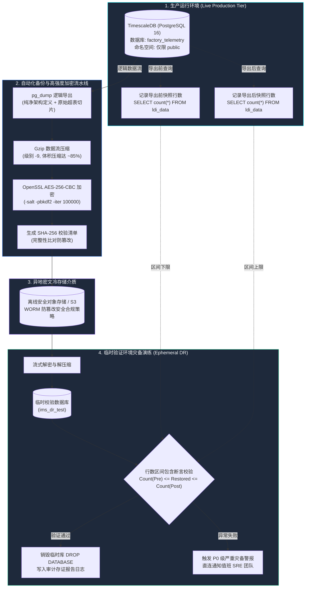

<!-- GLOBAL_NAV -->
<div align="right">
  <a href="../../README.md"> <b>首页</b></a> &nbsp;|&nbsp;
  <a href="../README.md"> <b>文档索引</b></a>
</div>
<br/>

<div align="center">
  <h1>IMS 数据库备份、恢复与有效性验证流程规范</h1>
  <p><b>企业级 pg_dump 流水线、AES-256 加密存储、临时数据库行数区间验证机制 (Row-Count Bracketing) 及时间点恢复 (PITR)</b></p>
  <p>
    <a href="../../../docs/operations/BACKUP_RESTORE.md">English</a> |
    <a href="../../../th/docs/operations/BACKUP_RESTORE.md">ไทย</a> |
    <a href="BACKUP_RESTORE.md">简体中文</a>
  </p>
</div>

---

> **受众对象:** SRE / 运维工程师、数据库管理员 (DBA)、信息安全审计员  
> **灾备恢复目标:** 恢复时间目标 (RTO) < 15 分钟 \| 恢复点目标 (RPO) < 1 小时  
> **合规遵循标准:** ISO 27001 A.12.3 (信息备份规范), IEC 62443-4-2 (数据完整性保障)  
> **数据源出处:** 基于生产技术栈在高频连续写入状态下运行 `scripts/dr-test.sh` 脚本所得实测数据。

---

## 1. 灾备与备份恢复体系架构



---

## 2. 生产环境标准备份操作流程

标准生产备份流水线完整导出关系元数据与全部时序超表数据行。通过流式管道执行高压缩与工业级对称加密 (AES-256-CBC)，杜绝备份数据在传输与存储介质中的泄密风险。

### 自动化备份脚本 (`scripts/backup-production.sh`)

```bash
#!/usr/bin/env bash
set -euo pipefail

# 环境参数配置
BACKUP_DIR="/var/backups/ims"
TIMESTAMP=$(date -u +"%Y%m%d_%H%M%SZ")
BACKUP_FILE="${BACKUP_DIR}/ims_backup_${TIMESTAMP}.sql.gz.enc"
CHECKSUM_FILE="${BACKUP_FILE}.sha256"
CONTAINER_NAME="ims-timescaledb"
DB_NAME="${POSTGRES_DB:-factory_telemetry}"
DB_USER="${POSTGRES_USER:-postgres}"

mkdir -p "${BACKUP_DIR}"

echo "==> [1/4] 记录导出前的实时数据行数 (Pre-count)..."
PRE_COUNT=$(docker exec "${CONTAINER_NAME}" psql -U "${DB_USER}" -d "${DB_NAME}" -tAc "SELECT count(*) FROM public.ldi_data;")

echo "==> [2/4] 执行流式 pg_dump 导出、Gzip 压缩与 AES-256 对称加密..."
# timescaledb_information 视图上的循环外键警告属于正常现象，无需干预
docker exec "${CONTAINER_NAME}" pg_dump -U "${DB_USER}" -d "${DB_NAME}"   --format=plain   --no-owner   --no-privileges   | gzip -9   | openssl enc -aes-256-cbc -salt -pbkdf2 -iter 100000 -out "${BACKUP_FILE}" -pass env:BACKUP_ENCRYPTION_KEY

echo "==> [3/4] 记录导出完成后的实时数据行数 (Post-count)..."
POST_COUNT=$(docker exec "${CONTAINER_NAME}" psql -U "${DB_USER}" -d "${DB_NAME}" -tAc "SELECT count(*) FROM public.ldi_data;")

echo "==> [4/4] 计算并生成 SHA-256 完整性哈希校验码..."
sha256sum "${BACKUP_FILE}" > "${CHECKSUM_FILE}"

echo "=========================================================="
echo "数据库备份成功完成!"
echo "目标文件:   ${BACKUP_FILE}"
echo "压缩体积:   $(du -h "${BACKUP_FILE}" | cut -f1)"
echo "哈希摘要:   $(cat "${CHECKSUM_FILE}")"
echo "有效区间:   ${PRE_COUNT} <= Restored <= ${POST_COUNT}"
echo "=========================================================="
```

---

## 3. 临时环境恢复与区间验证协议 (Verification Protocol)

由于 IMS 是一套**处于持续高频写入状态的时序监控系统**，对备份数据进行简单的“还原行数 == 当前实时行数”的等值比对必然产生误报。系统强制实施 **行数区间包含断言 (Row-Count Bracketing)**：恢复出的行数只要严格落在区间 $[Count_{	ext{pre}}, Count_{	ext{post}}]$ 之内即判定验证通过。

### 自动化灾备验证演练指令

```bash
# 执行自动化备份还原演练
./scripts/dr-test.sh backup-restore
```

### 手工验证标准排查流程

```bash
# 1. 验证备份密文文件的 SHA-256 完整性
sha256sum -c "${BACKUP_FILE}.sha256"

# 2. 在数据库实例中创建独立的临时演练库 (绝不触碰生产库)
docker exec ims-timescaledb psql -U "$POSTGRES_USER" -d postgres -c "CREATE DATABASE ims_dr_test;"

# 3. 流式解密、解压并向临时数据库导入数据
openssl enc -d -aes-256-cbc -pbkdf2 -iter 100000 -in "${BACKUP_FILE}" -pass env:BACKUP_ENCRYPTION_KEY   | gunzip   | docker exec -i ims-timescaledb psql -U "$POSTGRES_USER" -d ims_dr_test -v ON_ERROR_STOP=1

# 4. 执行数据行数区间比对
RESTORED_COUNT=$(docker exec ims-timescaledb psql -U "$POSTGRES_USER" -d ims_dr_test -tAc "SELECT count(*) FROM public.ldi_data;")

echo "恢复数据行数: ${RESTORED_COUNT}"
# 断言校验: PRE_COUNT <= RESTORED_COUNT <= POST_COUNT

# 5. 验证完毕后清理并销毁临时演练数据库
docker exec ims-timescaledb psql -U "$POSTGRES_USER" -d postgres -c "DROP DATABASE ims_dr_test;"
```

---

## 4. 恢复后持续聚合 (CAGG) 手动重算规范

TimescaleDB 持续聚合视图 (CAGGs) 的元数据定义随备份还原，但底层的预计算物化数据表需要异步重算。在生产环境执行全量灾难恢复后，必须执行以下指令强制立即物化数据：

```sql
-- 切换进入已恢复的业务数据库
\c factory_telemetry;

-- 强制刷新 1 分钟颗粒度物化聚合视图
CALL refresh_continuous_aggregate('public.cagg_ldi_metrics_1m', NULL, NULL);

-- 强制刷新 1 小时颗粒度分析聚合视图
CALL refresh_continuous_aggregate('public.cagg_ldi_hourly', NULL, NULL);

-- 核查超表数据切片与列式压缩恢复状态
SELECT 
  hypertable_name,
  num_chunks,
  compressed_chunks
FROM timescaledb_information.hypertables
WHERE hypertable_schema = 'public';
```

---

## 5. 基于 WAL 归档的时间点精确恢复 (PITR)

对于要求严苛零数据丢失的生产环境 (RPO < 5 分钟)，必须通过配置预写式日志 (WAL) 归档实现时间点精准恢复。

### 核心配置文件 (`postgresql.conf`)
```ini
# WAL 归档核心参数
wal_level = replica
archive_mode = on
archive_command = 'test ! -f /var/lib/postgresql/wal_archive/%f && cp %p /var/lib/postgresql/wal_archive/%f'
archive_timeout = 300
```

### PITR 精确时间点还原步骤
1. 停止运行中的数据库容器: `docker compose stop timescaledb`
2. 将最新的全量基准备份解压至数据存储卷目录中。
3. 在数据根目录下创建标志文件 `recovery.signal`。
4. 在 `postgresql.conf` 中追加恢复目标配置：
   ```ini
   restore_command = 'cp /var/lib/postgresql/wal_archive/%f %p'
   recovery_target_time = '2026-09-28 12:00:00 UTC'
   recovery_target_action = 'promote'
   ```
5. 启动 `timescaledb`：PostgreSQL 会自动重放归档日志直到目标时间戳，并自动切换为主库读写模式。

---

## 6. 生产故障恢复核对清单 (DR Checklist)

- [ ] 校验灾备数据包的 SHA-256 哈希值无误。
- [ ] 确认 PgBouncer 中已清理所有孤立未提交事务。
- [ ] 确认所有恢复后的数据库对象严格位于 `public` 命名空间。
- [ ] 执行 `refresh_continuous_aggregate` 刷新所有 CAGG 物化视图。
- [ ] 验证 `http://localhost:3000` 处的 Grafana 大屏图表渲染正常。
- [ ] 通过 Prometheus 指标 `rate(ims_telemetry_ingested_total[1m])` 确认数据写入流量已完全恢复。

---

[⬅️ 返回运维手册](../operations-runbook.md) | [ 主代码仓库](../../README.md)
