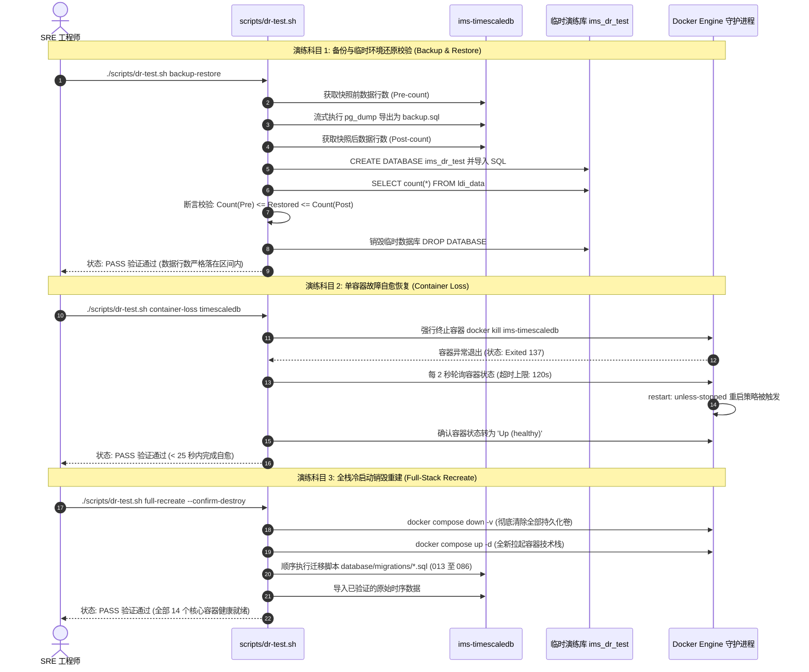

<!-- GLOBAL_NAV -->
<div align="right">
  <a href="../../README.md"> <b>首页</b></a> &nbsp;|&nbsp;
  <a href="../README.md"> <b>文档索引</b></a>
</div>
<br/>

<div align="center">
  <h1>IMS 灾难恢复 (DR) 测试计划与实战演练规范</h1>
  <p><b>自动化恢复验证机制、备份有效性确认、容器故障自愈测试及全技术栈冷启动重建演练</b></p>
  <p>
    <a href="../../../docs/operations/DR_TEST_PLAN.md">English</a> |
    <a href="../../../th/docs/operations/DR_TEST_PLAN.md">ไทย</a> |
    <a href="DR_TEST_PLAN.md">简体中文</a>
  </p>
</div>

---

> **受众对象:** SRE / 运维工程师、DevOps 专家、QA 质量保证团队、合规与审计人员  
> **灾备恢复目标:** 恢复时间目标 (RTO) < 15 分钟 \| 恢复点目标 (RPO) < 1 小时 \| 最大可容忍停机时长 (MTD) < 2 小时  
> **演练执行体系:** 基于 `scripts/dr-test.sh` 与 `scripts/soak-test-report.sh` 脚本体系构建。全部指令均针对活动容器环境真实执行，严格捕获实测时间戳与遥测存证，杜绝假数据模拟。

---

## 1. 灾难恢复全流程演练时序 (Drill Sequences)



---

## 2. 演练科目 1 — 备份与临时还原有效性确认 (Backup / Restore)

### 演练目标
在不中断在线高频写入、不产生锁表风险的前提下，验证生产数据能否完整导出并成功还原到隔离的演练数据库中。

### 执行指令
```bash
./scripts/dr-test.sh backup-restore
```

### 判定标准与通过准则 (Pass Criteria)
1. **零生产干扰:** 生产主库 `ims` 的遥测入库与大屏查询零延迟波动。
2. **行数区间包含断言 (Row-Count Bracketing):** 在持续写入的高并发监控平台上，静态的绝对行数匹配必定失败。脚本会在导出前后各执行一次 `SELECT count(*) FROM public.ldi_data;`，并校验：
   $$\text{Count}_{\text{pre}} \le \text{Count}_{\text{restored}} \le \text{Count}_{\text{post}}$$
3. **自动环境清理:** 演练结束后，临时创建的 `ims_dr_test` 数据库必须被彻底销毁。

---

## 3. 演练科目 2 — 单容器异常崩溃自愈恢复 (Single-Container Loss)

### 演练目标
验证当关键组件因宿主机内核 OOM 强杀、意外宕机或网络分区导致进程中断时，系统的自动恢复与连接池重连韧性。

### 执行指令
```bash
# 测试时序数据库容器崩溃恢复能力
./scripts/dr-test.sh container-loss timescaledb

# 测试数据接入管道 Node-RED 崩溃恢复能力
./scripts/dr-test.sh container-loss node-red
```

### 判定标准与通过准则
1. **异常进程终止:** 通过 `docker kill` 命令发送 SIGKILL 信号强杀容器 (退出码 137)。
2. **守护进程自愈:** Docker 守护进程依照 `restart: unless-stopped` 策略拉起新容器实例。
3. **健康检查收敛:** 容器必须在 **120 秒** 内通过内置 Health Check 并进入 `healthy` 状态。
4. **上游连接池自动重连:** Node-RED 中的 `pg.Pool` 看门狗机制必须在无需人工干预的情况下重新建立数据库连接池。

---

## 4. 演练科目 3 — 全栈冷启动销毁重建 (Full-Stack Cold Recreate)

### 演练目标
模拟服务器机房全面瘫痪、硬件彻底报废等极端灾难场景，验证从纯白环境重建整个多容器系统、重建架构迁移并恢复业务数据的完整能力。

> [!WARNING]
> **破坏性操作警示:** 科目 3 会执行底层存储卷的物理抹除 (`timescaledb_data`, `prometheus_data`, `alertmanager_data`, `grafana_data`)。必须显式传入 `--confirm-destroy` 参数，且严禁在实际生产服务器上执行。

### 执行指令
```bash
./scripts/dr-test.sh full-recreate --confirm-destroy
```

### 判定标准与通过准则
1. **存储卷彻底清空:** `docker compose down -v` 成功释放所有命名存储卷。
2. **版本化迁移顺畅执行:** `database/migrations/` (从 013 到 086) 必须按版本依赖顺序无报错执行。
3. **纯净数据行还原:** 在迁移构建出纯净 Schema 后导入科目 1 备份的原始数据，避免触发 TimescaleDB 持续聚合的循环外键冲突。
4. **全技术栈可用性:** 全部 14 个核心容器在 **180 秒** 内全部达到 `Up (healthy)` 状态。

---

## 5. 灾难恢复演练周期与合规治理要求

| 演练科目 | 演练周期 | 执行环境 | 责任角色 | 审计证据保存位置 |
|---|---|---|---|---|
| **科目 1 (备份恢复)** | **每月一次** (CI 自动化) | Staging / 预发环境 | 数据库可靠性工程师 (DBA) | `scripts/dr-test-reports/` |
| **科目 2 (容器崩溃)** | **每季度一次** | 非生产测试集群 | 值班 SRE 负责人 | 故障应急演练日志库 |
| **科目 3 (全栈重建)** | **每半年一次** | 物理隔离的 Lab 演练集群 | 首席基础架构师 (Lead Architect) | SRE 灾备复盘归档库 |

---

## 6. 相关技术文档

- `docs/operations/BACKUP_RESTORE.md` — 备份脚本目前实际能做的事、如何验证恢复，以及尚未提供的加密与 PITR 步骤
- `docs/operations/INCIDENT_RESPONSE.md` — 值班应急响应指南与事故升级流转机制
- `docs/architecture/DATA_RETENTION.md` — 列式数据压缩周期与历史生命周期轮转策略
- `docs/sre/SLO_DEFINITIONS.md` — 服务质量目标 (SLO) 与错误预算治理体系

---

[⬅️ 返回运维手册](../operations-runbook.md) | [ 主代码仓库](../../README.md)
