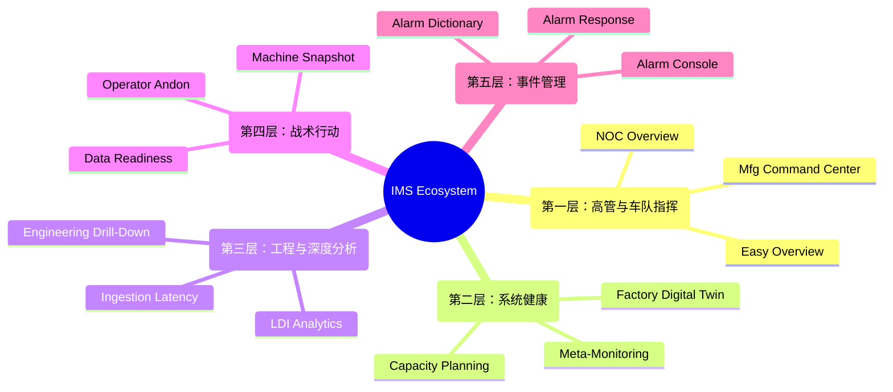

<!-- GLOBAL_NAV -->

  <a href="../../README.md"> <b>首页</b></a> &nbsp;|&nbsp;
  <a href="../README.md"> <b>文档索引</b></a>

 

#  IMS 仪表板生态系统：宏观到微观架构

**工业监控系统 (IMS)** 使用 **15个仪表板的“赛博朋克 HUD”生态系统**，旨在彻底消除警报疲劳，并弥合企业 IT 与物理运营技术 (OT) 之间的差距。

本文档作为主目录，按 **海拔高度（宏观到微观）** 进行结构化组织——确保正确的数据在恰当的决策时刻到达正确的人员。

---

## 🗺️ 生态系统拓扑结构 (Ecosystem Topology)

> [!TIP]
> **性能架构：** 这些仪表板中没有一个会查询超过 24 小时的时间范围的原始遥测数据。它们完全由 **TimescaleDB Continuous Aggregates (CAGGs)** 驱动，确保亚秒级加载时间。所有仪表板都遵循 **Grid-24** 纪律。

---

##  第一层：高管与车队指挥 (30,000 英尺 - 宏观)

_**目标**：为商业领袖提供即时的扫视价值。专注于整体健康、启动/停机状态和总体 OEE。_
**受众**：C级高管、工厂经理、NOC 指挥官

| 仪表板 | 描述 | 预览 |
|-----------|-------------|---------|
| **IMS NOC Overview** | 统一车队健康评分 (0-100)，排名前10的关键节点排行榜，以及异常时间线。 |  |
| **LDI Manufacturing** | 实时整体设备效率 (OEE)、物理良率和生产瓶颈。 |  |
| **IMS Easy Overview** | 简化的业务级 KPI 跟踪。全球系统正常运行时间和总体制造产量。 |  |

---

##  第二层：系统健康与可预测性 (10,000 英尺)

_**目标**：预测性操作 (AIOps)。在问题表现为中断的前几天就予以解决。_
**受众**：IT 部门主管、维护规划员、SRE

| 仪表板 | 描述 | 预览 |
|-----------|-------------|---------|
| **Capacity Planning** | 预测性预测。线性回归趋势线计算“达到 100% 容量的准确天数”。 |  |
| **Meta-Monitoring** | “监控监控器”。摄取管道吞吐量、SNMP 状态和查询预算。 |  |
| **Factory Digital Twin** | PCB 生产车间的实时物理代理。机器状态的空间映射。 | *(Requires specialized 3D plugin)* |

---

##  第三层：工程与深度分析 (1,000 英尺)

_**目标**：IT 基础设施限制与 OT 制造良率之间的根本原因关联。_
**受众**：系统管理员、工艺工程师、数据科学家

| 仪表板 | 描述 | 预览 |
|-----------|-------------|---------|
| **Engineering Drill-Down** | 切换上下文的微观指标。针对 24 小时滚动基线的 Z-Score 异常检测。 |  |
| **LDI Analytics** | 深度流程工程数据科学。将 OT 因素与结构性 PCB 良率缺陷关联起来。 |  |
| **Ingestion Latency** | 测量工厂车间传感器发出信号与成功提交到 PostgreSQL 之间的确切传播延迟。 | *(CAGG aggregation active)* |

---

##  第四层：战术行动 (地面)

_**目标**：为操作物理硬件的人员提供二进制的、零延迟的决策。_
**受众**：车间操作员、生产线主管、质量检查员

| 仪表板 | 描述 | 预览 |
|-----------|-------------|---------|
| **Operator Andon** | 超简化的、高对比度的状态板。纯红色/绿色视觉提示。如果是红色的，请停止。 |  |
| **Machine Snapshot** | 机器的实时心跳。加载的配方、激光功率、传感器读数。 |  |
| **Data Readiness** | 数据完整性验证。跟踪空值、模式损坏和传感器离线状态。 |  |

---

##  第五层：事件管理与解决 (微观)

_**目标**：使用标准化的操作手册对异常进行分类、确认和永久解决。_
**受众**：L1/L2 支持团队、事件指挥官

| 仪表板 | 描述 | 流程 |
|-----------|-------------|-------------|
| **LDI Alarm Console** | 实时事件分类。警报队列、相关异常的分组以及实时确认状态。 | `Alertmanager -> Console` |
| **LDI Alarm Response** | 验尸和团队效率跟踪。跟踪 SLA 合规性、MTTR、升级频率。 | `Console -> Resolution` |
| **LDI Alarm Dictionary** | 定义的映射系统，将原始机器十六进制代码与人类可读的指令链接。 | `Database -> Playbook` |

> [!IMPORTANT]
> **数据完整性约束：** 显示汇总数据（第 1-3 层）的任何仪表板都必须仅从 Continuous Aggregates 中提取。只有第 4 层和第 5 层仪表板才被授权查询原始遥测表。
