<!-- GLOBAL_NAV -->
<div align="right">
  <a href="../../README.md"> <b>首页</b></a> &nbsp;|&nbsp;
  <a href="../README.md"> <b>文档索引</b></a>
</div>
<br/>

<div align="center">
  <h1>IMS 工程师入职与上手指南</h1>
  <p><b>面向平台工程师的系统架构全景、本地开发环境部署与日常运维排障工作流</b></p>
  <p>
    <a href="../../../docs/product/ONBOARDING.md">English</a> |
    <a href="../../../th/docs/product/ONBOARDING.md">ไทย</a> |
    <a href="ONBOARDING.md">简体中文</a>
  </p>
</div>

---

## 1. 欢迎加入 IMS 工程团队

欢迎加入 **工业监控系统 (IMS)** 工程团队。IMS 专为高精度工业 PCB 制造（激光直接成像 / LDI）、数控钻孔（CNC Drilling）以及垂直连续电镀（VCP）设施设计，提供生产级实时遥测监测与智能告警。

### 系统架构总览

```mermaid
%%{init: {"flowchart": {"nodeSpacing": 20, "rankSpacing": 32, "padding": 10, "wrappingWidth": 150, "curve": "basis"}, "sequence": {"wrap": true, "width": 170, "actorMargin": 36, "boxMargin": 8, "noteMargin": 8, "messageMargin": 30, "mirrorActors": false}, "state": {"padding": 6}, "theme": "base", "themeVariables": {"fontFamily": "Inter, Segoe UI, Helvetica, Arial, sans-serif", "fontSize": "14px", "primaryColor": "#334155", "primaryTextColor": "#ffffff", "primaryBorderColor": "#1e293b", "lineColor": "#64748b", "textColor": "#64748b", "secondaryColor": "#475569", "tertiaryColor": "#f1f5f9", "clusterBkg": "transparent", "clusterBorder": "#94a3b8", "titleColor": "#64748b", "edgeLabelBackground": "#475569", "nodeTextColor": "#ffffff", "noteBkgColor": "#fef3c7", "noteTextColor": "#1e293b", "noteBorderColor": "#d97706", "actorBkg": "#334155", "actorTextColor": "#ffffff", "actorBorder": "#1e293b", "actorLineColor": "#94a3b8", "signalColor": "#64748b", "signalTextColor": "#64748b", "labelBoxBkgColor": "#334155", "labelBoxBorderColor": "#1e293b", "labelTextColor": "#ffffff", "loopTextColor": "#64748b", "activationBkgColor": "#e2e8f0", "sequenceNumberColor": "#ffffff", "stateLabelColor": "#ffffff", "compositeBackground": "transparent", "transitionColor": "#64748b", "transitionLabelColor": "#64748b"}}}%%
flowchart LR
  accTitle: IMS 概览
  accDescr: 机台通过 HTTP 发送数据或经 SNMP 被轮询；nginx 与 Node-RED 经 PgBouncer 写入 TimescaleDB；Grafana 展示 22 个仪表板；Prometheus、Alertmanager 与 Grafana 告警经 Node-RED 发送到 LINE 和 Teams。
  EDGE["LDI · SNMP 设备"]:::ext
  IN["nginx :3000 → Node-RED"]:::flow
  PGB["PgBouncer :5432"]:::app
  TSDB[("TimescaleDB")]:::store
  GRAF["Grafana · 22 个仪表板"]:::viz
  ALERT["Prometheus → Alertmanager"]:::obs
  NOTIFY["LINE · Teams"]:::notify
  EDGE -->|"HTTP · SNMP"| IN --> PGB --> TSDB --> GRAF
  IN -->|"/metrics"| ALERT -->|"经 Node-RED"| NOTIFY
  GRAF -->|"告警规则经 Node-RED"| NOTIFY
  classDef actor fill:#475569,stroke:#1e293b,color:#ffffff,stroke-width:1px
  classDef ext fill:#57534e,stroke:#292524,color:#ffffff,stroke-width:1px
  classDef ingress fill:#1d4ed8,stroke:#1e3a8a,color:#ffffff,stroke-width:1px
  classDef app fill:#0f766e,stroke:#134e4a,color:#ffffff,stroke-width:1px
  classDef flow fill:#0e7490,stroke:#164e63,color:#ffffff,stroke-width:1px
  classDef store fill:#b45309,stroke:#78350f,color:#ffffff,stroke-width:1px
  classDef viz fill:#4338ca,stroke:#312e81,color:#ffffff,stroke-width:1px
  classDef obs fill:#6d28d9,stroke:#4c1d95,color:#ffffff,stroke-width:1px
  classDef notify fill:#b91c1c,stroke:#7f1d1d,color:#ffffff,stroke-width:1px
  classDef future fill:#f8fafc,stroke:#94a3b8,color:#475569,stroke-width:1px,stroke-dasharray:4 3
```



---

## 2. 首日开发环境初始化 (Day-1 Setup)

5 分钟内在本地启动完整的全套运行环境：

### 环境前置要求

- **Docker Desktop** / Docker Engine（支持 Compose v2）
- **Node.js**（v18 或 v20 LTS）
- **Make**（Windows 环境可直接调用 PowerShell 对应脚本）

### 极速初始化步骤

```bash
# 1. 克隆代码仓库
git clone https://github.com/PATTANAKORN025/IMS.git
cd IMS

# 2. 配置环境配置文件
cp .env.example .env
# 编辑 .env，并将默认示例密码替换为强随机本地密钥

# 3. 校验工具链依赖
make doctor

# 4. 构建并启动全部 16 个服务容器
make up

# 5. 全面验证系统健康状态
make verify
```

启动完成后，通过浏览器访问 `http://localhost:3000` 即可进入 Grafana 控制台。

---

## 3. 核心生产与排障工作流

### 异常排查与下钻定位 (Triage & Drill-Down)

当制造工艺指标超出规格或产生系统告警时：

1. **NOC 全景大屏 (`/d/ims-noc-overview`)**:
   - 检查全厂设备的温度、扫描速度或对齐误差整体态势。
   - 点击高亮异常指标，通过 Grafana Data Link 直接跳转到对应设备下钻面板。
2. **LDI 制造集群指挥中心 (`/d/ims-ldi-manufacturing`)**:
   - 切换 `$machine_id` 过滤单台设备（如 `LDI-01` 至 `LDI-10`）。
   - 查看由 TimescaleDB 连续聚合动态计算的过程能力指数 ($C_p, C_{pk}$) 以及 3-sigma Z-Score。
3. **告警控制台 (`/d/ims-ldi-alarm-console`)**:
   - 审查记录在 `public.ldi_alarm_lifecycle` 的活动告警。
   - 操作员确认告警（Acknowledge），工程师通过 `ims-alarm-api` 输入根本原因分析笔记并解除告警（Resolve）。

---

## 4. 工程守则与开发门禁

- **零风险流程规则**: 切勿直接手动修改 `nodered_data/flows.json`。拆分源码保存在 `nodered_data/flows/*.json` 中，执行 `make deploy-flows` 进行合并部署。
- **数据库架构规范**: 业务表与超表必须严格存放在 `public` 模式下，禁止建立自定义 schema。
- **提交前质量门禁**: 提交 Pull Request 前务必运行 `make check`（或 `node scripts/pre-commit.js`），确保所有单元测试与代码检查 100% 通过。

更详尽的技术规范请参阅 [文档索引](../README.md)。
