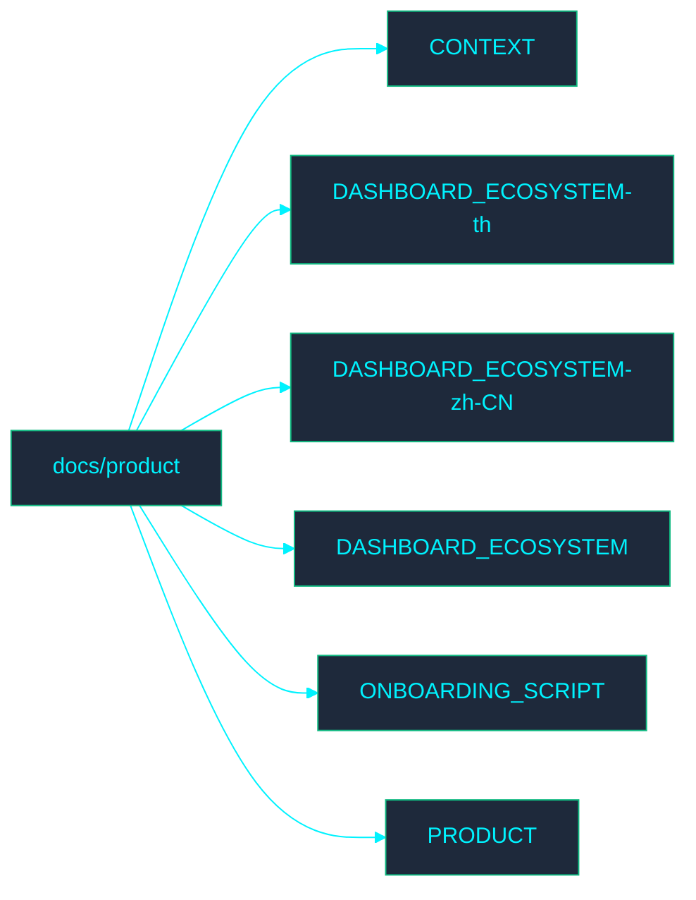

<!-- GLOBAL_NAV -->

  <a href="../../../README.md"> <b>Home</b></a> &nbsp;|&nbsp;
  <a href="../../../docs/README.md"> <b>Docs Index</b></a>

 

#  产品文档

欢迎来到 **Product**（产品）目录。此部分包含与 IMS 产品流程相关的文档。

## ️ 目录结构图

##  文件索引

- [CONTEXT.md](../../../docs/product/CONTEXT.md)
- [DASHBOARD_ECOSYSTEM-th.md](../../../th/docs/product/DASHBOARD_ECOSYSTEM.md)
- [DASHBOARD_ECOSYSTEM-zh-CN.md](DASHBOARD_ECOSYSTEM.md)
- [DASHBOARD_ECOSYSTEM.md](../../../docs/product/DASHBOARD_ECOSYSTEM.md)
- [ONBOARDING_SCRIPT.md](../../../docs/product/ONBOARDING_SCRIPT.md)
- [PRODUCT.md](../../../docs/product/PRODUCT.md)
