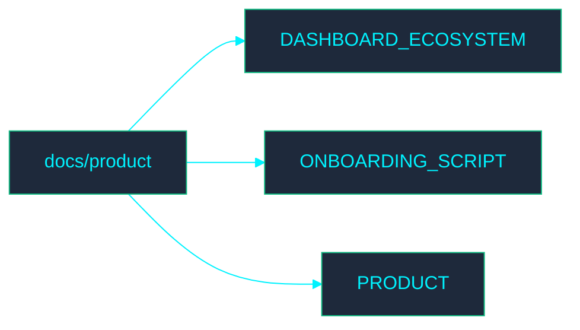

<!-- GLOBAL_NAV -->

  <a href="../../README.md"> <b>首页</b></a> &nbsp;|&nbsp;
  <a href="../README.md"> <b>文档索引</b></a>

 

#  产品文档

欢迎来到 **Product**（产品）目录。此部分包含与 IMS 产品流程相关的文档。

##  目录结构图

```mermaid
%%{init: {'theme': 'base', 'themeVariables': { 'primaryColor': '#1e293b', 'primaryTextColor': '#00F2FE', 'primaryBorderColor': '#10B981', 'lineColor': '#00F2FE', 'secondaryColor': '#0f172a', 'tertiaryColor': '#0f172a', 'clusterBkg': '#030407', 'clusterBorder': '#00F2FE'}}}%%
flowchart LR
  ROOT["docs/product"]
  ROOT --> F0["DASHBOARD_ECOSYSTEM"]
  ROOT --> F1["ONBOARDING_SCRIPT"]
  ROOT --> F2["PRODUCT"]
```

##  文件索引

- [DASHBOARD_ECOSYSTEM.md](DASHBOARD_ECOSYSTEM.md)
- [ONBOARDING_SCRIPT.md](ONBOARDING_SCRIPT.md)
- [PRODUCT.md](PRODUCT.md)
