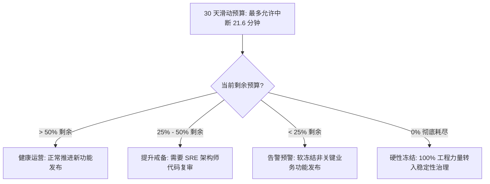

<!-- GLOBAL_NAV -->
<div align="right">
  <a href="../../README.md"> <b>首页</b></a> &nbsp;|&nbsp;
  <a href="../README.md"> <b>文档索引</b></a>
</div>
<br/>

<div align="center">
  <h1>IMS 站点可靠性工程 (SRE): SLI 与 SLO 规范定义</h1>
  <p><b>服务等级指标 (SLI)、服务等级目标 (SLO)、PromQL 严谨公式、多时间窗口燃尽率告警及错误预算冻结机制</b></p>
  <p>
    <a href="../../../docs/sre/SLO_DEFINITIONS.md">English</a> |
    <a href="../../../th/docs/sre/SLO_DEFINITIONS.md">ไทย</a> |
    <a href="SLO_DEFINITIONS.md">简体中文</a>
  </p>
</div>

---

## 1. SRE 核心原则与四大黄金信号 (The 4 Golden Signals)

工业监控系统 (IMS) 作为 PCB 制造现场与关键网络基础设施的遥测神经中枢，其 SRE 目标遵循 Google SRE 最佳实践，通过**四大黄金信号**进行量化观测：

```
┌─────────────────┐   ┌─────────────────┐   ┌─────────────────┐   ┌─────────────────┐
│     Latency     │   │     Traffic     │   │     Errors      │   │   Saturation    │
│ 遥测数据流转延迟 │   │ 摄入吞吐量与    │   │ 写入失败与告警   │   │ 连接池打满比例  │
│ 耗时全链路追踪   │   │ SNMP 轮询频率   │   │ 丢包错误发生率   │   │ 与 CPU/内存负载 │
└─────────────────┘   └─────────────────┘   └─────────────────┘   └─────────────────┘
```

- **延迟 (Latency)**: 接收、清洗、转换、持久化入库及图表渲染工业指标的全链路耗时。
- **流量 (Traffic)**: 每秒摄入的遥测有效载荷数量，以及每周期 SNMP 轮询的 OID 数据量。
- **错误率 (Errors)**: 发生 4xx/5xx 的 HTTP 拒绝请求比率、数据库写入超时以及丢失的 SNMP 数据包。
- **饱和度 (Saturation)**: PgBouncer 数据库连接池占用率、系统内存水位及磁盘 I/O 吞吐负载。

---

## 2. SLI 与 SLO 核心指标矩阵 (Specification Matrix)

所有目标均在 30 天滑动合规时间窗口 ($43,200\text{ 分钟}$) 内进行持续统计：

| 业务领域 | 监控指标 / 服务指标 (SLI) | 目标值 (SLO) | 30 天错误预算 (Error Budget) | 度量途径与方法 |
|:---------|:--------------------------|:-------------|:-----------------------------|:---------------|
| **摄入端点可用性** | `/ldi-telemetry` 与 `/api/v1/alarms` 返回成功 HTTP 状态码 (`200 OK`) 的比率 | **$\ge 99.95\%$** | 允许故障下线时间 $21.6\text{ 分钟}$ | 持续 Blackbox 拨测探针 |
| **管道流转延迟** | 从 Nginx 接收到载荷到在 TimescaleDB 完成提交的时长 | **$P_{99} < 2.0\text{s}$** | 允许 $1\%$ 的异常慢请求 | 数据采集入库时间戳差值 |
| **仪表板查询性能** | Grafana 针对 15m 与 1h 持续聚合视图执行 SQL 查询的响应时长 | **$P_{95} < 1.0\text{s}$<br/>$P_{99} < 3.0\text{s}$** | 允许 $5\%$ 的查询超过 1.0s | Grafana 数据源度量指标 |
| **严重告警分发延迟** | 从告警阈值突破触发到 LINE / Teams Webhook 投递成功耗时 | **$P_{99.9} < 5.0\text{s}$** | 允许 $0.1\%$ 的超时延迟分发 | Alertmanager 调度计时器 |
| **SNMP 采集完整率** | Linux 服务器与 Juniper 交换机全量 OID 成功轮询采集率 | **$\ge 99.0\%$** | 允许 $1.0\%$ 的 OID 丢包或超时 | Node-RED 轮询节点统计 |

---

## 3. 数学公式与 PromQL SLI 计算表达式

### 1. 摄入端点可用性 SLI 计算公式

$$\text{SLI}_{\text{avail}} = \frac{\sum \text{HTTP Requests with Status } 2xx}{\sum \text{Total HTTP Ingestion Requests}} \times 100\%$$

```promql
# LDI 遥测摄入端点 30 天滑动可用性百分比
(
  sum(increase(nginx_http_requests_total{status=~"2.."}[30d]))
  /
  sum(increase(nginx_http_requests_total[30d]))
) * 100
```

### 2. 摄入管道第 99 分位数延迟 SLI

$$\text{SLI}_{\text{latency}} = \text{Quantile}_{0.99}\left(\text{Duration}_{\text{received}} \to \text{Duration}_{\text{persisted}}\right)$$

```promql
# 5 分钟滑动窗口下管道流转延迟第 99 百分位数
histogram_quantile(0.99,
  sum(rate(ims_pipeline_duration_seconds_bucket[5m])) by (le)
)
```

### 3. Grafana 仪表板查询第 95 分位数延迟 SLI

```promql
# 遥测数据库查询耗时第 95 百分位数 (秒)
histogram_quantile(0.95,
  sum(rate(grafana_datasource_request_duration_seconds_bucket{datasource="factory_telemetry"}[5m])) by (le)
)
```

### 4. SNMP 轮询采集成功率 SLI

```promql
# 60 秒轮询周期内的 SNMP 采集成功率
(
  sum(rate(node_red_snmp_polls_success_total[5m]))
  /
  sum(rate(node_red_snmp_polls_attempted_total[5m]))
) * 100
```

---

## 4. 多时间窗口燃尽率告警架构 (Multi-Burn-Rate Alerting)

为在快速故障响应与抑制告警疲劳之间达成平衡，IMS 采用 Google SRE 倡导的多窗口多燃尽率告警策略。燃尽率 (Burn Rate) 反映了 30 天错误预算被快速消耗的倍速：

```
燃尽率 1.0x  ───> 30 天内平缓耗尽 100% 预算 (无需紧急介入)
燃尽率 6.0x  ───> 6 小时内消耗 5% 预算 (高优先级: 自动创建工单排查)
燃尽率 14.4x ───> 1 小时内消耗 2% 预算 (致命级: 呼叫 On-Call 工程师介入)
```

### 告警燃尽率矩阵 (Burn-Rate Matrix)

| 告警级别 | 燃尽率系数 | 预算消耗占比 | 长时间窗口 | 短时间窗口 | 响应处置与通知渠道 |
|:---------|:-----------|:-------------|:-----------|:-----------|:-------------------|
| **CRITICAL (致命)** | $14.4\times$ | $2.0\%$ | 1 小时 | 5 分钟 | LINE On-Call 传呼 + 警笛呼叫 |
| **HIGH (高危)** | $6.0\times$ | $5.0\%$ | 6 小时 | 30 分钟 | MS Teams 加急工单指派 |
| **MEDIUM (中度)**| $1.0\times$ | $10.0\%$ | 3 天 | 6 小时 | 记录入 SRE 周会迭代排期 |

### Prometheus 告警规则定义 (`prometheus/rules/slo_burn_rate.yml`)

```yaml
groups:
  - name: slo_ingestion_burn_rate
    rules:
      - alert: IngestionErrorBudgetBurningFast
        expr: |
          (
            sum(rate(nginx_http_requests_total{status=~"5.."}[1h]))
            /
            sum(rate(nginx_http_requests_total[1h]))
          ) > (1 - 0.9995) * 14.4
          and
          (
            sum(rate(nginx_http_requests_total{status=~"5.."}[5m]))
            /
            sum(rate(nginx_http_requests_total[5m]))
          ) > (1 - 0.9995) * 14.4
        for: 2m
        labels:
          severity: critical
          tier: tier1
        annotations:
          summary: "LDI 摄入管道错误预算正以 14.4 倍速迅速燃尽 (1h 窗口)"
          description: "突发高错误率已在过去一小时内消耗了超过 2% 的月度可用错误预算。"
```

---

## 5. 错误预算政策与代码发布冻结机制 (Error Budget Policy)

错误预算是研发团队、SRE 与工厂生产运营之间的契约。当预算充足时鼓励快速试错与业务迭代；当预算耗尽时，系统可用性拥有最高优先级。



### 逐级升级管控梯次 (Escalation Tiers)

1. **绿色状态 (剩余预算 $>50\%$)**: 允许通过 CI/CD 正常发布。
2. **黄色状态 (剩余预算 $25\% - 50\%$)**:
   - 对 Node-RED Flow 的任何修改均须经 SRE 技术主管审核签字。
   - 非紧急的数据库架构变更推迟至下一维护窗口。
3. **橙色状态 (剩余预算 $<25\%$)**:
   - 启动软发布冻结，除缺陷修复 (Bugfix) 外暂缓业务发布。
   - 任何改动均须在预发环境执行压力验证后方可合入。
4. **红色状态 (预算耗尽 100% / 超支)**:
   - **硬性发布冻结 (Hard Deployment Freeze)**: 严禁向 `main` 分支合入任何新功能代码。
   - 研发人员 100% 调拨至故障排查、慢查询治理及灾备演练。
   - 必须在 48 小时内发布根因复盘分析报告 (PMR)。

---

## 6. 实时 SLI 命令行巡检指南

工程师可使用 cURL 直接通过 Prometheus API 查询 SLI 实时健康状况：

```bash
# 查询 LDI 摄入端点近 1 小时实时错误率百分比
curl -s -G "http://localhost:9090/api/v1/query" \
  --data-urlencode 'query=(sum(rate(nginx_http_requests_total{status=~"5.."}[1h])) / sum(rate(nginx_http_requests_total[1h]))) * 100' \
  | jq '.data.result[] | {metric: .metric, current_error_rate_pct: .value[1]}'

# 查询近 5 分钟管道第 99 分位数流转耗时
curl -s -G "http://localhost:9090/api/v1/query" \
  --data-urlencode 'query=histogram_quantile(0.99, sum(rate(ims_pipeline_duration_seconds_bucket[5m])) by (le))' \
  | jq '.data.result[] | {p99_latency_seconds: .value[1]}'
```
