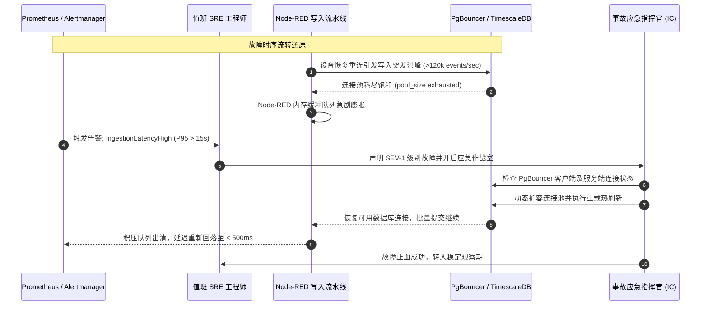
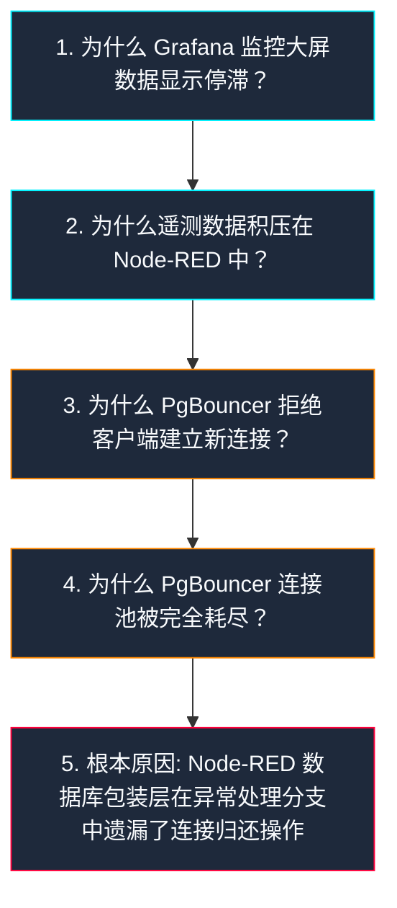

<!-- GLOBAL_NAV -->
<div align="right">
  <a href="../../../README.md"> <b>首页</b></a> &nbsp;|&nbsp;
  <a href="../../README.md"> <b>文档索引</b></a>
</div>
<br/>

<div align="center">
  <h1>企业级无指责事故复盘与故障回顾模板 (Blameless Post-Mortem)</h1>
  <p><b>标准化根本原因分析 (RCA)、故障时间线还原、SLO 错误预算消耗评估与整改行动项闭环管理</b></p>
  <p>
    <a href="../../../../docs/sre/postmortems/TEMPLATE.md">English</a> |
    <a href="../../../../th/docs/sre/postmortems/TEMPLATE.md">ไทย</a> |
    <a href="TEMPLATE.md">简体中文</a>
  </p>
</div>

---

> **事故复盘哲学 (无指责文化):**  
> 我们严格践行 **无指责文化 (Blameless Culture)** (遵循 Google SRE / Etsy 行业标准)。我们坚信每位工程师在当时均凭借其所掌握的最优信息做出了最合理的决策。事故复盘的唯一目的是审查**系统漏洞、架构边界缺陷、自动化失效及运维工具链不足**，绝不针对个人过失。

---

## 1. 事故概览与元数据 (Incident Overview & Metadata)

| 事故属性 | 属性取值 |
|---|---|
| **事故标题** | `[INC-YYYYMMDD-SEVX] 简明扼要的事故描述性标题` |
| **严重程度等级** | **SEV-1** (核心业务中断) \| **SEV-2** (严重服务降级) \| **SEV-3** (次要异常事件) |
| **发生日期** | `YYYY-MM-DD` |
| **事故指挥官 (IC)** | `@incident-commander` |
| **主调查 SRE 工程师** | `@sre-lead` |
| **沟通协调负责人** | `@comms-lead` |
| **受影响服务组件** | `ims-timescaledb`, `ims-node-red`, `ims-pgbouncer`, `ims-grafana` |
| **当前推进状态** | `[ 草稿阶段 | 评审进行中 | 已批准并落实行动项 | 已关闭存档 ]` |

---

## 2. 管理层摘要与业务影响评估 (Summary & Impact)

### 管理层执行摘要 (Executive Summary)
*(提供 2 至 3 段简明摘要，阐述具体失效部件、初始触发条件、影响爆炸半径以及最终恢复手段。)*

### 业务与生产运营影响 (Business & Operational Impact)
* **事故持续总时长:** `XX 小时 YY 分钟`
* **遥测数据中断黑障期:** `XX 分钟`
* **丢失 / 丢弃的未缓冲遥测记录数:** `~X,XXX 条`
* **受波及生产车间线体:** `[例如：LDI 曝光机 1–4 号线, CNC 数控钻孔机 01–12 号主轴]`
* **SLO 错误预算消耗情况 (Error Budget Consumption):**
  - 数据写入可用性 SLO (每月 99.9%): 消耗了 30 天总预算的 **XX.X%**
  - 查询响应耗时 SLO (P95 < 500ms): 消耗了总预算的 **YY.Y%**

$$\text{Error Budget Burn Rate} = \frac{\text{Observed Error Rate}}{\text{Allowed Error Rate}} = \frac{1 - \text{SLI}}{1 - \text{SLO}}$$
*(错误预算消耗速率 = 实际观测错误率 / 允许错误率上限)*

---

## 3. 故障处理全周期指标 (Incident Lifecycle Metrics)

```text
检测用时 (TTD)         确认用时 (TTA)         止血缓解用时 (TTM)       彻底修复用时 (TTR)
    [ 4 分钟 ] ------------ [ 2 分钟 ] ------------- [ 18 分钟 ] ------------ [ 35 分钟 ]
```

* **检测用时 (Time to Detect - TTD):** `4 分钟` (从故障首次发生到 Alertmanager 触发警报)
* **确认用时 (Time to Acknowledge - TTA):** `2 分钟` (从收到告警通知到值班工程师介入排查)
* **止血缓解用时 (Time to Mitigate - TTM):** `18 分钟` (从排查开始到系统恢复基本写入能力)
* **彻底修复用时 (Time to Resolve - TTR):** `35 分钟` (从排查开始到补丁生效并清空所有积压队列)

---

## 4. 故障时间线与时序交互图 (Incident Timeline)

所有时间戳必须同时以 **UTC 世界标准时间** 和 **ICT 泰国/中南半岛时间 (UTC+7)** 记录。



### 详细事件流水记录
* `14:02 ICT (07:02 UTC)` — 设备重连后开始推送离线积压数据，形成瞬时写入洪峰。
* `14:04 ICT (07:04 UTC)` — `ims-pgbouncer` 客户端连接数达到硬性配额上限 (`max_client_conn`)。
* `14:06 ICT (07:06 UTC)` — Prometheus 监测到延迟突增并向 Alertmanager 推送告警通知。
* `14:08 ICT (07:08 UTC)` — 值班 SRE 工程师确认告警并建立应急处置通道。
* `14:15 ICT (07:15 UTC)` — 发现慢查询事务持有了连接槽位且未释放。
* `14:24 ICT (07:24 UTC)` — 执行命令 `docker exec ims-pgbouncer kill -HUP 1` 紧急热扩容连接池。
* `14:39 ICT (07:39 UTC)` — 内存队列数据全部入库完毕，端到端写入延迟恢复至正常的 180ms。

---

## 5. 根本原因五问法分析 (5 Whys Root Cause Analysis)



1. **为什么 Grafana 监控大屏数据显示停滞？**  
   实时监控面板未从 `public.ldi_data` 接收到最新的时间戳记录。
2. **为什么遥测数据积压在 Node-RED 中？**  
   Node-RED 接入流水线因数据库批量写入超时产生了严重的背压 (Backpressure)。
3. **为什么 PgBouncer 拒绝建立新连接？**  
   活动的客户端连接总数触碰了 `default_pool_size` 的阈值上限。
4. **为什么连接池被完全耗尽？**  
   在上游设备网络重试期间，异常断开的连接被长时间悬挂占用。
5. **为什么连接悬挂且未归还连接池 (根本原因)?**  
   Node-RED 内部定制的数据写入包装函数在网络套接字中断异常时，未能调用 `client.release()` 归还连接。

---

## 6. 排查诊断遥测与 PromQL 查询集

事故排查处置过程中使用的高价值 PromQL 与 SQL 诊断指令：

```promql
# 1. 管道新鲜度：距上次成功刷写的秒数
time() - max(ims_pipeline_last_flush_timestamp_seconds)

# 2. 写入失败比例（未部署 PgBouncer exporter，连接池状态请用 SHOW POOLS 查看）
sum(rate(ims_pipeline_inserts_failed_total[5m])) / clamp_min(sum(rate(ims_pipeline_inserts_total[5m])), 1e-9)

# 3. 缓冲区溢出（写入前被丢弃的记录）
sum(rate(ims_pipeline_buffer_overflows_total[5m]))
```

```sql
-- 数据库活跃未提交事务状态排查
SELECT pid, now() - xact_start AS duration, query, state
FROM pg_stat_activity
WHERE state != 'idle' AND query NOT LIKE '%pg_stat_activity%'
ORDER BY duration DESC
LIMIT 10;
```

---

## 7. 经验总结与复盘反思 (Retrospective)

### 值得肯定的方面 (What Went Well)
* Prometheus 自动化报警机制在指标越限 4 分钟内准确触达。
* `ims-timescaledb` 内置健康看门狗有效防止了内存脏写风险。
* 工厂现场 OT 工程师与 IT/SRE 团队的应急协同非常高效。

### 存在不足的方面 (What Went Wrong)
* 应急 Runbook 手册中缺少热重载 PgBouncer 配置的具体命令行指导。
* Node-RED 异常处理逻辑在自动化回归测试中存在覆盖盲区。

### 侥幸避免扩大的隐患 (Where We Got Lucky)
* 故障适逢车间交接班停机间隙，未造成批量在制品 (WIP) PCB 报废。
* 双网卡冗余配置防止了生产边缘网关的彻底失联。

---

## 8. 整改与预防行动项追踪表 (Corrective Action Items)

| 编号 | 类别 | 具体整改行动项描述 | 优先级 | 负责人 | 期望完成时间 | 跟踪工单/PR |
|---|---|---|---|---|---|---|
| **ACT-01** | **防御预防** | 修复 Node-RED 异常处理中的连接释放缺陷并补齐单测 | `P0` | `@engineer-dev` | `YYYY-MM-DD` | `PR #XXX` |
| **ACT-02** | **监控发现** | 在 Prometheus 中添加连接池排队监控告警 (`waiting_clients > 10`) | `P1` | `@sre-lead` | `YYYY-MM-DD` | `ISSUE-YYY` |
| **ACT-03** | **处置缓解** | 在应急手册中完善 PgBouncer 免重启热重载操作指南 | `P1` | `@sre-lead` | `YYYY-MM-DD` | `DOCS-ZZZ` |
| **ACT-04** | **演练流程** | 组织覆盖四大生产制造领域的连接池打满故障注入混沌演练 | `P2` | `@qa-team` | `YYYY-MM-DD` | `DR-TEST-AAA` |

---

[⬅️ 返回 SRE 索引](../SLO_DEFINITIONS.md) | [ 主代码仓库](../../../README.md)
